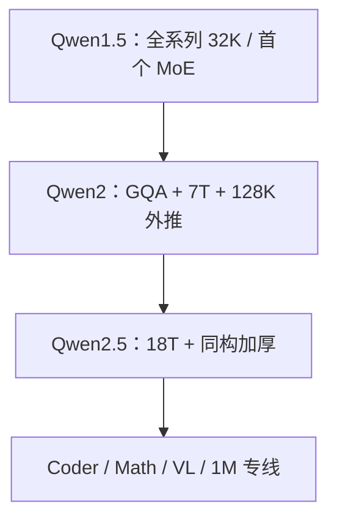

# Qwen 1.5 / 2 / 2.5 演进

    
Qwen2.5 把高质量预训练数据从上一版的 7 万亿 token 扩到 18 万亿，并在后训练里使用百万级 SFT 与多阶段强化学习。

    <footer>—— Qwen Team，Qwen2.5 Technical Report，arXiv:2412.15115</footer>

通义千问从 2023 年的 Qwen 技术报告走到 2024 年的 1.5、2、2.5，主线不是换一种注意力，而是**同一套解码器骨架上把数据、窗口、稀疏化与对齐做厚**。1.5 把全系列窗口统一到 32K，并首次开源 MoE；2 换上 GQA、把 RoPE 基数与 Dual Chunk Attention / YaRN 接到 128K；2.5 把预训练从 7T 拉到 18T，并分出数学、代码、视觉等专线。本篇按官方博客与技术报告写这三版的差分，不把 Qwen3 的思考模式提前写进来。

## 问题

开源模型族要同时服务：边侧 0.5B、单卡 7B、服务器 72B，以及 API 里的稀疏大模型。若每一版都改词表与层规范，生态无法积累。Qwen 的约束是：字节级 BPE 词表大体稳定（2.5 仍约 15 万词加控制符），解码器保持 Pre-LN + RMSNorm + SwiGLU + RoPE，把差异放在**注意力KV、位置外推、数据配比、MoE 是否共享专家**上。

另一条轴是上下文。1.5 用 32K 覆盖当时的长文档需求；2 与 2.5 要把推理窗口做到 128K，且短任务不能塌。只加长预训练序列太贵，于是采用「先 4K 再 32K 预训练 + 推理期 YaRN/DCA 外推」的两段式。问题是如何让这套补丁成为系列惯例，而不是某个尺寸的特例。

### 从「能聊天的千问」到「可对标的稠密旗舰」

2023 年 Qwen（Bai 等，arXiv:2309.16609）证明中英双语稠密模型可开源。1.5 要解决的是开发者体验：合进 `transformers` 主分支、全尺寸 32K、量化齐全。2 要解决推理 KV 与长窗。2.5 要解决的是：同样 72B 量级，知识与代码数学是否够厚，才能在开源榜上接近大得多的稠密模型。数据从 7T 到 18T，是 2.5 相对 2 的主叙事。

Qwen2.5-Turbo / Plus 是云上 MoE，不是与 72B 稠密一一对应的开源检查点。写演进时要把「开源稠密档位」和「API 稀疏档位」分开，否则会把 Turbo 的 1M 窗口误安到 7B-Instruct 上。

## 方法

### Qwen1.5：32K 与第一代 MoE

2024 年 2 月博客发布 Base/Chat：**0.5B、1.8B、4B、7B、14B、32B、72B、110B** 八档，全部支持 32K，并提供 GPTQ/AWQ/GGUF。同期 Qwen1.5-MoE-A2.7B：约 27 亿激活、Non-embedding 约 20 亿，对标 7B 稠密；细粒度专家加共享专家，训练成本相对 7B 降约 75%，推理约 1.74 倍。1.5 把 ChatML 与工具相关控制符开始标准化，为后续统一词表铺路。

### Qwen2：GQA、ABF、DCA 与 YaRN

Qwen2 技术报告（arXiv:2407.10671）开源稠密 **0.5B、1.5B、7B、72B** 与 MoE **57B-A14B**。注意力改为 [GQA](/llm/gqa)，KV 头数按尺寸配置。预训练末期上下文从 4096 提到 32768，RoPE 基数从 $10^4$ 提到 $10^6$（ABF，Xiong 等）。推理用 [YaRN](/llm/yarn) 与 [Dual Chunk Attention](/llm/dual-chunk-attention)，把可用长度做到约 131072（7B/72B Instruct；57B-A14B 报告为 64K 量级，小模型更短，以报告表格为准）。Qwen2 仍使用 QKV bias。预训练数据约 7T。

### Qwen2.5：同一骨架，数据与后训练加厚

2.5 报告明确：**稠密结构与 Qwen2 相同**——GQA、SwiGLU、RoPE、QKV bias、RMSNorm。开源档位变为 0.5B、1.5B、3B、7B、14B、32B、72B。预训练 18T，并用 Qwen2-Instruct 做质量过滤与领域配平；数学、代码数据来自 Qwen2.5-Math / Coder 管线。后训练：百万级 SFT，再 DPO 与 GRPO。长窗策略同 2：4K→32K 预训练 + YaRN/DCA，常规 Instruct 到 128K；Turbo 与后来的 2.5-1M 开源检查点走百万上下文，那是专线，不是每张 2.5 卡的默认。

词表在 2.5 把控制符从 3 个扩到 22 个（含工具），常规 token 仍约 151643，全系列共享，减少「换尺寸就换 tokenizer」的事故。2.5 还用缩放律在 44M–14B 稠密与小 MoE 上扫学习率与 batch，再把最优超参外推到 72B，而不是只抄 2 的训练表。开源同时给 bf16 与多种量化，使 0.5B 到 72B 能走同一套应用代码。

Qwen2 去掉了 1.5 的若干档（如 4B/14B/32B/110B），2.5 又把 3B/14B/32B 接回来。档位是产品矩阵，不是架构定理。对比分数必须对同年同尺寸，不能拿 1.5-32B 直接当 2 的缺失层。

## 机制

三版共用「解码器 LM + 字节 BPE」。GQA 把 KV 从「头数=查询头」降到分组共享，128K 才有可服务的缓存斜率。ABF 提高 $\theta$，使 32K 预训练相位仍在可插值/外推的区间；DCA 在推理把超长序列切成训练长度块，块内几何与短窗同构，块间另写位置，于是不必为 128K 重训一遍注意力。YaRN 再管频率分段与注意力温度。2 与 2.5 的长窗是**同一套机制**，2.5 赢在数据与对齐，不是新发明一种位置编码。

MoE 从 1.5-A2.7B 的「7B 质量、1/3 激活」示范，到 Qwen2-57B-A14B，再到 2.5 云上 Turbo/Plus：细粒度切专家 + 共享专家，是 Qwen 在 3 之前的稀疏惯例。稠密开源线负责可复现；稀疏线负责 API 性价比。2.5 把 Coder/Math 数据灌回基座，使通用 72B 不必在 HumanEval 上明显弱于专线——专线仍更尖，但基座不再是「不会数学的聊天模型」。

后训练从 1.5 的 SFT/RLHF 叙事，到 2.5 写明离线 DPO + 在线 GRPO，长回复做到约 8K 生成长度。机制上，预训练把世界知识放进先验，后训练把格式、工具、拒绝与长回答的稳定性补上。数据从 7T 到 18T 不能线性外推成「知识翻倍」，但报告把它当作 2.5 相对 2 的主因果。领域配平则把电商与社交里的模板页下调、把科技与学术上调，否则 18T 只是把网页噪声再读一遍。

## 边界与工程取舍

1.5 的 32K 评测在 L-Eval 上好看，并不自动等于 2 的 128K 针检索。DCA/YaRN 是推理补丁，应用侧必须使用匹配的实现，否则 128K 只是配置谎言。2.5-7B 默认不是 1M；要百万上下文应使用 2.5-1M 报告里的检查点与推理框架。

MoE 开源档在 2 只有 57B-A14B，2.5 开源主线回到稠密，稀疏放进云。不要假设「2.5 一定有可下载的 Turbo 同构权重」。QKV bias 在 2/2.5 仍在，到 Qwen3 才去掉并加 QK-Norm——那是下一篇的差分，不能回溯改写 2.5 实现。

中文能力是系列卖点，但报告里的多语与英文基准同样被用来对标。演进叙事若只写「更会中文」，会丢掉 GQA 与 18T 这两件真正改服务成本与知识密度的事。

## 小结

- Qwen1.5：八档稠密全 32K，并开源 A2.7B MoE，把开发者栈标准化。
- Qwen2：GQA、7T 数据、32K 预训练 + YaRN/DCA 到约 128K，MoE 为 57B-A14B。
- Qwen2.5：架构对齐 Qwen2，预训练 18T，后训练 SFT+DPO+GRPO；长窗机制继承 2。
- 开源稠密与云上 MoE、常规 128K 与 1M 专线，必须按检查点区分。
- 出处：Qwen Team，Introducing Qwen1.5 与 Qwen1.5-MoE 博客（2024-02）；Yang 等 Qwen2 Technical Report，arXiv:2407.10671；Yang 等 Qwen2.5 Technical Report，arXiv:2412.15115。前史见 Bai 等 Qwen Technical Report，arXiv:2309.16609。
