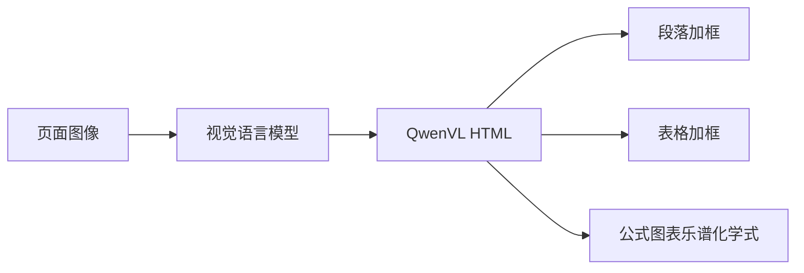

# Qwen HTML 版式感知文档解析

文档不是一行行纯文本；把段落、表、公式和插图写成带框的 HTML，阅读顺序与版式才一起进模型。

<footer>—— Qwen2.5-VL 技术报告；Qwen3-VL 技术报告</footer>

传统 OCR 把页面压成字符串，栏序、表结构、图注位置全部丢失。版式模型（LayoutLM 一类）把二维坐标喂给预训练语言模型，但仍常与独立检测、识别模块串成流水线。Qwen2.5-VL 把「通吃文档解析」定义为：用通用视觉语言模型直接生成 **QwenVL HTML**——标签里既有内容，也有 `data-bbox` 一类框，并按阅读顺序组织段落、表格、图表、公式、乐谱与化学式。Qwen3-VL 沿用 HTML，并增加以 Markdown 为主、仅对图和表定位的平行表示。本篇写这一目标格式与数据如何构成，不把检测器流水线假扮成 Qwen 的内部模块。

## 问题

页面是二维的。双栏论文若按像素从左到右、从上到下硬读，会把左栏某段与右栏某段交错切碎。表格的「单元格」是结构不是换行；公式是符号图，纯文本 OCR 会拆成乱码；图表需要读出系列与坐标轴，而不是一句「见图」。Donut 一类端到端模型已证明：可以直接从页图像生成结构化标记，而不经显式 OCR。Qwen 要在通用 VLM 里做同样的事，还要覆盖多场景、多语言、手写与印刷混排。

监督信号若只是纯文本转录，模型没有理由学习栏序与嵌套。必须把版式写成可训练的目标语言。HTML 是已有的嵌套标记，下游浏览器与抽取脚本都能吃，也便于把框属性挂在标签上。问题是标签集合要覆盖哪些元素、框用什么坐标、阅读顺序谁来定。

Qwen2.5-VL 强调：版式框与插图描述写进 HTML 标签，并按典型阅读顺序编排模块坐标。解析的目标是「整页信息的统一字符串」，不是单独一个检测头。

### 对照流水线与 LayoutLM

流水线：版面分析 → 文字检测 → 识别 → 规则重建表格。每段误差相乘，且与通用 VQA 模型割裂。LayoutLM 把 OCR 结果与二维位置嵌入预训练，擅长分类与抽取，但输入仍依赖外部 OCR。Qwen HTML 路径把页当作图，输出当作带版式的标记语言，检测与识别不作为用户可见的独立阶段。内部造数据时可以使用版面模型，那是**数据工厂**，不是推理图里的必经模块。

## 方法

### 标签、框与阅读顺序

Qwen2.5-VL 技术报告给出的 QwenVL HTML 把页面包在 `html/body` 里，典型块包括：带 `data-bbox="x1 y1 x2 y2"` 的段落 `p`；带样式与框的 `table`；图表为带框的 `div.chart`，内含图与表示数值的表；公式为 `div.formula`，同时保留图与文本内容；插图题注与插图 OCR；乐谱用 ABC 记谱写在带框容器里；化学式用 SMILES 写在 `div` 的 format 属性中。同一套 HTML 因此同时承载：**读什么**、**在哪**、**是哪类对象**。

阅读顺序由标注（合成或版面模型预测）排好，模型学习按该顺序发射标签。这比让 Decoder 自己从二维注意力里「猜」栏序更稳，因为损失直接打在序列上。Qwen3-VL 造数据时：从 Common Crawl 等收集大量 PDF，先用内部版面模型预测阅读顺序与文/非文区域框，再用 Qwen2.5-VL-72B 做区域识别，最后拼回带位置的解析目标。推理时用户只看到一个 VLM，看不到这套工厂。

### HTML 与 Markdown 两条靶

Qwen3-VL 技术报告写明两套统一标注：QwenVL-HTML 带细粒度元素级框；QwenVL-Markdown 主要给图像与表格定位，表格用 LaTeX 编码。合成 HTML 可系统转成 Markdown，再在真实文档上打伪标签并过滤。训练混合合成与高质量伪标，避免模型只会对「生成器风格」的干净 HTML 解码。任务提示应显式要求格式，否则模型可能退回纯文本转录——那是能力未激活，不是骨干坏了。

框与内容在同一字符串里，坐标必须与 [2D grounding](/llm/qwen-ocr-text-grounding) 所用的坐标系一致（2.5 用原图像素，3 用归一化到千分位），否则 HTML 能读、框却对不回原图。

## 机制

Decoder 把解析当成条件语言建模：视觉前缀提供页的 token，目标是 HTML 字符串。对阅读顺序中的块 $b_1,\ldots,b_B$，监督是

$$
p(y\mid x)=\prod_{t}\mathrm{LM}\big(y_t\mid y_{<t},\;v(x)\big),\quad y=\mathrm{HTML}(b_1,\ldots,b_B)
$$

其中 $v(x)$ 为页的视觉前缀。标签提供离散的对象类型先验，`data-bbox` 把回归问题改成与文本混排的数字串，模型用同一套语言模型头发射。嵌套标签强迫层次：表在段落之间、单元格在表内。这比扁平 JSON 列表更容易表达「图下有题注、题注下有来源」。

版式感知的关键是视觉侧仍保留足够空间分辨率——动态分辨率与 merge 之后，一个视觉 token 对应约 $28\times 28$ 像素量级的窗口，栏缝与单元格线仍可能落在 token 内。HTML 监督让语言模型学会**查询**这些视觉键并输出结构，而不是在像素上跑 NMS。失败时常见的是栏序颠倒或表被压成并列段落：那是序列目标学错了阅读顺序，应用带顺序的合成数据与过滤，而不是再加一个独立检测器当「补丁」却不改监督。

## 边界与工程取舍

HTML 比纯文本长得多，一页复杂杂志可能消耗大量解码步。长 PDF 不能把每一页的完整 HTML 无上限拼接进上下文，需要 [跨页策略](/llm/qwen-ocr-long-pdf)。极深嵌套或错误闭合标签会让下游解析器失败，应用侧应容错或要求模型按白名单标签输出。

化学 SMILES、乐谱 ABC、公式 LaTeX 都是**领域小语言**。通用 VLM 能输出格式，不等于化学有效性或乐谱可演奏；关键路径仍要规则校验。LayoutLM / Donut 在固定文档类型、固定 schema 上可能更稳、更便宜；Qwen HTML 的优势是与对话、VQA、多语言同一套权重，代价是生成式幻觉：框对、字错，或字对、结构错。评测应分开报转录错误与结构错误，不能只用 BLEU。提示必须点名格式。只说「解析这页」时，模型常退回纯文本；要求 QwenVL HTML 或 Markdown 才把版式通道打开。这是解码条件，不是另载一套权重。

造数据时用 72B 教师打伪标，会把教师的系统偏差写进学生。过滤低置信与格式残缺是必要步骤，不是可选项。不要声称推理期仍串联版面模型——报告把版面模型放在数据侧。

## 小结

- Qwen 文档解析的目标是带阅读顺序与框属性的 HTML（及平行的 Markdown），而不是纯 OCR 字符串。
- 标签覆盖段落、表、图、公式、乐谱、化学式等；框与类型写在同一标记语言里。
- 版面模型与大教师用于造数据；推理是单模型生成标记。
- 对照 Donut 的端到端标记生成与 LayoutLM 的「OCR+二维预训练」流水线，Qwen 走通用 VLM 生成式版式。
- 出处：Qwen2.5-VL 技术报告（QwenVL HTML 格式）；Qwen3-VL 技术报告（HTML/Markdown 双靶与 PDF 工厂）；对照 Donut、LayoutLM。
