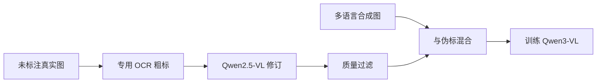

# 粗到细伪标注 OCR 数据管线

先让专用弱模型把字读脏，再让更强的视觉语言模型改干净；规模可以涨到千万级，而不把人工逐字标成瓶颈。

<footer>—— Qwen3-VL 技术报告</footer>

高质量 OCR 标注极贵：多语言、弯曲、模糊、印章、手写，每张图都要人盯着改。Qwen3-VL 技术报告写明：约三千万张内部真实图走 **coarse-to-fine** 管线，把 OCR 专用模型的伪标签与 Qwen2.5-VL 的修订合在一起，**全程无人逐字标注**。另再合成约三千万多语言样本，并收逾一百万内部真实多语言图，语言覆盖在 2.5 的十种（不含中英）之外再加二十九种。粗到细不是模型架构，是数据工厂的两级教师；本篇把它与「人工金标」和「单教师一次伪标」分开写。

## 问题

监督式 OCR 的上限随标注分布走。公开集偏印刷英文与规整文档，野生中文招牌、小语种、低质量拍照覆盖不足。人工扩到千万级不可行。单模型自训练（只用自己的预测当标签）会把系统性错误写成真理：把「折」永远标成「拆」，下一轮更确信。需要至少两级、且能力形态不同的教师：一级擅长局部字形（OCR 专用），一级擅长语境与版式（通用 VLM），再加过滤，而不是把脏标签原样当交叉熵靶。

Qwen2.5-VL 已用合成引擎、开源与内部数据训 OCR，并覆盖法德意西葡阿俄日韩越等。Qwen3-VL 要在真实野生图上再加一个数量级，且声明无人工标注。问题于是是管线顺序、谁先谁后、如何防崩溃，而不是再设计一个识别头。

报告原句级的要点：伪标来自 OCR-specialized models，修订来自 Qwen2.5-VL，三千万内部样本，无人标注。语言扩展是另一条合成与真实并行的支路，不要与 coarse-to-fine 混成同一步。

### 粗与细分别补什么

粗：召回与速度。专用 OCR 在规整印刷上往往比通用 VLM 更稳、更便宜，能先给出字级或行级草稿，包括框。细：用整图语境改明显错字、补漏行、按阅读顺序重排，并把结果写成与 [HTML](/llm/qwen-html-document-parse) 或纯文本靶兼容的字符串。细模型若先跑，成本高且在极小字上可能不如专用检测；粗模型若单独当金标，语境错误进训练集。顺序是先粗后细，不是集成投票而不修订。

## 方法

### 两级伪标再过滤

对一张未标图：专用 OCR 产出草稿 $y_{\mathrm{c}}$（可含框）。Qwen2.5-VL 在看到图与草稿的条件下产出 $y_{\mathrm{f}}$：

$$
y_{\mathrm{c}}=\mathrm{OCR}_{\mathrm{weak}}(x),\qquad y_{\mathrm{f}}=\mathrm{VLM}_{2.5}(x,y_{\mathrm{c}})
$$

训练学生（Qwen3-VL）用 $y_{\mathrm{f}}$ 或经过质量门的版本。报告未把门控公式写成公开损失，只强调修订与专用伪标的整合以及无人工。工程上合理的门包括：格式是否可解析、是否空页、是否与粗稿差异过大（过大可能是细模型胡写，过小可能是细模型偷懒照抄）。这些门若未在报告展开，实现时应写成自己的过滤策略，不要伪称论文超参。

文档解析支路是同源思想：版面模型出序与框，Qwen2.5-VL-72B 做区域识别，再拼回 HTML——区域级的粗到细。OCR 野生图管线不必经过版面模型，但都是「弱结构/弱识别 → 强 VLM 修订」。合成支路不依赖伪标：渲染引擎生成图文对，标签精确，用来补小语种与稀有字体；与粗到细真实图混合，避免学生只会对渲染风格。

学生下一版若再当教师，进入自训练循环。报告写的是用 2.5 修订以训 3，没有把「3 再标、再训 3」写成默认。扩代际时要重新过滤，否则误差会固化。

## 机制

### 两级教师降低的是系统误差，不是噪声为零

粗教师提供高召回的局部证据，细教师提供语言模型式的纠错：根据词法、版式、甚至图像里其他字段，把不可能的识别改掉。人在回路里做的也是这两步，只是细教师换成了 2.5。无人工不等于无偏：细教师的语言先验会把少见专名「纠正」成常见词，地名与品牌首当其冲。过滤若只看「像不像句子」，会系统性删掉真的乱码招牌或真的字母数字串，留下通顺但错的标签。

规模机制是：专用 OCR 便宜，可先扫过全部内部图；VLM 修订更贵，可以只对粗稿低置信或与语言模型先验冲突的子集做，也可以全量做——报告未拆分比例。写系统时要把这一比例当成成本旋钮。合成三千万提供「标签无噪声」的梯度，真实三千万提供「成像噪声」的梯度，两者缺一都会偏科。

与单教师伪标相比，两级降低了专用 OCR 的系统误差直接写进学生的概率，但引入教师间不一致：细模型改对了还是改错了，没有人投票。质量门是唯一的自动裁判，其本身也是模型或规则，会错。这是伪标管线的天花板，不是实现疏忽。

## 边界与工程取舍

法律、医疗、证件号等零容错场景不能把伪标当金标上线；管线服务的是基础模型预训练，产品层仍要校验。低资源语言即使加了合成，真实图只有约一百万量级的内部多语言，长尾脚本（与合成字体不一致的手写）仍会弱。粗模型若完全不会某语，细模型只能从图像凭语言先验「编」字，比留空更糟，过滤应能丢掉这类样本。

不要把 coarse-to-fine 写成课程学习里的「先低分辨率再高分辨率」——那是另一含义。这里粗细指**标注质量与教师强度**。也不要写成检测框的由粗到精回归头。架构仍是标准 VLM；变的是标签从哪来。

公开复现没有那三千万内部图。能复现的是流程：开源 OCR + 开源 VLM 修订 + 过滤 + 合成。效果取决于教师差与过滤，而不是流程名字本身。Qwen2-VL / Qwen2.5-VL / Qwen3-VL 技术报告是出处；不要给这条管线编造论文编号或内部准确率表。粗到细与「先低分辨率再高分辨率」的课程学习只是同名。这里改的是标签教师，不改输入金字塔。把两者写成同一步，数据工厂和视觉预处理会缠在一起，无法单独关掉某一级教师做消融。

## 小结

- Qwen3-VL 用专用 OCR 粗标、Qwen2.5-VL 修订的粗到细管线，在约三千万内部真实图上得到无人逐字标注的 OCR 监督。
- 另用大规模多语言合成与逾百万真实多语言图扩展语种；合成与伪标分工不同。
- 两级教师降低单模型自训练的误差固化，但细教师的语言先验与自动过滤会引入新偏置。
- 这是数据工厂，不是新识别头；证件级应用仍需校验，不能把伪标当金标。
- 出处：Qwen3-VL 技术报告（coarse-to-fine、规模与无人标注）；Qwen2.5-VL 技术报告（合成与多语言 OCR 数据作为前代基础）。
