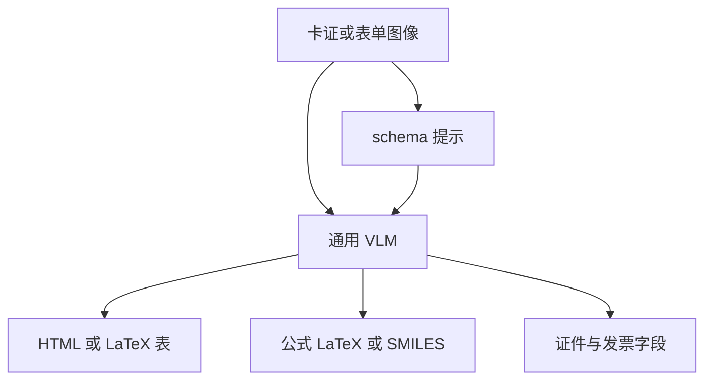

# 表格、公式与卡证关键信息抽取

文档里真正要入库的往往不是全文，而是表里的格、公式里的符号、证件上的字段；抽取必须带着结构，而不能停在读出一串字。

<footer>—— Qwen2.5-VL 技术报告；Qwen3-VL 技术报告</footer>

关键信息抽取（KIE）把图像变成字段字典或结构化表：发票号、姓名、税额、表格某一列、公式的 LaTeX、化学式的 SMILES。流水线通常是检测区域 → OCR → 规则或小模型填槽，字段一变就要改规则。Qwen 系列把 KIE 放进通用 VLM：同一套权重既做 [HTML 版式解析](/llm/qwen-html-document-parse)，也按提示输出 JSON 字段。Qwen2.5-VL 写明对发票、表单、表格的结构化抽取以及图表、公式的分析；HTML 目标里表格、公式、化学式、乐谱都是一等公民。卡证（身份证、银行卡、车票）是同一能力在固定 schema 上的应用，不是另做一个「证件专用骨干」。

## 问题

表的难点不是认出每个数字，而是格子的行列对齐、合并单元格、跨页表头。公式的难点是二维排版（上下标、分式、矩阵）被 1D OCR 拆碎。卡证的难点是版式相对固定但拍摄条件差：反光、透视、遮挡，以及字段之间的校验关系（号码位数、校验位）。纯全文转录把这些结构摊平，下游还得再写解析器，等于把版式问题从模型推给正则。

Donut 已在票据、表单上证明端到端生成 JSON 可行。Qwen 要在开放提示下做同类事：用户可以改字段表，而不重新训检测器。问题变成监督里必须同时出现**结构靶**（HTML 表、LaTeX、JSON）与**足够多样的载体**（真表、合成图、证件扫描），否则模型只会朗读不会填槽。

Qwen2.5-VL 对真实表格处理了约六百万样本，经离线表识别模型过滤低置信、重叠与单元格过稀的表；图表另合成约一百万。这是表与图的数据厚度，不是推理期仍调用该离线模型。

### 字段抽取与版式解析是同一能力的两种接口

要整页结构时走 HTML/Markdown；要几个键时走 JSON。底层都是「看见区域 → 生成受约束的标记」。不要把 KIE 理解成在 HTML 之外另训的抽取头。提示里给出 schema（键名、类型、允许空值）比不给 schema 更稳，因为解码有了键顺序与值格式的脚手架。

## 方法

### 表：HTML 或 LaTeX 格网

HTML 路径用 `<table data-bbox=...>` 包单元格，样式可保留。Qwen3-VL 的 Markdown 路径把表写成 LaTeX，只对表整体定位。训练时合成 HTML 再系统转 Markdown，真实文档打伪标后过滤。单元格内容仍是 OCR 问题，但换行与 `|`、`\href` 等分隔符由结构靶提供，模型学习在视觉上找横竖线再填格，而不是先读成散文再猜列。

### 公式与卡证字段

公式在 QwenVL HTML 里是带框的 `div.formula`，同时保留公式图与文本内容；化学式用 SMILES。这迫使模型输出机器可解析的串，而不是「一张积分符号的图说」。卡证与票据在应用层常用 JSON：键为「姓名」「证件号」「车次」等，值为字符串，模糊字用占位符而不是编造。Qwen 公开示例里火车票抽取把票号、站名、席别、身份证号列为键，并要求不编造、不漏字段——这是产品层的 KIE 模板，与技术报告里「发票、表单、表格」的能力叙述一致。

数据上，除合成与公开 OCR 外，多语言场景文字、手写、图表库（matplotlib 等）扩大载体分布。KIE 不另走一套视觉骨干；[SigLIP-2](/llm/qwen3-vl-siglip2) 或 2.5 的 ViT 只负责看见，结构由语言头发射。

合并单元格、表头斜向、无线表（纯空隙对齐）是表识别的长尾。过滤「单元格密度不足」会减噪声，也会减掉无线表；评测集若以无线表为主，不能直接用过滤后训练分布的数字交差。

## 机制

KIE 是受约束解码。给定图像 $x$ 与字段集合 $\mathcal{K}=\{k_1,\ldots,k_m\}$，模型生成

$$
\hat{y}=\mathrm{Decode}\big(x,\;\mathrm{prompt}(\mathcal{K})\big),\qquad \hat{y}(k)\in\Sigma^*\cup\{\texttt{?}\}
$$

schema 把输出熵从「任意文档语言」降到「若干键的值」。视觉侧通过动态分辨率保留数字与印章细节；[2D grounding](/llm/qwen-ocr-text-grounding) 让模型在需要时先框后读，减少张冠李戴（把邻行金额填进本行）。HTML 表提供二维归纳：生成 `<tr>` 时，注意力应落在下一行格子对应的视觉 token。公式则要求模型在符号邻域做局部对齐，与窗口注意力的局部归纳一致。

幻觉机制与开放 VQA 相同：字段必须有而图中没有时，语言模型会补一个看起来合法的号码。证件号、金额尤其危险。训练里构造不存在对象的查询（grounding 章节的负类）有助于拒绝；KIE 侧仍应在应用里做校验位、日期合法性与「模糊则问号」的指令，不能只靠模型自觉。

与流水线相比，联合模型可以用整页语境消歧：「合计」出现三次时，提示「表右下角合计」能把值绑到正确格。流水线 OCR 字符串丢失「右下角」。代价是端到端错误不可定位到「检测」还是「识别」，除非同时要求输出框。

## 边界与工程取舍

固定 schema 的卡证可以用更小的专用模型打到更高字段准确率、更低延迟。通用 VLM 的价值是同一权重覆盖发票、学术公式、多语言证件与对话修改 schema。关键路径（支付、实名）必须有规则校验与人工抽检，技术报告并不声称字段级零错误。

公式的 LaTeX 可编译率、SMILES 的化学有效性、表格的树编辑距离，应分项报，不能用文档 VQA 总分代替 KIE。跨页表（表头在上页、行在下页）超出单页 HTML，要靠 [多页 PDF](/llm/qwen-ocr-long-pdf) 的跨页 VQA，而不是单页 KIE 提示。印章覆盖文字、复印件网格、屏幕摩尔纹会同时打伤识别与结构；降低分辨率「为了速度」往往先掉的是税额小数点。

不要把 LayoutLM 的字段分类头写成 Qwen 的隐藏模块。Qwen 的 KIE 就是生成；LayoutLM 类模型是编码器加分类/抽取头。对比时比的是任务接口与错误类型，不是假装同一架构。JSON schema 写进提示，等于临时加了一个输出头。键名一变、顺序一变，解码分布跟着变，所以评测要固定模板。把某次 Prompt 的字段准确率当成模型上限，换一套中文键名就可能掉点。

## 小结

- 表格、公式、卡证 KIE 在 Qwen 里是通用 VLM 的结构化生成：HTML/LaTeX 表、公式串、JSON 字段，而不是独立抽取头。
- 表需要格网监督与过滤后的真表数据；公式与化学式需要可解析的小语言；卡证需要 schema 与反编造指令。
- 联合解码能用版式消歧，也会联合幻觉；生产环境要校验位与人工复核。
- 无线表、跨页表、专用小模型在固定证件上的成本优势，是明确边界。
- 出处：Qwen2.5-VL 技术报告（发票/表单/表、HTML 中的表与公式、表与图的数据规模）；Qwen3-VL 技术报告（HTML/Markdown 表）；对照 Donut 端到端 JSON 与 LayoutLM 式抽取头。
