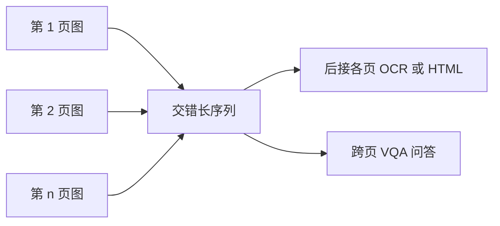

# 多页 PDF 合成与跨页文档 VQA

长文档的证据经常不在同一页：把多页当序列来训，模型才学得会跨页指代与翻页式问答。

<footer>—— Qwen3-VL 技术报告</footer>

单页 OCR 与单页 [HTML 解析](/llm/qwen-html-document-parse) 把一页当作一张图。真实 PDF 动辄数十页：目录指向后文、表头在上页、脚注在下页、「见图 3」与图不在同一屏。Qwen3-VL 在数据里单独加厚长文档：一是把单页样本**合成**为多页解析序列——若干页图像放在序列前部，其后接这些页的 OCR 或 HTML 文本；二是从高质量多页 PDF 构造必须跨页、跨元素（图、表、正文）才能回答的 VQA。Qwen3-VL 还把原生上下文拉到 $256\mathrm{K}$ 级，使「多页视觉 token + 文本」能放进同一窗口。本篇写合成与跨页问答的设定，不把检索式 RAG 写成模型内部模块。

## 问题

页与页在文件里是切好的，在语言里却互相指代。只训单页，模型从未见过「第 $i$ 页的『如上所述』要绑定第 $i-1$ 页的命题」。把每一页独立解析再在外部拼接字符串，丢失视觉上的页眉页码、跨页表格线，也丢失「提问时必须看哪几页」的监督。长视频用时间轴；长 PDF 用页序，二者都是要在序列里学会远距离对准。

上下文有限时，把全部页的图像无压缩塞进去会先打满视觉 token——每页仍走动态分辨率与 [2×2 merge](/llm/qwen-vl-patch-merge)。必须在数据里出现「多图前缀 + 结构化文本」的模式，并出现真正需要跨页 hop 的问题，否则模型会学会只读第一页。问题是如何合成合法长序列、如何平衡问类型、如何避免答案泄漏在邻近页的纯文本里让模型抄捷径。

Qwen3-VL 预训练最后阶段把序列长度推到 $262144$，数据强调长视频与长文档。跨页能力既是数据问题也是窗口问题；只有合成没有足够上下文，页会在窗口外被截断。

### 跨页指代是 VQA 的监督目标之一

指代包括：页码、「同上」、图表编号、续表、脚注标记、法律条款引用。VQA 必须要求证据来自多种版式组件，且问题类型要配平，否则全变成「第 1 页标题是什么」。报告写：supporting evidence 来自 charts、tables、figures 与 body text，促进 grounded 的多跳推理。不要把长文档理解写成「把多页 OCR 文本丢给纯语言模型」——视觉页仍在序列里，模型可以回看扫描件而不是只看伪标文字。

## 方法

### 合成多页解析序列

取已有单页解析样本（OCR 字符串或 QwenVL HTML），按文档类型与阅读顺序拼接。序列布局：先放多页图像 token，再放对应文本。这一布局让 Decoder 在生成全文或 HTML 时，注意力可以回到前面的页图像，而不是先生成完再「想起」还有图。页数从数页到数十页，与真实 PDF 分布对齐；报告写明目标包括 spanning dozens of pages。合成时页来源应尽量同属一篇，若把无关页硬拼，跨页指代会变成噪声，模型学到的是「忽略远页」。

### 跨页 VQA

从高质量多页 PDF 采样，生成必须跨页推理的问答：例如问某表与后文结论是否一致、某图例在哪一页定义、某字段在附录重复出现时以哪处为准。元素类型要覆盖图、表、正文，避免只训读表。问类型配平（抽取、比较、计数、是否、多跳）防止模型用单一模板。证据应真正分散；若问题与答案句都在同一页，则退化为单页 DocVQA，浪费多图前缀。

训练后期加长窗口，使上述序列不必截成单页。推理时用户也可把多页当多图输入；是否在图间插入「第 $k$ 页」文本标记，属于提示工程，报告在视频侧用了显式时间戳，文档侧以页图顺序为结构。不要编造一个未写明的页码特殊 token 名。

合成解析序列是教师文本跟在所有页图之后；真实阅读器则是一页一页翻。两者分布有差：模型可能过度依赖「先看完全部页再输出」。评测应包含必须在中间页作答、且后面页含干扰项的题目。

## 机制

多页进入同一自注意力后，任意页的视觉 token 可以与其他页、与问题对齐，这是跨页的代数来源。记第 $p$ 页视觉前缀为 $v_p$，问题为 $q$，答案

$$
\hat{a}=\mathrm{Decode}(v_1,\ldots,v_P,q)
$$

没有把 $v_1,\ldots,v_P$ 放进同一窗口，页间只有外部拼接的字符串，视觉对齐链断了。[Interleaved MRoPE](/llm/qwen3-vl-interleaved-mrope) 给每页图像自己的高宽网格，并用全局位置偏移把页与页在序列轴上分开，避免两页的左上角共享同一 $(h,w)$。时间轴在静图上退化，页序主要靠序列位置与可选的页码文字。

合成「图在前、文本在后」训练的是条件：给定页图像生成解析；VQA 训练的是条件：给定页图像与问题生成答案。后者更接近产品。若只训前者，模型会变成多页转录机，不保证会跳读。多跳要求中间页的表作为键、后页正文作为值，注意力必须真的落到证据页；否则会抄近邻页的高分词。配平与证据多样化就是为了让这条边被用到。

与 RAG 对照：检索先选页再让 VLM 只看 Top-$k$ 页，上下文更省，但检索错则不可挽回。Qwen3-VL 的长窗口路线是把多页同时放进模型，用注意力选证据。二者可在产品里结合，但技术报告这一节写的是长序列数据，不是检索器。

## 边界与工程取舍

视觉 token 随页数线性涨，数十页高清扫描在 $256\mathrm{K}$ 里也很快不够，必须降 `max_pixels` 或先检索。降分辨率先伤小字与续表线。合成若只用干净单页拼接，缺少扫描噪声、缺页、重复页码，真实 PDF 会 OOD。跨页表（一行拆在两页）即使有长上下文也难，因为单页 HTML 监督从未把「半行」标成跨页对象；需要在 VQA 里显式出现这类题，否则模型会只读半张表。

不要声称模型「内置 PDF 解析器」。输入仍是渲染后的页图像（或后续产品里的原生 PDF 通路，那是更后的版本叙事）；本节点的公开依据是多页图像序列与长文档 VQA 数据。Qwen2-VL / Qwen2.5-VL 已有强单页文档基准，长文档专节以 Qwen3-VL 技术报告为准，不要把 2.x 的 DocVQA 分数写成跨页能力。页序是序列位置，不是 MRoPE 的时间轴。静图上 $t$ 退化，若两页共用同一套 $(h,w)$ 原点，左上角会在几何上撞车。实现必须给后页加全局偏移或页间间隔 token，报告没有另发明一套「页 RoPE」名称。

法律与论文场景的「见条款 $X.Y$」若条款在几十页外且中间全是无关表，仍可能丢针。长窗口降低截断概率，不保证针测成功。评测应报必须跨页的子集，而不是用单页 DocVQA 代替。

## 小结

- 长 PDF 能力来自两类数据：多页图后接 OCR/HTML 的合成解析序列，以及证据跨页、跨图/表/正文的 VQA。
- 页图像与文本进入同一长上下文，靠自注意力做跨页对准；页间位置要错开网格，避免 $(h,w)$ 碰撞。
- 这与外部 RAG 选页不同；窗口不够时仍要降分辨率或检索，小字与续表是首发失败点。
- 单页 HTML 监督覆盖不了拆行跨页表，必须在 VQA 里显式训练。
- 出处：Qwen3-VL 技术报告（长文档合成与跨页 VQA、超长上下文阶段）；单页文档能力见 Qwen2-VL（Wang 等，2024）与 Qwen2.5-VL 技术报告。
