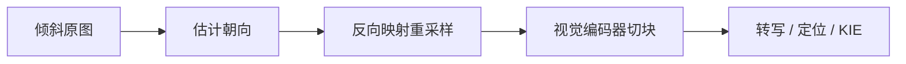

# 图像旋转矫正

倾斜图像：在 DashScope SDK 中设置 enable_rotate: true 可显著提升识别效果。

<footer>—— 阿里云百炼，Qwen-OCR 文档</footer>

扫描件、手机随手拍、传真件和屏幕截图里，文字行很少正好水平。文档倾斜不是识别之后的美化问题，而是 OCR 的前置条件：视觉编码器看到的是像素网格上的笔画方向，解码器按阅读顺序生成字符串。若整页绕光轴转了几十度，行方向、列方向和阅读顺序同时错位，后续的转写、定位和关键信息抽取都会在错误的几何上工作。Qwen-VL-OCR 把「图像旋转矫正」做成输入侧开关 `enable_rotate`，而不是让用户先用 OpenCV 估角再送图。本篇只讲这件事在文档 OCR 管线里的位置、几何与失败模式，不把版式解析或 2D grounding 展开成另一篇文章。

## 问题

一张文档图像可以看成平面上的像素函数 $I(x,y)$。理想阅读坐标里，文字行沿 $x$ 轴延伸，行间沿 $y$ 轴递增。实际拍摄引入刚体或近似刚体变换：平面内旋转、小幅透视、以及 90°/180°/270° 的整页翻转。平面内旋转写成

$$
\begin{pmatrix} x' \\ y' \end{pmatrix}
=
\begin{pmatrix} \cos\theta & -\sin\theta \\ \sin\theta & \cos\theta \end{pmatrix}
\begin{pmatrix} x-c_x \\ y-c_y \end{pmatrix}
+
\begin{pmatrix} c_x \\ c_y \end{pmatrix}.
$$

$\theta$ 不大时，人还能按斜行阅读；模型的 patch 网格是轴对齐的。ViT 式视觉编码器把图像切成固定朝向的块，位置编码也按网格行列编号。行方向一旦偏离网格，同一个字符会被切进多个斜向相邻的 patch，二维位置不再对应「第几行第几列」。这不是解码器词汇表的问题，是编码器几何先验被破坏。

传统 OCR 把矫正做成独立模块：投影直方图找主方向、Hough 找直线、最小外接矩形估 $\theta$，再双线性重采样。模块级联的代价是误差累积——估角偏 2°，细笔画在重采样里发虚，后面的识别器再把虚影当成噪声。端到端文档 VLM 希望少一个外部模块，但并不等于「旋转可以不管」：不矫正就把斜图送进同一套阅读顺序先验，CER 会在发票、身份证、书架侧拍上明显变差。

### 整页旋转与行内倾斜不是同一件事

整页旋转指画布坐标系相对阅读坐标系转过一个全局角，常见于「手机横着拍竖版合同」或扫描仪进纸偏斜。行内倾斜指局部文字块相对页面还有自己的角，例如印章、侧栏竖排、贴纸。全局矫正只能消掉前者。Qwen-OCR 高精识别任务返回的 `rotate_rect = [c_x, c_y, w, h, \alpha]` 里，$\alpha\in[-90,90]$ 描述的是文字框相对水平方向的局部角，和输入侧的整页转正是两层几何。把两者混成「开了旋转开关坐标就对了」，是定位任务里常见的坐标系错误。

90° 的倍数是离散分类问题，任意 $\theta$ 是回归问题。前者可以用「把图转四次、选最像文档的朝向」近似；后者必须估连续角并重采样。产品开关往往先覆盖前者和中等斜角，并不声称任意透视都可逆。

## 方法

Qwen-VL-OCR 在 DashScope 的图像内容字段上暴露 `enable_rotate`。默认关闭，斜图上文档建议打开。打开之后，服务端在送入视觉编码器之前估计朝向并重采样到近似水平的阅读坐标；后续内置任务（转写、定位、文档解析）都在矫正后的画布上运行。OpenAI 兼容接口不直接提供该参数，需要调用方自己转正，或改走 DashScope 以使用完整 OCR 选项。

矫正本身可以写成「检测—变换—再编码」三步。检测输出一个朝向假设 $\hat\theta$（有时再加翻转类别）；变换用反向映射把目标网格上的每个像素从原图采样，避免正向旋转产生的空洞；再编码把新图按 `min_pixels` / `max_pixels` 约束切块。反向映射是

$$
I_{\mathrm{rect}}(u,v) = I\bigl(R(-\hat\theta)\,(u-c)+c\bigr),
$$

插值通常是双线性。文档边缘在旋转后不再填满轴对齐矩形，需要填充或裁切；填充色若与纸色差太大，会在页边制造假边缘，干扰版式。

### 与定位坐标的耦合

高精识别返回的顶点坐标以「原图左上角为原点」为约定时，必须明确是矫正前原图还是矫正后画布。若服务端先转正再识别，却把框画回未转正的原图，四个顶点会整体偏转。工程上应把 `enable_rotate` 与坐标参考系写成同一份契约：要么坐标在原图像素系并附带所用 $\hat\theta$，要么坐标在转正后的图像上、可视化时用同一张转正图。Qwen-OCR 文档把倾斜图的识别效果提升和定位框绘制分成两段说明，原因正在于此——识别可以在转正图画布上变好，框必须回到用户手里的那张图。

## 机制

旋转矫正改变的是编码器看到的二维位置统计，不是解码器的语言模型。水平文字行让同一行字符落在相近的高度位置编码上，行间间距变成稳定的垂直位移；MRoPE 一类把高、宽拆开的位置几何，也更接近训练时「横排文档」的分布。斜行则把「同行」拆到对角线相邻的 token 上，注意力必须同时补偿内容和几何，容量被浪费在逆变换上。

从采样角度看，旋转不是信息无损操作。离散网格上的旋转会引入插值低通，细笔画、小号字、点阵打印尤其明显。因此「先小图估角、再对原分辨率旋转」比「在已压缩的视觉 token 上估角」更合理：token 网格已经把高频细节丢掉了。这也解释了为何矫正是前置，而不是解码器用自然语言说「这页好像斜了」就能补回来——生成侧看不到被插值抹掉的像素。

透视（相机不垂直纸面）不能用单个 $\theta$ 消掉。单应矩阵有八个自由度，旋转只是其中两个三角自由度里的一个。证件放在桌角、书本翻开的曲面，打开 `enable_rotate` 仍然会剩梯形和弯曲。那些要靠更高阶的文档展平，或直接让模型在畸变图像上认字，而不是幻想一个开关解决全部几何。

### 训练分布与开关的关系

若预训练和 OCR 后训练里已经大量加入随机旋转增强，模型对中等斜角会有一定鲁棒性，开关的增益变小。扫描件流水线里斜角集中在 $\pm5^\circ$，增强就能覆盖；用户相册里 90° 拍错、180° 倒置更常见，离散翻转必须显式处理。产品把矫正做成可选开关，等于承认两套分布并存：干净扫描希望少一次重采样以保锐度，野外照片希望先把阅读坐标扶正。默认关闭，是把锐度优先留给已经水平的图。

## 边界与工程取舍

`enable_rotate` 只在 DashScope 路径上作为一等参数存在。走 OpenAI 兼容 Chat Completions 时，不能靠同名字段「默默转正」；调用方要么自己做估角，要么接受斜图识别变差。这不是模型能力突然消失，是协议没有把前置几何暴露出来。批量流水线里应在接入层统一：斜扫描件走带旋转的接口，屏幕截图和已桌面化的 PDF 渲染图关闭旋转，避免无意义的二次插值。

矫正失败比不矫正更糟。估成 90° 的反例会把整页横竖对调，表格的行变成列，KIE 的字段名和值对调。因此开关不是「永远 true」。对已知朝向的证件模板、固定工位摄像头，应锁死几何，只在来源不可控时打开。多页 PDF 若逐页独立估角，某一页估错会造成跨页阅读顺序跳变；原生 PDF 路径里文字对象已有自己的变换矩阵，更不该对矢量页盲目做图像级旋转。

旋转矫正解决的是阅读坐标系，不解决分辨率。一张斜着的 200 万像素图转正后仍然受 `max_pixels` 约束，过小的字在切块后依旧不可读。先转正再按像素预算缩放，比先缩小再估角更稳，因为估角本身也需要足够的边缘能量。

## 小结

- 文档倾斜破坏轴对齐 patch 与阅读顺序先验，是 OCR 的几何前置，而不是识别完成后的后处理。
- 平面内旋转由 $\theta$ 参数化；Qwen-VL-OCR 用 `enable_rotate` 在编码前估朝向并反向映射重采样。
- 整页转正与文字框局部角 `rotate_rect` 的 $\alpha$ 是两层几何，定位坐标必须写明参考画布。
- 旋转重采样有插值损失；透视和曲面超出单角模型，开关不能替代文档展平。
- OpenAI 兼容接口不直接暴露该参数；固定朝向的工位应关闭，以免估错 90° 造成整页错位。
- 出处：阿里云百炼 / Qwen Cloud《文字提取》文档中的图像旋转矫正与 `enable_rotate` 说明；定位几何见同系列的文字定位任务。
