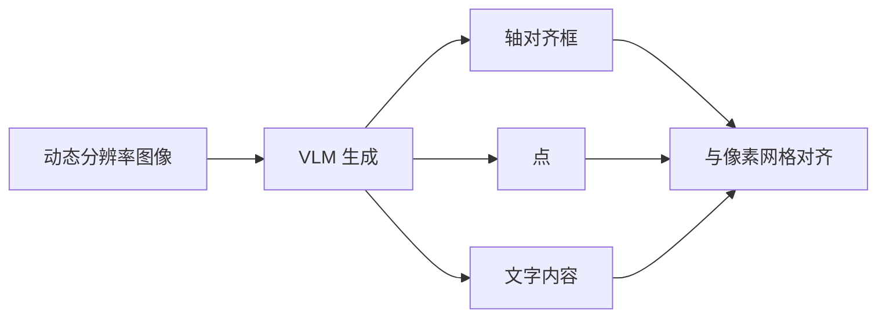

# 文字定位与 2D grounding

认出字还不够；把字所在的框或点用坐标说出来，阅读顺序、点击与核对才有几何落点。

<footer>—— Qwen2.5-VL 技术报告；Qwen3-VL 技术报告</footer>

OCR 常被理解成「图到字符串」。文档与界面场景还要求**文字在哪**：划出题干、把表头与列对齐、给 GUI 元素一个可点的框。Qwen2.5-VL 把检测、指向与计数做成通用 grounding，框与点用**输入图的实际像素**表示，并支持 JSON、XML 等多种格式。Qwen3-VL 把坐标改成归一化到 $[0,1000]$，仍保留框与点两种模态，并加强计数。文字定位是 grounding 在字符、词、行、栏上的特例：目标是文本实例，不是「猫」或「按钮」这一类物体名词。本篇把 2D 坐标如何进语言、如何与 HTML 框对齐写清，不另发明检测头。

## 问题

纯转录丢失几何。双栏页面上两处都出现「合计」，没有框就无法知道哪一处属于哪一张表。Agent 要点击屏幕上的某个词，必须把语言里的指称映射到像素。传统 OCR 检测器输出框与识别结果，但与 VLM 的问答、抽取是两套系统，坐标空间还要自己对齐分辨率缩放。

VLM 若只用相对坐标（$0$–$1$ 或百分比）而训练时又做动态分辨率，模型难以把「框的大小」和「物体真实尺度」联系起来。Qwen2.5-VL 因此在原生分辨率上直接用原图像素当监督。代价是：换分辨率或 letterbox 后，数字串的含义随 $H,W$ 变。Qwen3-VL 改为千分位归一化，换分辨率更稳，但失去像素尺度本身。问题是任务要的是「可回投的 2D 指称」，坐标系必须在训练与推理之间写成契约。

Qwen2.5-VL：框与点用输入图实际宽高下的数值。Qwen3-VL：坐标缩放到 $[0,1000]$。写应用时先看版本，不要把一套数字当另一套用。

### 文字实例与物体实例共用同一套输出通道

没有单独的「OCR 检测头」。框是语言模型生成的数字与分隔符，与物体 grounding、GUI grounding 同一条生成路径。好处是指称可以是任意短语：「右上角红色标题」「第三行金额」。坏处是框的数值精度受解码约束，不是 NMS 后的连续回归。文字定位要在提示里写清粒度（行框还是词框），否则模型会在两种粒度间摇摆。

## 方法

### 框、点、计数

框用 $(x_1,y_1,x_2,y_2)$（或报告中的等价序列）标出轴对齐矩形；点用于「指这里」与计数时的一一对应。Qwen2.5-VL 用公开与自建数据，格式合成到 XML、JSON 与自定义模板，并借助 Grounding DINO、SAM 等现成模型做拷贝粘贴增强与伪框。开放词汇检测扩展到上万类，并构造「查询里出现图中不存在的类」以抑制幻觉框。指向数据含 PixMo 等公开集与针对细节的合成点。

Qwen3-VL 的框数据从 COCO、Objects365、OpenImages、RefCOCO 等汇集，再用 Qwen2.5-VL 提候选、检测器与教师联合标框、过滤低置信。点数据同样混合 PixMo、检测/分割派生与细节合成。计数分成直接报数、依框数、依点数三种题型。文字定位共享这套几何；文档上的行框往往来自 [HTML 解析](/llm/qwen-html-document-parse) 的 `data-bbox` 与 OCR 伪标，而不是另训一套字符检测器。

$$
x'=\mathrm{round}\Big(\frac{x}{W}\cdot 1000\Big),\quad y'=\mathrm{round}\Big(\frac{y}{H}\cdot 1000\Big)
$$

上式概括 Qwen3-VL 的归一化（实现以报告为准）。反变换时必须用**模型实际看到的** $H,W$（含动态分辨率缩放后的尺寸），不能用磁盘上原图尺寸而不记录预处理。

绝对像素让模型看见尺度：同样内容的大图与小图，框的数值差一截，这是 2.5 的设计意图。3 的千分位则让「左上角」在不同分辨率上数字相近，便于后处理，但尺度要另从图像 token 数或边长推断。

## 机制

### 坐标是读出来的数字串

Grounding 是条件生成：视觉 token 带着 [MRoPE](/llm/qwen3-vl-interleaved-mrope) 的高宽几何，语言模型把查询对齐到某些视觉键，再把对齐结果读成数字串。动态分辨率下，token 网格与像素网格有固定比例（merge 后约 $28$ 像素一格），坐标回归本质上是「说出所依据的那些视觉 token 在网格上的范围」。文字比自然物体更细，往往只占一两个合并 token，所以定位误差对分辨率上限更敏感：`max_pixels` 太低时，小字的框会漂到邻行。

与独立 OCR 检测器相比，VLM 框与识别是联合解码，可以出现「字对框错」或「框对字错」。联合的好处是查询可以消歧：「标题里的 Qwen」而不是页脚里的。JSON 模板把字段顺序钉死，降低数字与标签错位。训练时多种格式混用，是为了测试期提示稍变仍能吐坐标，而不是模型内部真有多个检测头。

## 边界与工程取舍

生成式框没有经典检测的置信度校准，NMS 也不自然。密集文字（合同小字、密集字幕）容易漏框或合并相邻行。旋转、透视下的轴对齐框会变松，本系列另有旋转矫正节点，本篇不假装 2D 框能替代四边形。手写与印章的「字」边界主观，IoU 评测会低估可用的粗定位。

坐标系契约一旦在服务端写错——用 2.5 的像素数去解 3 的千分位，或忘记动态 resize——所有框整体缩放错误，比单字识别错误更难发现。后处理应把框画回**预处理后**的图做可视化验收。Agent 点击还要把框中心映射到屏幕坐标，中间若有窗口缩放，又是一层几何。不要在评测里只用识别准确率代替 grounding；文字定位应报 IoU 或点是否落在字形上。

Qwen3-VL 另有 3D 框与空间关系数据，那是物体与场景，不是 OCR 行框。本篇的 2D grounding 停在图像平面。把 9 自由度空间框拿来当文档定位，是范畴错误。与 HTML 的 `data-bbox` 应是同一几何契约：解析输出的框要能画回预处理后的页。两套数字各用各的原点，下游高亮会整体错位，看起来像模型不会定位，其实是后处理没对齐。

## 小结

- 文字定位是 2D grounding 的文本实例：模型生成框或点以及对应字符串，没有单独 OCR 检测头。
- Qwen2.5-VL 用原图像素坐标以保留尺度；Qwen3-VL 用 $[0,1000]$ 归一化以稳分辨率，反变换必须记录预处理尺寸。
- 框与物体、GUI grounding 共用生成通道；粒度（词/行/块）要靠提示与数据钉死。
- 密集小字、旋转与错误坐标系是主要失败模式；评测要分开识别与几何。
- 出处：Qwen2.5-VL 技术报告（绝对坐标与多格式 grounding）；Qwen3-VL 技术报告（归一化坐标、框/点/计数）；对照独立 OCR 检测器与 LayoutLM 所用的外部框。
