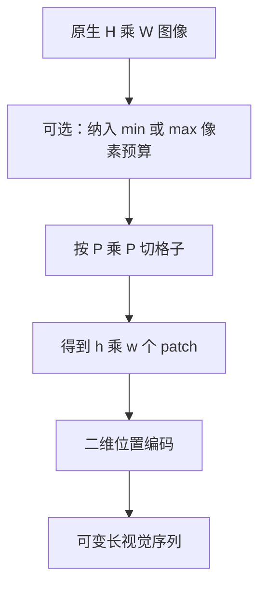

# Naive Dynamic Resolution 原生分辨率切块

不必先把所有图像缩进同一块固定画布；按原生长宽切成 patch，视觉序列的形状跟着图走，畸变与细字损失才能从源头去掉。

<footer>—— Peng Wang 等, Qwen2-VL, 2024</footer>

Qwen-VL 把图 resize 到固定边长再编码，宽表、长截图、海报都会被压方。[AnyRes](/llm/anyres) 仍要求每一格缩进 ViT 的原生 $S\times S$。Wang 等人 2024 年的 Qwen2-VL 把策略写成 Naive Dynamic Resolution：在给定的像素预算内尽量保持原生分辨率与长宽比，直接按 patch 大小切格子，得到可变长度的视觉序列。本篇只写「切块本身」——格子如何随 $H,W$ 变、为何不强制固定画布。$2\times 2$ patch merge 是控制 token 数的下一步，留给下一篇，这里只把它当作切块之后可以接上的模块来点到。

## 问题

固定画布有三重损失。几何：非方形图被拉伸或填充，表格列宽与圆被改形状。采样：大图缩小，小字低于 Nyquist。浪费：已经很小的图标被放大到 448，没有任何新信息，却占满同样多的 token。AnyRes 缓解了采样，但每格仍 squish 到 $S$，格边界切断字符，且实现绑在「编码器只认 $S\times S$」。

若视觉编码器的位置编码能表达任意二维格子，就可以问一个更朴素的问题：为什么不按原图像素切 $P\times P$？令 $h=\lceil H/P\rceil$，$w=\lceil W/P\rceil$，视觉序列长度就是 $hw$，形状即图的形状。这就是「naive」的含义：没有额外的查询、没有先切成固定 tile 再编码，动态性来自输入本身。剩下的工程问题是：长度不能无限、位置怎么编号、以及（下一篇）如何在切块之后再降 token。

## 方法

### 按原生格子切 patch

给定 patch 边长 $P$（ViT 常用 14），对高 $H$、宽 $W$ 的图（必要时先做可整除的轻度缩放或填充到 $P$ 的倍数）做规则切块，得到 $h\times w$ 个 patch，展平后线性嵌入。不把 $(H,W)$ 先变成 $(S,S)$。横图得到扁的 token 网格，竖图得到瘦的网格，信息在送进 Transformer 之前没有被全局畸变。

$$
h=\left\lceil\frac{H}{P}\right\rceil,\quad
w=\left\lceil\frac{W}{P}\right\rceil,\quad
N_{\mathrm{patch}}=h\cdot w
$$

这与分类 ViT「先 resize 再切成固定 $N$」相反：$N_{\mathrm{patch}}$ 是输入的函数。Qwen2-VL 在实践中仍会给像素或 token 设上下界：过大的图先按比例缩小到预算内，过小的图上采样，以免 $N$ 爆掉或过短。动态指的是在预算内跟随原生形状，不是拒绝任何缩放。

上下界不否定 naive。固定 448×448 是把所有图都拧到同一点；min/max 预算是一条带子，带子里长宽比仍自由。写实现时要把「预算缩放」和「强制方形」分开，前者保留动态分辨率，后者回到 Qwen-VL 2023。

### 二维位置，而不是固定长度 PE

可变 $h,w$ 使一维可学习位置表不够用：预训练见过的长度与推理格子对不上，扁图与方图的 raster 下标不可比。切块方案必须给每个 patch 坐标 $(i,j)$，用可外推的二维位置编码（Qwen2-VL 在视觉侧使用多维 RoPE 一类设计，后续专文再展开）。没有二维坐标，原生切块只是「可变长的一维序列」，模型分不清宽表的列方向。

### 本篇停在切块，不写 merge

切完之后 $N_{\mathrm{patch}}$ 仍可能太大：4K 宽图在 $P=14$ 下会有数万 patch，视觉编码器自己的二次注意力先炸。Qwen2-VL 用 $2\times 2$ 合并把相邻四块收成一个 token，再进 LLM。那是长度控制，不是切块定义。本篇的方法到「格子跟随原生分辨率」为止。把 merge 写进切块，会把「有没有 squish 到固定画布」和「有没有 4× 降采样」两笔账混在一起——前者是本篇，后者是下一篇。

## 机制

原生切块减少的是全局几何误差：圆形还是圆，列宽比例还在。细字能否读清，取决于缩放是否发生、以及 $P$ 相对笔画有多粗。若预算迫使 8K 扫描件先缩小到几千像素再切，naive 不会魔法般保留全部笔画；它只保证缩小是各向同性的、为了预算，而不是为了塞进方形窗口。这与 AnyRes「多张方形作物」的机制不同：AnyRes 的每格内部仍有一次独立 resize，格间还要靠拼接恢复邻接；原生格子的邻接在切块时就是原图邻接。

可变长序列让 batch 变难：同一 batch 里 $h,w$ 不同，需要填充或按分辨率分桶。这是动态分辨率的真实工程税，不是论文配图画出来的免费午餐。服务侧应按 $N_{\mathrm{patch}}$ 计费与限流，按像素边长限流会误伤长条图。

视觉编码器内部的注意力复杂度 $\Theta(N_{\mathrm{patch}}^2)$，这是 naive 必须配预算（以及下一步 merge、窗口注意力）的原因。切块本身不降低二次项，它只是停止用错误的几何去喂编码器。

## 边界与工程取舍

没有像素预算的 naive 会在用户上传原图时打爆显存。预算过紧，又回到「先缩小再切」，与固定画布的差别只剩是否保长宽比——这一条仍然重要，但 OCR 增益会缩小。填充到 $P$ 的倍数会引入垫边 token，应掩码掉，否则注意力浪费在黑边上。

不要把 Naive Dynamic Resolution 写成 AnyRes 的别名。AnyRes：固定 $S$，可变格数，每格 resize。Naive：可变 $h\times w$ 格子，尽量不把整图拧成方。也不要在本篇展开 merge 的通道拼接与损失；读者只需要知道切块之后长度仍可能过大，下一篇才处理。Qwen-VL 2023 的固定 448 + 查询适配器，是本方法明确要替换的输入假设。

复现时若仍先 `resize(448,448)` 再宣称 Qwen2-VL 动态分辨率，切块网格恒为常数，$N_{\mathrm{patch}}$ 不随长宽比变，方案已经退回上一世代。应用日志里应记录每张图的 $h,w$，作为是否真正落地的探针。

取舍：视觉骨干已支持二维可外推位置、服务能按 token 分桶，应默认原生切块；骨干只能吃固定 $S$ 的 CLIP 权重，先走 AnyRes，不要假装可变格子。文档与 UI 截图从这条切块获益最大；近方形的自然照片，与固定画布差别较小。

## 小结

- Qwen2-VL 的 Naive Dynamic Resolution：按原生（或预算内保比例的）$H\times W$ 切 $P\times P$ patch，不强制整图 resize 到固定方形画布。
- 视觉序列长度 $N_{\mathrm{patch}}=h\cdot w$ 随形状变；需要二维位置，而不是固定一维 PE。
- min/max 像素预算是带子，不是固定点；仍允许为预算做各向同性缩放。
- 切块不降低注意力二次项；过长序列由后续 $2\times 2$ merge 等模块处理，本篇不展开。
- 与 AnyRes 的差别：不是多张固定 $S\times S$ 作物，格子邻接即原图邻接。
- 落地探针是每张图的 $h,w$ 是否随长宽比变化。
- 出处：Wang et al., *Qwen2-VL: Enhancing Vision-Language Model's Perception of the World at Any Resolution*, 2024。对照 Bai et al., Qwen-VL, 2023；Liu et al., LLaVA-NeXT AnyRes；Dosovitskiy et al., ViT, 2020。
