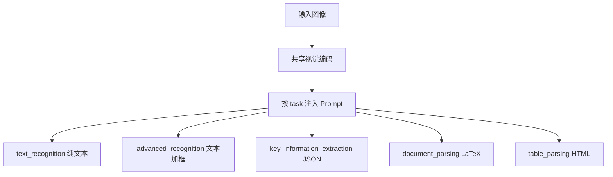

# Qwen-VL-OCR 内置任务模板

同一张图，转写要的是字符串，定位要的是几何，KIE 要的是字段；换任务就是换提示词，而不是换一个新的视觉骨干。

<footer>—— 归纳自 Qwen-OCR 内置任务文档</footer>

通用视觉语言模型可以把「图上有什么字」当成普通 VQA。文档 OCR 不行：下游要的输出类型不同——纯文本、带框的行、HTML 表、LaTeX 公式、JSON 字段。若每次都靠用户现场写一段提示词，格式漂移、漏字段、把说明文字混进转写，会变成系统故障而不是文风问题。Qwen-VL-OCR 因此内置一组任务模板：调用方设 `ocr_options.task`，服务端注入对应 Prompt，模型按该任务的输出契约生成。转写、定位、关键信息抽取走不同的提示词，共享同一套视觉编码，不共享同一套解码约束。本篇把模板当成接口设计来讲，不把某一类证件的字段表展开成产品手册。

## 问题

OCR 不是单一损失函数。同一图像 $I$ 上，三个内置任务对应三个条件：

$$
p(y\mid I),\qquad
p(y,b\mid I),\qquad
p(\{k_i{:}v_i\}\mid I,S).
$$

$y$ 是阅读顺序字符串，$b$ 是行框几何，$S$ 是 KIE schema。表格要的是单元格拓扑，公式要的是符号树。把这些任务压进同一句「请识别图中文字」，模型只能猜调用方想要哪一种张量。猜错的代价在业务上不可接受：发票要 JSON 键，却返回一段散文；定位要框，却返回没有坐标的纯文本。

提示词是这些任务之间最便宜的路由信号。它不改视觉 token，只改解码器的条件前缀。内置模板的价值是把路由从「每个应用自己维护一页 Prompt」收拢到「一小段稳定的任务标识」。标识稳定，才能对输出做结构化校验，才能把 `ocr_result` 从自由文本里拆出来。

### 自由生成与契约生成

没有模板时，解码器在自然语言空间里游走，格式是软约束。有模板时，Prompt 把合法输出限制在一种句法：纯文本、HTML `<table>`、LaTeX、或可解析 JSON。契约越硬，后处理越简单，对幻觉字段的检测也越容易。代价是任务必须事先枚举。枚举之外的需求——「把这一段翻译成英文再抽取」——要么叠自定义 Prompt，要么拆成多步。早期 Qwen-VL-OCR 用内部固定 Prompt 覆盖用户文本；从 `qwen3.5-ocr` 起，内置任务与用户 Prompt 并存，结构化结果走 `ocr_result`，自然语言说明走普通文本通道。

模板不是新模型。`task=table_parsing` 不会加载另一份权重，它只是把解码条件换成「用 HTML 忠实反映格子」。若视觉编码器根本没看清线，再强的模板也变不出正确的 `rowspan`。模板约束的是输出形态，不是感知上限。

## 方法

DashScope 路径上，内置任务通过 `ocr_options={"task": ...}` 选择。OpenAI 兼容路径没有同名参数，必须把文档里公布的任务 Prompt 手动放进用户消息。Qwen-VL-OCR（基于 Qwen3-VL 架构的 OCR 专用线）覆盖的主要任务包括：通用转写 `text_recognition`、多语言转写 `multi_lan`、高精识别与定位 `advanced_recognition`、文档解析 `document_parsing`、表格解析 `table_parsing`、公式识别 `formula_recognition`、关键信息抽取 `key_information_extraction`。文档解析把版式转成 LaTeX；表格转成 HTML；公式只要 LaTeX 片段；KIE 按 schema 填 JSON。

高精识别的提示词明确要求定位所有文字行，并返回旋转矩形 $[c_x,c_y,w,h,\alpha]$。这是转写加几何，不是「再写一遍字」。KIE 的提示词则假设调用方给出 JSON schema，要求只输出合法 JSON，模糊字用 `?`，缺值用 `null`。同一张身份证，转写任务应吐出阅读顺序文本，KIE 应吐出姓名、号码等键；用错任务，不是识别率下降，是接口语义错了。

### Prompt 即输出头

可以把任务模板看成没有额外参数的「软输出头」。真正的多头会为框回归另接 MLP，为 JSON 另接受限解码。模板路线把限制放进语言：用示范句法让自回归头模仿。优点是一套权重服务多任务，迭代 Prompt 不必重训。缺点是格式服从是概率性的，长表、深 schema 时仍可能截断或夹杂解释性句子。因此文档强调从 `ocr_result` 取结构化字段，而不是只信 `text` 里的 markdown 围栏。

KIE 还分两种条件。给出 `result_schema` 时，模型做槽位填充，未知键不应发明；不给 schema 时，做开放字段发现，键名由模型从版面上读。前者可校验，后者召回高但键不稳定。三层嵌套是 schema 深度上限——不是语言模型写不出更深的 JSON，是产品把契约停在可测的深度。

## 机制

任务条件进入解码器后，改变的是 token 转移的合法集合。转写任务的高概率延续是字、标点和换行；定位任务还要生成数字坐标和括号；KIE 要生成引号、冒号和 `null`。视觉特征相同，语言模型的约束不同，注意力会把预算花在不同的视觉证据上：转写更盯笔画，定位还要盯框的角点，KIE 还要盯印刷标签与填写值的空间配对。

这解释了为何「用转写结果再规则抽取」和「直接 KIE」不是等价管线。规则抽取看不到「姓名」二字与手写值的二维对齐，只能在一维字符串上猜。内置 KIE 把二维对齐留在视觉 token 里，用 schema 当查询。公式任务则把二维结构编译成 LaTeX 线性化，依赖的是符号邻接而不是自然语言词序。

`text_recognition` 与 `multi_lan` 在文档里共用「只输出文字、不要说明」这类 Prompt，差别主要在评测与路由语义：后者显式面向多文种混排。不要假设换一个 task 名就会换识别脚本系统；脚本能力来自训练数据，task 只声明输出要干净。

### 覆盖与并存

早期快照用内部固定 Prompt，用户自定义指令会被覆盖，行为可预测但不可组合。`qwen3.5-ocr` 改为任务结果与用户 Prompt 结合：`ocr_result` 承担契约通道，对话文本承担追问。这使「先按模板抽字段，再问这个金额含不含税」成为同一会话里的两件事，而不是两次互不记忆的单轮 OCR。组合的代价是两套输出都要解析，且用户 Prompt 可能把解码从严格 JSON 拉开；校验仍应以 `ocr_result` 为准。

## 边界与工程取舍

模板枚举不可能覆盖全部文档 AI。版式极其不规则的海报、被截断的表、需要计算或跨页核对的字段，超出「看见什么填什么」。What You See Is What You Get 写进 KIE Prompt，既是能力声明也是责任边界：模型不应补全省库里的标准地址。模糊与强光明确要求用 `?`，这是把拒绝识别编码进契约，避免一本正经的幻觉字。

OpenAI 兼容调用必须手工粘贴任务 Prompt。Prompt 一旦与官方文本漂移，输出格式就不在回归测试集里。生产系统应把官方模板当成版本化资源，跟随模型快照升级，而不是由业务方「优化措辞」。定位任务的坐标与旋转矫正开关耦合，见图像旋转矫正一文；文档解析对扫描 PDF 仍可能要先渲染成图，直到原生 PDF 路径出现。

内置任务降低的是集成熵，不是错误率上限。选错 task 比模型弱更常见：对卡证用纯转写再正则，会把版式信息丢掉；对纯段落用 KIE，会得到空洞 JSON。先定输出契约，再选模板。

## 小结

- Qwen-VL-OCR 用 `ocr_options.task` 在共享视觉编码上切换解码契约：转写、定位、KIE、表格、公式、文档解析走不同 Prompt。
- 转写要字符串，高精识别要行文本加几何，KIE 要 schema 约束的 JSON；三者不是同一任务的详略。
- 模板是软输出头，格式服从是概率性的；结构化字段应读 `ocr_result`。
- 早期版本内部覆盖用户 Prompt；`qwen3.5-ocr` 起任务通道与对话 Prompt 并存。
- OpenAI 兼容接口需手工注入官方 Prompt，并随快照做版本管理。
- 出处：阿里云百炼 / Qwen Cloud Qwen-OCR 文档「调用内置任务」一节及各 task 的 Prompt 与输出格式表。
