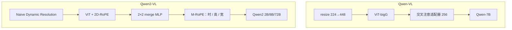

# Qwen-VL / Qwen2-VL

第一代用固定 448 画布和 256 个位置感知 query 把 Qwen-7B 接上视觉；第二代取消固定边长，用原生分辨率与 M-RoPE 让图、文、视频共用一套位置几何。

<footer>—— Bai 等，Qwen-VL，arXiv:2308.12966；Wang 等，Qwen2-VL，arXiv:2409.12191</footer>

通义的视觉语言模型分两代公开报告。**Qwen-VL**（2023-08）建在 Qwen-7B 上，OpenCLIP ViT-bigG 作视觉塔，一层交叉注意力适配器把视觉序列压到 **256**，输入先 resize 到 224 再在第二阶段升到 **448**。训练三阶段：冻 LLM 对齐、全参多任务（描述、VQA、OCR、框）、再指令微调得到 Qwen-VL-Chat。**Qwen2-VL**（2024-09）换成 2B / 8B / 72B，提出 **Naive Dynamic Resolution** 与 **M-RoPE**，图和视频同一套管线，并讨论 LVLM 的规模律。切块与 $2\times 2$ merge 的机制已有专文，本篇写两代**论文差分**：固定画布 vs 原生网格、适配器压缩 vs merge、框当文本 vs 动态 token 预算。不把 [Qwen2.5-VL](/llm/qwen25-vl) 的窗口注意力与绝对时间倒填进 2-VL。

## 问题

纯文本 Qwen 不能读图。2023 年开源 LVLM 要么分辨率低、读不了字，要么不会指物体。Qwen-VL 要在**一个**通用模型里同时做描述、问答、中英多语、多图交错、以及把框当成可生成字符串。固定画布是当时 ViT 位置表的约束：绝对位置嵌入按 224/448 训练，任意长宽比会畸变。

Qwen2-VL 面对的是下一代产品缺口：海报、扫描件、屏幕、视频不能都先压成 448 方图。若继续用 256 query，细节在适配器里丢掉；若按 LLaVA AnyRes 切 336 格，格缝仍在。问题改成：ViT 能否直接吃可变 $H\times W$ 的 patch 网格，LLM 又如何用同一套旋转位置去表示时间、高、宽。

### 第一代：位置感知的 256 槽

视觉塔 1.9B，适配器约 0.08B，LLM 7.7B，合计约 9.6B。适配器：可学习 query 对 ViT 特征交叉注意，输出长度钉死为 256，query–key 加 **2D 绝对位置**，减轻压缩时丢坐标。图像序列用 ` … </img>` 包起来。框归一化到 $[0,1000)$，写成 `$(x_1,y_1),(x_2,y_2)$`，再用 `<box>` / `<ref>` 与指代短语绑定——**不新增坐标词表**，框就是文本。阶段 1：约 14 亿清洗图文对（从 50 亿网页对滤出，英 77.3% / 中 22.7%），冻 LLM，训 ViT+适配器，224。阶段 2：解冻，448，混入交错、VQA、OCR、grounding。阶段 3：Chat 指令微调，常冻视觉塔以保感知。

256 槽与 InstructBLIP 的 32 query 同类，只是更宽。它解决的是「7B 窗口装不下 1024 个 patch」，不是「任意分辨率」。448 仍是方画布；宽表要先被 resize 拧形。

## 方法

Qwen2-VL 的视觉塔改为可处理可变网格：去掉一维绝对位置表，ViT 内用 **2D-RoPE**。图像按 patch 14 在原生（或预算内按比例缩放后的）分辨率上切格，再经 MLP 把相邻 **2×2** patch 合成一个 token，前后加 `|vision_start|` / `|vision_end|`。于是 224×224 进入 LLM 约 **66** 个视觉 token（含起止），而不是 256 固定槽。推理时不同分辨率的图打包成一条序列，用 `min_pixels` / `max_pixels` 卡显存。视频与图像统一：帧沿时间维排，位置编码拆成时间 / 高 / 宽三分量（**M-RoPE**）；纯文本三分量相同，退回 1D RoPE；静图时间分量恒定。规模实验给 2B、8B、72B；72B 在当时多模态榜上与 GPT-4o、Claude 3.5 Sonnet 对照。训练数据相对一代从「14 亿对 + 多任务」扩到报告中的更大规模混合（具体 token 以 2409.12191 与后续 2.5 报告对照为准，2.5 写 2-VL 约 1.2T 视觉–语言预训练量级）。

### 两代位置几何不要混用

一代适配器的 2D 绝对位置活在 **256 个 query** 上；二代 2D-RoPE 活在 **可变 patch 网格** 上，M-RoPE 再活在 LLM token 上。实现若把一代的 `<box>` 字符串格式接到二代动态分辨率模型，坐标语义仍是「相对原图归一化」，但视觉 token 数已随分辨率变——框监督必须与当时的缩放一致，否则点不准。一代多图靠交错 `` 块；二代同样交错，但每块长度不同，pack 时要按像素预算切，而不是每图 256。

## 机制

固定 256 的机制是信息瓶颈加位置补偿：query 在压缩时仍知道自己在问图的哪一块。它适合「LLM 上下文很金贵」的 2023 年 7B。动态分辨率的机制是承认 ViT 自注意力并不要求 $N$ 恒定，只要每个 patch 有 $(h,w)$ 上的相对旋转；merge 则把面积代价从 $HW/P^2$ 降到约四分之一，把账单转给 LLM 而不是把细节在 query 里抽干。M-RoPE 让「第几帧」与「第几行第几列」可加：文本没有空间维，图像没有时间维，视频三者都有，一个公式覆盖。

相对 [LLaVA-OneVision](/llm/llava-onevision) 的切格，Qwen2-VL 不把图先切成多个 384 方块再编码，减少格缝切断笔画；相对 Flamingo 的 64 latent，它把长度交给像素预算，OCR 上限随 `max_pixels` 升，而不是随 query 数升。一代 grounding 把检测收成语言建模，使通用解码器能出框；二代沿用文本化坐标思路，但感知网格已经变了，读字任务更吃动态分辨率。

Naive 的意思是「按原生格子切，不另学一个分辨率选择网络」。预算缩放仍然存在：超大图先按比例缩小。写产品时要把 min/max pixels 当成用户可见旋钮，默认中位值会在缩略图聊天与发票 OCR 上两头不讨好。

### 和 LLaVA 浅投影、和 BLIP-2 瓶颈

LLaVA 冻 CLIP、浅 MLP、指令数据少，不训 14 亿对适配器。Qwen-VL 愿意在阶段 1–2 动视觉塔与适配器，换细粒度与中文图文。BLIP-2 的 32 query 更窄、LLM 冻得更死。Qwen2-VL 在「浅投影进 LLM 自注意力」上更接近 LLaVA，在「可变二维位置 + 图视频统一」上是自己的几何。选 7B 聊天助手且只有公开指令数据时 LLaVA 系更轻；选动态分辨率、多语 OCR、视频与 72B 规模律时走 Qwen2-VL 报告。

## 边界与工程取舍

Qwen-VL 的 448 方图与 256 槽对现代文档任务不够，不要用一代 Chat 的 Demo 能力代表 2-VL。Qwen2-VL 的 ViT 仍是二次注意力，极高清会在编码器侧先炸，这是 2.5-VL 窗口注意力才处理的问题。72B 对照 GPT-4o 的表是当时协议，随后榜会变。内部的 Qwen-VL-Plus / Max 已用过动态分辨率，论文写明 2-VL 是把该技术公开升级——不要把 Plus 的闭源分数写进开源 2B/8B。

框输出不是检测器 NMS：多个 `<box>` 可能重叠、坐标受模板约束。视频抽帧与时间 ID 在 2-VL 里按帧递增，同一段真实时长在不同 FPS 下相位不同，2.5-VL 才改绝对时间。许可与商用条款以通义当时模型卡为准。实现必须与 tokenizer 特殊符号表一致，否则视觉起止符会对不齐。

专文分工：[原生切块](/llm/qwen-vl-naive-dynamic-res)、[patch merge](/llm/qwen-vl-patch-merge) 写公式与账单；本篇只钉两代论文各自证明了什么。2.5-VL 见 2502.13923，不要把窗口层 $\{7,15,23,31\}$ 写进 2-VL。

## 小结

- Qwen-VL：Qwen-7B + ViT-bigG + 256 位感知适配器，224→448 三阶段，框与指代当文本，支持中英与多图。
- Qwen2-VL：Naive Dynamic Resolution、ViT 2D-RoPE、2×2 merge、M-RoPE，2B/8B/72B，图视频统一。
- 一代瓶颈换窗口，二代用原生网格换畸变；像素预算仍是硬约束。
- 窗口注意力与绝对时间对齐属于 2.5-VL，不是 2409.12191 的主体。
- 出处：Bai 等，*Qwen-VL*，arXiv:2308.12966；Wang 等，*Qwen2-VL*，arXiv:2409.12191。
