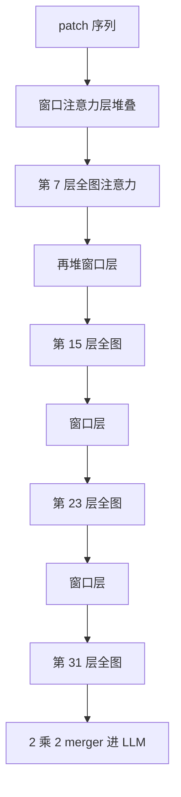

# 窗口注意力与周期性全局注意力交替

多数视觉层只看局部窗口，计算随 patch 数近似线性；再周期性插入全图层，跨窗的版式与长程依赖才有落点。

<footer>—— Qwen2.5-VL 技术报告</footer>

原生分辨率把 ViT 的 patch 数 $N$ 从数百推到数千。若每一层都做满自注意力，编码器代价是 $\Theta(N^2)$，高清文档会比语言模型还贵。Qwen2.5-VL 把视觉 Transformer 改成「窗口层为主、全图层为辅」：绝大多数层只在最大 $112\times 112$ 像素的窗口内做注意力，全图自注意力只出现在四个固定层号上。这与语言模型里的 [滑窗](/llm/sliding-window-attention) / [局部–全局混合](/llm/local-global-attention) 同构，但发生在**双向**的视觉编码器里，不是因果 Decoder。Qwen2-VL 尚未把这一窗口化写进公开架构叙述；本篇以 Qwen2.5-VL 技术报告的配置为准。

## 问题

动态分辨率下，$N=HW/p^2$ 随输入变。训练批次里既有小缩略图也有 A4 扫描件，满注意力会使大图样本的算力与激活显存远高于小图，负载不均衡，步时间被最长样本钉死。二次复杂度还有第二层含义：同一张海报，开到更高分辨率以保护小字，编码器代价按分辨率平方涨，而 [patch merge](/llm/qwen-vl-patch-merge) 只压缩**送给 LLM** 的长度，不降低 ViT 内部的 $N$。

需要一种视觉注意力，使多数层的代价随 $N$ 近似线性，同时不允许整幅图被切成互不通信的瓷砖——表格跨列对齐、题注与插图、页面页眉页脚，都是超局部窗口的依赖。问题于是变成：窗口多大、全图层放在哪几层、小图要不要补零。

这里的窗口在 ViT 网格上切，单位是 patch 不是像素。报告写窗口 $112\times 112$，对应 $p=14$ 时的 $8\times 8$ 个 patch，一层内每个标记最多看 $64$ 个邻居（含自身）。

### 视觉双向与语言因果不要混用同一套掩码

语言模型滑窗必须保留因果下三角。视觉编码器没有「未来」，窗口内是全双向的，全图层也是全双向的。把 Decoder 的带状因果核直接套到 Qwen 的 ViT 上，会切断同一窗口里右侧与下方的 patch，OCR 的右半边字形会读残。实现必须用二维窗口掩码或把窗口内 token 收集成块后做密注意力。

## 方法

### 窗口层与四个全图插入点

Qwen2.5-VL 的 ViT 共 $32$ 层、隐维 $1280$、$16$ 头。配置表写明：窗口大小 $112$，**全注意力层号为 $\{7,15,23,31\}$**。也就是说，第 $8$、$16$、$24$、$32$ 层（$0$-index 的 $7,15,23,31$）看整幅 patch 图，其余层把注意力限制在至多 $8\times 8$ 的窗口。小于 $112\times 112$ 的区域**不补零**，按原分辨率成窗，避免小图被垫成固定块而引入假边界。

记窗口内邻域为 $\mathcal{W}(t)$。窗口层的一层代价约为 $\Theta(N\cdot |\mathcal{W}|)$，全图层为 $\Theta(N^2)$。全图层只有四层，总编码器代价由窗口项主导：

$$
C \approx (L-4)\,c_{\mathrm{win}}N|\mathcal{W}| + 4\,c_{\mathrm{full}}N^2,
$$

其中 $L=32$，$|\mathcal{W}|\le 64$。$N$ 增大时，只要全图层数固定，增长仍接近线性加上一小段二次；二次项的系数是 $4/32=1/8$，而不是 $1$。

### 位置编码仍是二维的

窗口化改的是可见集，不改位置几何。Qwen2.5-VL 在 ViT 内用 2D-RoPE 标明 patch 的行、列；窗口外的键本来就不进 softmax，但窗口内的相对几何仍由旋转提供。全图层一旦打开，任意两 patch 可以在该层直接对齐，2D-RoPE 的相对位移在全图距离上仍然成立。不要把「窗口注意力」理解成「位置编码也局部化了」——位置是全局网格上的坐标，注意力边才是局部的。

视频把连续两帧打成 3D patch 后，窗口仍主要在空间上切；时间混合更多依赖帧间的 3D 切块与后续语言模型里的 [MRoPE](/llm/qwen3-vl-interleaved-mrope)，而不是把时间轴也切成 $8$ 帧的滑窗。报告没有把 ViT 窗口写成三维滑窗。

## 机制

窗口 softmax 把归一化限制在邻域。局部对比度、笔画、单元格边框在窗口层被反复精炼，类似卷积的归纳偏置，但权重由内容决定。全图层每隔七层插入一次，作用是把已经局部混合过的表征做一次任意远的重新对准：左上角页眉与右下角页码、跨栏的同一表格、相距很远的两个相同图例，都可以在这一层建立边。

层叠意味着窗口层的感受野会随深度扩大——下一窗口层读到的隐状态已含上一窗的混合——但没有全图层时，跨页宽的对齐仍要走很多跳，且每跳被近邻稀释。四个全图插入点把直径从 $O(\sqrt{N}/8)$ 量级的网格距离缩短到「最多隔七层就能点对点」。这与 Gemma 2 在 Decoder 里交替局部/全局是同一配额思想，配额按层而不是按特殊 CLS token。

全图层的 KV 在编码器前向里随 $N$ 二次出现，但视觉编码通常只跑一次、不进入生成期的逐步 KV 缓存。省的是 prefill 侧 ViT 的激活与算力，不是 Decoder 的 decode 缓存。两者不要算成同一笔账。

## 边界与工程取舍

窗口 $112$ 与全图层号是 Qwen2.5-VL 的默认，换骨干或改 patch 大小不能照抄像素数。若 $p$ 不是 $14$，应保持「约 $8\times 8$ patch」还是「约 $112$ 像素」要单独验证；报告给的是两者同时成立的配置。把全图层减到一层，长程版式会明显弱；加到每两层一次，二次项会重新主导大图。

小区域不补零会让同一层里窗口形状不一，内核必须支持可变窗口，或按图把窗口收集后再 batched 计算。错误地统一 pad 到 $112$ 会在真图外引入黑边 token，OCR 容易把垫边读成伪字符。另一边界：窗口层看不见窗间边，若某张表的一条线正好压在窗口缝上，只能等全图层或靠 ViT 隐状态接力；这与 [patch merge](/llm/qwen-vl-patch-merge) 的网格缝叠加，密集表格是双重硬切。

Qwen3-VL 换 [SigLIP-2](/llm/qwen3-vl-siglip2) 骨干并继续动态分辨率，技术报告没有把「四层全图 + $112$ 窗口」原样列为 SigLIP-2 的超参。写实现时应以对应版本配置为准，不要把 Qwen2.5-VL 的层号写进 Qwen3-VL 却声称来自同一张表。

## 小结

- Qwen2.5-VL 的 ViT 以窗口注意力为主，窗口至多 $112\times 112$（$8\times 8$ patch），使编码器代价随 patch 数近似线性。
- 全自注意力只放在层 $\{7,15,23,31\}$，周期性打开跨窗通道，版式级长程依赖不必每层付 $N^2$。
- 小于窗口的区域不补零；位置仍用 2D-RoPE，改的是可见集不是坐标系。
- 这是视觉编码器内的局部–全局配额，与 Decoder 因果滑窗同构但双向，且不减小 decode 的 KV。
- 出处：Qwen2.5-VL 技术报告（窗口大小与全图层号）；对照 Longformer / 局部–全局混合注意力；Qwen2-VL（Wang 等，2024）以动态分辨率与 merge 为主，窗口化以 2.5 报告为准。
