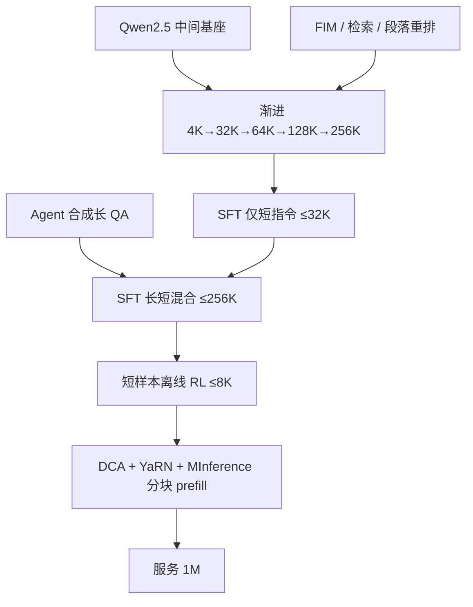

# Qwen2.5-1M 长上下文

    
预训练只训到 256K，推理用块注意力与稀疏核把可用窗口拉到 1M；短样本上的对齐也能泛到长对话。

    <footer>—— Yang 等，Qwen2.5-1M Technical Report，arXiv:2501.15383</footer>

Qwen2.5-1M 是通义把 Qwen2.5 窗口做到 **100 万 token** 的专线：开源 **7B-Instruct-1M** 与 **14B-Instruct-1M**（Apache 2.0），云上另有 MoE **Qwen2.5-Turbo**。常规 Qwen2.5 Instruct 默认是 32K 预训练加外推到 128K，与 1M 检查点不是同一张权重。报告的原文贡献分两块：**怎么把训练长度渐进加到 256K 而不把短任务打崩**，以及 **开源推理框架如何用训练免费外推 + 稀疏注意力把 1M prefill 加速 3–7 倍**。[Dual Chunk Attention](/llm/dual-chunk-attention) 与 [YaRN](/llm/yarn) 有专文，这里只写 1M 报告如何把它们接进训练表与部署。

## 问题

仓库级代码、多文档研究、超长日志，128K 仍然不够。直接在 1M 上做满注意力预训练，激活与 KV 的账单不可接受；只做推理外推、权重仍停在 32K，复杂检索（多针、多值）会先于简单 passkey 崩掉。自然长文本往往局部连贯、远距关联弱：模型可以靠近邻预测下一个词，学不会「第 3 章的定义约束第 18 章的用法」。

后训练更缺标注：人读百万字再写答案既贵又不稳。若长指令 SFT 冲掉短任务，产品无法用同一权重既聊短又读长。服务侧 1M 的注意力可占前向 90% 以上时间，满注意力 + 整段 prefill 会在激活显存上先 OOM（报告举例：7B 单层 MLP 在 1M 上激活约 71GB）。

### 训练长度不是服务长度

1M 系列架构与 Qwen2.5 同构：GQA、SwiGLU、RoPE、QKV bias、RMSNorm。7B 为 28 层、28/4 头；14B 为 48 层、40/8 头；生成长度仍标 8K。训练最长 **262144**，1M 是推理外推目标。把 `max_position_embeddings=1000000` 写进配置，不等于权重见过 1M 的相对位置。

Passkey 在 1M 上好看，只说明还能找一个隐藏数。报告用 RULER 的多查询 / 多值 NIAH 对照：DCA 对所有 Instruct 都有帮助，但 256K 训练过的 1M 权重外推明显稳于 128K 版硬拉到 1M。

## 方法

预训练从 Qwen2.5 Base 的中间检查点接着做长窗。自然语言长文本来自 Common Crawl、arXiv、书籍、代码仓。合成任务专门造远距依赖：FIM 在不同位置挖空洞；按关键词或按位置取段落；打乱段落再恢复顺序。这些任务迫使预测依赖远键，而不是只抄局部。

长度五段。前两段与常规 2.5 相同：4K，再 32K 并把 RoPE 基数从 1 万调到 100 万（ABF）。随后 65,536 / 131,072 / 262,144，基数分别为 100 万、500 万、1000 万。每一档 75% 当前最大长度、25% 更短，避免忘掉短序列。14B 在 RULER 上：32K 训完后 128K 任务只有 37.6；训到 256K 后 128K 升到 87.6——更长的训练长度会抬高相对短的长窗任务。

### 两段 SFT，短样本 RL

长指令用智能体合成：从预训练文档抽一段让 Qwen2.5 出题（摘要、检索、多跳 QA、推理、代码等），再用 Qwen-Agent 在**全文**上检索、分段读、逐步推理写出答案。人标长文不可规模化时，这是报告的替代。

SFT 两阶段。第一阶段与常规 2.5 一样，只用 ≤32K 短指令、步数相同，保住短任务。第二阶段混入最长到 256K 的长短数据，配比避免遗忘。RL 用离线偏好优化（类 DPO），**样本全是 ≤8K 的短对**——与其他 Qwen2.5 的离线 RL 对相同。Longbench-Chat 上，短 RL 之后 7B-1M 从 7.32 到 8.08，Turbo 从 7.60 到 8.34，说明短偏好可以泛到长对话。

推理框架三件套。长度外推：DCA 把相对位置重映射到训练长度内（块内 / 块间 / 相邻块），再叠 YaRN 的注意力温度 $1/\sqrt{t}=0.1\ln s+1$（$s$ 为推理长与训练长之比）。稀疏注意力基于 MInference 的 Vertical-Slash：离线搜每头要保留的竖线与斜线数，在线用 last_q 对全部键打分再只算关键键。再加 **chunked prefill**（块长 32768）把激活显存砍约 96.7%，并与 DCA 拼在一起；另做稀疏配置精修以挽回长序列精度。引擎层还有核、流水并行与调度。开源集成进 vLLM。

## 机制

合成远距任务改变的是**哪些键对损失有贡献**：段落重排的监督信号跨段，FIM 的空洞两侧都要读。渐进加长则让 RoPE 相位逐步进入新区间，避免一次把基数跳到 $10^7$ 时短窗任务崩溃。75/25 的长短混合是同一权重上的多任务，不是两个模型。

### 1M 是折叠后的相对位置

短 RL 能泛到长上下文，说明「是否按人类偏好组织回答」对长度不敏感；真正长度敏感的是检索与多跳，那部分靠预训练与第二段 SFT。DCA 保证任意两 token 的相对位置仍落在 256K 训练支撑里，因此 1M 不是「看见过 1M 的 $\Delta$」，而是「把 1M 的 $\Delta$ 折叠回见过的集合」。稀疏核假设长序列注意力呈竖线+斜线；若某头的模式不是这样，近似会丢针。分块 prefill 改变的是激活峰值，不是数学上的注意力集合——但与 MInference 结合时，关键 token 的选择必须在块之间对齐，否则竖线会被切碎。参见已有的 [chunked prefill](/llm/chunked-prefill) 专文：1M 报告把它与稀疏核绑在同一套服务路径上。

YaRN 温度与 DCA 一起用时，短序列行为应保持不变，这是报告明确写出的产品约束：1M 权重在短任务上不能明显弱于 128K 版。

## 边界与工程取舍

开源只有 7B/14B Instruct-1M，没有 72B-1M 权重；Turbo 是 API MoE，不可当开源稠密的隐藏档。生成长度 8K，1M 是输入侧。部署必须走匹配的 vLLM / 官方框架：无 DCA 时 1M 相对位置 OOD；无分块 prefill 时激活先爆；无稀疏时 1M 注意力时间不可用。MInference 的离线头配置换模型要重搜。量化 KV 在早期集成里受限，规划显存不能抄常规 128K 的量化表。

评测上 14B-1M 报告称长任务显著好于 GPT-4o-mini 且窗口长八倍；短任务以「不明显回退」为成功标准，不是短榜新 SOTA。不要把 1M 针测满分写成「已理解整本法律汇编」。

应用侧仍要切文档：1M 是上限不是默认。无结构的网页垃圾填满窗口，稀疏注意力会去拟合竖线噪声。

## 小结

- Qwen2.5-1M 在同构 Qwen2.5 上渐进预训练到 256K，开源 7B/14B Instruct-1M，推理外推到 1M。
- 数据侧用 FIM、检索与段落重排加强远距依赖；后训练先短 SFT 再长短混合，短样本 RL 泛到长对话。
- 服务侧 DCA+YaRN 外推，MInference+分块 prefill 把 1M prefill 加速约 3–7 倍。
- 常规 128K Instruct 与 1M 权重不可互换。
- 出处：Yang 等，*Qwen2.5-1M Technical Report*，arXiv:2501.15383，2025。DCA 原论文 An 等，arXiv:2402.17463。
