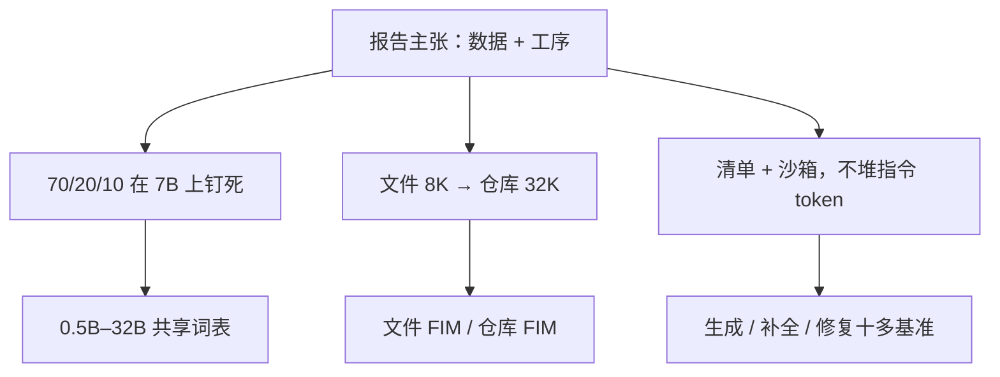

# Qwen2.5-Coder 报告

    
在 Qwen2.5 骨架上继续预训练超过 5.5 万亿 token：文件级填空、仓库级拼接，再加一份按清单打分的指令数据；代码能力与通识、数学一起保住。

    <footer>—— Hui 等，Qwen2.5-Coder Technical Report，arXiv:2409.12186</footer>

架构继承、70/20/10 配比与特殊符列表见 [Qwen2.5-Coder](/llm/qwen25-coder)。本篇钉 Hui 等人这份技术报告（arXiv:2409.12186，2024）：它作为**报告**而不是短论文，篇幅花在数据管线、三阶段日程、指令侧的多语 agent 与清单上；架构段几乎只声明「与 Qwen2.5 相同」。引用时应把贡献记在数据与工序，不要把 [GQA](/llm/gqa) 或 [YaRN](/llm/yarn) 写成这份报告发明的。旗舰 32B-Instruct 对标开源第一档、并声称多项任务接近 GPT-4o——那是报告叙事，必须连基准与日期一起抄。

## 问题

CodeQwen1.5 已经证明代码专线有用，但档位少、语料与指令工序不够厚。报告要补的问题有两层。预训练：只喂 GitHub 源文件会丢掉教程接地、仓库 import 图、以及 IDE 的 FIM 分布；把代码比例拉到 100% 又会伤通识与数学，助手没法解释报错。后训练：开源指令集偏 Python 面试题，长尾语言与可执行校验不足，堆 token 不等于堆覆盖。

另一条报告特有的约束是**六档共享词表与骨架**（0.5B 至 32B）。专文若只报 32B，边侧补全的 0.5B/1.5B 没有合同；若每档一套词表，部署矩阵崩溃。报告必须证明同一套 FIM / 仓库控制符、同一套 70:20:10 配比扫在 7B 上之后，可以外推到全系列——这是外推，不是每档都做了同等规模的配比网格。

### 报告体裁：表很多，定理很少

与 Rozière、Guo 的代码模型文相比，这份报告更接近「可复述的数据手册」：源码过滤、Common Crawl 层级打分、合成数据过执行器、指令清单的加权项，都写成可抄的工序。读者不该期待新注意力公式。价值是把 5.5T 继续预训练的**中间决策**公开到能做消融引用的粒度，例如「大模型当过滤器并不明显更好」。

六档中间维并不单调加宽：3B 比 1.5B 更窄、层数更多。读报告表 1 按列对照，不要用 7B 隐维去口算 32B。词表 151646，另加 FIM 与 `<|repo_name|>` / `<|file_sep|>`。

## 方法

预训练数据称作 Qwen2.5-Coder-Data。源码：2024 年 2 月前公开 GitHub，92 种语言，规则接近 StarCoder2 / DeepSeek-Coder；另收 PR、Commit、Jupyter、Kaggle。文本–代码接地：从 Common Crawl 做由粗到细的层级过滤，每级用 fastText 一类小分类器卡一个质量维，留下的文档自带分数便于配比。合成：前代 CodeQwen1.5 生成，执行器只留能跑通的。数学并入 Qwen2.5-Math 语料；通识取自 Qwen2.5 并剥掉代码段以免重复计数。7B 上扫配比，钉代码 / 文本 / 数学 = 70 / 20 / 10；100% 代码在纯代码榜上并不领先。

三阶段：文件级约 5.2T、8K、NTP+FIM；仓库级约 300B 高质量长代码、32K、仓库级 FIM（格式随 StarCoder2）；RoPE 基数 $10^4\to 10^6$，推理 YaRN 到 128K。指令阶段不堆规模，堆可验证覆盖：语言识别、无监督片段「先题后答」、多语语言专用 agent 交叉迁题型、清单加权（一致性、是否计算机域、难度、是否含代码、语法逻辑、命名缩进、注释、可学性），再加多语言沙箱静态检查与自包含题的单测。

### 报告量过的消融，以及外推句

量过：层级过滤迭代后 1.5B 在 HumanEval+MBPP 平均从约 41.6% 升到 46.8%；配比表 3 支持 70:20:10 综合平均最高；指令侧去掉无代码样本会伤 MultiPL-E / McEval。量过的产品句：32B-Instruct 在多项代码任务接近当时 GPT-4o、同尺寸开源 SOTA。量不出：70:20:10 在 0.5B 上是否仍最优；语言 agent 的交叉讨论有多少是近重复改写；沙箱只喂自包含片段时，真实工程文件被误杀的比例。128K 是 YaRN 外推，不是 128K 预训练——报告用法与 Qwen2.5 通用线相同，机制见 YaRN 专文。

## 机制

层级过滤给接地文档一条可调质量轴：后段更干净，前段仍提供覆盖。小分类器盯表面特征，避免把语义复杂度误当成质量——报告把「不必用大模型过滤」写成观察，这对复现成本很关键。执行器把「看起来像代码」从「能跑」切开，合成数据才不会纯蒸馏幻觉。仓库分隔符让 import 与定义进入同一 32K 窗，跨文件补全才有键；自行用 `###` 拼接等于作废位置统计。

### 清单是多目标，不是单一 LLM-as-judge

一致性、正确性、可学性会打架：很难但错误的题不该高分，无代码的计算机史问答不该占满预算。报告用加权清单而不是一个标量裁判，是承认指令数据没有单一质量方向。语言 agent 带生成历史以避近重复，交叉讨论把稀缺语言题型从富语言迁过来——这是数据扩增协议，不是运行时多代理产品。读报告时不要把「agent」写成 SWE-agent 那种仓库循环。

云上 Qwen2.5-Coder 产品快照与开源权重不是同一检查点。报告评测绑开源 Instruct；引用产品演示（Artifacts、代码助手）不能代替基准表。

后训练之后模型仍是因果解码器。FIM 与仓库标记只改序列。服务端 YaRN 实现不匹配，32K 训练也不会自动变成 128K 可用。

## 边界与工程取舍

### 配比外推与合成题过拟合

70:20:10 扫在 7B，更小模型对数学配比的敏感度未必相同。合成过执行器仍可能过拟合短自包含题；真实仓库的构建系统、私有依赖、生成代码许可，报告解决不了。许可证以当时 Hugging Face / ModelScope 卡片为准，系列目标是可商用宽松许可，条款会改。不要把 0.5B 的 HumanEval 拿去对 32B 的「接近 GPT-4o」叙事。

需要从零仓库组包对照，读 [DeepSeek-Coder 论文](/llm/deepseek-coder-paper)；需要 Llama 2 续训对照，读 [CodeLlama 论文](/llm/codellama-paper)。这份报告的位置是「通用骨架上的超大规模代码继续训 + 可验证指令工序」。

出处：Hui et al.，*Qwen2.5-Coder Technical Report*，arXiv:2409.12186，2024。仓库级 FIM 分隔符必须与训练一致。复现层级过滤需要四轮小分类器，不是一次 URL 白名单。

## 小结

- 报告贡献在数据管线与三阶段工序，架构声明为 Qwen2.5 继承。
- 约 5.5T 继续预训练；文件 8K NTP+FIM，仓库 32K，推理 YaRN 到 128K。
- 指令靠多语 agent、清单与沙箱，不靠堆开源指令 token。
- 70:20:10 与「接近 GPT-4o」均绑定报告内实验与当时基准。
- 出处：Hui et al.，arXiv:2409.12186；落地对照见 [Qwen2.5-Coder](/llm/qwen25-coder)。
