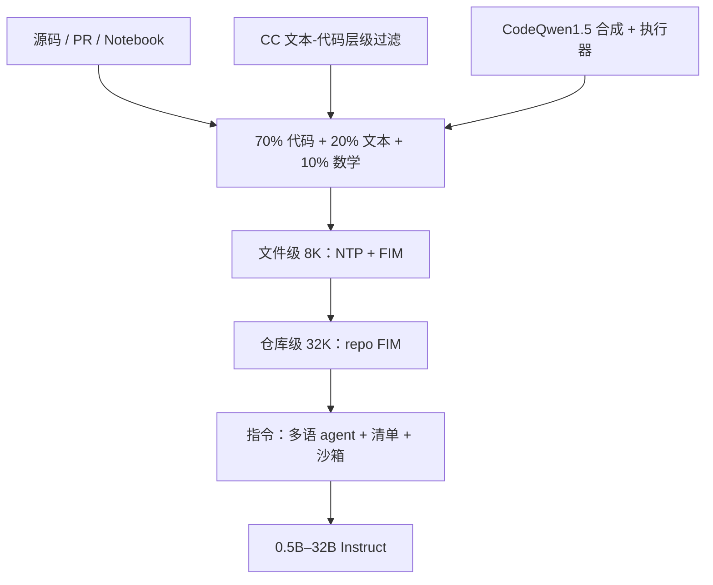

# Qwen2.5-Coder

    
在 Qwen2.5 骨架上继续预训练超过 5.5 万亿 token：文件级填空、仓库级拼接、再加一份按清单打分的指令数据，代码能力与通识、数学一起保住。

    <footer>—— Hui 等，Qwen2.5-Coder Technical Report，arXiv:2409.12186</footer>

Qwen2.5-Coder 是通义在 CodeQwen1.5 之后的代码专线，开源六档：**0.5B、1.5B、3B、7B、14B、32B**，Base 与 Instruct 成对放出。架构与词表继承 [Qwen2.5](/llm/qwen-evolution)——[GQA](/llm/gqa)、[SwiGLU](/llm/swiglu)、[RoPE](/llm/rope)、QKV bias、[RMSNorm](/llm/rmsnorm)——专文贡献不在换注意力公式，而在 **5.5T 代码向语料怎么造、文件级与仓库级怎么接、指令数据怎么验**。旗舰 32B-Instruct 在报告叙事里对标当时开源代码模型的第一档，并声称在多项代码任务上接近 GPT-4o；小档覆盖边侧补全。本篇写 Hui 等人报告里的数据与训练工序，不把 GQA 或 YaRN 再展开成并列理论。

## 问题

代码模型若只喂 GitHub 源文件，会同时丢掉三样东西：教程与 API 文档里的自然语言接地、仓库里跨文件的 import 图、以及「中间缺一块」的 IDE 补全分布。纯下一 token 预训练对文件头到文件尾的因果续写很熟，对 prefix–suffix 夹一道空洞的 FIM 不熟；把整仓文件随机打散，模型也学不会「这个函数的实现在另一个文件」。CodeQwen1.5 已经证明专线有用，但尺寸档位少、语料与指令工序不够厚，对闭源旗舰仍有缺口。

另一条约束是**不要训成只会写代码的窄模型**。下游助手既要 HumanEval，也要解释报错、算一点数学、用中文讲清楚。把代码比例拉到 100% 会伤通识；反过来，网页噪声掺多了，补全会开始说人话。报告用 7B 扫三种配比，最后钉在代码 / 文本 / 数学 = 70 / 20 / 10。

### 从单文件因果到仓库几何

文件级预训练窗口 8192，目标是下一 token 预测加 FIM（Fill-in-the-Middle，Bavarian 等；解码形态见 [FIM decode](/llm/fim-decode)）。仓库级要把上下文拉到 32768，RoPE 基数从 $10^4$ 调到 $10^6$，再用 [YaRN](/llm/yarn) 外推到 131072——外推机制见专文，这里只记报告的用法：长窗是为了把 `<|repo_name|>` 与 `<|file_sep|>` 隔开的多文件序列装进去，而不是另发明一种位置编码。

六档共享词表 151646，并新增 FIM 与仓库控制符（`<|fim_prefix|>` / `<|fim_middle|>` / `<|fim_suffix|>` / `<|fim_pad|>`、`<|repo_name|>`、`<|file_sep|>`）。换尺寸不必换 tokenizer；缺这些特殊符，仓库级打包在推理侧对不齐训练分布。

## 方法

预训练数据称作 Qwen2.5-Coder-Data，五类来源。**源码**：2024 年 2 月前的公开 GitHub，覆盖 92 种语言，规则过滤接近 StarCoder2 / DeepSeek-Coder；另收 PR、Commit、Jupyter、Kaggle。**文本–代码接地**：从 Common Crawl 召回文档、教程、博客。报告不用「按 URL 多段召回」当主策略，而做由粗到细的层级过滤：每一级用 fastText 一类小分类器卡一个质量维度，留下的数据自然带质量分数，便于配比。他们观察到大模型当过滤器并不明显更好——小模型更盯表面特征，避免把语义复杂度误当成质量。该管线迭代四轮后，1.5B 在 HumanEval 与 MBPP 上的平均分从 41.6% 升到 46.8%。

**合成数据**：用前代 CodeQwen1.5 大规模生成，再用执行器校验，只留能跑通的代码，压幻觉。**数学**直接并入 Qwen2.5-Math 的预训练语料；**通识文本**取自 Qwen2.5，并剥掉其中的代码段以免与源码重复计数。配比实验（表 3）显示 100% 代码在纯代码榜上并不领先，70:20:10 的综合平均最高。最终约 5.2T token 进入文件级阶段。

### 三阶段：文件、仓库、指令

文件级：5.2T、长度 8192、NTP + 文件级 FIM。仓库级：约 300B 高质量长代码，窗口 32K，FIM 升到仓库级（格式跟随 Lozhkov 等 StarCoder2 的多文件填空）。指令阶段不再堆 token 规模，而堆**可验证的任务覆盖**。

指令数据几条并行管线。用微调过的 CodeBERT 做近百种语言识别：主流语言保留，长尾随机丢一部分；几乎不含代码的样本会伤 MultiPL-E / McEval，大部分去掉。无监督 GitHub 片段（≤1024 token）先让 LLM 写出「题」，再让代码模型写「答」，再用评分模型滤低质；并混入 McEval-Instruct 一类开源多语指令。多语言上，报告提出**语言专用智能体**：每个语言一个 agent，带自己的指令种子与生成历史（避免近重复），再按协议交叉讨论，把一种语言里的题型迁到另一种，或合成新语言的指令。质量用清单加权：问答一致性、是否在计算机域、难度、是否含代码、语法与逻辑正确、命名与缩进、注释、可学性。最后用多语言沙箱做静态检查（AST 解析失败即丢）并对自包含算法题自动生成单测。

3B 的中间维（4864）比 1.5B（8960）更窄、层数更多（36 vs 28），不是「参数量单调加宽」。读表 1 时按列对照，不要用 7B 的 3584 隐维去口算 32B。

## 机制

文件级 FIM 让模型在训练分布里见到「已知前后文、未知中段」，与 IDE 的行内补全同构；仓库级把同一 repo 的多文件用分隔符串起来，import 与被引用定义可以落在同一 32K 窗口内，跨文件补全才有键可查。层级过滤给接地文档打分，等于在预训练混合里插入一条可调的质量轴：后段留下的文档更干净，前段仍提供覆盖。执行器过滤合成数据，把「看起来像代码」从「能通过运行」里切开——这是相对纯蒸馏的关键差异。

指令侧的清单不是单一 LLM-as-judge 分数。一致性、正确性、可学性会打架：很难但错误的题不该高分，无代码的计算机史问答也不该占满预算。多语 sandbox 只喂自包含片段，避免把「缺环境就跑不了」的真实工程文件误杀。语言 agent 的记忆库降低近重复，交叉讨论则把稀缺语言的题型从富语言迁过来，而不是为每种语言单独雇标注。

### 特殊符只改序列，不改核

后训练之后，模型仍是因果解码器：FIM 靠特殊符改写序列顺序，而不是改注意力核。128K 推理依赖与 Qwen2.5 相同的 YaRN 外推；若服务端没用匹配实现，仓库级 32K 训练也不会自动变成 128K 可用。

## 边界与工程取舍

报告评测覆盖生成、补全、推理、修复十多个基准，强调同尺寸开源 SOTA。不要把 0.5B 的 HumanEval 拿去对 32B 的叙事，也不要把云上 Qwen2.5-Coder 产品快照与开源权重当成同一检查点。合成数据过执行器仍可能过拟合「短自包含题」；真实仓库的构建系统、私有依赖、生成代码许可，报告解决不了。70:20:10 是 7B 上的扫描结果外推到全系列，更小模型对数学配比的敏感度未必相同。

许可证按当时模型卡：系列以允许商用的宽松许可为目标，具体条款以 Hugging Face / ModelScope 页面为准。Artifacts 与代码助手是报告里的产品演示，不是新的损失函数。

仓库级 FIM 的分隔符必须与训练一致。自行把多文件用 `###` 拼接，等于把 `<|file_sep|>` 的位置统计作废，补全质量会先掉一截再谈模型强不强。

## 小结

- Qwen2.5-Coder 在 Qwen2.5 架构上用约 5.5T token 继续预训练，开源 0.5B 至 32B。
- 数据贡献是层级过滤的文本–代码接地、可执行合成、以及 70:20:10 的代码–文本–数学混合。
- 训练分文件级 8K（NTP+FIM）与仓库级 32K（repo FIM + 基数 $10^6$），推理侧 YaRN 到 128K。
- 指令数据靠多语 agent、清单打分与沙箱单测，而不是只堆开源指令集。
- 出处：Hui 等，*Qwen2.5-Coder Technical Report*，arXiv:2409.12186，2024。
