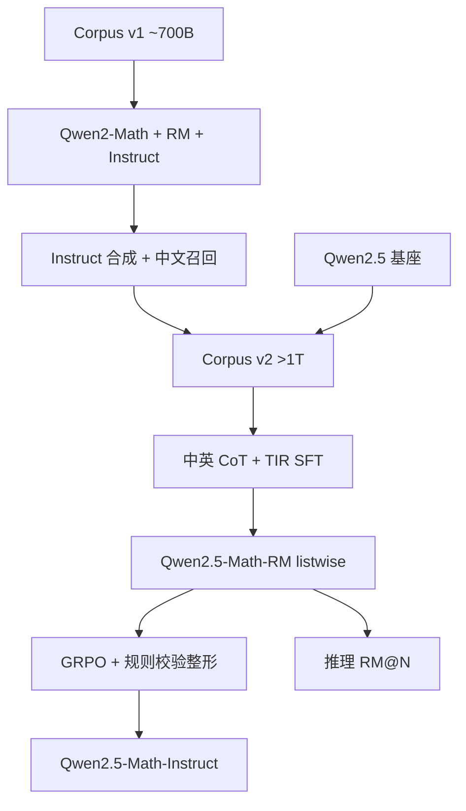

# Qwen2.5-Math

    
把自我改进贯穿预训练、后训练与推理：上一代 Instruct 造语料，奖励模型筛 SFT，再拿最终 RM 做强化学习与 Best-of-N。

    <footer>—— Yang 等，Qwen2.5-Math Technical Report，arXiv:2409.12122</footer>

Qwen2.5-Math 是通义的数学专线：Base 与 Instruct 的 **1.5B / 7B / 72B**，外加 **Qwen2.5-Math-RM-72B**。相对一个月前的 Qwen2-Math，这条线的原文贡献不是新的注意力，而是把**自我改进**写成同一套闭环：Qwen2-Math-Instruct 合成预训练；采样造奖励模型；RM 迭代进化 SFT 数据；最终 RM 做 [GRPO](/llm/grpo) 与推理期选样；并且把能力从「英文思维链」扩成**中英 CoT + 工具集成推理（TIR）**。博客明确劝告：这系列主要用来解中英数学题，不要当通用聊天模型。本篇写 Yang 等人报告里的语料代际与对齐配方，GRPO 公式见专文，这里只记他们怎么把 RM 与规则校验器拼进奖励。

## 问题

通用基座数学差，首先是预训练里数学文本不够、不够干净。从网页召回能加量，但噪声、重复、以及「看起来像题其实是广告」会把继续预训练带偏。即便有了 Qwen Math Corpus v1（约 7000 亿 token）训出 Qwen2-Math，后训练若只用英文 CoT，中文高考与竞赛、以及需要精确计算的题（求根、特征值）仍会在纯语言链上算错。

第二条是监督从哪来。数学有标准答案，却没有无限的正确逐步推导。拒绝采样（RFT）能留下「最终答案对」的轨迹，但合成题没有金标；过程对不对，需要比「最后一个数」更密的信号。若 RM 只在最后一轮出现，SFT 数据无法随模型变强而变难。问题于是变成：如何让**上一代模型当数据工厂，这一代 RM 当过滤器，再让过滤器反过来训策略**。

### 两代语料，而不是一次堆 token

Qwen2-Math 从 Qwen2 中间检查点出发，在 Corpus v1、4K 上下文上继续预训练。Qwen2.5-Math 改为从 **Qwen2.5 基座**初始化（通识、代码、推理更强），语料升级为 Corpus v2：**超过 1T**，增量来自 Qwen2-Math-72B-Instruct 合成，以及多轮召回补上的中文书、网页与代码中的数学。上下文仍是 4K——专线没有把长窗当主叙事。

1.5B Instruct 在 TIR 下 MATH 约 80、7B CoT MATH 83.6 / TIR 85.3、72B 在报告数字上超过当时 GPT-4o 与 Gemini 数学专线的若干表。引用时必须分 CoT / TIR、greedy / Maj@8 / RM@8，不能把 RM 选样写成「单次生成分数」。

## 方法

预训练管线是召回、去重、过滤、合成、配比。FastText 用数学种子与通用文本迭代训练，再靠 URL 等元数据扩池；MinHash 去重。质量过滤用 Qwen2-0.5B-Instruct 打分，高分优先。合成阶段用 Qwen2-72B-Instruct：从已有材料抽取并改写问答，以及直接生成新题。配比在 1.5B 数学模型上消融后冻结为 v1；v2 在同一套 4K 设定上加量、加中文、加合成。

后训练要同时会 CoT 与 TIR。SFT 序列长 4096，3 个 epoch；72B batch 256、学习率 $5\times 10^{-6}$，1.5B/7B batch 128、学习率 $2\times 10^{-5}$，衰减到 $7\times 10^{-7}$。

### CoT 与 TIR 两套合成

CoT 查询：约 58 万英文 + 50 万中文题，来源含 GSM8K / MATH / NuminaMath 训练集，以及内部 K-12；合成题用 MuggleMath 从标注题进化，并用难度模型配平。回答用带 RM 与金标的拒绝采样迭代：有答案时取最终正确的 top-$k$ 路径；无答案时加权多数表决再按 RM 取 top-$k$。Qwen2.5 相对 Qwen2 多一轮用 Instruct 打磨。最终 CoT 训练集约 **200 万英 + 50 万中**。

TIR 查询：19 万标注 + 20.5 万合成（MuggleMath、DotaMath 在 GSM8K/MATH 上进化），另将 7.5 万题用 Qwen2-72B 译成中文。回答走在线 RFT：多温度核采样，难题加采样量，去重后进入下一轮微调；合成题用当时最好的 RFT 模型生成再多数表决。格式上，模型在推理中插入 Python，执行器回填结果，再继续写。

奖励模型从 SFT 检查点改标量头（两层线性）。Qwen2-Math-RM：20.6 万英文题 × 6 条候选。Qwen2.5-Math-RM：36.1 万英 + 25.7 万中，覆盖 TIR。正负由最终答案对错决定，去掉全对或全错的题，再混入不同中间版本与不同尺寸的回答以保持难度与正负比。损失按 Ouyang 等的成对 logistic，但是 **listwise**：每题 6 条里 $k$ 正 $6-k$ 负，一次算完 $k(6-k)$ 对，而不是拆成独立 pair 再喂。

## 机制

自我改进的闭环是代际的：v1 没有 2.5 的 RM，2.5 的预训练已经吃过 2-Instruct 的合成题，所以「数据变好」与「老师变强」缠在一起。消融时不能把 Corpus v2 的增益全部记在「多 3000 亿 token」上，其中一部分是分布迁移（更多中文、更多已解过的竞赛型问答）。

### 奖励整形把对错放在 RM 之上

GRPO 仍用组内奖励标准化当优势，不训 critic，细节见 [GRPO](/llm/grpo)。报告的本地改动是**奖励整形**：规则校验器给出 $r_v\in\{0,1\}$，RM 给出 $r_m$，

$$
r=\sigma(\alpha r_m)+(r_v-1),\quad \alpha=0.5.
$$

于是错答的整体奖励恒低于对答；对错组内部再按 RM 排序。RL 查询从 RM 训练集里筛：每题采 8 条，只留 2–5 条正确的题（约 6.6 万），太难学不动、太简单没梯度。每题采 32 条完成；TIR 的 RL 把执行器输出的 token 全部 mask，避免策略去模仿打印出来的数字格式。推理期同一 RM 做 Best-of-N，AMC 2023 上 72B 在报告中称几乎全对——那是选样后的数字。

去污染用 13-gram 加最长公共子序列比 > 0.6，并对 MATH 训练集里「同结构换数字」的近重复也过滤。评测表若与未去污染的第三方分数对不上，先查这一条。

## 边界与工程取舍

TIR 依赖本地或沙箱 Python，线上若不允许执行，只能退回 CoT，分数会掉一截。RM@8 把计算预算换成准确率，延迟与费用不是 greedy 的同一档。专线 4K 上下文装不下长篇论文证明；竞赛题可以，教材章节级不行。自我改进会放大教师的系统性偏置：Qwen2-Math 写错的套路，v2 合成可能复制。博客不建议把该系列用于非数学任务——指令分布就是数学。

GRPO 与 RM 整形是报告内的配方，不是对 DeepSeekMath 原文的改写；实现应对齐 ChatLearn 与他们公开的评测脚本里的答案抽取。1.5B 能打高 MATH，高度依赖解释器，不能理解成「1.5B 稠密已经会竞赛」。

SFT 把 CoT 与 TIR 混训，推理要靠提示切换模式。默认 Chat 模板若没声明「可以写 Python」，模型不一定会调工具。

## 小结

- Qwen2.5-Math 的主贡献是贯穿预训练 / SFT / RL / 推理的自我改进，以及中英 CoT+TIR。
- Corpus v2 超过 1T，从 Qwen2.5 基座继续预训练，窗口 4K。
- RM 用 6 候选 listwise 训练；RL 用 GRPO，奖励为 RM 与对错校验的整形和。
- 评测必须声明 CoT/TIR 与 greedy/Maj/RM；专线不宜当通用模型。
- 出处：Yang 等，*Qwen2.5-Math Technical Report: Toward Mathematical Expert Model via Self-Improvement*，arXiv:2409.12122，2024。对照 Qwen 博客 *Qwen2.5-Math*（2024-09-19）。
