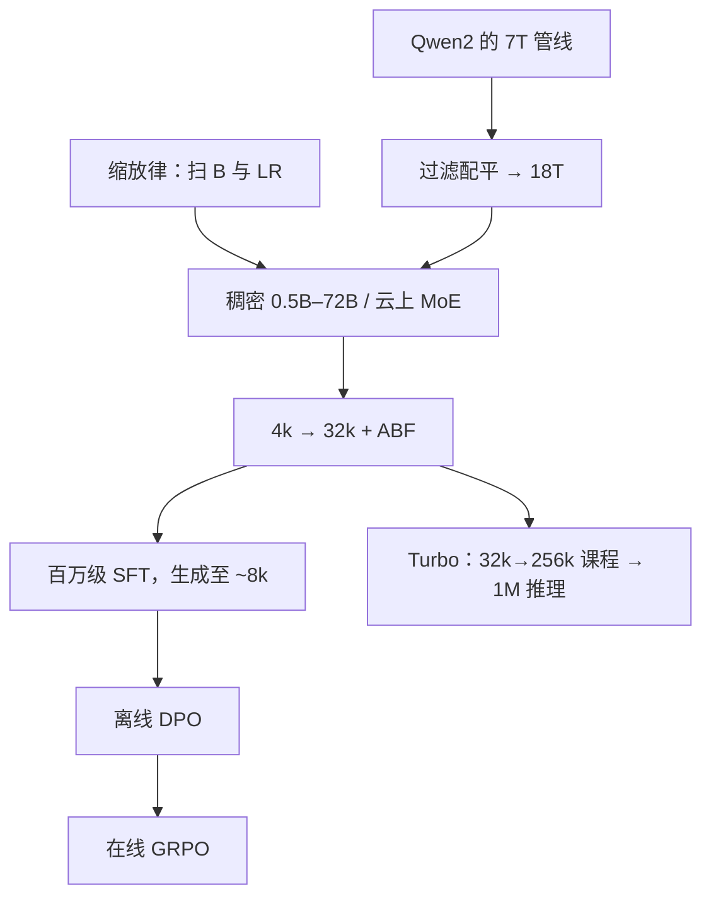

# Qwen2.5 技术报告

    
Qwen2.5 把高质量预训练从 7 万亿扩到 18 万亿 token；后训练用逾百万条 SFT，再接离线 DPO 与在线 GRPO。

    <footer>—— Qwen Team，Qwen2.5 Technical Report，arXiv:2412.15115</footer>

[Qwen 1.5 / 2 / 2.5 演进](/llm/qwen-evolution) 写家族差分；Coder / Math / 1M 各有专文。本篇对着 **2412.15115** 写 2.5 **这一份报告**里的可核对配方：稠密与云上 MoE 分家、缩放律用来调学习率而不是只定尺寸、两段预训练长度、SFT→DPO→GRPO 的后训练，以及 72B-Instruct 对标 Llama-3-405B 的叙事。架构与 Qwen2 相同——[GQA](/llm/gqa)、[SwiGLU](/llm/swiglu)、RoPE、**保留 QKV bias**、[RMSNorm](/llm/rmsnorm)——不要把 Qwen3 的去 bias / QK-Norm 提前写进来。

## 问题

Qwen2 开源档是 0.5B / 1.5B / 7B / 72B 加 57B-A14B MoE，预训练约 7T。缺的是中间部署点（3B / 14B / 32B）和「同样 72B 是否够厚」。2.5 的问题是：在**不改解码器骨架**的前提下，用 18T 与更重的后训练，让开源旗舰在知识、代码、数学、结构化输出上逼近大一个数量级的稠密模型，并用 Turbo / Plus 两条 API MoE 去打 GPT-4o-mini / GPT-4o 的价绩位置。

第二个问题是长生成与长窗口分开。2 的生成长度偏短；2.5 要把生成拉到约 8k，把常规 Instruct 推理窗口做到约 128k，并把 **1M** 只交给 Turbo 专线，避免每张 7B 卡都宣称百万上下文。

### 开源稠密与 API 稀疏必须分列

开源：Base + Instruct，尺寸 **0.5B、1.5B、3B、7B、14B、32B、72B**，bf16 与多种量化，Hugging Face / ModelScope / Kaggle 上超过一百个制品。专有：Qwen2.5-Turbo（API 名如 `qwen-turbo-2024-11-01`）与 Qwen2.5-Plus，细粒度专家 + **共享专家**（继承 Qwen2-MoE 惯例），专家个数与激活量未写成与 3 代相同的 128/8 表，细节**公开信息有限**，只知它们用来对标 4o-mini / 4o 档。不要把 Turbo 的 1M 窗口写进 72B-Instruct 的模型卡。

词表主体约 151643，控制符扩到 22 个（含工具），全系列共享。换尺寸不必换 tokenizer；缺工具符则 JSON 调用会对不齐训练分布。

## 方法

预训练数据从 7T 到 **18T**，侧重知识、代码、数学，并分阶段切换混合。用 Qwen2-Instruct 做质量过滤与领域配平：下调电商/社交模板页，上调科技与学术。缩放律在 44M–14B 稠密与小 MoE 上扫 **batch \(B\) 与学习率 \(\mu\)**，再外推到 72B 与云上 MoE——报告明确：他们用缩放律选超参，而不只是选「给定 FLOP 的最优宽度」。MoE 的激活量与总量则调到能分别对上 14B / 72B 稠密的质量目标。

### 长度课程：4k→32k，Turbo 再四级加长

除 Turbo 外，全体先在 4,096 上预训练，末期扩到 32,768，RoPE 基数 ABF 从 \(10^4\) 到 \(10^6\)。推理用 [YaRN](/llm/yarn) 与 [Dual Chunk Attention](/llm/dual-chunk-attention) 再四倍：常规约 **131,072**。Turbo 单独走 32k→65k→131k→262k，RoPE 基数 \(10^7\)，每档约 40% 满长、60% 短序列，再外推到 **1M**。后训练 SFT 对 Turbo 再加长样本，以免对齐洗掉长窗。

后训练三条：**逾 100 万**条 SFT（含最长约 8k 的生成、数学、带执行校验的代码、表格/JSON、多语），两 epoch、序列 32k 量级；然后对数学/代码/指令遵循等「有标准答案但奖励模型难打分」的域做离线 [DPO](/llm/rafailov-dpo)（执行反馈与答案匹配造正负对）；在线 [GRPO](/llm/grpo-paper) 用奖励模型，每查询采样 8 条，按分数方差排课程，全局 batch 2048。奖励模型的查询来自开源与更难的私有集，回复来自 SFT/DPO/RL 不同检查点与温度。

报告评测叙事：72B-Instruct 在多项上对开源与部分专有有竞争力，并称可对照约 5 倍大的 Llama-3-405B-Instruct；14B-Instruct 接近 GPT-4o-mini；Turbo 训练/推理更便宜，却在多张表上超过 14B-Instruct。32B-Instruct 相对同尺寸 Gemma2-27B 与前代 Qwen2-57B-A14B，数学与代码跳得尤其明显——这被解释为 18T 里 STEM/代码配比，而不是新注意力。长上下文表上 Turbo 在 1M 针检索仍高，综合型长文档会随长度掉点，说明「能取回」和「能用上」仍要两张表。这些都是 2024-12 快照，不是 2025 年的 Qwen3 表。

SFT「一百万」是条数，不是 token 数，不得加进 18T。GRPO 的 8 样本与 DeepSeek-Math 论文同族，超参以 2.5 报告为准，不要把 R1 的配方倒填回来。

## 机制

18T 的机制是把 72B 继续推向欠拟合曲线的右侧，并靠配平避免「更多网页 = 更多导航模板」。骨架不变，意味着 KV 布局、bias、RoPE 实现可以沿用 2 的内核；质量差来自数据与对齐。GQA 使 128k 的缓存可服务；YaRN/DCA 是推理补丁，应用必须用匹配实现，否则 128k 只是配置谎言。

DPO 先处理可验证域，减少「奖励模型不会判对错」时的在线 RL 噪声；GRPO 再在偏好与开放性任务上用组内相对优势，避免单独价值网络。生成 8k 来自 SFT 显式加长，而不是上下文 128k 的自动副作用——窗口长不等于愿意写长。结构化输出与工具控制符把 JSON 当成一等格式，降低「聊天模型不会填表」的失败率。

### 云上 MoE 的机制是价绩，不是开源可复现

细粒度专家 + 共享专家让激活远小于总参数，API 按激活计价。没有公开与 Mixtral 同构的 8×top-2 表，就不能把 Turbo 画成 Mixtral 放大版。缩放律预测「多少激活对上 72B」是内部曲线；外部只看到产品对标 4o。Plus 的发布节奏以 API 名为准，报告里曾出现占位日期。

## 边界与工程取舍

QKV bias 仍在，与 Qwen3 不兼容。2.5-7B 默认不是 1M。MoE 权重基本不随 18T 稠密一起开源。18T 的版权与污染外部不可逐条审计。72B vs 405B 的「接近」依赖所选基准；人类偏好与长尾事实不一定同方向。专线 Math / Coder 仍更尖，基座只是「不再明显不会」。后训练里「结构化输入输出更好」依赖 SFT 里的表与 JSON，换一套自创 schema 仍会掉格式。在线 GRPO 的奖励模型若过拟合家族风格，会把多样性打掉——报告用多检查点、多温度采样来对冲，外部无法复现同一 RM。

工程上，32B / 72B 的 128k 服务仍受 KV 带宽限制；量化制品与 bf16 分数会分叉。工具调用必须带上 22 个控制符的模板。不要用 2.5 报告解释 Qwen3 的思考模式。

真实编号：arXiv:2412.15115。前代 Qwen2 为 2407.10671；Qwen1.5 以博客为主。1M 开源检查点见 [Qwen2.5-1M](/llm/qwen25-1m)，不是每张 2.5 卡的默认。

## 小结

- 开源稠密 0.5B–72B，架构对齐 Qwen2（含 QKV bias）；预训练 18T；常规推理约 128k，Turbo 到 1M。
- 缩放律用于学习率与 batch；后训练为百万 SFT + DPO + GRPO；生成长度约 8k。
- API MoE（Turbo / Plus）细粒度 + 共享专家，权重与专家表公开信息有限。
- 出处：Qwen Team，*Qwen2.5 Technical Report*，arXiv:2412.15115。家族对照见 [演进](/llm/qwen-evolution)，下一代预训练见 [Qwen3 报告](/llm/qwen3-report)。
