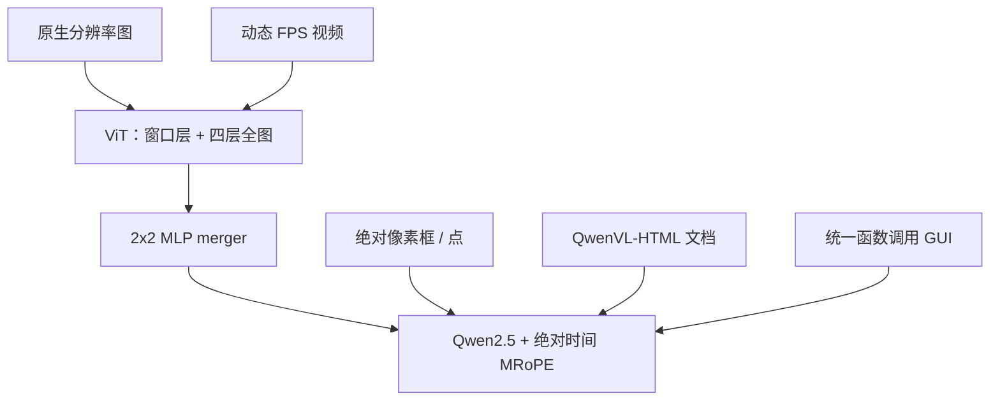

# Qwen2.5-VL

    
从零训原生动态分辨率 ViT，窗口注意力压视觉计算；时间维用动态帧率与绝对时间对齐的 MRoPE，让小时级视频能按秒定位。

    <footer>—— Qwen Team，Qwen2.5-VL Technical Report，arXiv:2502.13923</footer>

Qwen2.5-VL 是通义视觉–语言旗舰的 2025 年 1 月一代：开源 **3B / 7B / 72B** 的 Base 与 Instruct，语言模型初始化自 Qwen2.5。相对 Qwen2-VL，报告列出四条技术差分：ViT 里的窗口注意力、时间维动态 FPS、把 MRoPE 的时间分量对齐到**绝对时间**、预训练从约 1.2T 扩到约 **4.1T**。定位改用图像真实宽高下的绝对坐标；文档走统一的 QwenVL-HTML；并加计算机 / 手机 GUI 智能体数据。窗口层与 [2×2 merge](/llm/qwen-vl-patch-merge)、[原生切块](/llm/qwen-vl-naive-dynamic-res) 已有专文，本篇只引用，写 2.5-VL **原文多出来的时间几何、绝对坐标、文档 HTML 与智能体**。

## 问题

Qwen2-VL 已经能按原生分辨率吃图，但高清文档让 ViT 内部仍是二次注意力，训练步时间被最大图钉死。视频更麻烦：时间 ID 若等于「第几帧」，同一段 10 秒可以是 10 帧也可以是 100 帧，模型分不清播放速度，也难以把事件钉到钟表时间。相对坐标把框归一化到 $[0,1]$，模型看不到物体的真实像素尺度——发票上的章和缩略图里的章在数值上可以一样大。

文档侧，版式、表格、公式、乐谱、化学式若分给不同专家模型，通用 VLM 只能做「看图说话」。智能体侧，手机与桌面的点击、滑动若没有统一动作空间，多步轨迹无法当成函数调用学。问题是：在**不推翻动态分辨率**的前提下，把空间尺度、时间尺度、结构化文档和 GUI 动作收进同一套生成目标。

### 时间 ID 不应等于帧号

Qwen2-VL 的 MRoPE 把位置拆成时间 / 高 / 宽。文本三分量相同，退回 1D RoPE；静态图时间分量恒定；视频则按帧递增时间 ID。2.5-VL 指出：这把时间绑在采样帧数上，同一真实时长在不同 FPS 下相位不同。要对齐的是**绝对时间间隔**，而不是帧下标。

3B/7B/72B 共用同一 32 层 ViT（隐维 1280、16 头、patch 14、窗口 112），全注意力层号 $\{7,15,23,31\}$。变的是 LLM 宽度与 merger 输出维。不要为 3B 另编一套视觉骨干。

## 方法

视觉编码器从零训练：CLIP 预训练 → 视觉–语言对齐 → 端到端。结构向 LLM 靠拢：RMSNorm、SwiGLU、二维 RoPE。多数层窗口注意力（最大 $112\times 112$ 像素 = $8\times 8$ patch），小于窗口的区域不补零；窗口注意力的计算与层号见专文。视频把连续两帧打成一个 3D patch，降低送进语言模型的 token 数。Merger 仍是相邻四 patch 拼接再两层 MLP，与 Qwen2.5 隐维对齐。

空间上继续动态分辨率，但 **bbox / 点用输入图像的真实宽高**，不再归一化。时间上，训练期动态采样 FPS；MRoPE 的时间分量按时间戳对齐，间隔编码事件节奏。长视频另合成超半小时的多帧字幕；时间戳监督同时用秒与时分秒帧（hmsf）两种写法。

### 文档 HTML 与绝对框

传统流水线拆成版面分析、OCR、图表、插图多个模型。2.5-VL 把表格、图表、公式、自然图、乐谱、化学式统一写成 HTML：段落、表、图都带 `data-bbox="x1 y1 x2 y2"`，图表在 `div.chart` 里同时放图和表内容，公式 / 乐谱 / SMILES 各有 class。读序按典型阅读顺序排。这样版式与文字是同一个生成目标，而不是 OCR 字符串再外挂检测头。

OCR 数据含合成野外文字、开源与内部真实图，并扩法德意西葡阿俄日韩越等。图表用 matplotlib / seaborn / plotly 合成约 100 万；表格用离线识别模型处理约 600 万真实表，滤低置信、重叠与过稀的表。

智能体：手机 / Web / 桌面截屏上合成 caption 与 UI grounding；动作空间统一成函数调用。多步轨迹来自开源与虚拟环境，每步用前后截屏加全局目标写推理过程，模型过滤低质思维，避免只拟合标准点击。

预训练三阶段（表 2）：视觉预训练约 1.5T（只训 ViT，8K，caption / 知识 / OCR）；多模态预训练约 2T（ViT+LLM，交错图文、VQA、视频、grounding、agent）；长上下文约 0.6T、序列 32K（长视频、长文档、长 agent）。合计约 4.1T。

交错图文用四维打分：纯文本质量、图文相关、信息互补、密度平衡。噪声网页「配一张无关图」会在相关性和互补性上被压下去，这是 4.1T 能加量而不只加噪的前提。

## 机制

绝对坐标让尺度成为可学习的量：同一物体在 4K 原图与缩略图上的框数值不同，模型必须把「占多少像素」和语义绑在一起。这对计数、指向、开放词汇检测是显式监督；相对坐标会把这层信息抹掉。绝对时间同理：时间 ID 的差分正比于真实秒差，不同 FPS 的视频在时间轴上可对齐，秒级定位才有几何意义。两帧一组的 3D patch 是 token 预算，不是把时间分辨率永远砍半——动态 FPS 仍决定一秒里来几帧。

### 三阶段冻结谁在学

HTML 监督迫使解码器维护嵌套与框，而不是只吐纯文本。智能体的逐步推理文本把「点哪里」和「为什么点」拆开，降低对标注轨迹的过拟合。三阶段冻结策略很硬：第一阶段不动 LLM，避免随机 ViT 把语言能力冲掉；长上下文阶段才把 32K 文档和长视频放进来。

## 边界与工程取舍

72B 在文档与图表上的报告数字接近 GPT-4o / Claude 3.5 Sonnet 当时的表，3B/7B 是边侧档，不可混用。视觉 token 仍占上下文：小时视频必须靠 FPS 与 merge 降长度，不是「窗口注意力自动支持任意时长」。绝对坐标依赖预处理把图缩放到训练时同一套像素预算；应用侧若先把图缩到 224 再问「原图像素框」，对不上。乐谱 ABC、化学 SMILES 在 HTML schema 里出现，生产准确率要单测。GUI 智能体的动作空间是训练时的函数集，未见过的 OS 控件会退化成乱点。

Qwen3-VL 的 SigLIP-2 与 DeepStack 是下一代差分，不能回写进 2.5-VL。开源权重与云上 Qwen-VL-OCR 产品模板不是同一契约。

评定位至少看框和点两套格式；评视频至少看描述与时间定位。只报通用 VQA 会选出「会看物体、不会读表、不会对秒」的检查点。

## 小结

- Qwen2.5-VL 用从零训练的动态分辨率 ViT、约 4.1T 多模态预训练，开源 3B/7B/72B。
- 原文增量：窗口化 ViT、动态 FPS、绝对时间 MRoPE、绝对像素坐标、统一 HTML 文档、GUI 函数调用。
- 空间切块与 2×2 merge 继承 Qwen2-VL，细节见已有专文。
- 出处：Qwen Team，*Qwen2.5-VL Technical Report*，arXiv:2502.13923，2025。对照博客 *Qwen2.5 VL*（2025-01）与 Wang 等 Qwen2-VL，arXiv:2409.12191。
