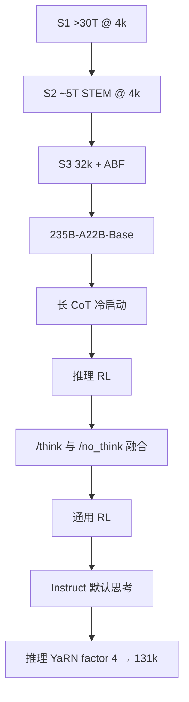

# Qwen3-235B-A22B

旗舰 MoE：2350 亿总参、约 220 亿激活；思考模式与非思考模式做在同一套权重里，原生 32K，YaRN 到 131K。

<footer>—— Qwen Team，Hugging Face 模型卡 Qwen3-235B-A22B；Yang 等，Qwen3 Technical Report，arXiv:2505.09388</footer>

Qwen3 开权旗舰是 **235B-A22B**：94 层，GQA 64/4 头，**128 专家、每 token 激活 8 个**，无共享专家。族级设计见 [Qwen3](/llm/qwen3)，预训练三阶段见 [技术报告](/llm/qwen3-report)。本篇对着 2025 年 5 月的 Instruct 模型卡写这一档的形状、开关、采样与部署边界；7 月的 Thinking-2507 把原生窗拉到 256K，不当作 5 月默认。

## 问题

2.5 开源主线停在稠密 72B，云上 MoE 不进下载列表。3 要把「接近闭源推理模型的思考、接近 2.5-Instruct 的直答」放进**一份可下载权重**，并让服务按约 22B 激活计价、按 235B 占盘。若仍用 2.5-MoE 的共享专家，内核要兼容旧实现；报告选择细粒度 128/8、去掉共享，换全局 batch 负载损失。用户侧问题是：默认会思考，简单寒暄会被写成一长段 `<think>`，延迟与费用上升——必须同时提供硬开关（`enable_thinking=False`）和软开关（`/think`、`/no_think`）。

第二个问题是窗口。预训练 S3 把长度做到 32,768；推理再用 YaRN（及报告中的 Dual Chunk Attention）大约四倍。卡片写原生 32,768、YaRN 后 **131,072**。`config.json` 里 `max_position_embeddings` 默认 40,960，是 32K 输出预算加约 8K 提示，不是第三种训练长度。

### A22B 不是 22 个专家

总参 235B（非嵌入 234B），激活约 22B；专家 128，激活专家 8。读型号时把总量、激活、专家数拆开，避免和 Llama 4「17B 激活 × 128 专家、$k=1$」或 gpt-oss「5.1B 激活 × 128 专家、top-4」混成一张表。注意力：去掉 Qwen2 起的 QKV bias，加 QK-Norm；与 2.5 权重不兼容。词表 151,669 量级的字节级 BPE，相对 2.5 略增控制符。

博客把 235B-A22B 的思考档对 DeepSeek-R1、o1、o3-mini、Grok-3、Gemini-2.5-Pro 等，非思考档对 2.5-Instruct 与直答闭源。分数随快照变；5 月卡与 2507 分叉检查点不要混贴。

## 方法

预训练族级：约 36T token、约 119 种语言；S1 在 4K 上超过 30T 通识；S2 约 5T 提高 STEM/代码；S3 数千亿 token 做到 32K，约 75% 落在 16K–32K。旗舰后训练四段（报告）：长 CoT 冷启动 → 推理 RL → 思考/非思考融合 SFT → 通用 RL。融合后，思维未写完可被预算打断：插入「时间有限，基于现有思考作答」并关闭 `</think>`。卡片接口：`tokenizer.apply_chat_template(..., enable_thinking=True/False)`；True 时即使用户写 `/no_think`，仍输出（可能为空的）思考块；False 时软开关无效。多轮历史应只保留最终答案、丢掉思考，以免 KV 被草稿纸撑满。

### 采样与部署

思考模式：Temperature 0.6、TopP 0.95、TopK 20、MinP 0；**不要贪心**，否则易循环。非思考：0.7 / 0.8 / 20 / 0。多数查询输出长度建议 32,768；竞赛题可到 38,912。部署：SGLang `≥0.4.6.post1` 或 vLLM `≥0.8.5`，示例 `--tp 8`；本地 Ollama / LM Studio / llama.cpp / KTransformers 亦支持。YaRN：仅当总长显著超过 32K 时在 `rope_scaling` 里设 `factor` 4、`original_max_position_embeddings` 32768；短文本开 YaRN 可能掉点。静态 YaRN 的因子不随输入变，65K 级应用更宜 factor 2。Alibaba Model Studio 端点默认动态 YaRN。智能体：官方推荐 Qwen-Agent 封装工具模板；思考与非思考都可以调工具。

## 机制

无共享 top-8：每个 token 的 FFN 是 8 个专家的加权组合，公共变换也必须由路由专家承担，组合数 $C(128,8)$ 很大，细粒度用来补「没有永远在线的 MLP」。负载损失在全局 batch 上推动专家分化；崩溃时 235B 退回几个专家的小网，激活 22B 变成虚数。QK-Norm 钉住 $Q,K$ 尺度，94 层加长 CoT 前缀上不容易 softmax 饱和。思考模式改变的是合法续写：先写 `<think>` 再写答案；关闭时走空块直答。同一残差流、两种前缀，避免「推理模型不会寒暄」。

相对 Llama 4 Maverick：同样总参量级（235B vs 400B），Qwen 激活更高（22B vs 17B）、$k$ 更大、无共享、无官方早融合视觉（本卡是文本因果 LM）。相对 gpt-oss-120b：总参更大、激活大约四倍、默认双模式而不是三档 Reasoning 提示。服务侧：显存按 235B（及专家并行度）估，计算按 22B 估；把 A22B 当稠密 22B 会装不下。报告用缩放律分别给稠密与 MoE 调学习率与 batch，旗舰不是把 32B 稠密超参乘一个常数。实例级配比（教育价值、领域、安全标签）是 36T 的质量故事：合成教材与 PDF-VL 抽取进了分子，过滤是分母；外部无法审计标注器，开放的是权重与报告叙述，不是整条数据流水线。

小尺寸 Qwen3 的思考大量来自强到弱蒸馏，旗舰 235B 走完整四段。不要用 0.6B 的开关行为反推 A22B 的 RL，也不要用 A22B 的 AIME 去宣传边侧。

### Base 表与 Instruct 开关

报告里 235B-A22B-Base 对 Qwen2.5-Plus、Llama-4-Maverick、DeepSeek-V3 Base 等，用来证明约 10% 激活的 MoE 底座。Instruct 的思考分数是后训练产物。把 Base MMLU 增量说成「聊天超过 R1」，或把思考 AIME 贴到 Base 检查点，都会算错账。2507 将部分尺寸拆成更偏聊天或更偏思考的快照，说明 5 月「单权重双模式」不是产品终态；写系统要钉检查点日期。

## 边界与工程取舍

默认思考会让分类题变成数百 token 内心独白；产品必须把 `enable_thinking` 接到 UX。预算打断句是英文模板，换语言未保证。36T 与 119 语种不可外部审计；PDF OCR 噪声在旗舰里同样存在。131K 仍不是 1M。专家并行、EP 通信与负载不均是生产事故主因。`transformers<4.51` 会 `KeyError: qwen3_moe`。许可证以当时 Apache 2.0 卡片为准。

竞赛与代理场景把 `max_new_tokens` 拉到 32K–38K 时，KV 与思维块会先打满，而不是 131K 窗口先打满。服务端应对思考模式单独设超时与截断策略，并在截断时走卡片描述的「停思考、写答案」路径，而不是丢一条半截 XML。`presence_penalty` 可在 0–2 之间试，用以压复读；卡片警告过高会导致中英混杂、分数微降。

不要把 Qwen3-Next 混合架构写进 235B-A22B。不要把 2507 的 256K 原生窗写进 5 月卡。不要贪心解码。多轮若把思考留下，上下文会被自己的草稿纸挤掉。工具调用在两种模式下都要测，不能假设 `/no_think` 时函数格式仍完美。Hugging Face 上的 SWE-bench Pro、MMLU-Pro 社区行与报告主表协议不同，引用须写明来源。Apache 2.0 覆盖权重，不覆盖你用它生成再分发的全部数据许可。

出处：Hugging Face `Qwen/Qwen3-235B-A22B`；Yang 等，*Qwen3 Technical Report*，arXiv:2505.09388。开关与四段后训练见 [Qwen3](/llm/qwen3)；36T 课程见 [Qwen3 技术报告](/llm/qwen3-report)。

## 小结

- 235B 总参 / 22B 激活，94 层，GQA 64/4，128 专家 top-8，无共享专家，无 QKV bias、有 QK-Norm。
- 同一 Instruct 权重：默认思考，`enable_thinking` 硬关，`/think` `/no_think` 软关。
- 原生 32,768，YaRN×4 到 131,072；短文本不要开 YaRN。
- 部署按 MoE 装载，不要按稠密 22B 估显存；采样分思考/非思考两套。
- 出处：模型卡与 arXiv:2505.09388。
