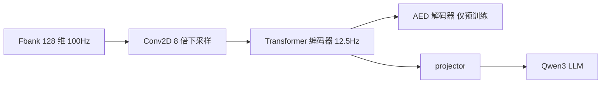

# AuT：AED 音频 Transformer 编码器

AuT 是基于注意力编码器–解码器的 ASR 模型，对 128 维 Fbank 做 8 倍下采样，得到 12.5 Hz 的音频编码器。

<footer>—— Qwen Team，Qwen3-ASR Technical Report，arXiv:2601.21337</footer>

把波形送进 LLM 之前，必须有一个音频前端给出时间上可承受的表示。Qwen3-Omni 与 Qwen3-ASR 把这个前端叫做 AuT（Audio Transformer）。它不是 LLM 内部的一层自注意力，而是独立预训练的注意力编码器–解码器（AED）风格音频模型：先按 ASR/音频理解目标把 Fbank 编成隐状态，再（在 Omni/ASR 里）丢掉或不用其解码器，只把编码器输出经 projector 交给 Qwen3。AuT 的职责是给 LLM 提供音频表示，而不是在部署时自己贪心出字。本篇讲清 AED 编码器作为特征器的几何：维数、下采样、窗口注意力，以及它与 Whisper 编码器、纯 CTC 前端的差别。

## 问题

16 kHz 波形经 25 ms 窗、10 ms 跳步得到约 100 Hz 的 128 维 Fbank。若每帧直接当一个 LLM token，一分钟 6000 步，加上文本，上下文与 KV 缓存都偏长，且相邻帧高度冗余。前端必须沿时间压缩，并把通道映到 LLM 隐藏维。压缩太狠，辅音与短停顿消失；压缩太少，LLM 做不成实时。

Whisper 编码器是成熟选择，Qwen2.5-Omni 仍走类似路线。Qwen3-Omni 认为通用音频表示应在更大规模监督上从零训：约 2000 万小时，中英伪标注 ASR 为主、兼其他语种与音频理解。Qwen3-ASR 里 AuT 还要再适应动态窗口，以便同一套权重既流式又离线。需要的不是「又一个 Conformer」，而是明确的 token 率与窗口契约，好让 FlashAttention 和 projector 设计有数可算。

### AED 作为表示学习器

AED 训练时，解码器用交叉注意力读编码器记忆并生成词。编码器因此被要求保存可被注意力检索的内容，而不是只优化帧级分类。训完之后，部署可以只保留编码器：记忆已经对「会被问到的词」友好。这与仅 CTC 预训练的编码器不同——CTC 编码器对折叠路径友好，对 LLM 的软前缀不一定最优。AuT 报告中的图示包含编码器自注意、Conv2D 下采样与解码器交叉注意；ASR 推理图则只接「预训练 AuT 编码器 → Qwen3 LM」。

AED 里的 D（解码器）在特征器阶段是训练脚手架。Qwen3-ASR 发布件用编码器输出，不再用 AuT 自己的词面解码器出最终转写。若把 AuT 整模型当 ASR 用，就退回传统 AED，丢掉 LALM 的 LLM 先验。

## 方法

Fbank 128 维、约 100 Hz，经 Conv2D 块 8 倍下采样，时间率变为 $100/8=12.5$ Hz，即每帧约 80 ms。这与 Omni 文本里「每帧对应约 80 ms」一致。Qwen3-ASR-1.7B 的 AuT 约 300M 参数、隐藏维 1024；0.6B 型号的 AuT 约 180M、隐藏维 896。Omni 基座里的 AuT 约 650M，规格更大，因任务更通用。ASR 用的 AuT 与 Omni 分开预训练：ASR 报告写约 4000 万小时伪标注 ASR；Omni 报告写 2000 万小时监督音频且含理解任务。两者同名异构，对接时靠 projector 把隐藏维对齐到 Qwen3。

注意力使用动态 FlashAttention 窗口，查询跨度从约 1 秒到 8 秒。短窗服务流式块；长窗服务离线整句。训练时随机或按课程抽窗口，推理时可固定 8 秒窗口做离线，或短窗做流式。于是同一编码器权重覆盖两种延迟曲线，而不必训两个前端。

### 从 AED 损失到 LLM 前缀

预训练损失是 AED 的交叉熵（加可能的理解任务）。编码器梯度来自「解码器能否听见正确的词」。进入 LALM 后，损失变成 Qwen3 的转写交叉熵，梯度经 projector 回流编码器（是否冻结取决于阶段）。Omni 的 S1 阶段曾冻结 LLM、先训 adapter 再训编码器，避免编码器去补偿被冻住的 LLM。ASR 后训练则在已对齐的空间上做风格迁移。数学上，encoder 输出 $H\in\mathbb{R}^{T\times d_{\mathrm{aut}}}$，$T=\lfloor L_{\mathrm{sec}}\times 12.5\rfloor$，

$$
Z = HW_p,\qquad Z\in\mathbb{R}^{T\times d_{\mathrm{llm}}},
$$

$Z$ 作为前缀（或交叉注意记忆）进入 LLM。$W_p$ 即学习型 projector，另文展开；这里只需知道 AuT 的 $d_{\mathrm{aut}}$ 不必等于 $d_{\mathrm{llm}}$。

## 机制

8 倍下采样把 10 ms 级细节交给卷积局部感受野，Transformer 层在 80 ms 网格上做中程依赖。12.5 Hz 与 Omni 输出 codec 同数量级，音画时间 ID 好对齐，也让一分钟音频大约 750 个音频 token，LLM 可接受。窗口注意力把自注意从全长音频的二次成本改成窗口内二次：8 秒窗约 100 个 token 量级，流式时更短。动态窗的代价是长短依赖不稳定——1 秒窗看不见跨秒韵律，8 秒窗延迟高。训练覆盖区间，是让同一套参数在两种掩码下都能给出可用表示，而不是推理时自适应到任意窗而不掉点。

AED 预训练让键值空间对语言查询可检索：解码器曾用文本状态去点音频记忆。LLM 的 projector 查询几何不同，但「内容可寻址的时间块」这一归纳偏置被保留。纯卷积下采样没有这种可检索记忆，要把全部压缩交给 LLM，12.5 Hz 可能不够用。

Conv2D 的 8 倍是时间（及可能的频带）下采样设计，不是把 128 维压成 16 维。通道维由后续线性层和隐藏宽 896/1024 承担。混淆「时间 8×」与「特征 8×」会算错 token 率。

### 与 Whisper 编码器替换的意义

Whisper 编码器在多语 ASR 上强，但对非语音理解、超长窗口与 Qwen 数据分布未必最优。从零训 AuT 可以用伪标注规模（千万小时级）覆盖中文方言与噪声，并用动态窗专门为流式服务。替换的代价是生态：不再能直接加载 Whisper 权重。Qwen3 选择在 Omni 与 ASR 两篇报告里把 AuT 写成一等模块，等于把音频前端从「借用 ASR 名模型」改成「自家表示学习器」。

## 边界与工程取舍

12.5 Hz 对精细时间戳不够。强制对齐、字幕打轴要另模型，不能从 AuT 帧边界直接当字边界。极度短指令（百毫秒）可能只覆盖一两帧，表示方差大，依赖 LLM 先验。重叠说话人在 80 ms 块内混叠，AuT 不会神奇分离。

ASR 的 180M/300M 与 Omni 的 650M 不可互换权重而不过 projector。微调时若只训 LLM、冻 AuT，省算力但域外声学适应慢；若大步训 AuT，可能破坏与 LLM 已对齐的几何。动态窗在实现上依赖注意力掩码正确：漏掩未来帧会在流式评测中作弊。

后续条目会分别写 128 维 Fbank、12.5 Hz、1s–8s 窗口与分块 Conv2D。本篇只定位 AuT：AED 训练出来的、给 LLM 用的音频 Transformer 编码器。

## 小结

- AuT 是 AED 风格的音频 Transformer：用编码器–解码器目标预训练，部署时把编码器表示交给 LLM。
- 128 维 Fbank 经 Conv2D 8× 下采样得到 12.5 Hz（约 80 ms）token，供 projector 对齐 Qwen3。
- 动态 FlashAttention 窗口 1s–8s 统一流式与离线；Omni 中约 650M，ASR 中约 180M/300M，分开预训练。
- 它替换 Whisper 式借用编码器，为大规模伪标注与长音频窗口服务，但不提供逐字时间戳。
- AED 解码器是训练脚手架；最终转写由 LALM 的 Qwen3 头生成。
- 出处：Shi 等，Qwen3-ASR Technical Report，arXiv:2601.21337（2026 年 1 月）；Xu 等，Qwen3-Omni Technical Report，arXiv:2509.17765，其中 §2.2 Audio Transformer (AuT)。
