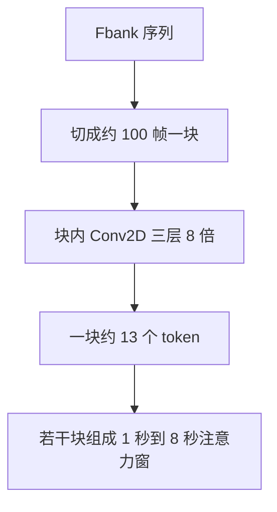

# 分块 Conv2D（约 100 帧 → 13 token）

动态窗口使模型能以短块做流式推理；前端卷积必须按块独立计算，否则核的感受野会看见未来帧。

<footer>—— 由 Qwen3-ASR 的流式设定与 8× Conv2D 前端合写，主文献 arXiv:2601.21337</footer>

8× Conv2D 若对整句谱图一次扫完，每一帧都会通过 padding 与核宽看到右侧若干未来帧。离线无妨，流式违法。Qwen3-ASR 把 Mel 切成约 **100 帧** 的块，每块独立过三层时间步长 2 的卷积，得到约 **13 个** 音频 token。100→13 不是随意取整，而是 8× 加上 $3\times 3$、padding 1 的卷积几何。本篇写分块如何把卷积因果化，以及块边界与动态注意力窗如何咬合；token 率的闭环见上一篇，窗的 1s–8s 见动态窗口篇。

## 问题

二维卷积的输出位置 $t$ 依赖输入 $[t-k, t+k]$ 一类邻域。有右侧上下文时，对当前 10 ms 帧的表示掺进了尚未发生的声音。流式系统若用这种全序列卷积，等于偷看下一秒。把整网改成严格因果卷积（只 pad 左边）可以，但会与离线全序列训练错分布：离线曾经看见未来频谱，上线突然看不见。

需要第三种办法：**离线和流式都按同一块大小做卷积**，块与块之间不共享卷积状态。块长取 1 秒量级，既和动态窗的下界对齐，又让 8× 之后仍有十几个 token 可做注意力。100 帧 Fbank 在与 12.5 Hz 对齐的常见设定下正好是 1 秒。问题变成：100 帧过完 8× 之后是多少个 token，以及为什么是 13 而不是 $100/8=12.5$。

### 卷积几何产生整数 13

三层核 3、步长 2、padding 1 的一维时间长度递推为

$$
L_{\ell}=\left\lfloor\frac{L_{\ell-1}-1}{2}\right\rfloor+1.
$$

$L_0=100$ 则 $L_1=50$，$L_2=25$，$L_3=13$。于是 **约 100 帧 → 13 token**。0.5 的小数来自「100 不能被 8 整除」加上每层 $\lfloor(L-1)/2\rfloor+1$ 的向上取整效应；padding 让边界帧也有输出，而不是丢掉。13/100 = 0.13，长时间平均仍接近 12.5 Hz（$13/1.0\,\mathrm{s}=13$ Hz 是块内瞬时个数；多块拼接并去掉不完整尾块后，速率回到 12.5）。工程上按块输出 13 个向量来分配缓冲，按 12.5 Hz 来报吞吐。

100 是 Fbank 帧数，不是采样点。16 kHz 下 1 秒有 16000 点，但卷积吃的是 100×128 的谱图。把 100 写成 100 ms 会把块长缩一百倍，13 个 token 会对进 8 ms，整条时间轴崩溃。

## 方法

### 按块独立前向

把长度为 $T$ 的 Fbank 沿时间切成 $\lceil T/100\rceil$ 块，不足 100 的尾块补零并记下有效长度。每块形状为 $(1,128,100)$，三层 Conv2D + 激活后展平、线性到 $d_{\mathrm{model}}$，得到 $(13, d)$。有效帧不足 100 时，用同一套长度公式算有效 token 数，掩掉 padding 对应的输出。块与块在卷积阶段互不看。这就是流式卷积因果化：当前块的核只在当前 100 帧内滑动，右侧最多看见块内的未来（最多约 1 秒块尾），看不见下一个未到达的块。

### 块与注意力窗对齐

动态窗以秒计，块以 100 帧计，二者应对齐成整数倍。1 秒窗 = 1 个卷积块 = 13 token 的注意力段；8 秒窗 = 8 个块拼成一段，FlashAttention 在约 104 个 token 内全连接（$13\times 8$）。训练与推理若一块按 100 帧切、窗却按「任意毫秒」切，边界会落在块中间，因果承诺失效。正确做法是：卷积的原子是 100 帧，注意力的原子是若干个这样的原子。

离线并不改成「整句一次卷积」。若离线全序列卷积、流式分块卷积，同一权重会碰到不同边界伪影，统一推理就被破坏。家族选择：两种模式都分块，离线只是一次喂更多块、注意力窗更大。卷积因果化是统一权重的前提，不只是流式补丁。

块内仍有「未来」。100 帧块的第 1 帧卷积会看到块内后面的帧。真正的超低延迟（例如 40 ms）不能靠这个 1 秒块；那要更小的块或因果核，并离开报告的 1s–8s 工作区。本设计优化的是「秒级流式」与离线统一，不是电话级逐帧。

## 机制

分块把卷积的感受野钉在块内。8× 之后每个 token 大约聚合 80 ms，但块首、块尾的 token 聚合的输入帧并不对称：块首缺左上下文，块尾缺右上下文（下一块还没来；上一块已经算完、不回传）。动态窗训练让注意力习惯这种边缘。若从不分块、只在推理切开，边缘分布是新的，WER 会在块缝上跳一下——听感上就是每隔一秒一个「结巴」或吞字。

### 13 为什么不能改成 12

有人会把输出截成 12，好让 $100/8$ 整除。截断等于丢掉最后一层卷积的边界格，时间网格与 80 ms 对齐器错位：ForcedAligner 按 12.5 Hz 索引，编码器却按均匀 12 格/秒，累积漂移在长音频上会到数百毫秒。正确的是保留 13，用长度公式掩掉无效格，再在多块拼接时按有效长度排列。整数 13 是几何，不是超参；把它当超参调，会拆开 token 率、窗口和时间戳三件事。

计算上，分块还带来批处理形状：把 $B$ 条音频的所有 100 帧块叠成 $B\cdot N_{\mathrm{chunk}}$ 条短特征图，卷积完全数据并行，再按 `cu_seqlens` 做变长注意力。这与 FlashAttention 的变长接口是同一套记账：卷积按块，注意力按窗（窗 = 若干块）。漏记一层，就会出现「卷积已经流式、注意力仍看全句」或相反。

## 边界

分块卷积不提供块间的声学滤波。跨块的混响尾、被切成两半的音节，只能靠注意力窗（若窗 ≥ 2 块）或解码器语言模型补。1 秒窗时注意力也看不见上一块的键，跨缝信息只剩解码器里已经生成的文字——那是语言侧记忆，不是频谱连续性。极慢的拖腔、超过 1 秒的长元音会被切成多块，短窗流式下更容易被写成两个字或吞掉延长记号。

补零尾块会改变卷积在右边界的值。必须用有效长度掩码，不能把补零也当成 13 个真 token 送进 AuT。否则静音垫会在离线批处理里制造「幻听」或把 LID 推成 None 与某语言之间的随机跳。

另一边界：100 帧假设 100 Hz Fbank。若前端帧移不是 10 ms，100 帧就不是 1 秒，13 个 token 也不再对应 1 秒窗。分块大小、窗口秒数、token 率必须一起改，禁止只改切块整数。与 CTC 流式的块（往往几十毫秒加右上下文）相比，这里的 1 秒块更粗、更适合 LALM 的 12.5 Hz 前缀，不适合做音素级低延迟对齐。

## 小结

- 前端 Conv2D 按约 100 帧 Fbank 分块独立计算，使流式看不到下一块未来。
- 三层 stride 2 的几何给出约 100 帧 → 13 token；13 要保留，不能为了整除改成 12。
- 离线与流式共用分块卷积，差别只在注意力窗覆盖多少块。
- 块是卷积原子，窗是若干块组成的注意力原子，两者必须整数对齐。
- 块内仍有最多约 1 秒的右上下文；这不是 40 ms 级因果卷积。
- 出处：Qwen Team, *Qwen3-ASR Technical Report*, arXiv:2601.21337（8× 下采样、12.5 Hz、1s–8s 动态窗）；卷积块大小与 13 的对应是与该闭环一致的实现几何。
