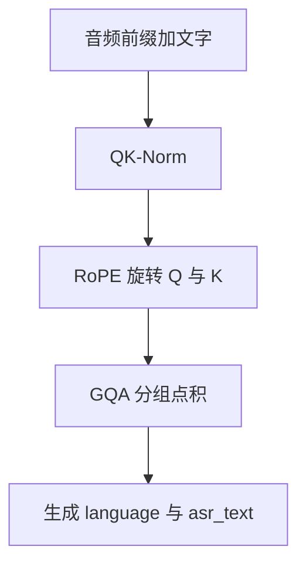

# Qwen3 解码器：GQA、RoPE、QK-Norm

Qwen3-ASR-1.7B 以 Qwen3-1.7B 为解码器，Qwen3-ASR-0.6B 以 Qwen3-0.6B 为解码器；二者都经 projector 读取 AuT。

<footer>—— Qwen Team, Qwen3-ASR Technical Report, arXiv:2601.21337</footer>

识别的最后一公里不是再做一个 AED 解码器，而是**沿用 Qwen3 的因果语言模型**：Grouped-Query Attention、RoPE、QK-Norm。音频前缀进残差流之后，生成转写的规则与生成文本相同——只是系统被 SFT 成 ASR-only 槽位。本篇写这三件解码器构件如何服务语音前缀：GQA 压 KV、RoPE 给音频与文字同一套相对几何、QK-Norm 稳住长前缀上的分数尺度。对照 Whisper 的交叉注意力解码器，以及 Ainslie 的 GQA、Su 的 RoPE 与 Qwen3 / 稳定训练文献中的 QK-Norm。

## 问题

LALM 的解码器要同时满足三件事。其一，音频前缀可长达二十分钟量级的 12.5 Hz 向量，KV 缓存按层、按头、按长度涨，服务并发会被带宽打死。其二，前缀是声学、后缀是文字，两种 token 要在同一套位置几何里做点积，不能音频用正弦、文字用 RoPE。其三，前缀长度从流式 1 秒跳到离线数分钟，softmax 的尺度若随长度漂，首 token 就抖。Whisper 用专门的编码器–解码器与交叉注意力，三项分别用较短的 30 秒块、解码器自注意力、训练时的固定形状来回避。Qwen3-ASR 选择不另开解码器家族，于是必须把 Qwen3 已有的 GQA、RoPE、QK-Norm 用对。

### 解码器是语言模型，不是第二套 AuT

AuT 自己在预训练时是 AED，含编码器自注意力与解码器交叉注意力。进入 Qwen3-ASR 之后，发布图的右支是：预训练 AuT 编码器 → projector → Qwen3 LM。文字侧不再走 AuT 的解码器。因此本篇的 GQA / RoPE / QK-Norm 指 **Qwen3 主干**，不是 AuT 内部层。混写会把编码器窗和语言模型 KV 算进同一笔账。

0.6B 与 1.7B 的差别主要在 Qwen3 深度与宽度，以及配套 AuT 的 180M / 896 对 300M / 1024。GQA、RoPE、QK-Norm 是同一套结构选择，不是大号才有、小号没有。

## 方法

### GQA：查询头分组共享 KV

Ainslie 等人的 Grouped-Query Attention 让 $h_q$ 个查询头共享 $h_{kv}$ 组键值，$g=h_q/h_{kv}$。解码时 KV 字节与 $h_{kv}$ 成正比，与 $h_q$ 无关。音频前缀很长时，这一点比纯文本对话更关键：前缀每秒新增 12.5 个键，会议和歌曲会把缓存拉成「文本对话的许多倍」。GQA 把斜率打下去，才能在 vLLM 批处理里用 0.6B 换到高并发、约 92 ms 级 TTFT。训练与推理必须同一分组，不能预训练 MHA、上线改 GQA。

### RoPE：音频下标与文字下标同一旋转

Su 等人的 RoPE 在 Q、K 上按位置旋转，内积只含相对位移。音频前缀占用 $0\ldots N-1$，文字从 $N$ 起。相对几何保证「当前字去看半秒前的声学 token」是合法的 $n-m$，无需为音频另学一张位置表。流式短窗下 $N$ 小，离线长音频 $N$ 大，旋转公式不变；会变的是未见过的大距离上的数值，那是频率外推问题，不是 ASR 特有的新编码。

### QK-Norm：先归一化再打分

Qwen3 及部分稳定训练文献在注意力里对 $Q$、$K$ 做逐头（或逐向量）RMSNorm，再缩放点积：

$$
\mathrm{head}=\mathrm{softmax}\left(\frac{\mathrm{RMS}(Q)\,\mathrm{RMS}(K)^\top}{\sqrt{d_k}}\right)V.
$$

长音频前缀使某些头的 $Q$、$K$ 范数随层放大，没有 QK-Norm 时 logits 进入饱和，后面的文字 token 几乎只看最近几个位置。有了逐查询、逐键的归一化，尺度被钉住，GQA 的共享键也不会因为某一头范数爆炸而独占分组。这是「能把分钟级前缀喂进小解码器」的数值条件。

顺序上 RoPE 与 QK-Norm 的先后以 Qwen3 实现为准：先投影，再对 Q/K 归一化，再旋转，再 GQA 打分。评测复现时不要把 Norm 加在旋转之后又再转一次，那会破坏 $R_m^\top R_n=R_{n-m}$ 与单位范数的组合假设。

## 机制

GQA 在识别里的机制是：**声学记忆按组共享，字面路由仍多头**。同一组查询头去读同一段 12.5 Hz 前缀，适合「这段音频在说什么」这类全局问题；组间仍可分化出噪声抑制、语种、专名等通道。这比 MQA 全部挤一头更不容易把方言和歌声挤丢，又比 MHA 便宜。RoPE 则让「看前缀的哪一格」成为相对距离问题：当前正在写的汉字，倾向对齐最近几百毫秒的声学 token，这与 80 ms 格子相洽。

### 与 Whisper 交叉注意力的分工

Whisper 解码器每层用交叉注意力去编码器记忆里检索，自注意力只在已生成文字上。Qwen3-ASR 把检索折叠进自注意力：音频向量已经作为前缀键值躺在缓存里，文字查询直接点它们。GQA 作用于这整段混合序列。效果是实现简单、与文本服务同栈；代价是无法在深层再学一套专门的「听」头——「听」必须已经在 projector 输出里。QK-Norm 在这种混合序列上尤其有用：音频向量和文本嵌入的原始范数往往不同，归一化后才在同一 softmax 里竞争。

SFT 把输出限制为语种槽加转写，解码器的语言建模能力被收窄到 ASR。GQA/RoPE/QK-Norm 并不因此消失；它们仍然决定前缀能有多长、多稳。RL（GSPO）再在难例上调策略，改的是生成分布，不是这三件结构。结构是能服务的前提，后训练是槽位与鲁棒性。

## 边界

GQA 不能在组内保存两套冲突的声学记忆。若某一层必须同时精细保留两个说话人，而 $h_{kv}$ 很小，应靠前端窗切开说话人，或接受混叠。RoPE 不提供绝对时间：它不知道「这是第 3 分钟」，只知道相对。产品要展示时钟，必须用 ForcedAligner 的 80 ms 索引，不能从 RoPE 相位反解。QK-Norm 会削弱用范数编码的置信度；若有人想从注意力范数读「模型有多确定」，在 Qwen3 解码器上会误读。

不要把编码器动态窗和 GQA 当成同一类稀疏。窗是对音频键的硬裁切；GQA 是对头的共享。流式短窗已经把 $n$ 裁小，GQA 的收益主要在离线长前缀与高并发。短句上两者的差别会缩小，不能用 3 秒测试片断否定 GQA。

另一边界：ASR-only 不等于可以删掉语言模型容量。专名、歌词、代码切换依赖 Qwen3 的世界知识；GQA 只减 KV，不减 FFN。0.6B 的效率优势来自更浅更窄的 Qwen3 加更小的 AuT，不是来自「识别不需要 LM」。把解码器换成随机初始化的小 Transformer、只保留 GQA 外壳，会丢掉报告里相对 Whisper 与商业 API 的那截质量。

## 小结

- 发布模型的解码器就是 Qwen3：GQA 减 KV，RoPE 统一音文相对位置，QK-Norm 稳住长前缀打分。
- 音频以 projector 前缀进入自注意力，不再使用 Whisper 式逐层交叉注意力。
- GQA 的收益随 12.5 Hz 前缀变长而显现，服务侧与 vLLM 批处理绑定。
- 绝对时间戳不在 RoPE 里，而在 ForcedAligner 的 80 ms 格子上。
- 结构三件套不能替代后训练的 ASR 槽位约束，也不能单独解释 0.6B / 1.7B 的质量差。
- 出处：Qwen Team, *Qwen3-ASR Technical Report*, arXiv:2601.21337；Ainslie 等，GQA，2023；Su 等，RoPE / RoFormer；QK-Norm 见 Qwen3 与相关稳定训练文献；对照 Radford 等，Whisper，2022。
