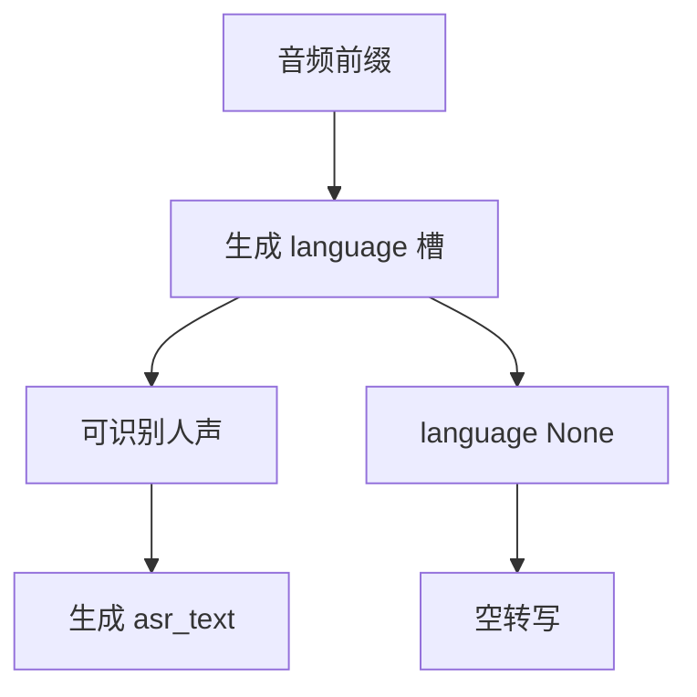

# 语言识别与 52 语种/方言

Qwen3-ASR-1.7B 与 0.6B 为 52 种语言和方言提供语言识别与识别转写。

<footer>—— Qwen Team, Qwen3-ASR Technical Report, arXiv:2601.21337</footer>

家族把覆盖面写成一个整数：**52 语种/方言**。拆开是 **30 种语言 + 22 种汉语方言**（表 1）。输出不是先跑一个独立 LID 分类器再切模型，而是在同一套 LALM 里先写 `language …` 再写 `<asr_text>`。无语音则 `language None`。本篇写 52 如何构成、LID 如何嵌进生成槽、以及与 Whisper 语言 token 的差别；不把各语 WER 表抄成榜单文。

## 问题

多语识别的经典做法是：上游 LID，下游按语种加载声学模型或语言模型。52 路检查点无法服务，方言之间还共享大量词汇与句法，硬切换会在混码处来回跳。另一极端是「不告诉模型是哪种话，让解码器自己拼」，则汉语方言、马来语与印尼语、粤语与普通话会在声学相近时互相抢字。需要把 LID 做成**同一生成过程里的显式槽**，既给后面的转写一个条件，又允许用户看到模型听成了哪种话。

覆盖面必须写清口径。30 语言含中、英、粤、阿、德、法、西、葡、印尼、意、韩、俄、泰、越、日、土、印地、马来、荷、瑞典、丹、芬、波、捷、菲、波希、希、匈、马其顿、罗等（以表 1 为准）。22 种汉语方言含皖、东北、闽、甘、贵、冀、豫、鄂、湘、赣、宁、陕、鲁、晋、川、津、滇、浙，以及香港口音粤语、广东口音粤语、闽南话、吴语等。52 = 30 + 22，粤语在语言表与方言表里都出现时，产品展示应避免重复计数；报告的家族口径是「52 languages and dialects」。

### LID 是生成，不是 52 路 softmax 头

独立分类头需要固定类别集、与 ASR 损失平衡。LALM 把类别写成自然语言词：`language English`、`language Chinese`。扩展槽位格式比扩展头容易，但也引入分词与别名问题（Chinese / Mandarin / zh）。SFT 用固定模板把别名收死。无语音模板是第三条路，避免把静音硬判成某语再幻想出字。

52 不是 Whisper 的语种数，也不是 ForcedAligner 的 11。对齐器覆盖更小的语言集。写「全家都 52」会把时间戳模型的能力说满。

## 方法

### 槽位顺序：先语种，后转写

可识别人声时：

$$
p(\text{lang}, \text{text}\mid \text{audio})=p(\text{lang}\mid \text{audio})\,p(\text{text}\mid \text{audio},\text{lang}).
$$

模型按这个因式生成：先采样或贪心出语言槽，再在该条件下出 `<asr_text>`。实现上仍是一条自回归链，不是两个网络。条件作用是软的——错误 LID 会把后续词表先验拧偏，例如把粤语判成普通话后，口语词更容易被写成普通话近音字。因此 LID 准确率（表 6）不只是附属指标，它进入 ASR 的条件。

### 与 Whisper 语言 token 对照

Whisper（Radford 等，2022）在解码器端使用特殊语言 token，也可先 LID 再转写。差别在于：Whisper 是 AED，语言 token 插在解码序列前端；Qwen3-ASR 是 LALM 槽位，语言以可读词出现在 assistant 消息里，并与「ASR-only、不跟指令走」的后训练绑在一起。Whisper 覆盖大量语言，但在汉语方言与内部口音集上的表现，报告用同一套内部评测对齐。Qwen3-ASR 的卖点不是「语种数比谁多」，而是 **30+22 的口径加显式 LID 槽、同一权流式离线**。

训练上，中英占各阶段数据的多数，多语与方言靠 Omni 与 SFT 的多语子集、以及内部方言对话集来补。LID 错误在 Fleurs 上剩余部分常是马来语与印尼语互混——声学近、槽位词也近。这是 52 里的近邻问题，不是覆盖空洞。

用户可用系统提示里的上下文 token 做热词，但不能用自然语言指令改「请当成法语听」。ASR-only 约束把 LID 钉在声学条件上，减少用提示劫持语种槽。评测 LID 时应用空提示或固定提示，不要把提示工程算进准确率。

## 机制

LID 槽相当于在 12.5 Hz 前缀上做一个全局读出：短窗流式时，第一秒就要出语言，信息更少，方言与口音更容易犹豫。动态窗训练让这种早判见过；回退协议若覆盖语言槽，产品可以在第二块到达后改判语种并重写已出文字。离线 8 秒窗则让歌声、电话带宽和噪声里的语种更稳。

### 方言不是第 31–52 种「外语」

22 种汉语方言与普通话共享文字系统，差别在语音与部分词汇。LID 若只输出 `Chinese`，转写仍可能是普通话正字，方言词被「翻译」成普通话。报告把方言 ASR 单独评（KeSpeech、粤语、四川等），说明槽位需要细到方言级，而不能 52 只在市场文案里出现、模型内部仍是粗语种。机制上，细槽位给解码器一个词汇先验：同一声学，判成粤语后更愿出粤语用字。这是条件语言模型，不是多套声学模型。

52 的联合训练还有负迁移风险：极低资源语种可能被中英槽吸走。表 5 在 Fleurs 扩到 30 语时相对 Whisper 仍有长尾差距，说明覆盖整数不等于均匀质量。写系统时要把 52 当成**接口承诺**（能出这些槽、能转这些话），把单语 WER 当成**质量承诺**，两张表分开。

## 边界

混码、一句三语、歌词里夹英文，LID 只能出单一槽，转写靠解码器硬扛。ForcedAligner 支持跨语对齐，但 ASR 的语言槽仍是单标签。产品需要句级多语时，应在外层切句，而不是期望 52 类单槽表示句内混合。儿童、老人、极噪条件下，LID 与 ASR 会一起掉；内部集把这些分开报，是为了避免用干净 Fleurs 的 LID 准确率代替真实场景。

`language None` 不是「未知语种」。未知应落在 52 之外的某一语言上，模型可能误判成近邻语种并幻想转写。None 表示没有可识别人声。静音、纯音乐、纯噪声应走向 None；歌声则是要识别的人声，走语种槽。评测歌曲时不要用 None 当失败标记。

另一边界：方言名称的政治与产品用词。模型槽位用的是训练模板里的字符串，前端展示可以映射成对用户友好的名字，但倒推时必须能映回槽位，否则日志里的 52 无法对齐。不要在文档里把 22 改成「数十种」——树标题与报告口径都是 52 与 22。

相对独立 LID 模型（如基于 ECAPA 的分类器）：它们可在 50 ms 级出语种，但不带转写条件。Qwen3-ASR 的 LID 延迟等于首个语言 token 的生成，受 TTFT 约束。需要极早语种路由的网关，可以外置分类器，但不要把它的类别集与 52 槽混用而不做映射。

## 小结

- 52 = 30 种语言 + 22 种汉语方言，是 ASR 与 LID 的家族覆盖口径。
- LID 写在同一条生成链的 `language` 槽，再条件生成 `<asr_text>`；无语音为 `None`。
- 错误 LID 会拧偏转写先验，故 LID 准确率是 ASR 质量的一部分。
- 方言槽提供词汇先验，不是 22 套独立声学模型。
- 覆盖整数不是均匀 WER；长尾语种与混码是已知边界。
- ForcedAligner 为 11 语，不要写成 52。
- 出处：Qwen Team, *Qwen3-ASR Technical Report*, arXiv:2601.21337；对照 Radford 等，Whisper，2022 的语言 token。
