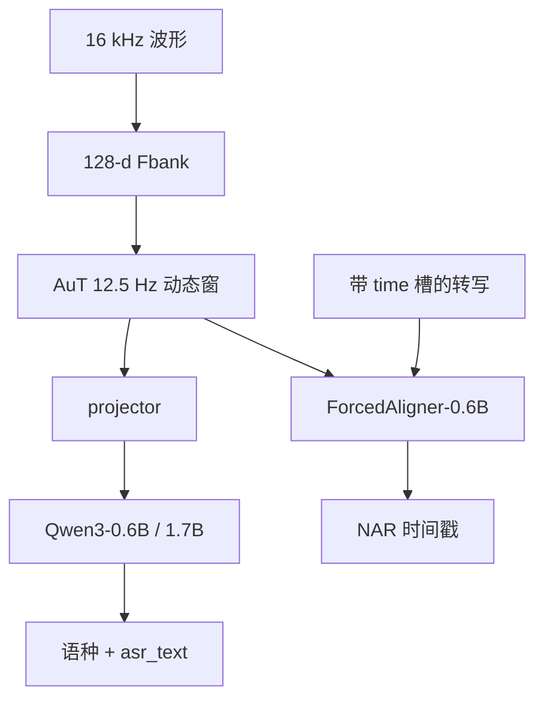

# Qwen3-ASR 技术报告

两档全功能转写加一个非自回归强制对齐器：理解先验来自 Qwen3-Omni，输出契约收成语种槽与转写槽。

<footer>—— Shi 等，Qwen3-ASR Technical Report，arXiv:2601.21337</footer>

Qwen3-ASR 家族不是 30B Omni Thinker 的原盘上线，而是三份可部署模型： **Qwen3-ASR-1.7B**、**Qwen3-ASR-0.6B** 做语种识别加转写，覆盖 **30 种语言 + 22 种汉语方言**（合计 52）；**Qwen3-ForcedAligner-0.6B** 用非自回归槽填充给 11 种语言的词/句打时间戳。三者 Apache 2.0。叶子里的 [AuT](/llm/qwen3-asr-lalm)、[动态窗](/llm/qwen3-asr-dynamic-window)、[SKU 对照](/llm/qwen3-asr) 已有专文；本篇按报告写训练四段、输出语法、对齐器公式与效率表，不把 Omni 的 Talker 复述成 ASR。

## 问题

传统 AED / Transducer 在干净朗读上已经接近标注噪声上限，但长音频、噪声、专名、多语方言、歌声仍然脆。大音频语言模型能借世界知识听懂，却容易把「听写」改成摘要，延迟与参数对纯转写过重。生产还要时间戳：过去用 CTC / CIF 后处理，粒度死、多语要多套音素词典。开源基准分数接近时，真实场景（口音、老人小孩、极低信噪、绕口令、多说话人）仍能拉开差距——所以报告除公开集外另建内部压力套件。

需要一条继承：理解来自 [Qwen3-Omni](/llm/qwen3-omni-paper)，输出收成固定槽位；时间戳另训一个 NAR 对齐器，而不是让自回归解码器逐 token 吐毫秒。两档 ASR 必须是**同一产品族**，否则语种表、无语音 `language None`、上下文偏置 prompt 都要分叉。

### 1.7B 与 0.6B 不是「完整版 / 阉割语种」

两档都做 LID 与转写，覆盖同一 52。ForcedAligner 是另一模型、11 语、最长 300 秒，不要写进 ASR SKU。0.6B 配套约 180M / 896 维 AuT；1.7B 配套约 300M / 1024 维 AuT。选档是容量配对：0.6B 换并发与约 92 ms 级 TTFT；1.7B 换稳健。发布名指**解码器档位**，不要把 AuT 加进去当成「2B 模型」去对标 Whisper-large。

「建在 Qwen3-Omni 上」指训练继承：两档都走了约 3T token 的 Omni 多模态阶段。推理图是瘦身后的 AuT + projector + 小 Qwen3，没有 Talker，也没有 235B 路由。SFT 明确训成 ASR-only，减轻指令注入。

## 方法

波形 → 128 维 Fbank → 分块 Conv2D 八倍下采样到约 **12.5 Hz** → AuT（动态 FlashAttention 窗约 1–8 s）→ 学习型 projector → Qwen3 解码器。AuT 本身是 AED，在约 **4000 万小时**伪标语音上预训练（中英为主），与 Omni 阶段的约 2000 万小时监督音频是不同课程，不要把两个数字写成同一个编码器的同一遍数据。

训练四段：(1) AuT 预训练；(2) Omni 预训练，与 Qwen3-Omni 相同，两档各约 3T；(3) ASR SFT，用与预训练不相交的较小多语数据做格式迁移，并加入非语音、流式增强、上下文偏置；(4) RL，报告用 **GSPO**，约 5 万句（约 35% 中英、35% 多语、30% 功能数据），补噪声与难例。有语音时输出 `language … <asr_text>…`；无语音时 `language None` 且转写槽为空。系统提示里的上下文 token 当作背景知识，允许用户偏置专名。

### ForcedAligner：时间槽而不是下一个词

对齐器把转写改写成带 `[time]` 槽的序列，AuT 帧长 80 ms，时间戳离散成最多 3750 类（对应 300 s）。Qwen3-0.6B 上看全部序列，线性头填槽；训练时输出与标签**不对齐移位**（因果、同步 CE，只在时间槽上计损失），并随机决定每个词/字后是否插入起止槽。伪标来自 Montreal Forced Aligner，模型被写成蒸馏并平滑 MFA 的系统性偏移，而不是复制 MFA。推理 NAR：一次填完所有槽，下标乘 80 ms 还原。支持词、句、段及用户指定任意边界。

单次 ASR 音频最长约 1200 s（20 分钟）；对齐器 300 s。音频类型含语音、歌声、带伴奏的整首歌。流式与离线共用同一权重，差别只在可见音频与回退窗口。vLLM 是官方高效推理路径；对齐器评测用 PyTorch + FlashAttention。

效率表在单卡、约 2 分钟音频、vLLM 0.14、bf16、CUDA Graph 下测。0.6B 并发 1 时 TTFT 平均 92 ms；并发 128 的在线异步吞吐约 2000（秒音频 / 秒）。不要把实验室 RTF 写成手机端实时因子。

## 机制

LALM 转写的条件是 $p(y_{\mathrm{lid}}, y_{\mathrm{asr}}\mid x, c)$：$c$ 为可选上下文。先形成音频的高层理解再生成字，专名可以从语言模型抄进来，这是相对纯声学匹配的差。SFT 把指令跟随关掉，是为了让 $y$ 停在听写而不是聊天。RL 的功能数据针对「复杂环境里别胡编、别把噪声听成词」。

动态窗让同一套权重服务短块流式与长查询离线：窗太短则上下文不够，太长则首包延迟。12.5 Hz 是 8× 下采样的直接后果，不是另设的语义码本。对齐器放弃 next-token，是因为时间戳不是「下一个汉字」：槽位预先知道、只需填离散帧号，NAR 更合适。MFA 伪标有偏，同步 CE 加随机插槽迫使模型学边界分布而不是背教师的偏移。

### 内部基准为什么必须写进读法

公开英中集上各家分数已经挤在标注误差附近。报告因此用内部套件压口音（英语 16 组）、22 种方言、老人小孩、极低 SNR、不流畅与绕口令式重复、多说话人中文对话，并单列歌声与整首带 BGM。多语在 Common Voice / Fleurs / MLS / MLC-SLM 及内部 15 语上评，Fleurs 还按语种流行度切子集。LID 单独报表。读实验时，1.7B「开源 SOTA、接近最强商业 API」是这条协议下的句子，不是任意 WER 表上的万能冠军。

基线含 GPT-4o-Transcribe、Gemini-2.5-Pro、Doubao-ASR，以及 Whisper-large-v3、FunASR-MLT-Nano、GLM-ASR-Nano。引用「超过 Whisper」必须带语种与噪声条件。对齐器相对 MFA / NFA 等报累计平均偏移相对降 67%–77%，那是人工标注测试集上的偏移，不是任意字幕软件的字准。

## 边界与工程取舍

ASR-only 意味着用户不能靠自然语言指令把模型临时改成翻译器或会议摘要；要摘要应另接 LLM。上下文偏置能灌专名，也能灌错名。无语音检测会把极轻声或远场漏成 `language None`。20 分钟上限不是无限长会议：更长要切段，切段会丢掉跨段偏置。歌声与 BGM 是报告卖点，现场混响 + 合唱仍应单测。

ForcedAligner 的 80 ms 栅格决定时间分辨率下限；要帧级音素对齐仍需传统工具。11 语与 ASR 的 52 不要混用。NAR 不能流式逐词出时间戳。伪标蒸馏会继承 MFA 在某语种上的系统误差。许可是 Apache 2.0，但训练数据本身未开源。

## 小结

- Qwen3-ASR 报告发布两档 52 语种/方言转写模型与一个 11 语 NAR 强制对齐器，权重 Apache 2.0。
- 训练：AuT 伪标预训练 → Omni 约 3T → ASR SFT（含非语音/流式/偏置）→ GSPO RL。
- 输出固定为语种槽加 `<asr_text>`；对齐器填 `[time]` 槽，帧长 80 ms。
- 0.6B 换吞吐，1.7B 换稳健；内部压力集比公开 WER 更能解释「听起来差很多」。
- 出处：Xian Shi 等，*Qwen3-ASR Technical Report*，arXiv:2601.21337，2026。对照 Xu 等 Qwen3-Omni，arXiv:2509.17765。
