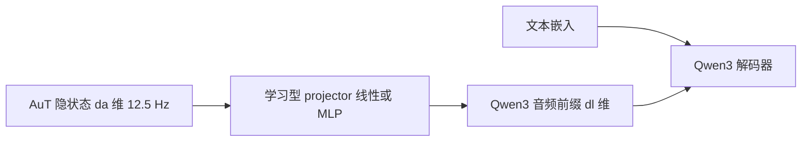

# 学习型 projector 对齐 AuT 与 Qwen3

发布的识别器由 Qwen3、一个 projector 与预训练 AuT 编码器组成。

<footer>—— Qwen Team, Qwen3-ASR Technical Report, arXiv:2601.21337</footer>

AuT 的隐状态活在音频编码器的宽度里：1.7B 规格约 1024 维、0.6B 规格约 896 维。Qwen3 解码器的 $d_{\mathrm{model}}$ 是另一套整数。两边不能直接残差相加，也不能假设「同为 Transformer 就可以 concat」。Qwen3-ASR 在中间放一个**学习型 projector**，把 12.5 Hz 的 AuT 向量映到 Qwen3 的嵌入空间，形成 LALM 的音频前缀。本篇只写这一对齐层：线性或 MLP 的形式、它对齐的是什么几何、冻结谁、训练谁；AuT 内部的 AED 与解码器的 GQA 留给相邻文。

## 问题

多模态连接有三种常见失败。第一，宽度不合：音频 $d_a$ 与语言 $d_l$ 不等，硬投影会切掉通道或补零，梯度尺度错乱。第二，几何不合：AuT 在 AED 预训练里习惯为交叉注意力提供声学键，Qwen3 习惯读文本嵌入；同一范数、同一坐标含义并不自动成立。第三，时间不合：12.5 Hz 的向量串要当「若干 token」进因果语言模型，位置编码与注意力汇点都按语言 token 规则工作，音频前缀若尺度漂移，后面的文字生成会崩。

Whisper 没有这层问题，因为它是编码器–解码器一体训练，交叉注意力从零学对齐。Qwen3-ASR 明确拆成「单独预训练的 AuT + 作为基座的 Qwen3-Omni / Qwen3 + projector」。连接器必须可学，且参数量远小于两边，否则要么毁了语言模型，要么把编码器重新训成另一个 LM。问题是写出这层映射要满足的接口，而不是发明一种新注意力。

### 接口是向量序列，不是离散码

projector 的输入是 $H\in\mathbb{R}^{N\times d_a}$，$N=12.5\cdot D$，输出 $Z\in\mathbb{R}^{N\times d_l}$。$N$ 不变：对齐发生在通道，不下采样、不上采样。时间网格继续由 8× 前端决定。若有人在 projector 里再做一层步长 2 的卷积，token 率会离开 12.5 Hz，窗口与 ForcedAligner 全部要改。本家族的 projector 不做这件事。

projector 不是 tokenizer。没有码本、没有 argmax。输出是连续向量，直接加到 Qwen3 的输入嵌入流里（音频前缀位置）。把它画成 VQ 箭头，会让人以为识别走离散语音 LM，那是另一条系统。

## 方法

### 线性或两层 MLP

最简形式是仿射：

$$
z_t = W h_t + b,\qquad W\in\mathbb{R}^{d_l\times d_a}.
$$

宽度差距大、两边分布差时，用带激活的两层 MLP：

$$
z_t = W_2\,\sigma(W_1 h_t + b_1)+b_2,
$$

其中 $W_1$ 可先保持在 $d_a$ 上做非线性，再由 $W_2$ 映到 $d_l$。这正是「线性 / MLP」两种实现：报告写 projector，不把层数当成贡献点；系统上它的职责是 **AuT 隐状态 → Qwen3 $d_{\mathrm{model}}$**。激活与 AuT 侧常用的 GELU 一致，避免连接器成为另一种非线性风格。

### 谁冻、谁动

AuT 先在约四千万小时伪标注上按 AED 预训练，再进入 Omni 与 ASR 后训练。projector 几乎总是随机初始化后与后训练一起学，因为它的目标几何（Qwen3 残差流）在 AuT 单独预训练时还不存在。Qwen3 作为基座，容量大、已有世界知识；projector 负责把声学坐标拧到这条流能读的方向。SFT 阶段数据比预训练小得多，风格转移到「language … &lt;asr_text&gt; …」格式，连接器在这一阶段被充分监督：识别损失通过解码器、通过 $Z$、回到 $W$。

推理时 projector 是纯前馈，按 token 独立（若无额外序列混合）。它不引入新的时间依赖，所以不破坏分块卷积的因果性，也不扩大动态窗。延迟上它通常可忽略，比起 AuT 的 FlashAttention 和 Qwen3 的解码步。

1.7B 与 0.6B 各有一套 AuT 宽度（1024 对 896）和一套 Qwen3 宽度，因此各有一套 projector，不能把 1.7B 的 $W$ 插到 0.6B 上。家族共享的是 128 维 Fbank、8×、12.5 Hz，不是连接器矩阵。

## 机制

projector 学的是**坐标系变换**，不是识别本身。若 $W$ 接近把 AuT 的主方向对齐到 Qwen3 残差的低频子空间，解码器就能把音频前缀当成一种「外语 embedding」来条件生成。MLP 多一层，是为了吸收编码器输出的范数和稀疏激活：AED 编码器的层归一化统计量与 LM 的 RMSNorm 统计量往往差一个数量级，没有非线性时，后训练前期损失会先花在「把向量调到可接受的尺度」上。

### 与交叉注意力连接器的差别

Whisper 式 AED 用解码器交叉注意力读编码器记忆，对齐发生在每一层、每一个解码步。Qwen3-ASR 把对齐压缩成前缀：只在输入处投影一次，之后全部是解码器自注意力（GQA）。代价是音频与文本的交互不再有层间交叉注意力那种专门通道；好处是可以原样复用 Qwen3 的服务栈、KV 缓存和 vLLM。projector 必须一次把声学信息摆进前缀，藏不住的细节（极短辅音、噪声里的专名）要靠 AuT 已经在 12.5 Hz 上编码好。连接器本身没有检索能力。

训练信号是文字交叉熵（以及后续 RL）。projector 不会单独收到「音频重构」损失。若后训练数据覆盖不足，它可能学成「只传递语种和语速、不传递音素」的捷径，LID 仍准、ASR 糊。这是为什么伪标注预训练先把 AuT 训厚，再让瘦连接器去对齐：厚表示让捷径更难，而不是连接器更宽就能补。

## 边界

projector 不能补前端已经丢掉的时间分辨率。80 ms 格子里没有的爆破音起点，线性层再宽也变不出来。它也不能让 0.6B 解码器读懂 1.7B 编码器：宽度对不上，语义空间也不是同一个后训练走出来的。跨规格蒸馏需要另训连接器，不是改一发矩阵形状。

把 projector 初始化成「只拷贝前 $\min(d_a,d_l)$ 维」在宽度接近时可作为消融，但不能当作发布配置。Qwen3 的嵌入空间经过文本预训练，前若干维没有声学含义。零初始化 $W_2$、让残差从文本侧慢慢长出音频方向，是更稳的常见做法；报告未把初始化写成贡献，实现上应视为工程选择。

另一边界：指令注入。SFT 把模型训成 ASR-only，不跟自然语言指令走。projector 若在音频前缀里保留过强的「可当文本读」的方向，用户可能用声音说指令来改转写格式。后训练用非语音数据、固定输出槽（language / asr_text），就是把连接器的输出限制在识别通道里。评估连接器时，除了 WER，还应看「音频里说一句改格式的话，输出是否仍是转写」。那是对齐层泄露语义控制权的失败模式。

与视觉 LLaVA 式 projector 相比，这里的 $N$ 由 12.5 Hz 决定，不能像 AnyRes 那样任意加 patch。音频连接器的主风险是时间错位而不是空间分辨率。任何在 projector 前后偷偷做池化的改动，都要同步改 12.5 Hz 叙事。

## 小结

- projector 把 AuT 隐状态从 $d_a$ 映到 Qwen3 的 $d_{\mathrm{model}}$，时间步数保持 12.5 Hz。
- 形式是线性或带激活的 MLP；职责是坐标系对齐，不是再做一层识别器。
- 1.7B 与 0.6B 因宽度不同而各有连接器；家族常数是前端，不是 $W$。
- 交互发生在解码器自注意力前缀，而不是 Whisper 式逐层交叉注意力。
- 连接器学不会前端已经压掉的时间细节，也不能跨规格热插拔。
- 出处：Qwen Team, *Qwen3-ASR Technical Report*, arXiv:2601.21337；对照 Radford 等，Whisper，2022 的编码器–解码器对齐；视觉侧 projector 仅作结构类比。
