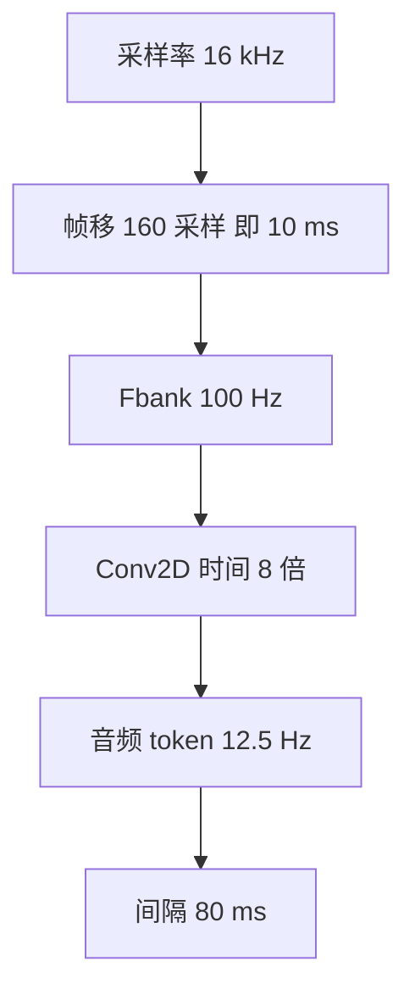

# 12.5 Hz 音频 token 率

对 128 维 Fbank 做 8 倍下采样，得到 12.5 Hz 的音频编码器。

<footer>—— Qwen Team, Qwen3-ASR Technical Report, arXiv:2601.21337</footer>

音频 token 率是前端所有整数乘完之后剩下的那一个数：每秒有多少个向量进入 AuT，再进入 Qwen3。Qwen3-ASR 把它钉在 **12.5 Hz**。一分钟语音约 750 个音频 token，二十分钟上限约 15000，和语言模型的上下文同数量级。本篇把 16 kHz、帧移、8× 下采样如何乘出 12.5 Hz 写成一条推理闭环；帧移若未在报告正文逐字给出，则标明这是与 12.5 Hz 对齐的常见设定。Whisper 约 50 Hz、CTC 更密的帧格，只作为对照，不在这里重写它们的训练配方。

## 问题

LALM 识别把语音变成一段连续向量，再当「前缀」交给解码器生成文字。前缀长度 $N_{\mathrm{aud}}=r\cdot D$，其中 $r$ 是 token 率（Hz），$D$ 是时长（秒）。$r$ 太大，长音频先炸上下文，流式批处理的 KV 也随时间线性膨胀；$r$ 太小，一个向量覆盖过长的声学事件，命名实体、方言变体和歌声里拖长的韵母都会糊。需要一个对家族所有规格（0.6B / 1.7B）都相同的 $r$，让动态窗口的「1 秒–8 秒」能直接翻译成 token 个数，也让 ForcedAligner 的 80 ms 格子与编码器输出重合。

报告已经给出答案：8× 作用于 128 维 Fbank，得到 12.5 Hz。问题是把这个 12.5 从采样率往下推一遍，避免只记住结果、算不清中间量。任何实现若采样率、帧移、下采样倍数有一个与训练不一致，表面仍叫「12.5 Hz」，实际相位已经漂了。

### 闭环里只有三个整数

把采样率写成 $f_s$，帧移（ hop ）写成 $H$ 个采样，时间下采样写成 $S$。则

$$
r = \frac{f_s}{H\cdot S}.
$$

Qwen3-ASR：$f_s=16000$，$S=8$，$r=12.5$，反解 $H=160$。160 个采样在 16 kHz 下就是 10 ms，帧率 $f_s/H=100$ Hz，正是报告图里的 FBank 100 Hz。这就是与 12.5 Hz 对齐的常见设定。若某份实现用 20 ms 帧移仍声称 12.5 Hz，除非把 $S$ 改成 4，否则公式不平。

12.5 Hz 描述的是编码器输出步，不是解码器吐字速率。文字 token 由 Qwen3 自回归生成，长度跟语言和分词走，与 12.5 没有除法关系。把「每秒 12.5 个字」当成识别速度，是把声学格子和语言离散混为一谈。

## 方法

### 从波形到 12.5 Hz

1. 16 kHz 单声道波形。
2. 短时窗（与 12.5 Hz 对齐的常见设定：约 25 ms 窗、10 ms 移）得到 100 Hz、128 维 Fbank。
3. Conv2D 时间 8×，100 除以 8 等于 12.5。

于是相邻两个音频 token 的中心间隔

$$
\Delta t = \frac{1}{12.5}=80\,\mathrm{ms}.
$$

ForcedAligner 把时间戳除以 80 ms 变成离散索引，用的就是这个 $\Delta t$。动态窗口写「1 s–8 s」，翻译成 token 就是 12.5 个到 100 个（未计卷积 padding 造成的 +1）。分块卷积写「约 100 帧 → 13 token」，100 帧恰好是 1 秒的 100 Hz Fbank，13 是 8× 加上边界 padding 后的整数输出。所有后文整数都从 $r=12.5$ 长出来。

### 和 Whisper、CTC 比长度

Whisper 在同样 16 kHz、10 ms 帧移下先得 100 Hz mel，卷积茎 2×，编码器约 50 Hz。同等 60 秒，Whisper 约 3000 步，Qwen3-ASR 约 750 步，差四倍。CTC 若只做 4×，会停在 25 Hz，更密。AED 敢于更疏，是因为对齐不靠帧级条件独立假设；LALM 还要再疏一点，因为每一步都要进解码器自注意力。12.5 Hz 是这条路上的工作点，不是「越疏越好」的极限。

padding 会让「$T/8$」变成略大的整数，例如 100 帧变成 13 而不是 12.5。token <em>率</em>仍按长时间平均定义为 12.5 Hz；块内个数是卷积几何。报延迟时要用块输出个数，报一小时吞吐时用 12.5 乘秒数。

## 机制

12.5 Hz 把声学事件量化进 80 ms 的桶。一个汉语音节常在 150–300 ms，一个桶装不下整个字，但一个字会跨 2–4 个 token，足够让注意力看见声母到韵母的过渡。英语重读音节、法语联诵、日语拍（mora）的时间尺度也落在同一数量级，所以同一 $r$ 能服务 52 语种/方言，而不按语言切换帧率。这是「一个前端、多种语言」能成立的时间条件。

### 窗口、流式、位置编码共用同一时钟

动态 FlashAttention 窗口若按秒配置，实现里必须乘 12.5 才变成 token 窗。流式切 1 秒，就是约 13 个卷积输出；离线放 8 秒，就是约 100 个。RoPE 的位置下标在解码器里对音频前缀按 token 计，不是按采样计。时钟不统一，会出现「窗是 8 秒但位置编码按 50 Hz 走」这种静默错位。机制上，12.5 Hz 是家族的时间单位制：前端、窗、对齐器、延迟指标都要换算到它。

服务指标也按此时钟读。0.6B 在高并发下可达约 92 ms 的平均首 token 时间，和 80 ms 格子同数量级：第一个解码步几乎在「一个音频 token」的时间内吐出。RTF 与吞吐则是「秒语音 / 秒墙钟」，与 $r$ 正交——$r$ 决定每秒要算多少个编码器位置，不决定解码器要生成多少个字。

## 边界

12.5 Hz 不是波形级超分辨率。爆破音、击键、极短的语气词可能短于 80 ms，只能靠卷积感受野里的能量模式被「带进」邻近 token，不能保证单独占一格。时间戳任务必须接受 80 ms 量化误差；需要更细的边界时，应在 ForcedAligner 的格子内插值或换对齐器，而不是假装 ASR 解码步带有毫秒级时间。

重采样到 16 kHz 是闭环的第一环。已经是 8 kHz 电话语音若未上采样就按 160 点 hop 切，实际帧移变成 20 ms，后面的 8× 会得到 6.25 Hz。这是线上最常见的「配置看起来都对、WER 却系统性变差」的来源之一。

另一边界：变速语音。把语速提高一倍，信息密度翻倍，但 $r$ 不变，每个 token 装进更多音素，等于有效下采样更狠。模型靠训练分布里的语速变化来抗，没有自适应帧移。评测极快语或极慢朗读时，应单独报，不能用 12.5 Hz 当「时间分辨率已经够」的保证。

与离散语音 tokenizer 的差别也要划清。12.5 Hz 的向量是连续隐状态，不是码本 ID。速率可以和某些 codec 的帧率碰巧相近，语义完全不同：这里没有量化器，梯度从 Qwen3 一直可以流到 AuT（取决于哪一段被冻）。写「Qwen3-ASR 用 12.5 Hz 的 speech token」时，若读者理解成 VQ 码，就把 LALM 前缀和生成式音频 LM 混在一起了。

## 小结

- 音频 token 率 $r=12.5$ Hz 是 Qwen3-ASR 编码器输出的时间单位。
- 闭环：$f_s=16\,\mathrm{kHz}$，与 12.5 Hz 对齐的常见设定 $H=160$（10 ms），$S=8$，则 $r=f_s/(H S)=12.5$。
- 相邻 token 间隔 80 ms；窗口秒数、分块帧数、对齐索引都从这里换算。
- 同等时长下，序列长度约为 Whisper 50 Hz 编码器的四分之一，这是 LALM 上下文预算所要求的。
- 12.5 Hz 不是吐字速率，也不是离散 codec 的码率。
- 改采样率或帧移必须重算 $r$，否则位置、窗口与时间戳一起错。
- 出处：Qwen Team, *Qwen3-ASR Technical Report*, arXiv:2601.21337；对照 Radford 等，Whisper，2022。
