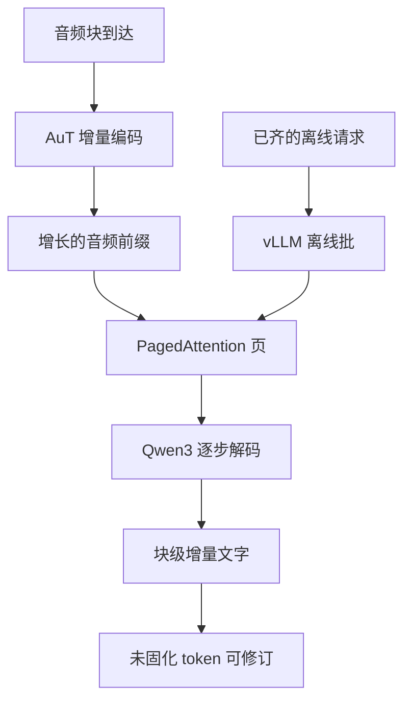

# vLLM 批推理与流式 ASR 服务

速度基准分两条路：离线批走 vLLM 的离线批生成，在线异步走 vLLM Serve 的多并发请求，后者更接近工业环境。

<footer>—— Qwen Team，Qwen3-ASR Technical Report，arXiv:2601.21337</footer>

Qwen3-ASR 把解码器做成 Qwen3 因果语言模型，音频经 AuT 与 projector 变成前缀。于是服务栈可以沿用文本侧已经成熟的 vLLM，而不是另写一套 AED 运行时。报告里的效率表（表 2）明确写：0.6B 与 1.7B 在离线批和在线异步两种模式都走 vLLM（评测用 v0.14.0、CUDA Graph、bfloat16）；ForcedAligner 只在 PyTorch 上做离线批。开源工具链进一步规定：流式识别目前只挂 vLLM 后端，且流式不与批推理、时间戳同时开。本篇只写这件事：批处理与流式服务如何共用 PagedAttention，以及流式 ASR 为什么不能当成「普通 chat 一次出完」。

## 问题

语言模型服务的经典负载是：提示一次到齐，再自回归吐到结束符。Kwon 等人 2023 年的 vLLM 针对这条路做了两件事：用 PagedAttention 按块管理 KV，避免按最大长度预留造成碎片；用迭代级调度做连续批处理，让新请求在步与步之间加入、旧请求结束即退。吞吐的屋顶线因此从「等最慢那条」变成「GPU 上始终有可算的解码步」。

ASR 服务不是同一条路。离线批确实接近 chat：整段音频已在，前缀长度已知，生成转写直到槽位结束。流式则是音频还在到达，前缀每过一个块就变长，文字还允许按回退窗口修订。若仍按 chat 语义——等 EOS 再把整段文本一次性交给客户端——首字延迟会退化成「说完再听」，流式协议作废。问题因而变成：如何在同一套 PagedAttention 上同时跑「音频已齐的批」和「音频增量到达的流」，而不把流式伪装成反复重跑整段的伪在线。

### 两种屋顶线不能合成一张表

报告把 offline batch 与 online async 分开报 RTF、吞吐和 TTFT。离线可以把许多已齐的请求叠成大 batch，用满计算；在线受到达过程与并发尾延迟约束。0.6B 在评测设定下平均 TTFT 可到约 92 ms，并发 128 时 RTF 可到约 0.064、吞吐约 2000（每秒处理约 2000 秒音频）。这些数描述的是 vLLM 调度下的服务效率，不是声学编码器单独的 FLOPs。把 92 ms 理解成「模型听懂一句话只要 92 ms」，是把首 token 与整句转写混为一谈。

ForcedAligner 不走 vLLM。它对齐是非自回归槽位填充，PagedAttention 的逐步解码优势用不上。时间戳应在转写固化之后另跑，不要为了「一个服务进程」把对齐器硬塞进同一条生成队列。

## 方法

### 离线批：前缀一次填满，再连续解码

记第 $i$ 条请求的音频前缀为 $h^{(i)}=P(E(x^{(i)}))$，其中 $E$ 是 AuT，$P$ 是 projector。离线批在时刻 $0$ 已有全部 $x^{(i)}$，vLLM 做一次前填，再按

$$
y_t^{(i)} \sim p_\theta(\cdot \mid h^{(i)}, y_{<t}^{(i)})
$$

逐步采样，直到语种槽与 `<asr_text>` 内容结束。各请求的转写长度不同，连续批处理让短请求先退，空出的 KV 页立刻给后来者。PagedAttention 把每层 KV 切成固定大小的块，逻辑上的序列位置映射到物理页，不必为「可能二十分钟」预留连续显存。

### 流式：块级增量前填，增量输出可修订

流式把波形按块长 $\Delta$（评测常用 2 秒）切开。第 $k$ 块到达后，编码器只消费新块（窗仍受动态注意力约束），前缀从 $h_{\le k-1}$ 增长为 $h_{\le k}$。解码器在已生成前缀上继续，而不是从零再开一条 chat。工具链用未固化块数与未固化 token 数描述修订：已发出的尾部若干 token 允许被后续块改写。这是增量输出，不是把到目前为止的全部音频重新当一条新 prompt。

开源说明把约束写死：流式仅 vLLM 后端；不支持流式批；不返回时间戳。原因直接：流式每条连接的前缀增长率、修订窗口和结束条件都与离线批不同，把它们塞进同一 iteration batch，调度器无法用同一套「提示已齐」假设去装箱。

「流式不支持批」指的是同一条生成调度里不要混多路未完成的流。多路流仍可以在 Serve 层用多并发各自占 KV 页，那是在线异步，不是把 $B$ 条不等长的增长前缀当成静态矩阵乘的 batch 维。

## 机制

PagedAttention 的页表让「前缀变长」变成「再分配若干 KV 页」，而不是整段缓存重拷。对 ASR 这比纯文本更关键：音频 token 率约 12.5 Hz，两分钟前缀已是约 1500 个键，会议与歌曲会继续涨。GQA 降低每位置的 KV 字节，分页降低碎片，二者叠加才撑得起表 2 的并发。CUDA Graph 适合形状稳定的解码步；流式每次加块会改变前填形状，图要在块边界失效或分段捕获，不能假设整条连接一张图打到底。

与普通 chat 流式 token 的差别在输出契约。Chat 的流式只是把尚未结束的 token 提前推给用户，语义上仍是一条不可修订的完成序列。ASR 流式允许尾部回退：时刻 $\tau$ 发出的字符串 $s(\tau)$ 不必是 $s(\infty)$ 的前缀。产品层必须按块或按未固化窗口推送，并准备「改正已上屏的字」。若网关按 chat 的 SSE 把每个 token 当最终值，回退协议就无法落地。

设未固化 token 数为 $u$（评测示例为 5）。固化前缀 $s_{\mathrm{fix}}(\tau)$ 是 $s(\tau)$ 去掉尾部 $u$ 个 token 的部分。客户端只应把 $s_{\mathrm{fix}}$ 当作不可撤回，把尾部当作草稿。这与 vLLM 是否开启流式 API 是两层：引擎负责增量前填与续写，应用负责把可修订区间翻译成 UI。

伪流式是每次新块把累计音频当新请求、丢掉旧 KV 重跑。延迟和算力都会按块数线性放大，PagedAttention 的续写优势被扔掉。真流式的标志是：新块只追加页，已固化的生成路径不推翻，只改未固化尾。

### 调度对象是请求，不是句子

vLLM 的调度器看到的是序列长度、KV 占用和结束条件。离线批的结束条件是转写 EOS；流式的结束条件还依赖「音频是否结束」——用户停说之后仍可能冲刷短于一块的尾部样本。把 ASR 当成 chat 应用，容易漏掉这条：没有 EOS 音频，就没有最终转写。在线异步评测用多并发请求模拟工业到达，正是把调度对象还原成请求队列，而不是实验室里的整句文件列表。

## 边界与工程取舍

vLLM 不能自动把任意音频前端变成可服务模型。Qwen3-ASR 能进 vLLM，是因为发布图已经把声学收成语言模型可读的前缀，解码器就是 Qwen3。换一套仍用逐帧 CTC 头的系统，PagedAttention 没有对应的逐步 KV。官方虽提供发布当日即可用的模型支持，工程仍要为音频特征、动态窗与槽位解析写胶水；那不是「装上 vLLM 就等于流式 ASR」。

流式与批的互斥是产品边界。要吞吐，走离线批，接受整段到达后再出字；要 TTFT，走单路流式，接受不能把许多未完成流叠成静态 batch。在线异步介于二者之间：许多已齐或短音频的请求并发，但每条内部仍是「提示相对完整」的生成。用在线异步的 92 ms 去承诺「实时会议字幕且可回退且可对齐」，会把三条不同的服务合同写进一个 SLA。

数值上，表 2 的音频长度约两分钟、单卡、指定并发。换块长、换窗、关 CUDA Graph，TTFT 分布会变。RTF 小于 1 只说明「算得比实时播放快」，不说明流式首字一定在 92 ms 内——首字还取决于第一块是否到齐、LID 是否先出。半精度与图捕获是评测配置，不是精度保证；对齐与时间戳仍在另一条 PyTorch 路径。

相对传统流式 Transducer：那些系统按帧发射，延迟可以到几十毫秒，但不享受 LLM 服务栈的分页与连续批。Qwen3-ASR 用 vLLM 换的是可批的离线吞吐加可修订的块级流式，延迟预算在秒级块，而不是帧级发射。选型时应先写清合同是批转写还是增量字幕，再决定入口，而不是只看「支不支持 vLLM」这一行。

## 小结

- Qwen3-ASR 的 0.6B / 1.7B 用 vLLM 做离线批与在线异步；评测为 v0.14.0、CUDA Graph、bfloat16。
- PagedAttention 按页管理随音频变长的 KV，连续批处理吃齐的是离线请求，不是把多路增长中的流当成静态 batch。
- 流式 ASR 是块级增量前填加可修订输出，不是 chat 那种提示一次到齐、流式只提前展示最终序列。
- 开源约束：流式仅 vLLM 后端，不与批推理、时间戳同时提供。
- 表 2 的约 92 ms TTFT 与高并发 RTF 描述服务屋顶线，不等于整句听写时延。
- ForcedAligner 走 PyTorch 离线批，不要塞进同一条自回归队列。
- 出处：Qwen Team，*Qwen3-ASR Technical Report*，arXiv:2601.21337；对照 Kwon 等 vLLM / PagedAttention（SOSP 2023）。
