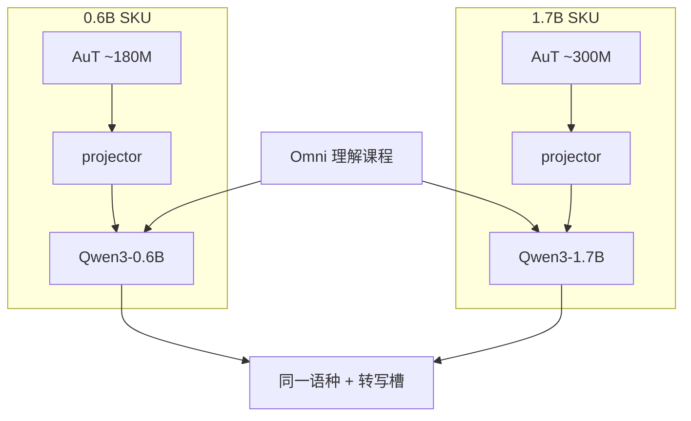

# Qwen3-ASR-1.7B / 0.6B

    
Qwen3-ASR-1.7B 以 Qwen3-1.7B 为解码器，Qwen3-ASR-0.6B 以 Qwen3-0.6B 为解码器；二者都经 projector 读取 AuT。

    <footer>—— Qwen Team，Qwen3-ASR Technical Report，arXiv:2601.21337</footer>

Qwen3-ASR 的发布物不是 30B Omni Thinker，而是两档**可部署稠密转写模型**：1.7B 与 0.6B。它们共享同一套 LALM 契约——语种槽加 `<asr_text>`、52 语种/方言、流式与离线同一权重——差别在解码器容量与配套 AuT 规格。本篇把两档当产品 SKU 来对照：何时用 0.6B 换并发，何时用 1.7B 换稳健，训练继承如何从 Omni 收口成 ASR-only。编码器窗、12.5 Hz、动态窗等叶子已有专文，这里只在对照需要时点到，不把报告各章重写一遍。

## 问题

通用 Omni 会听也会聊，参数与 Talker 对纯转写过重，且指令跟随会把「听写」改成摘要。生产 ASR 要的是固定槽位、可批处理、可流式、TTFT 在百毫秒级。Qwen3 已经提供 0.6B 与 1.7B 稠密解码器，问题变成：音频前端用多大的 AuT、投影层如何对齐，才能在两档上复用同一套数据课程与输出语法。

两档必须是**同一产品族**，否则语种表、无语音 `language None`、上下文偏置 prompt 都要分叉。报告的做法是：训练图相同（AuT 预训练 → Omni 理解阶段 → ASR SFT → RL），发布时切两套编码器–解码器容量。SKU 差异应落在 WER、延迟、显存，而不是落在「会不会方言」。

### 1.7B 与 0.6B 不是「完整版 / 阉割语种」

两档都做语言识别与转写，覆盖报告中的 **30 种语言 + 22 种汉语方言**。ForcedAligner 是另一模型、更小语种集，不要写进 ASR SKU 的 52。0.6B 的卖点是平均约 92 ms 级 TTFT 与高并发；1.7B 的卖点是更大解码器与更大 AuT（报告中 0.6B 配套约 180M / 896 维，1.7B 配套约 300M / 1024 维）。选档是容量配对，不是功能开关。

「建在 Qwen3-Omni 上」指训练继承：理解先验来自 Omni 阶段约 3T token 量级的多模态课程。推理图是瘦身后的 AuT + projector + 小 Qwen3，没有 Talker，也没有 235B 路由。

## 方法

### 共同骨架

波形 → 128 维 Fbank → 分块 Conv2D 下采样到约 12.5 Hz → AuT 编码器（动态 FlashAttention 窗约 1–8 s）→ 学习型 projector → Qwen3 解码器（GQA、RoPE、QK-Norm）。输出先语种后转写。SFT 把模型收成 ASR-only，减轻把转写改写成聊天。RL（报告中 GSPO，约 5 万句）补噪声与难例。伪标注大规模语音用于预训练扩张。流式与离线共用 $\theta$，差别只在可见音频与回退窗口。

### 两档如何切

解码器直接用 Qwen3-0.6B 或 Qwen3-1.7B，保证文本先验与 Qwen3 词表一致。AuT 规格随解码器放大，避免 300M 级编码器压过 0.6B LM，或 180M 编码器成为 1.7B 的感知瓶颈——这与 Qwen3-VL 小模型换较小 SigLIP 是同一容量配对逻辑。发布名 `Qwen3-ASR-1.7B` / `0.6B` 指的是**解码器档位**，不要把 AuT 参数加进去当成「2B 模型」去对标 Whisper-large。

评测协议上，开源集流式常用 2 秒块、5-token 回退、尾部若干块不固化；离线看整段。两档都应报 offline 与 streaming，不能只晒离线 WER 宣传「同一模型实时」。报告把离线批处理与在线异步分开列表，因为屋顶线不同：批处理打满 GPU，流式受到达过程限制。权重统一并不等于 RTF 统一。

上下文偏置写在系统提示里，当背景知识注入，不是第二套 WFST。SFT 关掉闲聊指令后，偏置仍是 ASR 产品允许的「专名表」，与「把这段改成摘要」不是同一类 prompt。

## 机制

LALM 把转写写成语言模型生成，语言先验进入解码器。0.6B 先验更窄，专名与长难句上更依赖声学证据与偏置列表；1.7B 更会用世界知识补口误，也更会把噪声「听成」常见词——错误类型从插删字母变成整词替换。两档共享 12.5 Hz 前缀，KV 增长斜率由解码器层数与 GQA 决定，所以并发优势首先来自 0.6B 的深度/宽度，而不是来自「更激进的下采样」。会议场景里 0.6B 往往先在专名上掉点，1.7B 先在「听成通顺句」上掉点，应用层要用实体错误率而不是只看总体 WER 来选档。

Omni 阶段让音频表示落在 Qwen3 能读的邻域；ASR SFT 把该邻域上的合法续写收成槽位语法。若在 0.6B 上用过大学习率继续微调聊天数据，会洗掉收口，重新出现指令注入。反之，只在干净朗读上微调，会丢掉 Omni 带来的噪声与方言稳健。SKU 再训练应锁定：AuT 检查点、projector、SFT 格式。

时间戳不在 1.7B/0.6B 的自回归槽里。需要对齐字幕时走独立的 ForcedAligner，语种覆盖更小。把 ASR SKU 宣传成「自带逐词时间」会在字幕场景失败。

## 边界与工程取舍

0.6B 不是「免费的 1.7B」。歌声、强方言、重重叠说话人上，更大解码器与更大 AuT 仍可能值得。若业务全是近场普通话命令词，0.6B 的 TTFT 与吞吐通常更合理。两档都不是说话人分离器；「只转第二个人」不是 prompt 能稳定完成的事。需要说话人过滤时应外接分离，而不是指望换 SKU。

长音频窗口与二十分钟量级理解，受动态窗与 KV 限制，不是无限会议录音保证。无语音应出 `language None`，若业务把静音当空字符串，要在解析层处理，不要强迫模型编字。公开基准接近标注噪声时，报告用内部复杂声学、方言、老人小孩与多语日志区分系统——复现应同时报公开集与自建集。歌词与歌声被列为相对传统 AED 的优势场景之一，会议叠音仍不是该 SKU 的解。

vLLM 批处理与流式服务是部署层，见专文；SKU 选择先按延迟 SLA 与 GPU 显存，再按方言 WER。不要为「1.7 看起来更旗舰」把所有流量打到大号。

## 小结

- Qwen3-ASR 产品是 1.7B 与 0.6B 两档稠密 LALM，不是 Omni 30B 原装上线。
- 解码器即 Qwen3-1.7B / 0.6B，AuT 约 300M 对 180M，经 projector 对齐；输出契约同为 52 语种/方言 + 转写。
- 训练继承 Omni 理解再 ASR SFT/RL；流式离线同一权重。
- 选 0.6B 换 TTFT 与并发，选 1.7B 换容量与更难声学；时间戳另走 Aligner。
- 出处：Shi 等，Qwen3-ASR Technical Report，arXiv:2601.21337。基座见 Xu 等 Qwen3-Omni，arXiv:2509.17765。实现细节见同目录 AuT、projector、解码器、流式与 LID 诸篇。
