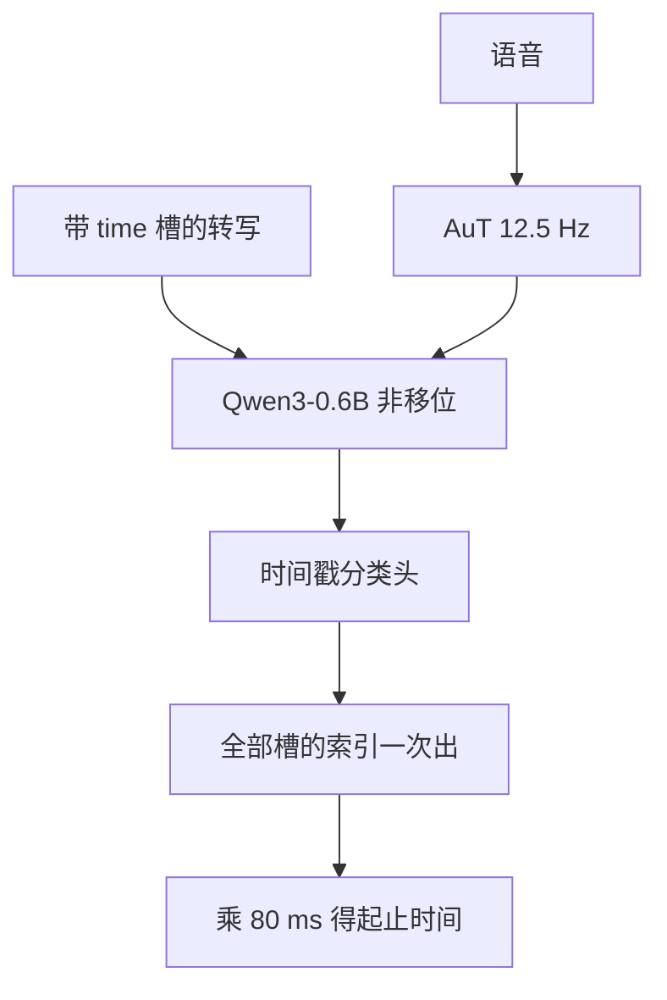

# Qwen3-ForcedAligner 非自回归时间戳

Qwen3-ForcedAligner-0.6B 是基于大模型的非自回归时间戳预测器，在给定转写上对齐起止时间，而不是边识别边对齐。

<footer>—— Qwen Team, Qwen3-ASR Technical Report, arXiv:2601.21337</footer>

字幕和训练数据都要「字/词在哪一毫秒」。旧路径是识别之后再用 CTC 分割、CIF 或 MFA 一类工具做强制对齐。Qwen3-ForcedAligner-0.6B 把任务改写成**槽填充**：转写里插入 `[time]` 槽，模型一次性填离散时间索引，**非自回归（NAR）**，不是再跑一遍自回归识别。格子是 AuT 的 80 ms（12.5 Hz 的倒数）。本篇写它与 ASR 解码器的分工：给已有转写打时间戳，不是自回归再对齐。

## 问题

自回归 ASR 的每个字在不同解码步出现，步索引不等于时间。Whisper 的时间戳是解码器学出来的特殊 token，仍走自回归，长音频上会漂移，且与识别错误绑死——字错了，时间也跟着错。CTC 强制对齐依赖帧级后验和空白符，语言覆盖要按语种建音素集。MFA 准，但慢、且各语各模型。需要一个轻量 LALM：输入是语音加**已经写好的转写**，输出是每个指定单元的起止时刻；一次前向填所有槽；覆盖 11 种语言、最长 300 秒。

报告把该模型称为家族中第一类基于大模型的多语强制对齐器，对比 MFA、NFA、WhisperX 等。问题设定里「forced」意为转写给定，不是「强制模型按某语种识别」。若把 ASR 输出的错字送进去，对齐器会对着错字找声学边界，这是输入错误，不是 NAR 失败。

### 离散索引，不是连续回归

AuT 输出帧长 80 ms。把时间 $t$ 变成类别

$$
n=\mathrm{round}(t/0.08),\qquad n\in\{0,1,\ldots,3749\}.
$$

3750 类对应 300 秒。预测头是线性分类，损失是槽位上的交叉熵。这与回归毫秒相比更稳，也与编码器格子一致。AAS（累积平均偏移）在索引域或毫秒域上定义，报告用人标与 MFA 标两种参照。

NAR 指时间槽同时填，不是指编码器双向看到整句——编码器仍是 AuT。禁止把 NAR 理解成「非因果乱序生成文字」。文字是输入，不是输出。

## 方法

### 槽位插入与因果、非移位训练

转写在每个要对齐的字或词后插入起止 `[time]`。训练时动态随机决定哪些单元带槽，提高粒度泛化（字、句、段）。普通 LM 训练会把标签相对输出错开一位做 next-token。对齐器不行：槽的位置必须与输出位置重合，才能「看见这是槽就填索引」。报告采用因果、**非移位**的序列，交叉熵只算在槽上。推理时用户在任意字后插槽，一次前向用 NAR 解码得到全部索引，乘 80 ms 还原时间。

### 与 ASR 权重的关系

对齐器使用预训练 AuT + Qwen3-0.6B + 时间戳线性层。它不是把 Qwen3-ASR-0.6B 的解码器改成并行输出。伪时间戳由 MFA 生成；模型不是复读 MFA，而是蒸馏并平滑其系统偏差。这解释了为何在人标测试上 AAS 仍低于 MFA 基线：目标不是模仿教师的每一个边界，而是学更稳的槽填充。

推理基准用 FlashAttention 与 bfloat16，在 Transformers 上跑；NAR 使 vLLM 的自回归调度优势变小。高并发下仍可维持很低的 RTF。它支持离线批，不以与 ASR 相同的流式开关为目标。

11 语言：中、英、法、德、意、日、韩、俄、西、粤、葡等（表 1）。跨语拼接在 Concat-300s 与跨语人标集上单独报。不要把 52 抄到对齐器卡片上。

## 机制

槽填充把「对齐」从隐式注意力变成显式分类。模型在槽位上必须在 3750 类里选一格，相当于问「这个字的边界落在哪一个 80 ms 桶」。因果非移位让当前槽能看见左边已填的槽与左边的字，于是时间序列保持单调的压力来自上下文，而不是来自外部 Viterbi。NAR 同时出所有槽，没有「错一个后续全崩」的自回归误差累积；长 300 秒拼接上，MFA / WhisperX 一类基线 AAS 猛增，而对齐器仍保持数十毫秒量级，机制正在这里。

### 不是自回归再对齐

自回归再对齐有两条常见路：解码时插时间 token；或识别完再用 CTC 回溯。前者把时间与字的交叉熵绑在同一条链，识别错则时间错，且 NAR 的并行优势没有。后者依赖空白对齐，粒度受帧率与音素词典限制。ForcedAligner 把识别交给 Qwen3-ASR（或任何转写源），自己只做时间。产品流水线是 **ASR → 文本 → Aligner**，不是 **ASR 内部解码步 ≈ 时间**。这是树标题要钉死的那句话：非自回归时间戳，给转写上时间，不是自回归再对齐。

训练用 MFA 伪标签，会继承教师的语言覆盖与错误模式。动态插槽与人标评测用来检验是否只是「神经网络 MFA」。报告显示人标 AAS 仍优，说明 LALM 的多语语义有助于在噪声和长拼接上平滑教师噪声，而不是逐点拟合。

## 边界

80 ms 量化是硬顶。需要音素级或 10 ms 级边界时，本模型只能给桶心，不能假装超分辨率。转写缺失、多字、乱序时，槽会对着错误文本找能量，AAS 无意义。300 秒是类别数上限，更长音频应切段并处理跨段索引偏移。NAR 一次吃全槽，槽极多时序列变长，仍受 Qwen3-0.6B 上下文限制；「任意粒度」指字/句/段可选，不是无限槽。

对齐器没有 LID 槽。语种由转写文字与多语 AuT 共同承担。把 ASR 的 language 字段漏传，通常仍能对齐，因为文本已在；但空文本或纯标点会让槽位失去语义锚。

另一边界：版权与歌词。歌曲 ASR 再对齐时，歌词文本若与演唱不一致（衬词、重复段），槽会在重复乐句上摇摆。应先固定转写再对齐，不要用对齐器去「发现」多出来的衬词。相对 CTC 分割：CTC 可在无完整文本时做部分对齐；ForcedAligner 要求文本。无文本场景应回到 ASR，而不是空槽乱填。

## 小结

- Qwen3-ForcedAligner-0.6B 在给定转写的 `[time]` 槽上一次填 80 ms 索引，NAR，不是自回归再识别。
- 最大 3750 类对应 300 秒；时间还原为索引乘 80 ms。
- 训练非移位、损失只在槽上；伪标签来自 MFA，人标上仍降低 AAS。
- 覆盖 11 语言与跨语，不覆盖 ASR 的 52 口径。
- 流水线是转写之后打时间戳；解码步不等于时间轴。
- 出处：Qwen Team, *Qwen3-ASR Technical Report*, arXiv:2601.21337；对照 MFA、CTC 分割、Whisper 式自回归时间 token。
