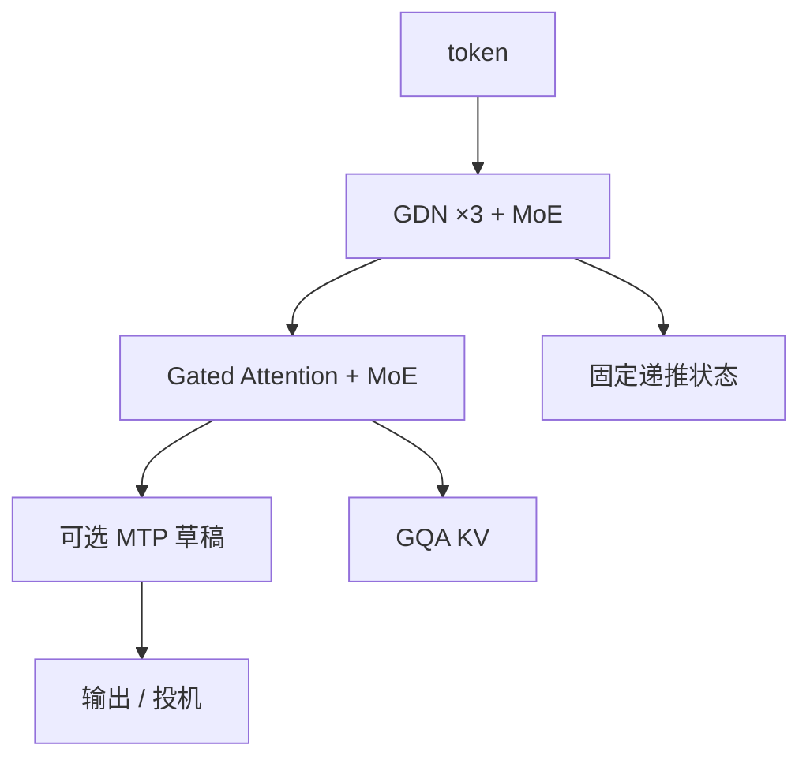

# Qwen3-Next 混合架构

    
在长上下文与大总参两条轴上，用 Gated DeltaNet 加门控注意力的 3:1 混合，再配超稀疏 MoE 与原生 MTP，把训练和推理成本压下来。

    <footer>—— Qwen Team，Qwen3-Next: Towards Ultimate Training & Inference Efficiency（官方博客 / Hugging Face 卡片）</footer>

[Qwen3 技术报告](/llm/qwen3-report) 的主线是 36T、稠密与 128 专家 MoE、QK-Norm。**Qwen3-Next** 换骨架：48 层里按 `12 × (3 × Gated DeltaNet→MoE + 1 × Gated Attention→MoE)` 排列，总参 80B、激活约 3B；预训练只吃 Qwen3 语料的均匀子集 **15T**。官方对照：相对 Qwen3-32B，训练 GPU 小时约 **9.3%**，却在多数下游上更好；相对 Qwen3-30B-A3B 训练时数低于 80%。推理上，相对 32B，4K prefill 吞吐近 **7×**，超过 32K 时 prefill / decode 均可超过 **10×**。本篇写混合注意力与稀疏 MoE，不把 2507 快照的思考开关写进默认列。

## 问题

上下文长度与总参数同时涨时，满 softmax 的二次代价和 KV 线性增长先打满解码；稠密 32B 的训练账单则打满预训。纯线性注意力快，但回忆弱；纯满注意力在超长 decode 上贵。滑窗与 Mamba-2 是常见线性替代，Qwen 的系统实验认为 [Gated DeltaNet](/llm/gated-delta-net) 的上下文学习强于这两类，于是把「多数层线性、少数层满注意力」当成默认，而不是把整网换成 SSM。

第二条轴是 MoE 稀疏度。[Qwen3](/llm/qwen3) 是 128 专家 top-8；若激活数不变、只加总专家数，全局负载均衡下训练损失仍能降——这给出「总参放大、激活钉死」的效率叙事。还要解决混合架构在 RL 里不稳：门控、稀疏路由与长轨迹叠在一起，原先的后训练管线会抖。Next 把稳定化写进层规范与路由初始化，而不是只靠调学习率。

### 为何不是 7:1 或纯 GDN

MiniMax-01 一类用更高比例的线性层换更长窗口。Qwen 报 3:1（75% GDN、25% 标准注意力）在质量与效率上同时优于任一单体。线性层负责长度上的递推压缩；满注意力层负责精确召回。比例再稀，回忆缺口会在 RULER 上露出来；比例再密，32K 以上的吞吐优势会被 KV 吃掉。这与 [Kimi Linear](/llm/kimi-linear-kda) 的 3:1 是同一数量级的工程共识，线性核与满注意力核并不相同。

卡片写明原生上下文 262,144，可用 YaRN 扩到约 1,010,000。官方警告静态 YaRN 在短文本上可能伤分，只在真正需要超长时打开。不要把 1M RULER 写成「预训练就是 1M 满注意力」。

## 方法

**Gated DeltaNet 层**：16 个 QK 头、32 个 V 头（分组值），头维 128，状态是固定尺寸的递推矩阵，decode 不追加 KV。更新是门控 delta：标量 / 头级遗忘清空过期上下文，delta 规则按键改写。**Gated Attention 层**：16 个 Q 头、2 个 KV 头，头维从常见的 128 提到 **256**；输出门来自「Gated Attention for LLMs」以减轻低秩与 [注意力汇](/llm/attention-sink)；RoPE 只旋位置维的前 **25%**（旋 64 维），利于外推。层输出都进 MoE。

**超稀疏 MoE**：512 专家，10 个路由 + 1 个共享，专家中间维 512，激活约总参的 3.7%。对比 Qwen3 的 128/8，这是「专家数翻倍级、激活几乎不动」。稳定化：Zero-Centered RMSNorm 并对 norm 权重做衰减，避免 Qwen3 里 QK-Norm 权重膨胀；路由参数初始化归一，降低早期随机偏置。输出门同时被用来压 Massive Activation。

**MTP**：原生多 token 预测，既当预训练辅助目标，又给投机解码一个高接受率的草稿模块；并做多步训练使训练 / 推理一致。Transformers 主分支已合并 `qwen3_next` 建模代码，但卡片注明 MTP 在 HF generate 路径上并非普遍可用，生产应走 SGLang / vLLM 的投机配置。

Instruct 在 RULER 上全长度高于 Qwen3-30B-A3B-Instruct-2507，并在 256K 内超过层数更多的 Qwen3-235B-A22B-Instruct-2507。1M RULER（YaRN、每档 260 条）平均 91.8，对 30B-A3B 的 86.8、235B 的 92.5。AIME25 69.5，接近 235B 的 70.3。Thinking 版在多套推理基准上超过 30B-A3B-Thinking-2507 与 Gemini-2.5-Flash-Thinking（官方陈述）。

### 前缀缓存要两平面

满注意力层的缓存边界仍是 KV；GDN 层的边界是 $d\times d$ 状态，该状态是位置 $t$ 之前**全部** token 的函数，不能按任意前缀切一刀就复用。只做注意力 radix 树、不做状态快照，多轮会把 GDN 的历史重算一遍。这是混合架构的服务税，不是博客里的 10× 能自动带上的。

## 机制

GDN 相对滑窗：窗口是硬局部，GDN 用有限状态做可学习压缩，长程指针靠 delta 改写而不是靠窗口碰巧覆盖。相对 Mamba-2：标量衰减清得快、改不准；delta 补定点覆盖。满注意力层的输出门把注意力从「必经的低秩通道」拉回带非线性的门控，减轻汇 token 垄断。RoPE 部分旋转减少高频位置维在超长上的 viscose，外推时少调基数。

稀疏 MoE 的机制是容量与 FLOPs 解耦：512 个专家提供分工，每 token 只跑 11 个（10+1）。全局负载损失必须写对，否则长尾专家饿死、热专家过载，15T 的效率叙事会塌。MTP 把「下一 token」监督扩成短前缀，既稠化训练信号，又让草稿头与主模型同分布——接受率来自同构，不是外挂小模型硬猜。

80B-A3B 的「A3B」是激活约 3B，不是 3 个专家。Hidden 2048、48 层。引用吞吐必须写清对照物是 Qwen3-32B、以及「实现强依赖内核」——官方自己把 flash-linear-attention 与 causal-conv1d 列为推荐。

## 边界与工程取舍

### 博客数字不是论文表

Qwen3-Next 的主出处是官方博客与 HF 卡片，不是单独的 arXiv 技术报告；架构论文应引 Yang 等 Gated DeltaNet（ICLR 2025）与 Gated Attention 工作，MTP 引 DeepSeek-V3 / Gloeckle 等。不要把 10× 写成任意框架的默认值。YaRN 因子 4 对应从 256K 到约 1M；短请求应关掉。

与 Kimi Linear 的差异写在核：Next 的线性侧是 GDN（头级门），满注意力是带输出门的 GQA+部分 RoPE；Kimi 是 KDA 通道门 + MLA NoPE。两者都证明 3:1 混合可打满注意力基线，但不能互换 checkpoint。RL 稳定性是官方宣称已解决的工程点，复现后训练仍需按混合 + 稀疏 MoE 重做调度，不能抄稠密 32B 的 PPO 超参。HF 主分支已能 `AutoModelForCausalLM` 加载，但 MTP 投机要走 SGLang 的 NEXTN 或 vLLM 的 `qwen3_next_mtp`；把 generate 默认路径上的延迟写成「10×」会误导。Thinking 与 Instruct 是两套后训练权重，不要用非思考卡去对 AIME。与 Qwen3 报告共用词表家族，骨架却已换成 GDN 混合，生态迁移的摩擦在内核与缓存平面，不在 chat template。

出处：Qwen Team，Qwen3-Next 官方博文与 `Qwen/Qwen3-Next-80B-A3B-Instruct` 卡片。Gated DeltaNet：Yang, Kautz, Hatamizadeh，arXiv:2412.06464。Qwen3 报告：arXiv:2505.09388（数据配比，非 Next 骨架）。

## 小结

- Qwen3-Next 以 3:1 混合 Gated DeltaNet 与 Gated Attention，80B 总参约 3B 激活。
- 512 专家、10 路由 + 1 共享；Zero-Centered RMSNorm 与路由初始化稳住训练。
- 15T 子集、相对 32B 约 9.3% 训练成本；长上下文吞吐官方报可达 10× 量级。
- 原生 256K，YaRN 到约 1M；服务端必须同时缓存 KV 与 GDN 状态。
- 出处：Qwen Team 官方卡片 / 博客；线性核见 Gated DeltaNet。
