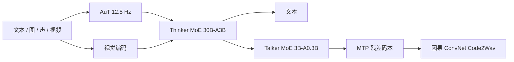

# Qwen3-Omni 技术报告

Thinker 写字、Talker 出声：两边都换成 MoE，音频前端从 Whisper 换成自训 AuT，冷启动首包理论延迟 234 ms。

<footer>—— Xu 等，Qwen3-Omni Technical Report，arXiv:2509.17765</footer>

Qwen3-Omni 是通义把文本、图像、音频、视频收进**同一套权重**的全模态报告。核心主张不是「又能看又能听」，而是：相对同尺寸 Qwen **单模态**模型，文本与视觉不退化，同时在 36 项音频 / 音画基准上开源 SOTA 32 项、总体 SOTA 22 项。架构沿用 Qwen2.5-Omni 的 Thinker–Talker，两边都升级为 MoE：Thinker **30B-A3B**，Talker **3B-A0.3B**。开源三份 Apache 2.0 检查点：Instruct、Thinking、以及从 Instruct 微调来的 Captioner。ASR 家族把它当语音理解基座，见 [Qwen3-ASR](/llm/qwen3-asr-paper)；本篇写 Omni 原文的五条升级、流式合成与模态互不伤害，不把 0.6B 转写 SKU 写进这一代。

## 问题

早期 omni 常见两种失败。一是「会听就不会写代码」：音频续训把语言挤掉。二是「会写就不会说」：语音生成用块扩散，首包要等一整块，对话不像对话。Qwen2.5-Omni 已经把 Thinker–Talker 与 TM-RoPE 摆上台面，但音频前端仍是 Whisper、Talker 仍吃 Thinker 的文本高维表示、合成侧单码本加块扩散。要同时服务 119 种文本交互、19 种语音理解、10 种语音生成，并把单实例音频理解拉到约 **40 分钟**，必须换编码器、换 MoE、把文本条件从 Talker 上解耦，才能让安全过滤、RAG、函数调用插在 Thinker 出字之后、Talker 出声之前。

社区还缺一个通用音频描述模型：ASR 只出字，音景、音乐、事件要另接专家。报告因此从 30B-A3B 微调出 Captioner，专门产低幻觉的任意音频描述。

### 五条相对 2.5-Omni 的升级

原文把差分收成五条：(1) Thinker 与 Talker 都改 MoE；(2) 音频编码器换成约 **650M** 的 AuT，约 **2000 万小时**监督音频从零训，token 率 12.5 Hz，动态窗注意力服务流式 prefill；(3) 多码本语音表示，容量够装音色、副语言与声学事件；(4) Talker 从单轨改为多轨：骨干每步出一个码本帧，MTP 模块补残差码本；(5) 块扩散换成轻量因果 ConvNet（Code2Wav），从第一帧就能流。冷启动无上文时，端到端首包理论延迟 **234 ms**（表里另列 547 ms 一档，读实验时不要只报较小的那个）。

Talker 不再消费 Thinker 的文本高维表示，只条件于音视频多模态特征。文本内容由离散 token 传递，与嵌入信息等价；音画协同的韵律 / 音色（例如口译）仍走多模态条件。解耦之后，Thinker 与 Talker 可以各用各的系统提示：一个管答什么，一个管怎么说。

## 方法

Thinker 把文本、音频、图像、无声视频编成表示并生成文本。文本用 Qwen 词表（报告写 151,643 个常规 token）。音频重采样到 16 kHz，25 ms 窗、10 ms hop 的 128 通道梅尔谱，经 AuT。AuT 是 AED：Conv2D 八倍下采样到 12.5 Hz；数据约 80% 中英伪标 ASR、10% 其他语种 ASR、10% 音频理解；动态窗 1–8 s，在实时缓存与离线长音频之间折中。视觉路径与 Qwen 的 VL 系列同源接口，本篇不展开切块。

### Talker 多码本与分块 prefill

Talker 在 Thinker 的高层多模态表示与对话史上自回归预测多码本。每步：骨干吃当前帧聚合特征，线性头预测第 0 层码本，MTP 出其余残差；Code2Wav 因果卷积把该帧立刻变成波形。分块 prefill：时间上切块，Thinker 完成当前块 prefill 后，表示立刻异步去 prefill Talker 的当前块，Thinker 继续下一块。MoE 提高并发；左上文-only 的多码本机制让第一枚 token 出现后就能合成第一包。

后训练分 Instruct 与 Thinking。Thinking 对任意模态显式推理。Captioner 在 Instruct 上针对详细、低幻觉音频描述微调。语音理解 19 语、语音生成 10 语、文本 119 语——三张表不要合成「119 语全能语音」。

ASR 产品线的 52 语种/方言是后训练扩出来的，不是 Omni 基座的 19 语听力表。用 Omni 当 [ASR 基座](/llm/qwen3-omni-speech-base) 时，覆盖以 ASR 报告为准。

## 机制

「不退化」依赖两件事：Thinker 仍是 Qwen3 级语言 MoE，音频与视觉以 token 形式进入同一残差流；训练配比不允许音频梯度长期压过文本。AuT 从零训而不是冻结 Whisper，是为了让 12.5 Hz 表示同时服务 ASR 与音频理解，而不是只有转写。动态窗与分块 prefill 把「40 分钟理解」和「234 ms 首包」拆开：理解可以看长窗，对话必须看短块。

Talker 解耦文本表示之后，外部模块可以改 Thinker 的字再送给合成——这是产品上的安全阀，也是延迟源：插入过滤会加在 234 ms 之外。多码本加 MTP 把一帧内的残差并行掉，避免逐层码本都走完整自回归。因果 ConvNet 替换块扩散，去掉「等一整块噪声解完才有波形」的等待。Captioner 存在，是因为通用 Thinker 的音频描述会偏短、偏幻觉；专用头把「详细且少编」写成单独目标。

### Thinker 出字与 Talker 出声的时间轴

端到端首包 = 音频块 prefill + Thinker 第一段文本 + Talker 第一帧码本 + Code2Wav。理论 234 ms 是冷启动、无额外安全栈的下界。多轮对话可以缓存 Thinker 历史，首包会好于冷启动，但报告用来打广告的是冷启动数字。Thinking 模式在出声前先写推理，延迟上是另一条产品线，不要和 234 ms 写在同一句。

表里 Audio Encoder 约 650M、Thinker 30B-A3B、Talker 3B-A0.3B。服务要把三套 MoE 专家并行配好；只量化 Thinker、漏掉 Talker，表现为「字对、声怪」，不是听力坏了。

## 边界与工程取舍

40 分钟是单实例理解上限，不是无限会议；更长要切段。语音生成只有 10 语，用户用第 11 种语言听写再要求「用同一种语言回答」会 silently 落到英语或中文音色。Talker 不读 Thinker 文本嵌入，口译场景的术语一致性要靠离散 token 与系统提示，不能假设声学条件自动抄词。Captioner 与 Instruct 是不同检查点。

234 ms 不是实测手机延迟，也不是含网络 RTT 的 API 延迟。块大小、窗长、MTP 深度都会改这个数字。音频理解 SOTA 表含闭源 Gemini-2.5-Pro、Seed-ASR、GPT-4o-Transcribe，引用必须带基准名。Omni 不宜直接当高并发 ASR：指令跟随与转写稳定性冲突，那是 ASR 报告做 SFT 收口的原因。

## 小结

- Qwen3-Omni 用 Thinker–Talker MoE 统一文本、图像、音频、视频；主张相对同尺寸单模态不退化，音频侧数字最强。
- 五条升级：双边 MoE、AuT 替换 Whisper、多码本、MTP 多轨、因果 ConvNet 流式合成；冷启动首包理论 234 ms。
- 开源 30B-A3B 的 Instruct / Thinking / Captioner，Apache 2.0。
- ASR 后训练在此基座上收口，推理图不是 30B 原盘。
- 出处：Xu 等，*Qwen3-Omni Technical Report*，arXiv:2509.17765。对照 Qwen2.5-Omni 与 Qwen3-ASR（arXiv:2601.21337）。
