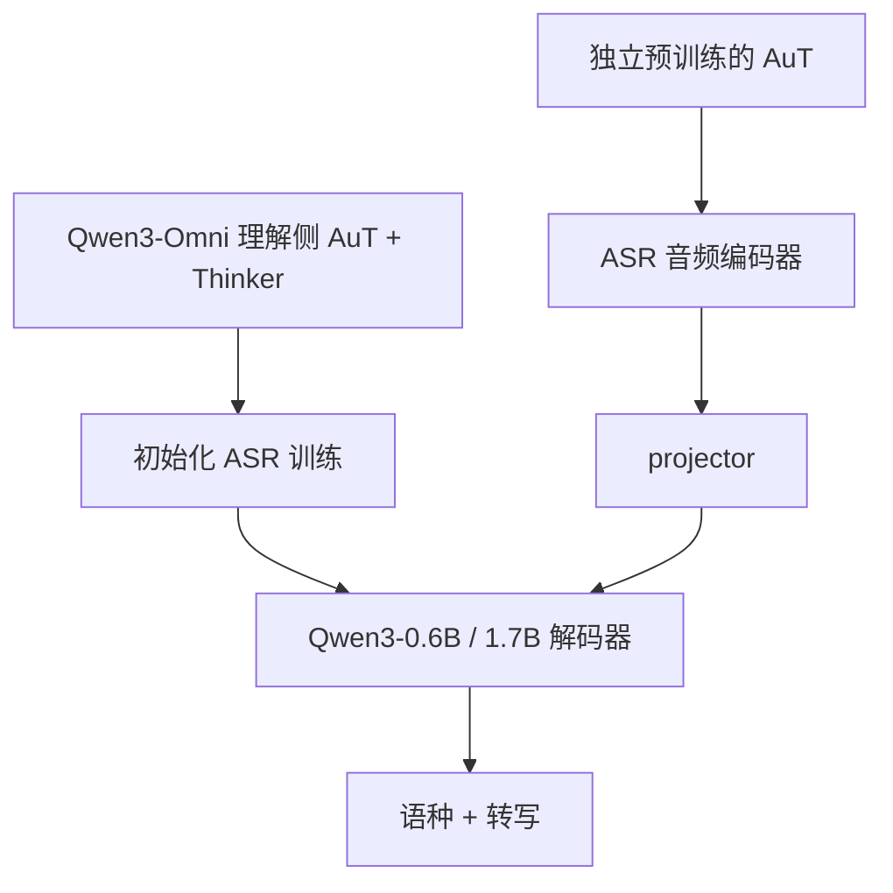

# Qwen3-Omni 作为语音理解基座

Qwen3-ASR 家族模型利用 Qwen3-Omni 作为基础模型，后者已被证明具有强音频理解能力。

<footer>—— Qwen Team，Qwen3-ASR Technical Report，arXiv:2601.21337</footer>

专用 ASR 可以从随机初始化的编码器–解码器训起。Qwen3-ASR 没有走这条路：它把语音理解的先验放在 Qwen3-Omni 里，再在其上做 ASR 后训练，接上转写格式与语种头。基座负责「听懂」——语种、内容、噪声、非语音、乃至音画场景；ASR 头负责「写成规定格式的字」。Qwen3-Omni 技术报告描述的是全模态 Thinker–Talker MoE，音频编码器从 Whisper 换成自训 AuT，支持最长约 40 分钟的音频理解。Qwen2.5-Omni 已引入 Thinker–Talker 与 TM-RoPE。本篇把 Omni 当作 ASR 的语音理解基座来讲，而不把 30B MoE 的全部生成能力复述成产品页。

## 问题

若 ASR 只在转写平行语料上训练，监督只有 $p(y_{\mathrm{asr}}\mid x)$，看不见「这是笑声」「这是中英夹杂」「这是歌」。Omni 基座先在更宽的任务上估计 $p(u\mid x)$，$u$ 可以是字幕、场景描述或对话回复；ASR 后训练再把 $u$ 的表示收口成转写。遇到这些情况，专用 AED 往往硬吐字或插入噪声词。通用音频理解模型在字幕、音景、语音指令上见过更宽的标签，隐状态对非朗读声学更稳，但解码器太自由，会把转写写成摘要。需要一种继承：理解来自 Omni，输出契约来自 ASR SFT。

另一个问题是模态互相伤害。早期多模态常「会听就不会写代码」。Qwen3-Omni 声称相对同尺寸 Qwen 单模态模型，文本与视觉不退化，同时在大量音频与音画基准上达到开源或总体 SOTA。只有基座本身没有用音频换掉语言，ASR 后训练才站得住；否则接上转写头时，语言模型已经残了。

### 基座与头的分工

基座：AuT 编码器 + Thinker LLM（Omni 预训练，含约 3T token 量级的多任务，见 ASR 报告对 Omni 阶段的转述）提供音频语义空间。头：projector 与 Qwen3 小解码器（0.6B / 1.7B）在 ASR 数据上做格式迁移。发布的 ASR 模型不是 30B-A3B 的 Thinker 原装，而是把理解能力蒸馏、迁移到可部署的稠密 Qwen3 上，并换用单独预训练的 AuT 规格（180M / 300M）。「建在其上」指训练继承与表示继承，不是把 30B 原盘当 ASR 服务。

Qwen3-Omni 的 Talker、多码本 codec、234 ms 首包延迟属于语音生成。ASR 基座用的是理解侧：AuT + Thinker 表征。不要把 Omni 的会说当成 ASR 的会写。

## 方法

Qwen3-Omni 用 Thinker–Talker：Thinker 做多模态理解与文本，Talker 做流式语音合成。相对 Qwen2.5-Omni，音频前端从 Whisper 换成约 650M 参数的 AuT，在约 2000 万小时监督音频上从零训练，token 率 12.5 Hz，动态窗口注意力服务流式 prefill。语音理解覆盖 19 种语言，文本 119 种；单实例音频理解可达约 40 分钟。这些数字描述基座的听力覆盖，不是 ASR 产品的 52 语种/方言（后者在 ASR 后训练中扩展到中文方言等）。

Qwen3-ASR 的训练叙述把 Omni 预训练列为第二阶段，与 AuT 预训练并列，然后才是 ASR SFT 与 RL。两个发布尺寸的 ASR 都「训练了 3T token 的 Omni 阶段」以获得多模态理解，再在不相交的较小多语数据上做转写格式 SFT。上下文偏置、非语音、流式增强数据也在 SFT 出现，说明基座的通用理解被收口，而不是被扔掉。

### 为什么不直接用 Omni 当 ASR

Omni 会聊天、会推理、会生成语音，延迟与参数对纯转写不划算，且指令跟随与转写稳定性冲突。ASR 报告写明 SFT 的目标是 ASR-only，减轻指令注入。小解码器加专用 AuT，才能在 0.6B 级别做到约 92 ms TTFT 与高并发。基座提供的是预训练权重与数据课程，推理图是瘦身之后的。这与 NLP 里「用大模型当基座、再训分类头」相同，只是头是整个小型 LLM 加音频口。

## 机制

Omni 预训练让音频表示与文本空间对齐：同一实体在语音和文字里靠近，专名才能从语言模型抄到转写里。仅 ASR 平行语料很难覆盖足够的实体字符串。方言与噪声上，理解任务（例如嘈杂场景字幕）提供的梯度比干净朗读更接近真实 ASR。Qwen3-Omni 在音频基准上相对闭源系统的比较，是在论证这块表示值得当基座，而不是论证 30B 应上线转写。

记 Omni 理解侧输出音频 token 序列 $H^{\mathrm{omni}}$，ASR 侧经 projector $P$ 得到

$$
H^{\mathrm{asr}}=P\bigl(\mathrm{AuT}(x)\bigr).
$$

训练继承要求 $H^{\mathrm{asr}}$ 落在与文本 LLM 已对齐的邻域内，而不是从随机投影开始。迁移时会发生能力裁剪。Omni 能做的音频问答、思维链，ASR 头不再暴露。评测 ASR 时不应要求它回答「这段话什么态度」；那是基座任务。反过来，Omni 的 ASR 分数与专用 Qwen3-ASR 也不应混表：解码器大小、AuT 规格、是否 RL、是否 52 方言，都不同。基座关系是训练图上的箭头，不是分数可传递性。

Qwen2.5-Omni（arXiv:2503.20215）已证明 Thinker–Talker 与块状音画编码可行，音频编码器仍偏 Whisper 系。Qwen3-Omni（arXiv:2509.17765）用 AuT 替换并加长音频窗口。Qwen3-ASR 继承的是后者这条理解线。

### 语言覆盖的不对称

Omni 语音输入 19 语、ASR 产品 30 语加 22 种中文方言。扩展来自 ASR 阶段数据，不是 Omni 纸面上的 19 自动变成 52。基座提供的是多语语音的一般表征与英语/汉语主干部，方言要靠伪标注与 SFT 补。把「Omni 会 19 语」写成「ASR 只有 19 语」或反过来，都是错的继承。

## 边界与工程取舍

用大 Omni 当在线 ASR 会把 MoE 路由、Talker 显存和安全策略一起拖进转写路径，成本错误。用未经 Omni 的随机 Qwen3 接 AuT，会缺少音–文对齐，专名与指令噪声会差一截。中间道路是报告所写：Omni 课程 + 小解码器。

基座升级与 ASR 发布不同步时，会出现「Omni 新版本听觉更好，ASR 仍是旧投影」的版本漂移。工程上应锁定三件套版本：Omni 预训练检查点、AuT 检查点、ASR SFT 数据。开放权重下，用户微调 ASR 若把学习率开太大，会洗掉基座的理解，退回普通小 AED。

「语音理解基座」不等于「语音识别冠军基座」。理解基准（音景、指令、音画）与 WER 相关但不相同。选基座要看迁移后的转写，而不是只看 Omni 论文表格。

## 小结

- Qwen3-ASR 的语音理解先验来自 Qwen3-Omni；ASR 头是格式化的小 Qwen3 解码器加 projector，不是 30B Thinker 原装上线。
- Omni 理解侧用自训 AuT 替换 Whisper，提供 12.5 Hz 表示与长音频窗口；Talker 生成侧不进入 ASR 推理。
- 后训练把通用理解收口为语种+转写，并扩展方言覆盖。
- 基座关系是训练继承，分数与语种表不可在 Omni 与 ASR 之间直接划等号。
- Qwen2.5-Omni 提供 Thinker–Talker 前史；Qwen3-Omni 提供可被 ASR 接住的听觉表示。
- 出处：Xu 等，Qwen3-Omni Technical Report，arXiv:2509.17765；Xu 等，Qwen2.5-Omni Technical Report，arXiv:2503.20215；Shi 等，Qwen3-ASR Technical Report，arXiv:2601.21337（2026 年 1 月）。
