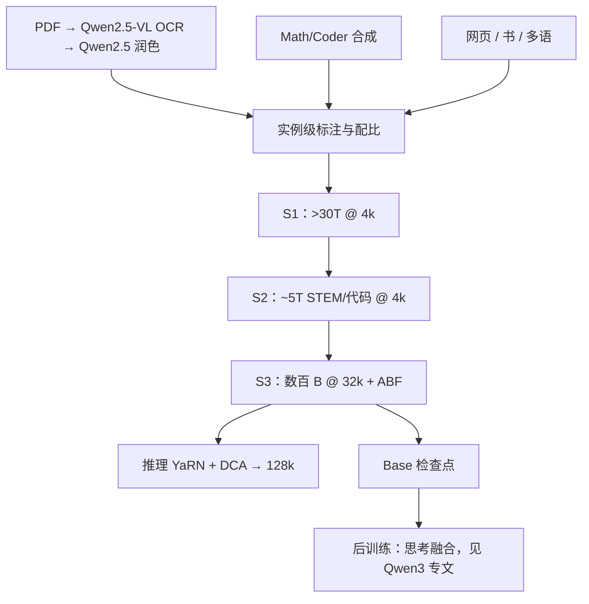

# Qwen3 技术报告

    
相对 Qwen2.5，Qwen3 把预训练 token 大约翻倍、语种扩大到约 119 种；稠密与 MoE 共用去掉 QKV bias、加上 QK-Norm 的注意力配方。

    <footer>—— Yang 等，Qwen3 Technical Report，arXiv:2505.09388</footer>

[Qwen3](/llm/qwen3) 专文写思考 / 非思考融合与 MoE 的 128 专家 top-8。本篇对着 **2505.09388** 写报告里那半边：**36T 怎么来的、三阶段预训练、实例级配比、架构表、基座分数如何对上 2.5 的更大稠密模型**。后训练四段与 `/think` 开关只在需要区分 Base / Instruct 时点到，细节不重复。2025 年 7 月的 2507 快照与 Qwen3-Next 不写进本报告的默认列。

## 问题

2.5 的开源主线是稠密 0.5B–72B、18T token、QKV bias 仍在。3 要同时做到：更小的稠密档打过 2.5 更大档、MoE 成为可下载一等公民、以及多语从约 29 种扩到 119 种。若只加 token 不加配比，18T→36T 会变成网页噪声翻倍。报告的问题是：**如何用标注过的 30T+ token 做实例级混合**，再用三阶段课程把世界知识、STEM 与 32k 窗口分开买，而不是从头就按 32k 训。

第二个问题是结构差分必须小到生态可迁移，又大到训练能稳。答案写在注意力：去 bias、加 QK-Norm；MoE 去共享专家、换全局 batch 负载损失。词表 151,669 的字节级 BPE 保持家族连续。

### 稠密表与 MoE 表要分开读

报告表 1（稠密）：0.6B / 1.7B 为 28 层、16/8 头、绑定嵌入、上下文 32k；4B 起 36 层、32/8 头，4B 仍绑嵌入且窗口 128k；8B 不再绑嵌入；14B 为 40 层 40/8；32B 为 64 层 64/8，窗口 128k。表 2（MoE）：30B-A3B 为 48 层、32/4 头、128/8 专家、128k；235B-A22B 为 94 层、64/4 头、同样 128/8 专家。A22B 指约 22B 激活，不是 22 个专家。小模型 14B 及以下与 30B-A3B 的思考能力大量来自强到弱蒸馏，见产品专文，不要用旗舰 AIME 宣传 0.6B。

预训练课程把窗口先做到 32,768；推理再靠 YaRN 与 Dual Chunk Attention 大约四倍，Instruct 常规到 128k。不要把 128k 写成「预训练就是 128k 满注意力」。

## 方法

数据：约 **36T** token，相对 2.5 的 18T 约两倍，语种约三倍。扩量两条公开管线：用 [Qwen2.5-VL](/llm/qwen25-vl) 从 PDF 类文档抽文本，再用 Qwen2.5 润色，得到万亿级高质量文本；用 Qwen2.5、[Math](/llm/qwen25-math)、[Coder](/llm/qwen25-coder) 合成教材、问答、代码片段。另加多语爬取。超过 30T token 被多维标注（教育价值、领域、安全等），在小代理模型上做消融，**按实例而不是按数据源**调混合——这是相对「按域名调配比」的方法差分。

### 三阶段：S1 通识、S2 推理、S3 长上下文

**S1（General）**：全体尺寸在序列长度 4,096 上吃 **超过 30T**，覆盖 119 种语言与方言，建立语言与世界知识。**S2（Reasoning）**：提高 STEM、代码、推理与合成数据比例，再训约 **5T**，仍为 4k 长度，并加快学习率衰减。**S3（Long Context）**：高质量长文本 **数千亿** token，序列 32,768；其中约 75% 落在 16k–32k，25% 在 4k–16k。RoPE 基数用 ABF 从 \(10^4\) 提到 \(10^6\)；推理期 [YaRN](/llm/yarn) 与 [DCA](/llm/dual-chunk-attention) 再把容量乘四。缩放律被用来分别给稠密与 MoE 调学习率日程与 batch，而不是只抄 2.5 的表。

基座评测是报告给的「配方是否值」的证据：Qwen3-32B-Base 对上 Gemma-3-27B、Qwen2.5-32B，甚至拿 2.5-72B 与 Llama-4-Scout 当强基线；叙事是 STEM/代码上 3 的较小 Base 打过 2.5 的较大 Base。235B-A22B-Base 再对 Qwen2.5-Plus-Base、Llama-4-Maverick、DeepSeek-V3 Base 与 2.5-72B-Base。MoE Base 用约 10% 激活对标 2.5 稠密，这是服务侧省 FLOP 的主句。边侧 8B/4B/1.7B/0.6B-Base 相对同尺寸 2.5、Llama-3、Gemma-3 继续在多数集上领先，且 8B/4B/1.7B 在过半基准上打过更大一档的 2.5。具体分数随表 3–8，引用应钉 Base 而非 Instruct，也不要把思考模式的 AIME 贴到 Base 检查点上。

36T 不是「36T 本高质量书」。报告自己把合成、OCR 网页、多语爬取并列。过滤与标注是质量故事，规模只是分子。

## 机制

实例级混合的机制是：每条样本带多维标签，代理模型上的消融决定「这条进 S1 还是下调」，避免整个 Common Crawl 域名被一刀切。代价是标注系统本身成为不可开源的核心资产。S2 提高 STEM 比例，等于在通识收敛后再买推理；学习率加速衰减防止把 S1 的知识冲掉。S3 不从头训 32k，是因为注意力二次成本：先 4k 买步数，再在已经成形的表示上长窗。

QK-Norm 钉住 \(Q,K\) 尺度，深层 94 层 MoE 与长 CoT 前缀上更不容易 softmax 饱和；去掉 QKV bias 使 2.5 权重无法热加载到 3。无共享专家迫使高频功能也走离散路由，全局 batch 负载损失用来对抗崩溃——机制取舍见 [Qwen3](/llm/qwen3) 与 [MoE 路由](/llm/moe-routing)。词表 151,669 相对 2.5 略增（控制符），常规 BPE 主体连续，减少「换代换 tokenizer」事故。

### Base 变强不等于聊天变强

报告用大量 Base 表证明预训练赢了。Instruct 的思考模式是另一套四阶段后训练。把 Base 的 MMLU 增量直接说成「Qwen3 聊天超过 2.5-72B」，会把 SFT/RL 的贡献算到 36T 头上。相反，小 Instruct 的 `/think` 来自蒸馏，也不能反过来说 36T 把 0.6B 训成了推理模型。

## 边界与工程取舍

36T 与 119 语种无法外部审计；PDF OCR 会把公式与表格噪声送进语言模型。S3 的 32k 加上 YaRN 的 128k 仍不是 1M——百万上下文是 2.5-1M 等专线。MoE 235B 的服务要专家并行，显存按总参数估，计算按激活估。报告中的对照含 Llama-4、DeepSeek-V3、闭源 o1 / Gemini 2.5，分数是 2025-05 快照。Instruct 表把思考档对 o1、R1、Grok-3-Beta（Think）、Gemini 2.5 Pro，非思考档对 GPT-4o、DeepSeek-V3、2.5-72B-Instruct 与 Llama-4-Maverick：那是后训练产物，用来证明融合后的两端都站得住，不能用来反推 S1 的 30T 配比。小模型若关掉思维槽，得到的是蒸馏过的直答，仍可能强于同尺寸 2.5，但旗舰思考分数不得下放到 0.6B 的发布说明。

不要把 Qwen3-Next 混合架构写进 2505 报告的默认骨架。思考预算插入的英文打断句是后训练产物，换语言未保证。tokenizer 151,669 与 2.5 接近但不相同，旧脚本写死 `vocab_size` 会在加载 3 时对不齐嵌入；控制符与 `/think` 槽位要以 3 的 `tokenizer_config` 为准。

出处：Yang 等，*Qwen3 Technical Report*，arXiv:2505.09388。产品开关与四段后训练见 [Qwen3](/llm/qwen3)；2.5 数据规模对照见 [Qwen2.5 技术报告](/llm/qwen25-report)。

## 小结

- 预训练约 36T、119 种语言；PDF-VL 抽取 + 合成 STEM/代码；实例级标注配比。
- 三阶段：>30T@4k → ~5T 推理@4k → 32k 长窗 + ABF；推理 YaRN/DCA 到约 128k。
- 稠密 0.6B–32B、MoE 30B-A3B / 235B-A22B；注意力无 QKV bias、有 QK-Norm；MoE 128/8、无共享专家。
- Base 表显示小尺寸对上 2.5 更大档；思考融合不在本篇展开。
- 出处：arXiv:2505.09388。
