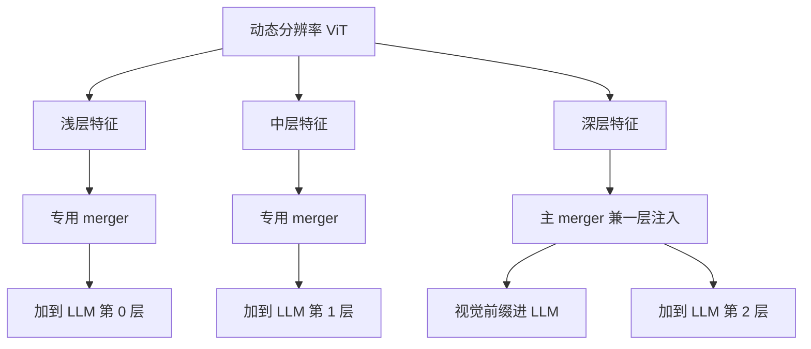

# DeepStack：多层 ViT 特征注入 LLM

视觉信息不必只从编码器最后一层灌进语言模型；把若干中间层特征残差写进 Decoder 浅层，细粒度与语义可以同时在场。

<footer>—— Meng 等，DeepStack，2024；Qwen3-VL 技术报告</footer>

连接器的默认契约是：ViT 末层 → 投影 → 当作视觉前缀拼进 LLM。这一路只交出最抽象的视觉词，笔画、边框、小字等浅层纹理已经在编码器深处被压掉。Qwen3-VL 引入 DeepStack：从视觉编码器**三个不同深度**取出特征，各自经过专用 merger，**加到语言模型前三层的隐状态上**。它不把多层特征在序列维上再拼一截前缀，因此上下文长度不增加。原始 DeepStack（Meng 等，2024）堆的是多尺度输入的 token；Qwen3-VL 把同一思想改成「多层 ViT 特征」，不要写成多裁剪拼接。

## 问题

单层接口有两种损失。浅层 ViT 特征空间分辨率高、语义弱，直接当 LLM token 会对不齐语言空间；深层特征语义强，但 OCR、定位、图表刻度需要的边缘在前向里已经被平均。LLaVA 式投影器只看见末层。若把多层特征在序列上拼接，视觉 token 数成倍增加，与 [2×2 merge](/llm/qwen-vl-patch-merge) 节省下来的长度互相抵消。

需要一种注入：多层视觉证据进入 Decoder 的**计算**，而不是进入 Decoder 的**上下文长度**。残差加法满足这一约束：在选定 LLM 层上，把已经映到隐维的视觉向量加到对应位置的隐状态，序列长度仍是「文本 + 一层视觉前缀」。问题变成取哪几层 ViT、注入 LLM 的哪几层、用几个 merger。

Qwen3-VL 写明：三个视觉层级、三个专用 vision–language merger，加到 LLM **前三层**隐状态。不是加到每一层，也不是只加到最后一层。

### 与原始 DeepStack 的差别要写在定义里

Meng 等的 DeepStack 把不同分辨率视觉输入编成的 token 在深度方向堆叠进语言模型。Qwen3-VL 技术报告明确说：他们不走多尺度输入堆叠，而从**同一个**动态分辨率 ViT 的中间层取特征。输入仍是一幅（或一段）原生分辨率图，分层发生在编码器深度上。复现时若改成多裁剪再堆 token，长度与计算图都变了，不能再标注为 Qwen3-VL 的 DeepStack。

## 方法

### 三层取出、三路投影、残差写入

记视觉编码器第 $k$ 层的 patch 特征为 $v^{(k)}$（在 $2\times 2$ 合并与维数对齐之后，与主视觉前缀同形）。Qwen3-VL 选取三个不同的 $k$，各接一个 merger $\mathrm{Merger}_\ell$，得到与 LLM 隐维相同的 $\tilde{v}^{(\ell)}$。主路径仍把末层特征作为序列前缀送入第 $0$ 层；DeepStack 路径则对前三层隐状态做

$$
h^{(\ell)} \leftarrow h^{(\ell)} + \tilde{v}^{(\ell)}, \qquad \ell \in \{0,1,2\}
$$

（层号按实现从零计；报告称 first three LLM layers）。加法发生在视觉 token 对应的位置上，文本位置不加视觉残差，避免把图像特征写进纯文本槽。

主 merger 与 DeepStack merger 参数不共享：浅层 ViT 与深层 ViT 的统计不同，需要各自的 LN-MLP。训练配方里先有只训 merger 的对齐阶段，再解冻全模型；DeepStack 的额外 merger 属于同一连接器家族，应与主 merger 一起进入该阶段，否则浅层注入会长期噪声。

上图只表达「多层 → 多层」的残差拓扑；具体哪一个 ViT 层号对应哪一个 LLM 层，以实现与配置为准，不要把层号编成论文没有公开的常数。

「不增加上下文长度」指序列维不变。参数与算力仍增加：多两到三个 merger，以及前几层多一次与视觉长度成正比的加法。这不是免费的多层特征。

## 机制

### 深度多尺度，而不是输入金字塔

Decoder 浅层仍在形成跨模态对齐。把高分辨率纹理加在浅层，后续自注意力可以在语言查询与细视觉残差之间建立边，而不要求末层前缀单独重建这些细节。深层语义则继续走标准前缀，提供物体与场景级的可寻址键。多层注入因此是**深度方向的多尺度**，与输入金字塔多尺度不同：后者复制空间网格，前者复制同一网格上的不同抽象级。

残差而不是拼接，保持 softmax 的键集合大小。拼接会让同一空间位置出现多个 token，位置编码与 [MRoPE](/llm/qwen3-vl-interleaved-mrope) 都要为「同一格的多层拷贝」另编 ID；加法把多层折进同一位置的向量和，位置 ID 仍与主前缀一致。这是它能与现有交错位置方案共存的原因。

Qwen3-VL 技术报告用内部 15B-A2B 量级实验对照：加上 DeepStack 后一组视觉基准均值上升，OCRBench、InfoVQA、ChartQA、DocVQA 等细粒度任务受益更明显。机制解释与此一致——需要读字、读刻度、读框的任务更依赖浅层。不要把这一消融外推成「任意层数、任意注入深度都单调变好」。

## 边界与工程取舍

注入只在前三层，深层 Decoder 不再直接看见浅层 ViT。若任务需要在很深的推理链里反复查阅笔画，只能靠隐状态里残留的细特征，或靠前缀里的末层 token。把 DeepStack 理解成「全程高分辨率视觉缓存」会高估它。

实现必须在视觉 token 与文本 token 之间做掩码式加法。整段隐状态广播相加会污染文本，出现图文串扰。生成阶段逐步解码时，DeepStack 项只作用于已编码的视觉前缀位置，新生成的文本位置不应再加 $v$。KV 缓存存的是加过残差之后的层输出，训练与推理必须同一顺序：先加再算该层注意力，或先算再加——须与训练图锁定，不能一种训练、另一种推理。

原始论文的多尺度堆叠与 Qwen 的多层取出不要混名。评测对比 LLaVA 投影器时，应写清：LLaVA 是末层线性（或 MLP）对齐；Qwen3-VL 是末层前缀加浅层残差。差的是注入拓扑，不只是 merger 宽一点。消融里细粒度基准更受益，并不等于可以无上限地加注入层。注入过深会干扰已经稳定的语言残差，过浅则细特征进不了跨模态对齐。前三层是报告给出的配额，不是 sweeper 结果的公开表。

## 小结

- DeepStack 在 Qwen3-VL 里把三个 ViT 深度的特征经专用 merger 残差加到 LLM 前三层，细粒度与语义同时进入计算图。
- 序列长度不因多层而倍增；代价是额外 merger 与浅层加法。
- 与 Meng 等 2024 的原版不同：不是多尺度输入堆 token，而是单流 ViT 的中间层。
- 主场是 OCR、文档与定位一类需要浅层边缘的任务；它不是无限视觉记忆。
- 出处：Meng 等，DeepStack，2024；Qwen3-VL 技术报告；对照 LLaVA 投影器仅用末层特征。
