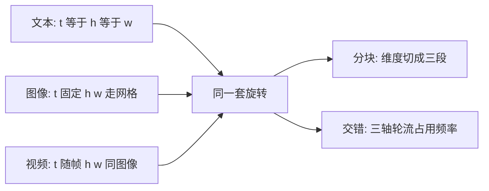

# MRoPE / Interleaved MRoPE 时空位置

把旋转频率按时间、高、宽三条轴来编；再把三条轴交错进高低频，视频与图像就可以共用同一套位置几何。

<footer>—— Wang 等，Qwen2-VL，2024；Qwen3-VL 技术报告</footer>

语言模型默认的 [RoPE](/llm/rope) 只有一条位置轴：token 下标。图像有高与宽，视频再加时间。Qwen2-VL 把旋转嵌入拆成时间、高度、宽度三个分量，称为 Multimodal RoPE（MRoPE / M-RoPE）：文本上三轴共用同一套 ID，退化为普通 1D-RoPE；图像上时间 ID 固定、高宽随网格变；视频上时间 ID 随帧递增。Qwen2.5-VL 曾把时间轴对齐到绝对时刻。Qwen3-VL 进一步指出：若把隐维切成三段分别专给 $t,h,w$，频谱会失衡、长视频变差，于是改为 **Interleaved MRoPE**——三条轴的频率交错分布在整个维度上。图与视频共用这一套交错几何，本篇写清从分块到交错改了什么。

## 问题

标准 RoPE 对位置 $m$ 施加 $R_m$，内积只含 $n-m$。多模态前缀里，一个视觉 token 不能只用「它是第几个标记」：同一行相邻两格应当比「上一行行末与下一行行首」更近；相邻两帧同位置应当在时间轴上近、在空间轴上重合。一维下标会把光栅顺序误当成空间邻近。

Qwen2-VL 的回答是给每个视觉 token 三个位置 ID $(t,h,w)$，并把旋转维度划成三组。问题随即变成频谱分配：RoPE 的低频维度负责长程、高频维度负责精细位移。若整段低频都给了高度、时间只分到高频（或反过来），长视频的时间距离会落在不擅长外推的频段上。Qwen3-VL 技术报告写明：分块式 MRoPE 在长视频理解上观察到频谱偏置。需要一种分配，使 $t$、$h$、$w$ 都能同时用到低频与高频，而图像（时间轴退化）与视频（三轴全开）仍是同一套公式。

文本 token 的 $(t,h,w)$ 取相同值，MRoPE 与 1D-RoPE 等价。不要给纯文本另训一套位置，也不要在图文交错时把文本改成二维 ID。

### 时间轴曾经绑在「第几帧」上

Qwen2-VL 的时间 ID 随输入帧序号增加，同一段视频抽 $8$ 帧还是 $32$ 帧，相邻 ID 的间隔含义不同，模型难以学会绝对节奏。Qwen2.5-VL 把时间分量对齐到绝对时间，用 ID 间隔表达秒级间隔。Qwen3-VL 认为这一做法在长视频上会让时间 ID 又大又稀疏，改为在帧组前插入文本时间戳；**位置几何**则交给 Interleaved MRoPE 的 $t$ 轴，不再靠绝对时间把 ID 拉得很开。本篇不展开时间戳字符串，只强调：交错的是 RoPE 频率布局，不是把时钟写进文本的那条旁路。

## 方法

### 分块 MRoPE：三轴切分维度

把注意力头的旋转维 $d_R$ 分成三段，分别用 $t$、$h$、$w$ 作为 [RoPE](/llm/rope) 的位置自变量。图像：$t$ 对所有视觉 token 取同一常数（常与该图像在序列中的起点对齐），$h,w$ 取合并后网格上的行、列。视频：每帧（或每个时间 patch）增大 $t$，帧内 $h,w$ 与单图相同。多图或多段模态拼接时，后一段的位置编号从先前列的最大值继续累加，避免两幅图的 $(h,w)$ 撞车。

对查询、键，形式上仍是分平面旋转，只是第 $i$ 个平面的角度是 $m^{(a_i)}\theta_i$，其中 $a_i\in\{t,h,w\}$ 由该平面所属轴决定。分块布局下，$a_i$ 在维度上成三段连续区间。

### Interleaved MRoPE：轴在频率上轮转

Qwen3-VL 把 $t,h,w$ **交错**进各旋转平面，使每个轴都均匀出现在低频带与高频带（报告引用 Huang 等 2025 的交错设计）。直观排列从「ttt…hhh…www…」变成「thwthw…」或等价的均匀交织。于是时间距离既能被低频平面慢慢旋转（利于长程），也能被高频平面精细分辨（利于近邻帧）；高、宽同理。图像把 $t$ 设为常数时，属于 $t$ 的那些平面不随空间位置转，空间几何仍由 $h,w$ 平面承担——与视频共用权重，只是时间通道关掉变化。

$$
(R_{t,h,w}q)^{\top}(R_{t',h',w'}k)
$$

仍由各平面相对位移决定；交错改变的是「哪一个 $\theta_i$ 乘在哪一条轴上」，不改变 RoPE 的相对性。

交错是频率分配，不是把一个 token 的位置改成三个下标的函数值再相加。实现上仍是按平面选一个标量位置去乘 $\theta_i$，只是平面到轴的映射从分段改成交织。

## 机制

RoPE 的相对内积对「未见过的大位移」敏感的是频谱：高频平面在大位移上已经转乱，只剩低频还在编码距离。长视频的帧间 $t$ 差可以很大；若 $t$ 只分到高频段，时间轴等于几乎没有可用的长程几何。交错强制每个轴都有慢旋转平面，长程时间与长程空间不再互相抢低频配额。

图像与视频共用，靠的是退化规则而不是两套权重：单图把时间差置零，交错布局里属于 $t$ 的平面对所有该图 token 施加同一旋转，相当于公共相位，不破坏 $h,w$ 的相对结构。训练时图、视频、文本可以混在同一批次，位置模块不必切换。这比「图像用 2D-RoPE、视频另接时间编码头」更省一套接口，也避免模态交界处位置定义不一致。

Qwen2.5-VL 的绝对时间对齐，是在分块 MRoPE 上改变 $t$ 的**取值**（与秒挂钩）；Interleaved MRoPE 改变的是 $t$ 乘在哪些**频率**上。二者层不同。Qwen3-VL 用文本时间戳承接「现在是第几秒」，用交错 MRoPE 承接「token 在三维网格上的相对几何」。

ViT 内部另有 2D-RoPE，编码的是尚未合并的 patch 网格。LLM 侧 MRoPE 编码的是合并后的视觉 token 以及文本。两套旋转不要共用同一套 $(h,w)$ 计数，除非实现明确对齐了 merge 前后的坐标。

## 边界与工程取舍

交错不能取消长度外推问题：频率底座、YaRN 一类插值仍可能需要。Qwen3-VL 公开材料提到超长上下文时 MRoPE 的 section 划分与较小的 YaRN factor，因为交错后位置 ID 增长方式与纯 1D 不同。复现时不要把纯文本 YaRN 的默认因子直接套到视觉长视频上。

分块 MRoPE 并非「错了所以必须立刻作废」：Qwen2-VL 已用它提升视频基准相对 1D-RoPE 的表现。交错是针对分块频谱偏置的修正，主场是长时序。短图、单帧任务上两者差距会小得多，不要用 OCRBench 一类静态任务去证明交错「全面替代」分块。

实现边界：必须按头维的配对平面交织，量化与 KV 缓存要缓存旋转前还是旋转后的键，与普通 RoPE 相同；多轴只是多了一张「平面 → 轴」查找表。若错误地把 $t,h,w$ 加成一个标量再送进 1D-RoPE，三维相对性全部丢失。另一边界是多图：第二张图的 $t$ 或全局偏移必须与第一张断开空间网格，否则两张图的左上角会共享 $(h,w)$，模型会以为它们在空间上重合。

## 小结

- MRoPE 把 RoPE 拆成时间、高、宽三个位置 ID：文本三轴相同，图像 $t$ 固定、视频 $t$ 随帧，图与视频共用空间轴。
- 分块布局把维度连续切给三轴，低频配额不均，长视频易伤；Interleaved MRoPE 让三轴轮流占用高低频。
- 交错改频率分配，不改相对旋转的代数；Qwen3-VL 另用文本时间戳表达绝对时刻，与 MRoPE 分工。
- 图像是时间轴退化后的同一套几何，不必为静图再训 2D 专用位置模块。
- 出处：Wang 等，*Qwen2-VL*，2024（MRoPE 定义）；Qwen2.5-VL 技术报告（绝对时间对齐的 $t$）；Qwen3-VL 技术报告（Interleaved MRoPE）；RoPE 见 Su 等。
