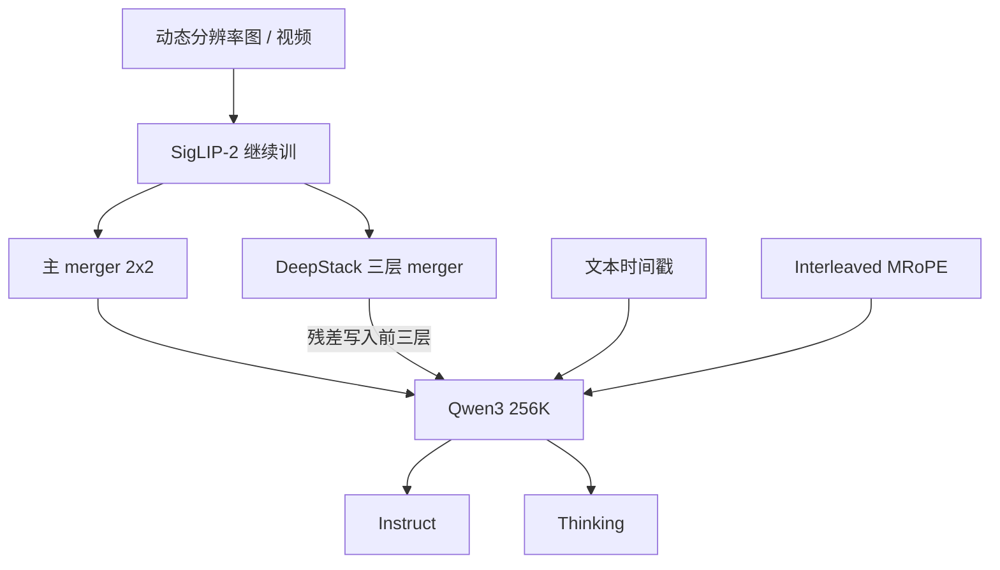

# Qwen3-VL 技术报告

交错 MRoPE 把时空频率摊匀；DeepStack 把多层 ViT 残差写进 Decoder 浅层；视频时间从位置编码改成显式文本时间戳。

<footer>—— Bai 等，Qwen3-VL Technical Report，arXiv:2511.21631</footer>

Qwen3-VL 是通义视觉–语言系列截至该报告的最强一代：稠密 **2B / 4B / 8B / 32B**，MoE **30B-A3B** 与 **235B-A22B**，原生交错上下文到 **256K**。每档再分 Instruct（非思考）与 Thinking。报告自称三条支柱：纯文本不弱于同尺寸 Qwen3 文本骨干、256K 图文视频长上下文、单图/多图/视频上的多模态推理。文档 OCR 已有专文 [Qwen3-VL 与文档 OCR](/llm/qwen3-vl)；本篇写报告的架构差分、预训练四段与后训练分叉，叶子里的 [patch merge](/llm/qwen-vl-patch-merge)、[DeepStack](/llm/qwen3-vl-deepstack)、[Interleaved MRoPE](/llm/qwen3-vl-interleaved-mrope) 只引用不重讲。

## 问题

2.5-VL 已经能吃原生分辨率并按绝对时间编视频，但三条限制仍在。其一，MRoPE 把隐维切成时间 / 高 / 宽三段，频谱失衡，长视频吃亏。其二，视觉只从 ViT 末层进 LLM，浅层纹理在连接器之前被压掉。其三，用位置 ID 对齐绝对时间，模型仍不能直接读「3.0 秒」这种人类时间码。语言侧，多模态续训常常伤纯文本；产品还要在「马上答」和「先想再答」之间分叉，不能用同一套后训练应付 OCR 抄字和 MathVision。

分辨率与窗口必须一起解。动态分辨率提高采样密度；256K 窗口使多页图与长视频能放进同一前缀。没有长数据，窗口只是空 vis；没有高分辨率，长窗口里全是不可读的糊 token。问题是：在换上 Qwen3 与 SigLIP-2 的同时，用三条架构补丁加一套分阶段课程，把文本、长上下文和视觉推理同时抬上去。

### 视觉骨干换成继续训的 SigLIP-2

3-VL 视觉侧改用 [SigLIP-2](/llm/qwen3-vl-siglip2) 并在动态分辨率上继续训，与 2.5-VL 从零训 ViT 不同。默认 SigLIP2-SO-400M；2B/4B 小档用 SigLIP2-Large（约 300M）。对比先验偏自然图文对，必须用文字密集样本把骨干从「物体名词」拧到「字形」。位置上对动态分辨率做 2D-RoPE，并按输入尺寸插值绝对位置嵌入（报告引用 CoMP）。Merger 仍是 2×2 MLP，DeepStack 另有专用 merger。

Instruct 与 Thinking 在 OCRBench 一类识别基准上可以很接近，思维链主要帮需要推理的图表题（如 CharXiv reasoning）。认字任务不要默认开思考模式加延迟。旗舰表上 235B-A22B-Instruct 在若干 OCR 解析基准甚至略高于 Thinking 变体。

## 方法

架构三件套：继续训的动态分辨率 SigLIP-2、MLP merger（含 DeepStack 支路）、Qwen3 LLM。位置编码改为 **Interleaved MRoPE**：把 $t,h,w$ 均匀交错进低频与高频，而不是切成三段专属频带。DeepStack 从同一个 ViT 的三个中间深度取特征，经专用 merger **残差加到 LLM 前三层**，不增加序列长度——与 Meng 等 2024 年「多尺度输入堆叠」的原版 DeepStack 不同。视频时间从 T-RoPE / 绝对时间位置 ID 改为每个时间 patch 前缀显式文本，例如 `<3.0 seconds>`，训练里秒与 HMS 两种写法都出现。

文本与多模态目标用**平方根重加权**，抬多模态而不把纯文本挤掉。预训练四段：先增强视觉编码器；S0 只训 merger（含 OCR 图文，8K）；再全参约 1T；然后扩窗到 32K、最后 256K。后训练显式分成 non-thinking 与 thinking 两套，并加了相对前代更多的后训练算力。

### 视频时间戳、长文档与智能体数据

长视频用由短到长的字幕合成，得到带时间戳交错的故事级描述；另做物体 / 动作 / 人物级的时空 grounding。文档侧约 3000 万内部 OCR 粗到细伪标、多语再扩 29 种、HTML/Markdown 双解析、多页合成与跨页 VQA——细节见 OCR 专文，报告把它们写成预训练主数据而不是插件头。空间上加强 3D 物体定位（Omni3D 等）；多图做指代、对应与多跳。智能体与 GUI 轨迹继续作为一等任务，但动作空间仍是训练时的函数集。

8B 档在视频理解上被报告写成可与大得多的 Qwen2.5-VL-72B 竞争，归因于交错 MRoPE、文本时间戳和更密的时间字幕，而不是「8B 突然等于 72B」。引用时必须带任务名，不能写成通用智能跃迁。

## 机制

交错 MRoPE 的机制是频谱：长程时间差需要低频旋转，精细高宽差需要高频；切块分配会让某一轴永远分不到合适频段。交错之后，图像（时间轴退化）与视频（三轴全开）仍是同一套公式。文本时间戳把「何时」从几何变成可读 token，模型可以直接把用户说的「第三秒」和前缀里的 `<3.0 seconds>` 对齐，代价是上下文多几个时间词——报告认为这比再学一套位置相位更稳。

DeepStack 让浅层边缘与深层语义同时进入 Decoder 的**计算**，而不是进入 Decoder 的**长度**。平方根重加权是批次层面的损失配平：多模态样本往往更短、梯度更冲，直接按样本数平均会淹没文本；开方把优势压回去，这是「纯文本不退化」主张的训练侧条件，不是架构魔法。Thinking 变体把 CoT 写进 $y$，对「这张表是否与后文结论一致」有用，对「把这行字抄下来」往往无增益。

### 稠密档与 MoE 档不是同一张推理图

2B–32B 是稠密 Transformer；30B-A3B 与 235B-A22B 要专家并行。报告强调在可比 token 预算与延迟约束下，稠密与 MoE 都优于前代，但服务栈不能共用：MoE 需要 expert parallelism，不能把 235B 当成「很大的 32B」。Instruct/Thinking 是后训练分叉，不是推理开关随手一拨；权重是两份检查点。

评测至少拆四张表：纯文本、OCR/文档、视觉推理（MMMU / MathVista / MathVision）、视频与多图。综合分会把「会想数学、不会抄发票」的 Thinking 档和「会抄字、不会证几何」的 Instruct 档搅在一起。

## 边界与工程取舍

256K 含视觉 token，页数 × 每页 merge 后的 patch 会先打满窗口。超长 PDF 仍要切分。扫描件加密、极细字、极端旋转，要靠旋转与分辨率策略，不是 235B 自动解决。原生 PDF 字节流是 [Qwen3.5-OCR](/llm/qwen35-ocr) 的产品能力，不要写进 3-VL 基座。开源权重与云上 `qwen-vl-ocr-*` 快照的任务覆盖并不相同。

文本时间戳增加前缀长度；极长视频若每秒都插时间词，预算会被时间码吃掉，需要抽帧策略。DeepStack 多三套 merger，量化时不要只量化主路径。3D 定位的 mAP@0.15 与 2D 框不是同一合同。幻觉字段在 KIE 上仍然存在：过密过糊会编造笔画。

## 小结

- Qwen3-VL 用 SigLIP-2 + Qwen3、原生 256K 交错上下文，稠密 2B–32B 与 MoE 30B-A3B / 235B-A22B，各有 Instruct / Thinking。
- 架构三条：Interleaved MRoPE、DeepStack 多层残差、显式文本时间戳；训练上平方根重加权与四段预训练。
- 文档 OCR 是主数据之一，细节见已有专文；本篇管报告总图与分叉。
- 出处：Bai 等，*Qwen3-VL Technical Report*，arXiv:2511.21631。对照 Qwen2.5-VL 技术报告与 Meng 等 DeepStack（2024）。
