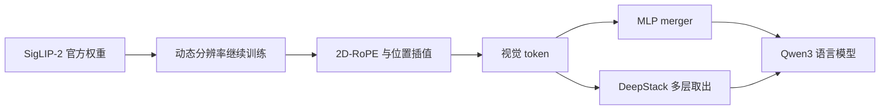

# SigLIP-2 视觉骨干

视觉编码器先在对比学习里学会图文对齐；Qwen3-VL 选用 SigLIP-2，再在动态分辨率上继续训，而不是从零搭一个与语言无关的 ViT。

<footer>—— Zhai 等，SigLIP，2023；Tschannen 等，SigLIP-2，2025；Qwen3-VL 技术报告</footer>

多模态模型的视觉侧几乎总是继承一个已经在图文对上预训练过的编码器。CLIP 用 softmax 对比损失；SigLIP（Zhai 等，2023）改成 sigmoid 损失，配对分数独立过 $\sigma$，不必在整批上做 Softmax 归一化。SigLIP-2（Tschannen 等，2025）在同一家族上加强数据、目标与尺度。Qwen3-VL 技术报告写明：视觉编码器采用 SigLIP-2 架构，从官方预训练权重初始化，并在动态分辨率下继续训练；默认 SigLIP2-SO-400M，较小语言模型（2B 与 4B）用 SigLIP2-Large（约 300M）。这与 Qwen2-VL 用 DFN ViT、Qwen2.5-VL 从零训 ViT 的路径不同，不要写成「Qwen 系列一直是同一个骨干」。

## 问题

随机初始化的 ViT 看图像，早期没有与语言共享的概念轴，对齐阶段要把视觉空间整个拧到 LLM 能读的方向，贵且不稳。对比学习骨干的补丁已经落在「能和文字匹配」的空间里，连接器只须做几何对准与分辨率适配。

选用哪一种对比骨干仍有约束。CLIP 式 InfoNCE 在大批次上用 Softmax，配对 $i$ 的正样本要压过批内所有负样本，实现与批次形状绑得紧。文档、OCR、定位还要求编码器接受可变分辨率，而许多对比模型在固定边长（如 $224$ 或 $384$）上预训练。问题是：找一个对比学习家族，既能提供强的图文先验，又能在 Qwen 的动态网格、2D-RoPE 与 [patch merge](/llm/qwen-vl-patch-merge) 下继续训而不崩。

Qwen3-VL 对 SigLIP-2 做的是持续训练，不是冻结当特征提取器。动态分辨率、2D-RoPE 以及对绝对位置嵌入的插值（报告称循 CoMP 的做法）都写在继续训练里。

### 与「从零训 ViT」的分工

Qwen2.5-VL 曾用 DataComp 等数据从零训视觉 Transformer，并配窗口注意力与 SwiGLU/RMSNorm，使视觉栈更像 LLM。Qwen3-VL 改回强对比初始化，把窗口化等细节交给该骨干在动态分辨率下的适配，而不是再讲一遍从零训的 32 层 $1280$ 维配置。写骨干时要以版本为准：2.5 的层数表不能贴到 3 的 SigLIP-2 上。

## 方法

### Sigmoid 对比而不是批内 Softmax

SigLIP 对图文对 $(x_i,y_j)$ 打分 $x_i^\top y_j/\tau + b$，损失对每个二元对独立：

$$
\mathcal{L}=-\frac{1}{|\mathcal{B}|}\sum_{i,j}\log\sigma\big(z_{ij}(x_i^{\top}y_j/\tau+b)\big),
$$

其中匹配对 $z_{ij}=+1$，否则 $-1$。没有「对第 $i$ 行在全部 $j$ 上 Softmax」，负样本以逐对 logistic 的形式出现。这使训练对批次大小更不敏感，也便于在异构分辨率或分布式下组织视觉批次。SigLIP-2 保持这一损失家族，并在更强的数据与辅助目标上训练出 SO-400M 等变体。

Qwen3-VL 取官方检查点后，在可变 $H\times W$ 上继续前向。为适配非固定网格：加上 2D-RoPE，并对原预训练里的绝对位置嵌入按输入尺寸插值。小模型用较小的 SigLIP2-Large，避免 400M 级编码器压过 2B/4B 语言模型。主路径仍是「编码器 → MLP merger → LLM」，[DeepStack](/llm/qwen3-vl-deepstack) 的多层取出也发生在这同一个 SigLIP-2 深度栈上。继续训练必须把文档、场景文字与定位数据混进去，否则对比先验会停在自然照片的物体名词上，OCR 只能靠语言模型去「猜字」。

对比预训练的图文匹配空间，不等于已经会 OCR。继续训练必须混入文字密集的文档与场景文字，否则骨干仍偏自然照片。Qwen3-VL 的数据章节把 OCR 与文档解析单独加厚，正是补这一缺口。

## 机制

### 匹配空间是起点，不是 OCR 终点

对比学习给每个 patch 一个「能被文字查询到」的先验：物体、场景、颜色词在嵌入里已经可分。Sigmoid 损失不强迫批内互斥，同一图里多个可对齐概念不会被 Softmax 挤成单峰，这对后续要同时读「标题 + 表头 + 脚注」的文档任务更温和。继续训练把位置从固定格改成动态格，2D-RoPE 提供相对几何，插值绝对 PE 保留预训练学到的绝对格子偏好作为起点，两者叠加而不是二选一。

规模配对是机制的一部分。编码器过大、LLM 过小时，梯度会把语言侧当成弱解码器，文本能力被视觉继续训带偏；报告因此在 2B/4B 上换 300M 级骨干。这与「永远用最强视觉编码器」的直觉相反：多模态是两侧容量的匹配，不是视觉侧单方面加大。

Qwen2-VL 的 DFN ViT 同样来自对比/数据筛选传统，只是检查点与损失细节不同。家族迁移（DFN → 从零 ViT → SigLIP-2）说明骨干是可替换模块，真正跨版本稳定的是动态分辨率、merger 与语言模型侧的位置方案，而不是某一份 ViT 权重。SO-400M 与 Large-300M 的差别是容量配对，不是「小模型用残缺骨干」。两套都从官方 SigLIP-2 初始化，只是宽度与 LLM 侧更匹配。换错检查点会在 merger 输入维上直接对不齐。

## 边界与工程取舍

SigLIP-2 的预训练分布仍偏网页图文对，化学结构式、乐谱、极端倾斜证件不在对比数据的中心。这些能力更多来自后续 OCR 合成与伪标注，不能假设换骨干就自动会解析 SMILES 或五线谱。冻结 SigLIP-2 只训 merger，对齐快但文档任务会顶在视觉表示的天花板上；Qwen3-VL 在对齐阶段之后解冻编码器，是承认天花板要被继续训抬高。

分辨率插值在极端长宽比上会扭曲预训练位置。动态分辨率与 [窗口注意力](/llm/qwen-vl-window-full-attn) 若在新骨干上的窗口大小、层号与 2.5 不同，必须读该版本配置，不能默认 $112$ 与 $\{7,15,23,31\}$。另一边界：对比损失里的温度 $\tau$ 与偏置 $b$ 属于预训练超参，继续训语言模型时通常不再走图文对比头；把 SigLIP 的 text tower 留在推理路径里是错误架构——Qwen3-VL 推理只用视觉塔 + LLM，文本塔已完成它作为预训练教师的任务。

## 小结

- SigLIP 用逐对 sigmoid 对比损失替代 CLIP 式批内 Softmax；SigLIP-2 是该家族的后续骨干。
- Qwen3-VL 以 SigLIP-2 初始化视觉编码器，默认 SO-400M，2B/4B 用 Large 约 300M，并在动态分辨率上继续训。
- 适配手段是 2D-RoPE 与绝对位置插值；下游仍接 MLP merger 与 DeepStack，而不是把 text tower 留到推理。
- 骨干可换：Qwen2-VL 用 DFN ViT，Qwen2.5-VL 从零训 ViT，不能把某一版的层表当成全系列常数。
- 出处：Zhai 等，SigLIP，2023；Tschannen 等，SigLIP-2，2025；Qwen3-VL 技术报告；对照 Wang 等 Qwen2-VL（2024）与 Qwen2.5-VL 技术报告的视觉初始化。
