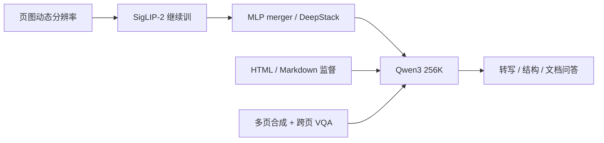

# Qwen3-VL 与文档 OCR

    
为增强真实图像上的 OCR，我们用由粗到细的流水线构造约三千万内部样本，并用专用 OCR 模型与 Qwen2.5-VL 的伪标迭代，无需人工标注。

    <footer>—— Bai 等，Qwen3-VL Technical Report，arXiv:2511.21631</footer>

Qwen3-VL 是通义的视觉–语言基座：稠密 2B/4B/8B/32B，MoE 30B-A3B 与 235B-A22B，原生交错上下文到 **256K**。文档 OCR 不是外挂识别头，而是预训练与后训练里被加厚的一类生成任务——转写、版式 HTML/Markdown、跨页 VQA、定位与 KIE 都走同一套「页图 → SigLIP-2 → merger → Qwen3」。云上的 Qwen-VL-OCR 基于该架构做任务模板；专用 [Qwen3.5-OCR](/llm/qwen35-ocr-model) 是下一代产品档。本篇写 3-VL **基座**如何把文档当一等数据，叶子里的 patch merge、DeepStack、MRoPE 只引用不重讲。

## 问题

通用 VQA 在自然照片上认物体，笔画宽度往往大于 patch。A4 扫描件、手机拍的发票、截屏表格，文字可能小于一个 patch，连接器再强也是在糊块上做语言建模。文档还要求读序、栏、表、公式，纯字符串 OCR 会把二维结构压扁。Qwen3-VL 要在不训练独立检测–识别流水线的前提下，让 LLM 直接生成带结构的文本，并在数十页 PDF 上做跨页指代。

分辨率与窗口必须一起解。动态分辨率提高采样密度；256K 窗口使「多页图 + 解析文本」能放进同一前缀。没有长文档数据，窗口只是空 vis；没有高分辨率，长窗口里全是不可读的糊 token。连接器与 [patch merge](/llm/qwen-vl-patch-merge) 决定每页有多少视觉 token 进入这 256K，页数预算要从这里反推，而不是按「PDF 有多少页」线性加。

### OCR 是数据问题，也是骨干问题

3-VL 视觉侧改用 [SigLIP-2](/llm/qwen3-vl-siglip2) 并在动态分辨率上继续训，与 2.5-VL 从零训 ViT 不同。对比先验偏自然图文对，必须用文字密集样本把骨干从「物体名词」拧到「字形」。报告因此单独写 OCR / 文档解析 / 长文档三节，而不是一句「VLM 当然会 OCR」。

Instruct 与 Thinking 两套后训练在 OCRBench 一类识别基准上可以很接近，思维链主要帮需要推理的图表题（如 CharXiv reasoning）。认字任务不要默认开思考模式加延迟。

## 方法

### 由粗到细的 OCR 数据

约 **3000 万** 内部真实场景 OCR 样本：专用 OCR 模型出伪标，再经 Qwen2.5-VL 精炼，无人工逐字标注。多语上，相对 2.5-VL 除中英外的约 10 种语言，再扩 **29** 种，另合成约 3000 万多语 OCR，并收集 100 万以上内部真实多语图。这解释「会更多文种」来自数据，不是换识别头。

### 文档解析：HTML 与 Markdown 双表示

从 Common Crawl 取约 **300 万** PDF，十类文档各约 30 万，另加约 **400 万** 内部文档。版面模型预测读序与框，Qwen2.5-VL-72B 做区域识别，再组装成对位的解析样本。目标格式包括：**QwenVL-HTML**（元素级框）与 **QwenVL-Markdown**（主要对图和表定位，表用 LaTeX）。合成 HTML 与高质量伪标混合，提高泛化。推理时通用 3-VL 按提示词在这些格式间切换；云上 OCR 产品把格式收成 `ocr_options.task`。

### 长文档：合成多页 + 跨页 VQA

单页样本合成序列：多页图像在前，OCR/HTML 文本在后，覆盖数十页量级。另从高质量多页 PDF 构造必须跨页、跨图/表/正文的 VQA，问类型配平，避免永远只读第一页。预训练 S3 把序列提到 262144，数据侧重长视频与长文档；后训练 SFT 也分 32K 与 256K 两段，256K 段混入上百页技术文档与整书。

预训练四段：S0 只训 merger（含 OCR 图文，8K）；S1 全参约 1T；再扩窗到 32K、256K。后训练含 OCR、解析、grounding 在内的 RL 奖励。旗舰 235B-A22B 在 OCRBench、OmniDocBench、DocVQA 等表上作为开源侧文档强点被报告——引用时应对 Instruct/Thinking 分列，且分数随快照变。

解析数据工厂里有版面模型，那是造监督的工具，不是用户推理图里的必经模块。线上仍是整页（或切片）图像进 VLM。

## 机制

文档 VLM 的条件是 $p(y\mid I_{1:P},x)$：$I$ 为页图，$x$ 为指令。HTML 监督迫使注意力维护框与嵌套；Markdown 监督更轻、更适合「能读、少框」。跨页 VQA 迫使键集合覆盖非当前页的视觉 token，否则「见图 3」无法落地。256K 提供容量，[Interleaved MRoPE](/llm/qwen3-vl-interleaved-mrope) 给每页自己的高宽格并在序列轴上错开页，避免两页左上角共享同一 $(h,w)$。

由粗到细降低人工成本，也把教师模型的系统性偏差写进学生：Qwen2.5-VL 认错的连笔，3-VL 可能继承。多语合成可补字体覆盖，但对真实街景拍糊的泛化仍依赖那 100 万真实图。Thinking 变体把 CoT 写进 $y$，对「这张表是否与后文结论一致」有用，对「把这行字抄下来」往往无增益。

Qwen-VL-OCR 产品在 3-VL 之上加任务模板与旋转矫正等接口，见 [内置任务](/llm/qwen-vl-ocr-tasks) 与 [粗到细](/llm/qwen-ocr-coarse-to-fine)。基座能力是上限：模板不能让没看见的笔画变成正确 `rowspan`。

## 边界与工程取舍

256K 含视觉 token，页数 × 每页 merge 后的 patch 会先打满窗口。超长 PDF 仍要切分，切分策略错误会丢掉跨文件表头，见 [长 PDF](/llm/qwen-ocr-long-pdf)。扫描件加密、极细字、极端旋转，要靠旋转与分辨率策略，不是 235B 自动解决。化学式、乐谱等在报告里作为解析标签出现，生产准确率应单测，不能用 DocVQA 总分代替。

3-VL 仍吃图像；原生 PDF 字节流是 [Qwen3.5-OCR](/llm/qwen35-ocr) 的产品能力，不要写进 3-VL 基座。开源权重与云上 `qwen-vl-ocr-*` 快照的任务覆盖、max_tokens 默认值并不相同。幻觉字段在 KIE 上仍然存在：过密过糊会编造笔画。

评文档 OCR 至少三张表：字符/字段准确、结构（表 HTML / 框）、跨页问答。只报 OCRBench 会选出「会念字、不会读表」的检查点。

## 小结

- Qwen3-VL 用 SigLIP-2 + Qwen3、原生 256K 交错上下文，把 OCR 与文档解析写成预训练主数据，而不是插件头。
- OCR：约 3e7 内部样本粗到细伪标，多语再扩 29 种；解析用 HTML/Markdown 双目标；长文档靠多页合成与跨页 VQA。
- 云上 Qwen-VL-OCR 基于该架构做任务契约；原生 PDF 多轮属于 3.5-OCR 产品线。
- Instruct/Thinking 在纯识别上未必分出高下；推理题再开思考。
- 出处：Bai 等，*Qwen3-VL Technical Report*，arXiv:2511.21631。对照 Wang 等 Qwen2-VL、Qwen2.5-VL 技术报告的文档章节。
