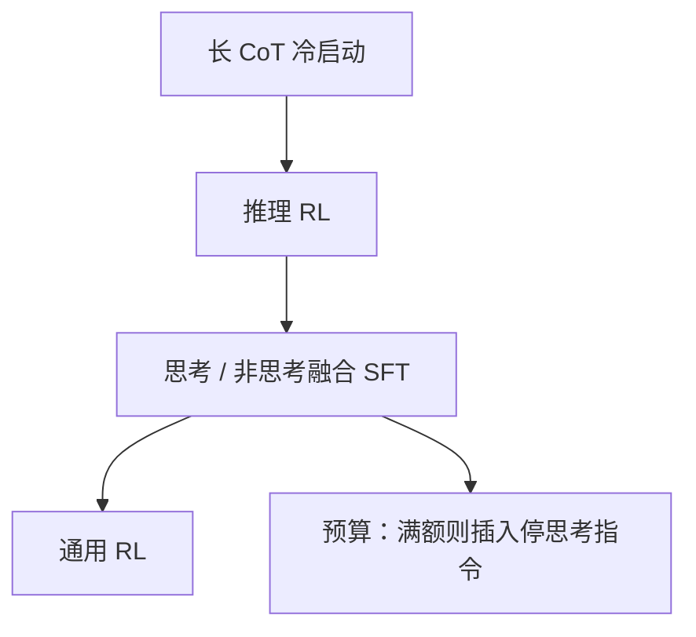

# Qwen3

    
Qwen3 把思考模式与非思考模式集成进同一套框架，用户不必在「聊天模型」和「推理模型」之间切换检查点。

    <footer>—— Yang 等，Qwen3 Technical Report，arXiv:2505.09388</footer>

Qwen3 是通义千问在 2.5 之后的基座世代：稠密从 0.6B 到 32B，MoE 为 30B-A3B 与旗舰 235B-A22B。相对 2.5，结构上去掉 QKV bias、加上 QK-Norm；MoE 改为 128 专家、每 token 激活 8 个，且**不再使用共享专家**。产品上的主差分是**同一套权重里的思考 / 非思考**，以及可中断的思考预算。本篇按 2025 年 5 月技术报告写这些公开设计，后续 2507 更新与 Qwen3-Next 只作为边界提及，不把未写入该报告的架构当成 3 的默认。

## 问题

2024 年末开源生态被劈成两半：一边是 GPT-4o 一类直接回答的聊天模型，一边是 o1 / QwQ 一类先写长思维链再给答案的推理模型。部署两套权，工具、记忆与安全策略都要双写；用户还要自己判断「这题该想」。Qwen3 把问题收成：能否在一次后训练里同时具备两种解码行为，并用聊天模板上的开关切换。

第二个问题是稀疏化。2.5 开源主线是稠密，云上才是 MoE。3 把 MoE 做成可下载的一等公民：235B 总量、约 22B 激活，试图在开源侧提供「接近稠密旗舰、服务按激活计价」的点。若仍用 2.5-MoE 的共享专家 + 细粒度，路由与实现要兼容旧内核；报告选择跟 Qwen2.5-MoE 的细粒度切法，但拿掉共享专家，并换全局 batch 负载损失。

### 稠密档与 MoE 档是同一套注意力配方

六档稠密：0.6B、1.7B、4B、8B、14B、32B。两档 MoE：30B-A3B、235B-A22B。骨架对齐 2.5：GQA、SwiGLU、RoPE、RMSNorm Pre-LN。差分是注意力数值：去掉 Qwen2 起用的 QKV bias，引入 QK-Norm，稳定深层与长前缀上的分数尺度。小模型（14B 及以下与 30B-A3B）用强模型做强到弱蒸馏，而不是各训一套完整 RL——报告认为蒸馏在性能与成本上优于小模型自己 RL。

「A22B」指每 token 约 220 亿激活，不是 22 个专家。专家数是 128，激活 8 个。读型号时把总量、激活量、专家数分开，避免和 Llama 4「17B 激活 × 128 专家」混成一张表。

## 方法

### MoE：细粒度、无共享、top-8

每层 FFN 换成 128 个专家，路由 top-8。相对 Qwen2.5-MoE，**排除共享专家**。负载用全局 batch 的平衡损失（报告引 Qiu 等 2025），促使专家分化。无共享意味着公共变换也必须由路由专家承担，组合数 $C(128,8)$ 很大，细粒度用来补「没有永远在线的 FFN」。实现与 [MoE 路由](/llm/moe-routing) 同一套 token-choice，只是 $k=8$ 且没有 $S(x)$ 那一项。

### 思考模式：四阶段后训练

旗舰后训练分四段（报告图 1）：

1. **长 CoT 冷启动**：用 QwQ-32B 等生成带思维过程的轨迹，过滤乱猜、复读、思维与摘要不一致的样本，植入推理格式，而不把分数当作唯一目标。
2. **推理 RL**：数学与代码等可验证任务上强化学习，大 batch、多 rollout。
3. **思考模式融合**：在已会推理的模型上继续 SFT，混入带 `/think` 与 `/no_think` 的样本。非思考样本仍保留空的思考块，使格式内部一致；开发者也可在模板里直接拼空块，禁止展开思维。默认思考；无开关的查询按思考训练。多轮里随机插入两种开关。
4. **通用 RL**：二十类以上任务的奖励，覆盖指令、格式（必须遵守 `<think>` 槽）、工具与场景稳定性。

思考预算不是另训一个「短思维」头。融合之后，模型能在思维未写完时被打断：当思维 token 达到用户阈值，推理端插入「时间有限，基于现有思考作答」并关闭 `</think>`，再写最终答案。报告写明该能力**是融合的涌现，没有单独当目标训练**。

聊天模板里 `/think`、`/no_think` 可写在用户或系统消息。Hugging Face 分词器提供 `enable_thinking=False` 一类接口，与报告表 9 一致。

预训练约 36T token、覆盖约 119 种语言与方言，是 3 相对 2.5 的数据侧公开数字。不要把 36T 理解成「全部都是高质量书籍」；报告强调的是覆盖面与多语，过滤流程是另一章。

## 机制

思考模式改变的是条件前缀与合法续写集合。思考开启时，助手先在 `<think>…</think>` 里写中间步骤，答案条件于这些步骤；关闭时，空块之后直接写答案，行为接近 2.5-Instruct。同一套残差流，两种前缀，避免「推理模型不会寒暄、聊天模型不会证明」。预算打断相当于在思维链上做一次强制 `[EOS_think]`，之后的分布是「摘要头」——若阈值过小，答案质量接近非思考，只是浪费了半截思维的 KV。

QK-Norm 把 $Q,K$ 的尺度钉住，再进缩放点积，深层 235B 与长 CoT 前缀上不容易 softmax 饱和。去掉 QKV bias 减少注意力里一套与输入无关的加性偏移，和 2.5 权重**不兼容**，不能把 2.5 的 bias 解释进 3 的检查点。

无共享 MoE 的机制代价是：极高频的功能词也走离散路由，负载损失必须足够强，否则专家崩溃。top-8 比 Llama 4 Maverick 的 $k=1$ 更稠，同样总参数下通信与专家计算都更重，换的是更细的技能组合。30B-A3B 用蒸馏继承旗舰的开关行为，使边侧也能 `/no_think`，而不必在 3B 激活上跑完整四段 RL。

## 边界与工程取舍

思考默认开启会把简单分类题变成数百 token 的内心独白，延迟与费用上升。产品必须把开关接到明确的 UX，不能假设用户会写 `/no_think`。预算插入的英文指令是报告给出的模板，换语言或改措辞属于未保证区。

2025 年 7 月的 Instruct-2507 / Thinking-2507 把部分尺寸拆成更偏聊天或更偏思考的检查点，说明「单模型双模式」与「分叉专化」在产品上会并存。写死「Qwen3 永远一个权重打天下」会被后续快照打脸；报告原文描述的是 5 月发布的融合设计。

MoE 服务需要专家并行；把 235B 当稠密 22B 去估显存会装不下。Qwen3-Next 等混合架构不在本篇展开。评测上 AIME、LiveCodeBench、BFCL 等数字随快照变，引用应注明报告版本，不要把 2507 分数贴到 2505 检查点上。

小模型的「能思考」大量来自蒸馏，不是 0.6B 自己搜出来的算法能力。边侧部署若关掉思维槽，得到的是蒸馏过的直答模型，仍可能强于同尺寸 2.5，但不要用旗舰 AIME 分数去宣传 0.6B。

## 小结

- Qwen3 提供六档稠密与两档 MoE（30B-A3B、235B-A22B）；注意力为 GQA + RoPE + QK-Norm，无 QKV bias。
- MoE：128 专家、激活 8、无共享专家，细粒度切分加全局负载损失。
- 公开的思考模式：模板开关 `/think` 与 `/no_think`、空思考块、可中断的思考预算；后训练四段冷启动–推理 RL–融合–通用 RL。
- 小模型靠强到弱蒸馏继承双模式。
- 出处：Yang 等，*Qwen3 Technical Report*，arXiv:2505.09388；发布说明见 Qwen 博客 *Qwen3: Think Deeper, Act Faster*（2025）。
