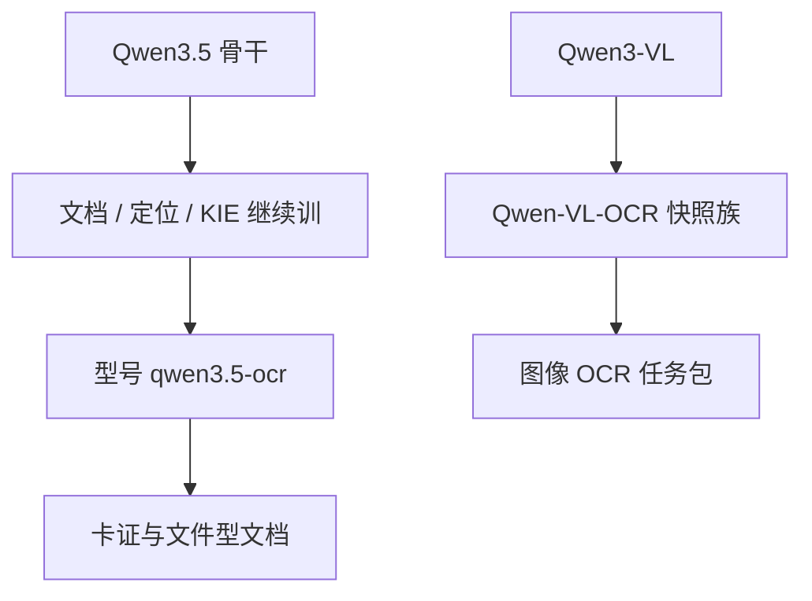

# Qwen3.5-OCR

    
Qwen3.5-OCR 基于 Qwen3.5 架构，在文档解析、文字定位和关键信息抽取上全面升级，并强化业务卡证抽取。

    <footer>—— 阿里云百炼 / Qwen Cloud《文字提取》产品文档</footer>

Qwen 云上的文字提取已经分出两条架构线：**Qwen-VL-OCR** 挂在 Qwen3-VL 上，**Qwen3.5-OCR** 挂在 Qwen3.5 上。后者以型号 `qwen3.5-ocr` 提供，定位是文档与卡证的专用档，而不是又一个通用多模态聊天检查点。原生 PDF 与多轮追问如何改接口形状，已在 [技术点篇](/llm/qwen35-ocr) 写过；本篇写**型号本身**：它从哪代骨干长出来、和 VL-OCR / 通用 3-VL 怎么分工、卡证与幻觉边界如何写进契约。不重复把 Response API 与页数上限再展开成全文。

## 问题

通用 Qwen3-VL 已经能做文档 HTML 与 OCRBench。为什么还要一个以 OCR 命名的云型号？因为通用 VLM 的解码先验是聊天与推理：同一张身份证，用户随口问「这人多大了」可能得到计算或拒答，而业务要的是稳定的字段 JSON。专用档把能力剖面收窄：文档解析、定位、KIE、证照票据，并把多轮、文件输入做成产品承诺。调用方选型号，等于选**输出契约与输入介质**，不是选「更会讲笑话的视觉模型」。

另一条分裂是骨干换代。VL-OCR 文档写明基于 Qwen3-VL；3.5-OCR 写明基于 **Qwen3.5 架构**。视觉继续训、语言侧对齐、卡证数据，都发生在新骨干上。不能把 3-VL 报告里的 SigLIP-2 层表或 256K 预训练课程，原样说成 3.5-OCR 的公开实现——产品文档没有放出同名开源技术报告。

### 专用 OCR 型号 vs 通用 VL

| 维度 | 通用 Qwen3-VL | Qwen-VL-OCR | Qwen3.5-OCR |
| --- | --- | --- | --- |
| 角色 | 开源/云通用多模态 | 3-VL 上的 OCR 任务包 | 3.5 上的 OCR 专用型号 |
| 输入 | 图、多图、视频 | 图为主，页需自转 | 文档强化，含 PDF 路径 |
| 交互 | 开放 VQA | 早期单轮为主 | 对话式抽取 |
| 结构输出 | 靠提示词 | 内置 task | task + `ocr_result` |

表是产品文档的归纳，不是论文消融。早期 `qwen-vl-ocr-2024-10-28` 等快照被标为不推荐，迁移目标指向 `qwen3.5-ocr`。

Qwen3.5 基座本身的层配置、是否 MoE、上下文精确数字，应以 Qwen3.5 的公开说明为准。OCR 型号文档只承诺「基于该架构做了文档侧强化」，没有把隐宽写成 OCR 超参。

## 方法

### 在 3.5 上做文档侧继续训

公开表述是：相对前代 OCR 线，文档解析、文字定位、关键信息抽取「全面升级」，并在身份证、驾驶证等**业务卡证**上显著增强，支持文档列出的数十种证照与票据。方法路径与 3-VL 文档章同类——合成与伪标、版式目标、KIE schema——但教师与数据配比未开源。调用方能抓住的接口是：内置 `ocr_options.task`（解析、定位、KIE、表、公式等）与用户 Prompt **并存**（不再用内部固定提示覆盖用户），结构化结果走 `ocr_result`。细节与旋转、grounding、KIE schema 见 OCR 叶子，本型号篇只强调：这些任务是 **3.5-OCR 的一等功能**，不是通用聊天的隐藏彩蛋。

### 输入介质与会话，作为型号能力而不是提示词技巧

3.5-OCR 把「文件进、结构出」写成型号能力：PDF 不必先在客户端光栅化（扫描件服务端仍可能转图像）；多轮允许后续只发文本追问。这改变的是**产品形态**——会话里有一份文档身份——而不是又发明一种注意力。实现约束、页数体积上限、Chat Completions 与 Response API 不对称，见 [原生 PDF 与多轮](/llm/qwen35-ocr)。选型号时若业务全是单张手机照片、无追问，VL-OCR 最新快照仍可能够用；一旦要证照字段 + 改 schema 再抽，3.5-OCR 才是文档指定的档。

OpenAI 兼容路径往往没有 `ocr_options` 同名参数，要靠文档公布的任务 Prompt。型号能力与协议能力是两件事：换 base URL 不会自动获得 PDF 字节流。

## 机制

专用型号通过数据与解码约束，把 $p(y\mid I,x)$ 的质量从「像聊天」拧到「像抽取器」。卡证增强意味着训练里大量对齐到固定键：姓名、号码、有效期。先验有用——它知道身份证该有哪些字段——也会幻觉：模糊位被填成合法校验格式的假号。3.5-OCR 文档对「与文字无关的开放问题」明确不保证，这是机制上的认输：语言模型头仍能闲聊，但那不是 SLA。多轮会把第一轮错误字段当成对话事实，这是状态问题，技术点篇已述；型号选择无法消除，只能靠校验与落库。

相对 3-VL 开源权重，云型号还叠了服务端预处理（旋转、分页、内部光栅）与输出通道拆分。用户看不见 merger 是否仍叫 DeepStack，也不应假设 256K 训练课程原样搬来。能写进架构图的只有：3.5 语言–视觉骨干 + OCR 后训练 + 文档化的任务/文件/多轮接口。

与 VL-OCR 并存，是因为迁移需要窗口：旧快照的 `max_tokens` 默认 4096、单轮无历史，业务卡证差一截；新型号改契约后，并不是所有调用方能同一天改 PDF 上传与会话状态。产品矩阵允许两代任务包短暂重叠，推荐方向指向 3.5-OCR。

## 边界与工程取舍

没有公开的「Qwen3.5-OCR Technical Report」arXiv 时，不要编层数与训练 token。评测应在自己的证照与票据集上做字段级 F1，不要用通用 OCRBench 代替。加密 PDF、超过文档页数/体积、纯扫描且dpi 极低，会退回失败或内部光栅，专用型号不是 PDF 渲染引擎。

通用 3.5 聊天模型（若单独提供）即使「也能看图」，也不承担 `ocr_result` 契约。业务上应锁型号名，避免路由到普通 VL 导致 JSON 漂移。卡证种类以文档附录为准，附录外的特种证件是域外。

本篇与 qwen35-ocr 叶子的分工：这里是「这是什么型号、何时选它」；那里是「PDF 与多轮怎样改条件概率」。集成代码两者都要读，但不要把两篇合成一份粘贴文。

## 小结

- `qwen3.5-ocr` 是基于 Qwen3.5 架构的文档 OCR 专用云型号，强化解析、定位、KIE 与业务卡证。
- Qwen-VL-OCR 基于 Qwen3-VL，偏图像任务包；早期快照不推荐，迁移目标指向 3.5-OCR。
- 原生 PDF 与多轮是该型号的产品能力，机制与限制见配套技术点篇，本文不重复展开。
- 无公开同名论文时，实现细节以云文档为准，不以虚构 arXiv 填充骨干表。
- 出处：阿里云百炼 / Qwen Cloud《文字提取》中 Qwen3.5-OCR 与 Qwen-VL-OCR 型号说明。对照 Qwen3-VL 技术报告（arXiv:2511.21631）仅作为前代 VL-OCR 骨干的公开文献。
