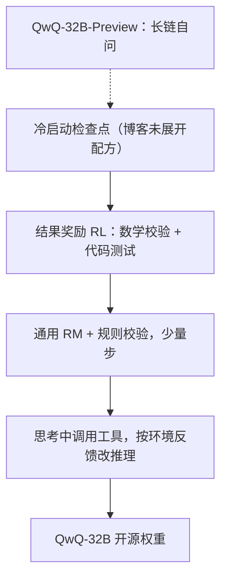

# QwQ

    
在够厚的 32B 基座上放大基于结果的强化学习：数学用答案校验器，代码用测试用例，再短促地补一轮通用奖励，不必先上 671B 稀疏旗舰。

    <footer>—— Qwen Team，QwQ-32B: Embracing the Power of Reinforcement Learning，官方博客 2025-03-06；预览版见 QwQ-32B-Preview 博客 2024-11-27</footer>

QwQ（Qwen with Questions，读音接近 quill）是通义的**推理专线**，不是 Qwen2.5-Instruct 换聊天模板。公开技术叙述以两篇官方博客为准：**QwQ-32B-Preview**（2024-11-27）展示长思维链在 GPQA / AIME / MATH-500 / LiveCodeBench 上的跳变；**QwQ-32B**（2025-03-06）把重点改成「强化学习如何放大」，并声称 32B 稠密可与 DeepSeek-R1（671B 总参、约 37B 激活）同桌。二者均 Apache 2.0 开源权重。团队**没有**为 QwQ 发布与 Qwen2.5 报告同级别的 arXiv 长文；架构数字以模型卡为准（Qwen2.5-32B 同系：64 层、GQA、RoPE、SwiGLU、RMSNorm、QKV bias、上下文 131072）。本篇写博客里实际承诺的训练故事与产品边界，不编造论文号，也不把 [DeepSeek-R1](/llm/deepseek-r1) 的冷启动配方整段搬过来冒充 QwQ 原文。

## 问题

指令微调能让模型「看起来会逐步思考」，但逐步文本往往是模仿，不是被对错信号塑形过的搜索。竞赛数学与可测代码提供稀缺的**可验证结果**：答案对错、测试是否通过。若奖励来自学习型偏好模型，策略会讨好文风；若完全没有热启动，随机探索在 32B 上的样本效率可能不可接受。通义要回答的工程问题是：在已经用世界知识预训练过的 Qwen2.5 级基座上，**只放大 RL** 能否接近大一个数量级的稀疏推理模型；以及思维模型能否在思考过程中用工具、并根据环境反馈改推理。

Preview 暴露了另一面：真开始「想很久」之后，会出现语种混杂、推理死循环、安全对齐不足、常识任务不强。这不是边角，而是长链生成的默认失败模式。正式版博客把 RL 分成「可验证域」与「通用域」两段，正是为了在抬数学代码的同时，用少量步数补指令遵循与智能体，并声称数学代码不明显回退。

### 预览版与正式版不是同一叙事

Preview 的公开数字：GPQA 65.2%、AIME 50%、MATH-500 90.6%、LiveCodeBench 50%（博客当时口径）。叙事是「给时间自问自答」。QwQ-32B 正式版对照 R1、R1 蒸馏的 Qwen-32B / Llama-70B、o1-mini，叙事换成「结果奖励可规模化」。不要把 Preview 的 AIME 50% 直接写成正式版分数，也不要把正式版的「可比 R1」写成架构创新。

Hugging Face 上的 `Qwen/QwQ-32B` 与 `Qwen/QwQ-32B-Preview` 是两个检查点。聊天模板会把思维过程与最终答案分栏（`reasoning_content` / `content`）。关掉思维、当普通 Instruct 用，会丢掉这根线存在的理由。

## 方法

正式版从**冷启动检查点**出发——博客未展开冷启动语料配方，只强调后续 RL 用结果奖励而非传统奖励模型来驱动数学与代码。数学侧：准确率校验器，只看最终解是否对。代码侧：执行服务器，看是否通过预定义测试。随 episode 增加，两域性能持续上升。第一段结束后，加第二段 **通用能力 RL**：奖励来自通用奖励模型加部分规则校验器。博客称少量步数即可抬指令遵循、人类偏好与智能体，同时数学代码无明显下降。

### 工具嵌在思维链里

智能体相关能力被写进推理模型：思考过程中调用工具，并根据环境反馈修改推理。这与 Qwen2.5-Instruct 的工具调用（见 [function calling](/llm/function-calling)）目标不同——这里工具是长链推理的中间步，不是「决定了再调一次 API 就结束」。

### 推理接口把思维与答案分栏

推理配置以官方用例为准：`max_new_tokens` 可到 32768 量级；温度等采样超参见模型卡与博客附录，错误采样会放大死循环。服务可用 vLLM；DashScope 兼容接口把思维链流式打在 `reasoning_content`。

## 机制

### 博客没有把算法写成可复现公式

结果奖励把优化目标从「像不像人类逐步写」拧到「最后对不对」。数学校验器是稀疏的序列级信号，策略必须自己发现可被校验器承认的中间形式（格式、单位、最终盒）。代码测试同样稀疏，但比风格 RM 难作假——过不了测例就没有正向奖励。这与 [GRPO](/llm/grpo) / R1 路线同属「可验证域 RL」，但 **QwQ 博客没有写出组相对公式、组大小或 KL 系数**；实现细节不能从 R1 论文反推后写进 QwQ 名下。

第二段通用 RL 的作用是正则：纯竞赛奖励会把模型训成「只愿写长解答的竞赛机」，指令遵循与安全会掉。少量步 + 规则校验器是在用小的分布修正换回产品可用，而不是再训一个同等算力的对齐模型。智能体反馈把环境（解释器、检索）接到思维链里，使「想」和「试」交替；若工具始终失败，长链会退化成 Preview 里写过的递归空转。

Preview 的自问自答可以视为冷启动或行为先验：用户可见的长思维，是 RL 要放大的生成模式，而不是推理时另插的搜索算法（没有公开 MCTS 树）。

32B 对 671B「总参」的对比，有效算力应对齐激活与生成长度。R1 激活约 37B，QwQ 是满 32B 稠密；显存账对稠密 32B 友好，并不自动等于 decode FLOPs 更低——长思维会把生成 token 拉到数万。

## 边界与工程取舍

没有技术报告意味着：冷启动数据、奖励权重、是否用过程监督、安全如何补，都不可复现到论文精度。Preview 列出的四条限制——语种混合、递归循环、安全、常识——在正式版博客里没有逐条宣布「已关闭」，部署仍要截断、重复检测与安全层。数学代码强、开放域弱，是专线的取舍，不是暂时的 bug。

许可 Apache 2.0，可商用，但仍须按模型卡处理衍生与归因。评测应复现官方仓库脚本；第三方「已超越 R1」的截图随 Arena 与快照变化。Qwen3 之后的思考模式是另一代产品，不要回溯改写 QwQ。

若生成出现无终止的自我反驳，先降 `max_new_tokens`、检查采样、启用官方推荐的重复惩罚，而不是换更大的 72B Instruct 当「更强 QwQ」——Instruct 没有这条 RL 专线。

## 小结

- QwQ 是 Qwen 的推理专线：Preview 展示长链反思，32B 正式版把叙事收成可验证域 RL 再加短通用 RL。
- 公开出处是两篇官方博客与模型卡，没有可引用的 QwQ 专有 arXiv。
- 数学用答案校验器、代码用测例；智能体在思考中用工具。架构同系 Qwen2.5-32B，窗口 128K 级。
- Preview 的循环与混语仍是部署风险；不要与 Instruct 或 R1 蒸馏检查点混用分数。
- 出处：Qwen Team，*QwQ: Reflect Deeply on the Boundaries of the Unknown*（2024-11-27）；*QwQ-32B: Embracing the Power of Reinforcement Learning*（2025-03-06）。基座对照 Yang 等 Qwen2.5 Technical Report，arXiv:2412.15115。
