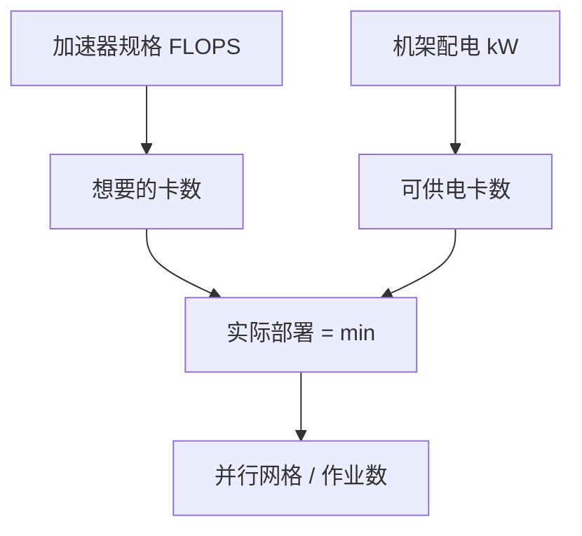

# 机架功率密度

卡的规格表写的是 TFLOPS；机房允许的是每机架千瓦。两者不一致时，先满的是电，不是算。

<footer>—— 对照公开的 DGX / HGX 机柜功耗量级与数据中心机架配电；液冷细节下一课</footer>

[上一课](/llm/dataset-storage-streaming) 假定 GPU 在算。本课写它为什么可能不让你插满：单柜功率密度。缺口是把 [Scale-Up 超节点](/llm/scale-up-vs-scale-out) 里提过的「液冷机柜、很高的单柜功率」收成一课账——规划并行网格之前，设施屋顶线已经把卡数上限写死。不编造未出现在厂商文档里的某代精确瓦数；用公开量级与机制。

## 问题

传统企业机架按 8–15 kW 设计；一台上一代 8 卡训练服务器就可以接近或超过这个数。NVL72 一类超节点把一柜做到几十张 GPU 加 CPU 加交换机，公开产品形态是液冷、高功率机柜，量级上是「一柜抵过去一排」。若机房仍按风冷列头柜供电，你会买得起卡、接不上电，或接上电却因过载降频——有效 FLOPS 不是规格表。

功率还随负载变：空闲、训练满 Tensor Core、以及检查点期间的波动不同。配电与 UPS 必须按峰值，否则同步的训练脉冲会在同一毫秒拉高整列电流。问题是：**规划单位从「卡数」换成「可供电的卡数」**，再倒推 DP/TP 网格。

厂商产品页会给出某代 DGX / GB200 机柜的典型或最大功耗。引用时写明是厂商规格，不是本机房实测。未公开的背板电流与 PSU 内部冗余，不写进容量表。

## 方法

三张表对齐：IT 负载（GPU + CPU + NIC + 存储）、制冷功耗（下一课，风冷经常再加 50% 量级的设施 PUE 故事，液冷更低但不是零）、以及 PDU / 母线容量。可部署卡数 = 供电允许的柜数 × 每柜卡数，再扣冗余（N+1 电源、维修下电）。

超节点是单一供电故障域：一柜下电损失 72 卡而不是 8 卡。Scale-Out 侧要用副本与检查点补爆炸半径，见故障课。软件上，调度器必须知道机架功率预算，不能按「空闲槽位」塞满高 TDP 作业导致跳闸。

训练作业的功耗接近峰值且同步，比云上异构 web 负载更「方波」。同一机架混部高功耗训练与突发推理，峰值叠加可能超过按平均值批的电。功率感知调度（推迟启动、错开检查点、限制每柜并发作业）是软件对设施的补偿。

## 机制

GPU 功耗与利用率、时钟、精度有关。FP8 Tensor Core 打满时往往比等待 NCCL 时更高；通信墙作业「看起来很忙」但功耗可能低于计算墙。设施不能按通信墙的稳态给训练柜做容量，否则一旦网格改对、算力吃满，就会过载。降频是保护，不是性能特性——step time 会不可预测地变长，像网络尾延迟。

[NVLink](/llm/nvlink) 域把许多 GPU 绑成一台逻辑机器，电上也更像一台：同时拉高。这与分散在许多低功率机架上的 Scale-Out 不同。形态选择包含电力形态，不只是带宽形态。

PUE 把制冷算进总电。液冷把热更直接地交给水，机房 PUE 可变好，但厂级仍要排热。不要用「液冷所以免费加一倍卡」的口号替代 PDU 表。

## 边界与工程取舍

不要用桌面 GPU 的 TDP 去乘服务器卡数。不要忽略 CPU、NVSwitch、NIC、光模块——超节点里它们不是零头。不要在合同电力未改之前按产品宣传柜数下单。下一课液冷是功率密度的配套，不是独立的「更环保」选修。

## 小结

- 可部署卡数由机架千瓦与峰值负载决定，不是由规格 TFLOPS。
- 超节点是高密度供电故障域；网格规划必须先问电。
- 训练负载同步且接近峰值，按平均值配电会在算满时跳闸或降频。
- 调度需要功率预算，不能只看空闲 GPU。
- 出处：厂商公开的机柜功耗规格；数据中心配电与 PUE 常识。
