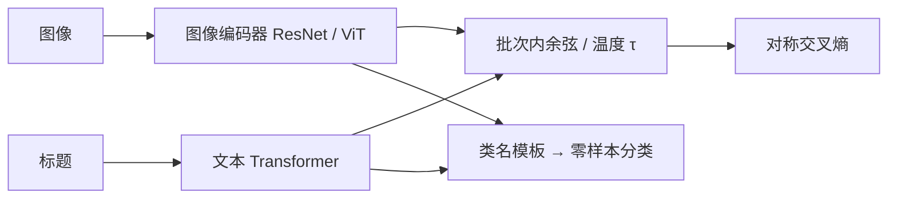

# CLIP 原文

不必为每一个视觉概念手工标类；在四亿图文对上做「哪一句是这张图的标题」，自然语言就能在推理时当分类器的权重。

<footer>—— Radford 等，Learning Transferable Visual Models From Natural Language Supervision，ICML 2021</footer>

OpenAI 的 CLIP（Contrastive Language–Image Pre-training）把视觉预训练的监督从 ImageNet 一千类换成互联网标题。Radford 等人收集约 **4 亿**图文对（内部名 WIT，WebImageText，从未开源），用双塔对比学习得到共享嵌入空间：图编码器（ResNet 或 [ViT](/llm/vit-as-encoder)）与文本 Transformer 各出一条 L2 归一化向量，批次内配对拉近、非配对推开。零样本时把类名填进提示模板，用文本塔编成分类权重。本篇写 2103.00020 原文的问题、目标函数、模型族与迁移实验；后续 VLM 如何把它当视觉前端，见已有的 [CLIP 对齐](/llm/clip) 与 [LLaVA 投影器](/llm/llava-projector)。

## 问题

监督学习把视觉语义钉死在预定词表上。换一个「红底白字的路牌」或「某种没进 ImageNet 的工具」，就要重新标、重新训头。检测与分割更贵。另一方面，网上已经有海量「图 + 自然语言」——弱、噪、偏英语，但覆盖面远大于一千名词。生成式标题预测（在图特征上自回归解码句子）在当时算力下扩展不动：预测目标的词表大、序列长，batch 上不去。

CLIP 要证明的不是「对比学习更新颖」，而是：**预测哪句标题匹配哪张图**，作为预训练任务，能从随机初始化学到可迁移表示，并且迁移时**不必看见下游训练集**。对照很硬：零样本 CLIP 要和在 128 万 ImageNet 图上监督训练的 ResNet 比。

### 先试生成目标，再改成对比

论文写明：他们早期用预测型目标，数据效率不够。改成对比之后，同样算力下学习「图文配对」比学习「逐词生成标题」大约高效一个数量级（文中给过约 4× 的数据效率对比）。机制是：对比把问题收成 $N\times N$ 的配对分类，梯度直接打在全局向量上，不需要为每个词步反传。这决定了后续十年 VLM 视觉塔的默认预训练：先对比对齐，再谈生成。

WIT 按约 50 万查询、每查询最多 2 万对收集，总量 4 亿。它不是 LAION 的公开镜像，不能用 LAION-400M 的噪声统计去「复现 CLIP 原文」。开源再现走的是 OpenCLIP 等另一条数据链。

## 方法

图像塔与文本塔在对比损失出现之前互不看见对方的 token。记批次内 $N$ 对 $(x_i,y_i)$，归一化嵌入 $z_i=f(x_i)$、$w_j=g(y_j)$，温度 $\tau$ 可学习，对称交叉熵为

$$
\mathcal{L}=\frac12\Bigl(\mathrm{CE}(z w^\top/\tau)+\mathrm{CE}(w z^\top/\tau)\Bigr).
$$

$\tau$ 初始化相当于 0.07，并裁剪以免 logits 缩放超过 100。全局 batch **32,768**；Adam + 解耦 weight decay；余弦 32 epoch。相似度矩阵按 GPU 分片，只算本卡需要的那一块，否则 3 万级 batch 的 $N^2$ 存不下。

### 模型族：五条 ResNet，三条 ViT

ResNet 侧：RN50、RN101，以及 EfficientNet 式放大的 RN50x4 / x16 / x64（算力大约是 RN50 的 4/16/64 倍）。ViT 侧：B/32、B/16、L/14。默认「CLIP」结果往往指 **ViT-L/14@336px**：在 224 预训练后再以 336 分辨率多训 1 epoch（FixRes 思路）。最大 ResNet（RN50x64）约 592 张 V100、18 天；最大 ViT 约 256 张 V100、12 天。文本塔是带因果掩码的 Transformer（CLIP 文本侧不是 BERT 双向），上下文 76 个 BPE token 加起止符。

零样本协议：每个类名套多条提示（`a photo of a {label}` 等）再把文本嵌入平均，相当于提示集成。这不是可有可无的花活——消融显示提示工程对 ImageNet 零样本有几个点的影响。下游若改为线性探针（冻图像塔，只训 logistic），分数会再高一截，但那已经用了下游标签，不再是零样本主张。

## 机制

对比损失在批次内制造 $N-1$ 个负例。$N$ 越大，模型越不能靠「这是一张图、那是一句英文」这种粗特征得分，必须抓住标题里真正能区分的视觉属性。温度把 softmax 的锋利程度变成可学习参数：过小则只打最容易的对，过大则正负差被抹平。L2 归一化把比较限制在球面，避免某一塔用范数偷尺度。

零样本之所以成立，是因为类空间被嵌入语言空间：新类等于新句子，不必改 $f$ 的权重。论文在 30 余个数据集上测迁移，覆盖 OCR、动作、地理、细粒度物种等。ImageNet 上 ViT-L/14 零样本 top-1 约 **76.2%**，与监督 ResNet-101 同级，却**没有用 ImageNet 训练图像**。更突出的是分布偏移：在 ImageNetV2、Sketch、ObjectNet 等上，零样本 CLIP 的有效稳健性优于在 ImageNet 上监督、再期望泛化的模型——监督模型在原分布上刷分，移位后掉得更狠。

「匹配 ResNet-50 的 ImageNet」是原文对较小 CLIP 的说法；旗舰 ViT-L/14@336 的 76.2% 不要和 RN50 零样本那一档混用。线性探针与零样本也不是同一列。

### 和监督 ImageNet、和生成式标题

监督 ImageNet 学的是一千路 logit，迁移要换头。CLIP 学的是「被语言点名过的属性」，换任务等于换句子。生成式标题模型（当时的 VirTex、ICMLM 等）也能用语言监督，但推理不是「任意文本当分类器」，而是解码一条描述；对比则直接给出检索与分类接口。代价是双塔没有词–区域对齐：全局向量靠近一句话，不蕴含句中某个词对准了某个框。

## 边界与工程取舍

双塔无交互，组合、空间关系、否定（「没有狗的房间」）是弱项。标题若只是物体名词堆砌，细字、计数、抽象图表不会进入损失。论文自己的分析指出 CLIP 在计数、细 OCR、系统性泛化上仍弱。英语网页标题会把空间拉向英语视觉文化。WIT 未发布，科学复现只能走开源图文对，规模与清洗都不同。

工程上，224/336 对自然照片够用，对文档不够，这把压力交给后来的切块与动态分辨率。不要把 CLIP 余弦检索对了理解成 VLM 不会幻觉：对比从未训练生成。冻 CLIP 再接 LLM 时，视觉塔仍是对比任务的特征；文档 OCR 掉字应解冻或换更高分辨率骨干，而不是只加宽投影层。取舍：开放词汇识别与检索，CLIP 几乎是默认起点；密集描述与读字，必须在这篇论文之上加生成目标。

CLIP 文本塔在接 LLaVA / Qwen-VL 时通常丢掉，只留图像塔的 patch 或 CLS。原文的零样本分类器依赖文本塔仍在；部署 VLM 时「还能不能用类名当权重」取决于你有没有加载 $g$。

## 小结

- CLIP 用 4 亿图文对做双塔对称对比学习，batch 32768，可学习温度，从随机初始化得到可迁移视觉模型。
- 零样本把类名写成句子；ViT-L/14@336 的 ImageNet top-1 约 76.2%，且在分布偏移上往往比 ImageNet 监督模型更稳。
- 对比目标相对生成式标题更易放大；对齐的是全局向量，不是框级对应。
- WIT 未开源；后续开源 CLIP 类模型是另一条数据链。
- 出处：Radford 等，*Learning Transferable Visual Models From Natural Language Supervision*，ICML 2021，arXiv:2103.00020。
