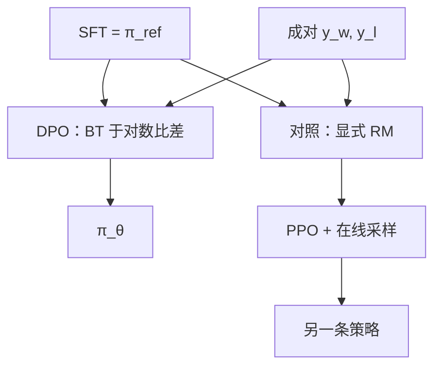

# Direct Preference Optimization 原文

在 KL 约束的奖励最大化里，最优策略与奖励一一对应；把奖励换成策略相对参照的对数比，成对比较的似然可以直接对策略求导。

<footer>—— Rafailov et al., Direct Preference Optimization: Your Language Model is Secretly a Reward Model, NeurIPS 2023</footer>

Rafailov、Sharma、Mitchell 等人 2023 年的 DPO 针对 InstructGPT 后半段的工程税：显式奖励模型加 PPO 要驻留四套网络、在环内采样、调 KL 与裁剪，还容易把奖励黑客训出来。作者指出，在「最大化期望奖励减去对参照策略的 KL」这一目标类里，最优奖励可以写成策略对数比，于是 Bradley-Terry 似然里的 $r(y_w)-r(y_l)$ 变成两条回答在 $\pi_\theta$ 与 $\pi_{\mathrm{ref}}$ 下的对数概率差。损失只涉及策略与冻结参照，不必再训 RM，也不必在训练环里采样。副标题 *Your Language Model is Secretly a Reward Model* 说的是这套对应，不是说任意因果 LM 都已经对齐。机制推导的展开见 [DPO](/llm/dpo)；本篇写原文的问题设定、实验主张，以及它相对 RM+PPO 少了什么。

## 问题

KL 约束的 RLHF 目标为

$$
\max_{\pi}\;\mathbb{E}_{x\sim\mathcal{D},\,y\sim\pi(\cdot\mid x)}\bigl[r(x,y)\bigr]-\beta\,\mathrm{KL}\bigl(\pi(\cdot\mid x)\,\|\,\pi_{\mathrm{ref}}(\cdot\mid x)\bigr).
$$

$\pi_{\mathrm{ref}}$ 通常是 SFT。最优解满足 $r(x,y)=\beta\log\frac{\pi^*(y\mid x)}{\pi_{\mathrm{ref}}(y\mid x)}+Z(x)$，$Z$ 只依赖提示。也就是说，在这个目标类里，奖励与策略不是两个自由对象。先拟合任意 $r_\phi$ 再让 $\pi$ 去追，既浪费，也可能因为 PPO 近似、早停、采样噪声而追不到与 $r_\phi$ 一致的最优。问题是：能否把比较数据上的 BT 似然，直接写成对 $\pi$ 的监督。

比较数据仍是 $(x,y_w,y_l)$。BT 需要的是 $r(x,y_w)-r(x,y_l)$。把最优形式代入，配分 $Z(x)$ 相减消掉。这要求两件事同时成立：真正关心的目标确实是上述 KL 正则期望奖励；人类比较确实由该 $r$ 的 BT 模型生成。两条都是假设。原文的贡献是在假设下给出闭式回代，并在情感、摘要、对话上显示可以不跑 PPO。

### 闭式回代把奖励限制在对数比族

定义隐含奖励 $\hat r_\theta(x,y)=\beta\log\frac{\pi_\theta(y\mid x)}{\pi_{\mathrm{ref}}(y\mid x)}$。任意 RM 能表示的函数比这个族宽。DPO 不是「无奖励」，而是「奖励必须长成对数比」。族外的 $r$ 无法被表示；PPO 配一个任意 RM 理论上更宽，只是优化更难。副标题里的 secretly 指：一旦接受 KL 约束最优，当前策略已经定义了一个奖励，不必另存一个头。

$Z(x)$ 消掉依赖成对比较。若数据是绝对分数而不是对，回代形式不同，不能直接抄 DPO 损失。原文实验用的是成对偏好，与 InstructGPT 的比较协议同构。

## 方法

损失为 BT 似然，分数差换成 $\beta$ 倍的对数比差：

$$
\mathcal{L}_{\mathrm{DPO}}=-\mathbb{E}\log\sigma\Bigl(\beta\log\frac{\pi_\theta(y_w\mid x)}{\pi_{\mathrm{ref}}(y_w\mid x)}-\beta\log\frac{\pi_\theta(y_l\mid x)}{\pi_{\mathrm{ref}}(y_l\mid x)}\Bigr).
$$

实现对 $y_w,y_l$ 分别在 $\pi_\theta$ 与 $\pi_{\mathrm{ref}}$ 下算回答段的 log-prob 和（提示掩码，与 SFT 相同）。$\beta$ 是 KL 温度：更小则要求更大的对数比差才能拟合同一胜率，更新更猛；更大则更靠近参照。优化器用 Adam，学习率低于 SFT。参照冻结为 SFT，训练开始时 $\pi_\theta=\pi_{\mathrm{ref}}$，损失是 $\log 2$。

原文实验包括：IMDB 情感（用 GPT-2 一类小模型控制正面完成）、TL;DR 摘要、Anthropic HH 对话。对照是 RM+PPO 以及只做 SFT。主张是：在这些离线偏好集上，DPO 达到或超过 PPO 的胜率，且超参更少、不在环内采样。这不是对所有规模、所有在线迭代设定的全面替代声明；论文把自己放在「同一偏好数据、两种优化器」的对照里。

### 离线对必须靠近参照分布

$y_w,y_l$ 若来自远离 $\pi_{\mathrm{ref}}$ 的教师（例如用 GPT-4 对 7B SFT 学生成对打标签），两条回答在参照下的概率都极低，对数比噪声大。原文实验里的偏好对，来自与策略同族或同任务上已收集的比较，而不是任意公开对话蒸馏。后来开源配方用 ShareGPT 式数据做 DPO 失败，多半是分布问题，不是公式写错。参照也必须与策略同词表、同模板：用基座当 $\pi_{\mathrm{ref}}$ 而策略已经 SFT，会把「学会 chat 格式」当成可优化奖励。

## 机制

对单对令 $\Delta=\beta\bigl(\log\frac{\pi_\theta(y_w)}{\pi_{\mathrm{ref}}(y_w)}-\log\frac{\pi_\theta(y_l)}{\pi_{\mathrm{ref}}(y_l)}\bigr)$，损失为 $-\log\sigma(\Delta)$。梯度提高赢回答的相对对数概率、压低输回答。因为比较的是两条完整序列的和，拉开 $\Delta$ 的方式不唯一：提高 $y_w$、降低 $y_l$、或两者同时。经验上降低 $y_l$ 往往更容易，导致对拒绝样本过抑制——与 $y_l$ 共享 n-gram 的好回答也被压。这是相对「只升赢家」的 SFT 的机制差异，原文的分析已经指出优化发生在相对参照的对数比上，而不是发生在绝对概率上。

BT 的 logistic 永不在有限 $\Delta$ 上达到零损失，理论上可以无止境拉大间隔。数据有噪声时，模型会为错误标签把对数比推到极端。Azar 等人后来用 IPO 的平方损失批评这一点：身份映射的偏好目标有一个有限间隔，而不是越大越好。DPO 原文在相对干净、与参照同分布的比较上表现强，并不自动保证嘈杂公开偏好上的间隔不爆。早停、$\beta$、以及持有集上的人类/裁判胜率，是原文实验里实际用来宣布成功的东西，而不是训练损失本身。

DPO 不在训练中对 $\pi_\theta$ 采样，因此不会自己发现 RM+PPO 在线迭代才能见到的新失败模式。覆盖外的奖励黑客换成了「没见过所以没推」。更安全与否取决于比较集，不取决于闭式。

### 与 PPO 对照测的是优化器，不是反馈定义

两套方法用的比较假设都是 BT。DPO 换的是优化路径：离线、无 RM、无价值函数。PPO 的优点——在线发现新完成、RM 可单独用于拒绝采样、奖励与策略规模解耦——原文没有用同等篇幅去复现。把论文读成「RLHF 被证伪」是过度引申。Llama 2 当时仍走 RM+PPO；开源社区随后大量在 SFT 之后接 DPO，是工程替代。原文提供的是一条合法的闭式捷径，条件是目标真的是 KL 正则期望奖励。

## 边界与工程取舍

DPO 不替代 SFT。比较是「更好」，不是「可接受的绝对示范」。没有 SFT 的参照，chat 格式不稳。长度偏置：log-prob 求和会偏向改短或改长，取决于哪边更容易动，需在验证比较上监视平均长度。隐含奖励依赖 $\pi_\theta$ 自身，随着训练变，不好单独拿去给另一个采样器当冻结 RM 用。

数学假设若与真偏好不符，DPO 是错指定下的最大似然。人类词典序、疲劳、排版捷径，一样会写进 $\Delta$。原文实验规模相对后续 70B 级 DPO 配方偏小，超参（尤其 $\beta$）不能当定律抄。需要在线探索、需要可组合的多目标标量、需要把奖励服务成独立打分器时，显式 RM 仍然更合适。

把训练对上的隐含奖励准确率当成功标准会保证过拟合。$\Delta$ 被拉爆时损失可以很低。原文用的是任务侧胜率与人类/GPT 裁判，读论文时应跟那种评测，而不是跟 $\mathcal{L}_{\mathrm{DPO}}$ 曲线。

## 小结

- DPO 原文利用 KL 正则最优下奖励与策略的对应，把 BT 损失写在 $\beta\log(\pi_\theta/\pi_{\mathrm{ref}})$ 的差上。
- 不必训 RM、不在环内采样；隐含奖励属于对数比函数族。
- 实验在情感、摘要、HH 对话上与 PPO 对照，展示离线优化可行。
- $\pi_{\mathrm{ref}}$ 应为 SFT；比较分布应靠近参照；$\beta$ 过小会过抑制输家。
- logistic 不饱和，嘈杂数据上可拉爆间隔；这是后续 IPO 的入口。
- 与 InstructGPT 共用 BT 比较假设，换的是优化器，不是人类反馈的定义。
- 出处：Rafailov et al., *Direct Preference Optimization: Your Language Model is Secretly a Reward Model*, NeurIPS 2023。
