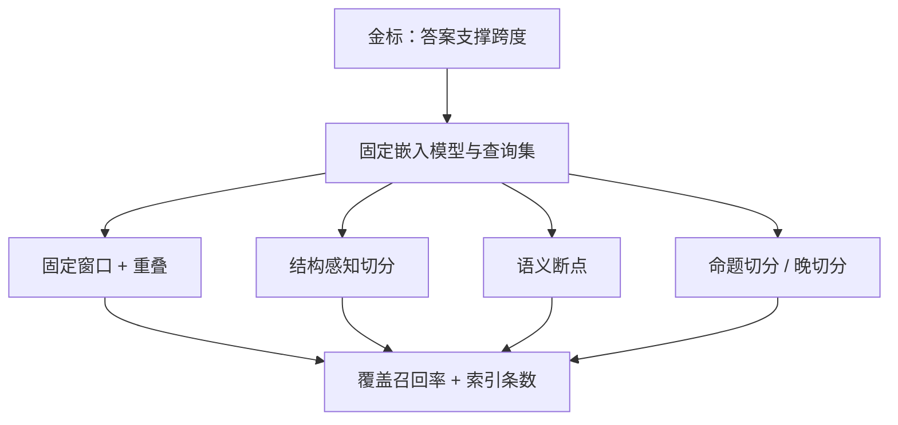
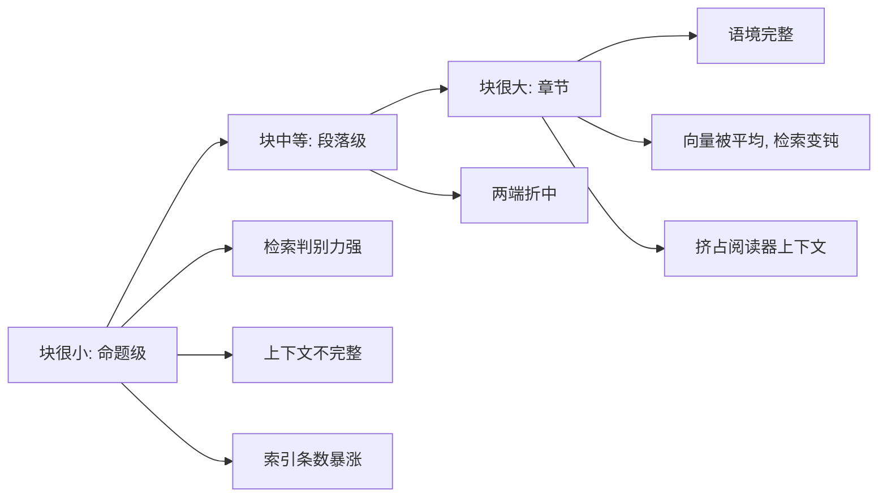

# 切分策略的深入比较

切分不是预处理杂务：它同时定义检索单元、引用粒度与阅读器上下文的形状，三个需求互相冲突，策略比较就是给冲突定价。

<footer>—— 据 Karpukhin 等 DPR 的段落粒度、Chen 等 Dense X Retrieval 的粒度研究与检索工程实践整理</footer>

[上一课](/llm/agent-map)把 Agent 工程收在三条线上：架构线分配「下一步」的决定权，质量线给失败与成本定价，生产线守住发布——一次补全被变成可审计、可恢复、可预算的劳动过程。劳动要有知识供给，供给的管线就是检索栈。主干已有[向量检索与切分](/llm/rag-chunking)：流水线、递归切分、重叠与父子块的第一性都在那里立好。本课程「RAG 系统深入」从检索工程开始，第一件事是把切分从「选一个 chunk_size」升级为受控比较：各策略是什么，各在哪类语料上赢，凭什么说赢。

## 问题

主干课给了默认做法：递归切分加一成到两成重叠，重要文档配父子块。语料一换，默认就失灵：表格有列约束，代码有函数边界，法律条款有编号层级，聊天记录有轮次结构。而比较本身有陷阱：换切分等于换索引对象，召回@k 的数字不可直接横比——块数不同、$k$ 的语义不同、金标「答案落在哪个块」也随切分重写。没有比较协议，任何「我的切分更好」都是自说自话。缺口不是再多几种策略，而是把变量钉住的比较协议。

术语翻译：召回@k 就是「把与问题最像的 k 个块捞回来时，装着答案的那块在不在里面」。k=5、命中记 1，不中记 0；一堆问题取平均就是召回率。它衡量的是检索器，与生成模型无关——答案块没被捞回来，后面的模型再强也只能编。

## 方法

先定金标再谈策略。对每个评测问题，标注「包含充分证据的最小文本跨度」；一种切分合格，当且仅当某个块**完整覆盖**该跨度。在此之上比较四族策略：

- **固定窗口加重叠**：与嵌入模型无关、实现最便宜，是一切比较的基线。
- **结构感知切分**：按标题、段落、句子层级回退，Markdown、AST、版面解析保留列表编号与表头等检索线索。
- **语义断点**：相邻句嵌入相似度低于阈值处断开；阈值与粒度互相定义，对页眉脚注等版面噪声敏感。
- **命题切分与晚切分**：前者用模型把文档改写成自足命题（Dense X 路线）；后者先用长上下文编码器读全篇再切块，块向量携带全篇语境。

协议是：同一嵌入模型、同一验证查询集、金标跨度固定；报两列——「跨度完整覆盖召回率」与「索引条数」；父子块按「子块召回、父块支撑」分别计。

## 机制

粒度是本质权衡，不是参数问题。检索器要「与查询同主题的小对象」：短、判别力强；阅读器要「足以支撑答案的大对象」：长、约束完整。切小到命题级，内积分辨最细，但索引条数涨一个量级，且命题改写可能抹掉「仅限 2023 年之后」这类限定词；切大到节级，向量平均化，查询会命中间概述而非故障排除小节。父子块与晚切分是在谱系上两头各取：前者把粒度拆成召回与阅读两个视图，后者把全篇语境压进每个块向量，缓解指代断裂。语义断点假设「相邻相似度骤降即话题边界」，在高密度主题区切成碎片，在套话区黏成一坨——它对嵌入质量的依赖比任何固定规则都深。

直觉类比：切分粒度像图书馆的索引方式——卡片越细（每段一张卡）越容易精准找到「讲这个故障的那一段」，但写综述时你要自己去拼十几张卡；整本书算一张卡（章节级）找起来一找一大片，却常常不是你真要的那页。父子块就是「用小卡找、拿整书读」。

命题级金标不必全靠人工：把问答对的答案文本对齐回文档，即可自动构建大半支撑跨度，人工只补对齐失败的案例。没有跨度级金标的切分评测，只是在比较块长分布。

## 边界

切分修不了烂抽取：版面丢失的 PDF 先修解析再谈策略。命题改写引入模型错误，要抽检限定词是否保留；晚切分依赖长上下文嵌入骨干，短窗口模型硬做会截断前缀。换切分即换块 ID：引用、缓存、权限过滤、增量更新全部受牵连，必须当一次数据迁移而不是配置微调；块 ID 解析不到原文，归因就断，见[引用与归因](/llm/citation-attribution)。比较协议钉下来之后，嵌入模型怎么选、什么时候值得微调，是下一课的缺口。

常见误区：初学者容易以为改 chunk_size 只是改个配置重跑一遍。实际上每个块 ID 都变了——线上缓存的旧块失效、按块挂的权限过滤对不上号、引用跳转指到不存在的块。正确姿势是当一次数据迁移：新旧索引并行、验证后再切换。

## 小结

- 切分同时定义检索单元、引用粒度与上下文形状；比较必须钉住金标跨度。
- 四族策略各有胜场：固定窗口做基线，结构感知保线索，语义断点押注嵌入质量，命题与晚切分买细粒度或语境。
- 报「覆盖召回率 + 索引条数」两列，父子块分开计。
- 粒度权衡的本质：检索要小对象，阅读要大对象；父子与晚切分两头各取。
- 换切分即数据迁移，块 ID 牵动引用与权限。
- 出处：Karpukhin 等 DPR；Chen 等 Dense X Retrieval；据主干切分课与工程实践整理。
