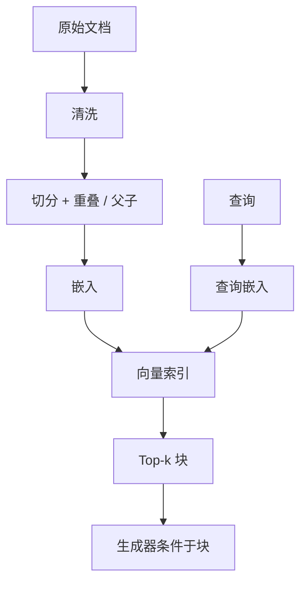

# 向量检索与切分

    
参数记忆会过时，也装不下私有语料；把可检索的非参数记忆接到生成器上，知识密集型任务才不必全靠权重里的事实。

    <footer>—— Lewis et al., Retrieval-Augmented Generation for Knowledge-Intensive NLP Tasks, NeurIPS 2020</footer>

Lewis 等人把预训练生成器（参数记忆）和可更新的检索器（非参数记忆）接到同一条前向里：先按问题取文档，再条件于文档生成。这就是后来产品口头上的 RAG。论文用的检索器是稠密双编码器，文档来自维基一类已经切好的段落。工程上最先炸掉的往往不是「要不要检索」，而是 **切分**：切太碎，嵌入看不到约束与指代；切太整，向量变成几页的平均值，检索变成主题分类。本篇写切分如何决定嵌入空间里的对象、重叠与父子块、以及检索器与生成器之间的接口。词法通道与融合见 [混合检索](/llm/hybrid-retrieval)；取回后再打分见 [重排序](/llm/rerank)。

## 问题

稠密检索把查询和文档块编进同一向量空间，用内积或余弦做近邻。编码器有长度上限，块必须短于该上限，且最好落在训练时见过的长度附近。若把整本手册当一个向量，手册里互相无关的小节被平均，查询「超时重试次数」会对上「简介」而不是「故障排除」。若按固定 50 字硬切，句子从中断开，指代（「该接口」「如上」）失去先行词，匹配分数失真。

切分还决定 *引用粒度* 与 *生成器上下文预算*。块太大，一次检索就把窗口占满，放不进多篇证据；块太小，生成器看不到完整步骤，容易拼出跨块才成立的错误手续。Lewis 原文的 RAG-Sequence / RAG-Token 假设检索对象已经是可用段落。产品语料是 PDF、HTML、表格与代码，没有现成段落，切分策略就是在定义「非参数记忆的条目是什么」。

### 切分粒度与嵌入空间

对象应是「编码器能为之给出稳定语义向量」的单元。对说明文，常用递归切分：先按标题、再按段落、再按句子，最后才按字符数封顶，并保留少量重叠。对代码，按函数或类，而不是按行数；对表格，按逻辑行或按「表头+行」复制表头，以免行向量丢失列名。嵌入模型若在短句上训练，硬塞 2k token 的块会系统性偏题。先测块长度分布与模型最大输入，再谈召回率。

重叠不是为了「多存一份」好看，是为了让跨边界的短语至少完整出现在一个块里。重叠过大则近重复块挤占 Top-k，看起来召回很高，生成器读到的是同一段话重复三遍。重叠通常取块长的 10%–20% 量级，要在验证集上扫，不是常数。

## 方法

流水线是：清洗（去导航、去页眉页脚）、切分、嵌入、写入向量索引（HNSW 一类 ANN）、查询时嵌入问题、取 Top-k 块、拼进生成器提示。元数据（路径、标题、版本、权限）与向量一起存，过滤在近邻之前或之后做。父子切分：子块用于嵌入与召回（短、准），命中后把父块（节或页）送给生成器（宽、全）。这能缓解「检索要短、阅读要长」的冲突，代价是索引条目变多、要维护父子指针。

查询侧不要假设用户的问题已经是好查询。可以把问题改写成检索式（多查询、假设文档 HyDE），但那是额外模型调用，且会放大改写错误。标题路径拼进块文本（「手册 > 网络 > 超时」）往往比调一个神秘的 chunk_size 更能提升召回。表格与图片应有文字替代，否则向量空间里根本没有这些对象。

### 重叠、父子块与元数据

元数据过滤比把所有限制写进自然语言查询更硬：租户 ID、语言、文档版本必须能在索引字段上截断，不能指望嵌入「自己懂权限」。时间敏感语料要带时间戳，否则近邻返回的是语义最像的旧政策。切分时把标题层级写入元数据，重排和引用才能指向人能打开的位置。丢失版面的 PDF 抽取会让切分在乱码上工作，检索指标再高也是假的——先看抽取质量。

索引更新是非参数记忆相对权重的优势：改一页只重嵌受影响的块。切分边界变了，块 ID 就变了，增量更新要对齐策略，否则会出现旧块与新块同时命中。生成器侧应带上块 ID 与引用，强制模型在证据不足时放弃编造，这是产品层，不是 Lewis 公式里自动出现的性质。

## 机制

双编码器对查询和文档 *分别* 编码，所以文档块可以离线嵌入；这是能上 ANN 的前提。相似度优化的是「查询与块是否同主题 / 同问题」，不是「块是否包含可生成正确答案的充分条件」。因此切得越像训练对（问题—段落），召回越好；切得像随机窗口，空间就糊。RAG-Sequence 在检索到的文档上分别生成再边缘化，RAG-Token 在逐步词上混合多篇文档——产品里更常见的是「把 k 块直接拼进提示」的简化版，对切分更敏感：拼进去的块若互相矛盾，生成器会调和幻觉。

嵌入模型与切分耦合。换嵌入必须重索引，也常常要重切：新模型上下文更长，不代表把块加大一定更好，加大可能重新引入平均化。评测应用固定问题集看召回@k、命中是否包含答案跨度、以及端到端准确率。只看端到端会把生成器的抄写能力与检索质量混在一起。

Lewis 的 RAG 是检索与 seq2seq 联合或半联合训练的一种；现在大量系统是冻结嵌入 + 冻结 LLM，只训或不训一个投影。后者更像「检索然后提示」，仍然是非参数记忆，但不要把产品 RAG 的超参数写进 2020 年论文的表格。

### 检索器与生成器如何接口

接口约定三件事：k 多大、块如何排序后拼接、超长时如何截断。截断应丢最不相关的块，而不是丢每块的尾巴——尾巴可能含答案。多跳问题往往一次检索不够，需要 [ReAct](/llm/react) 式多轮检索，每轮的查询来自上一跳的实体，切分仍要保证实体所在块可被独立命中。长上下文模型出现后，有人把 k 加大或把父块加大，这改变的是生成器读的量，不自动消除切分错误，见 [长上下文是否取代 RAG](/llm/long-context-vs-rag)。

## 边界与工程取舍

向量检索不擅长精确字符串：订单号、错误码、函数名，应用 [BM25 混合](/llm/hybrid-retrieval)。切分无法修复烂抽取。也不要为了「语义」把所有结构（列表、步骤编号）拍成纯散文再切，结构是检索线索。法律与医疗等需要完整条款的领域，父子块或「命中后回读整节」几乎是必需，短子块只负责找到门。

ANN 近似会丢极近邻，召回上限不是暴力 kNN。重建索引、嵌入版本、切分版本应一起打标签，否则线上线下块对不齐。引用以 Lewis et al. NeurIPS 2020 与 Karpukhin 等 DPR 为稠密检索背景；递归切分是工程惯例，不要给它编造一篇「官方 chunk_size 论文」。

块 ID 是审计对象。没有稳定 ID，就无法说模型引用了哪一版文档，也无法做权限回溯。切分算法变更要当一次数据迁移，而不是一次配置微调。

## 小结

- RAG 把可更新的非参数记忆接到生成器；切分定义了记忆条目的粒度。
- 块过长则向量平均化，过短则丢失约束与指代；递归切分加适度重叠是说明文的起点。
- 子块召回、父块阅读能缓解检索与生成对长度的相反需求。
- 元数据过滤、版本与权限不能交给嵌入「意会」。
- 双编码器使离线 ANN 成为可能，但相似度不等于证据充分。
- 换嵌入或换切分都要重索引，并用召回与端到端分开评测。
- 出处：Lewis et al., *Retrieval-Augmented Generation for Knowledge-Intensive NLP Tasks*, NeurIPS 2020。
