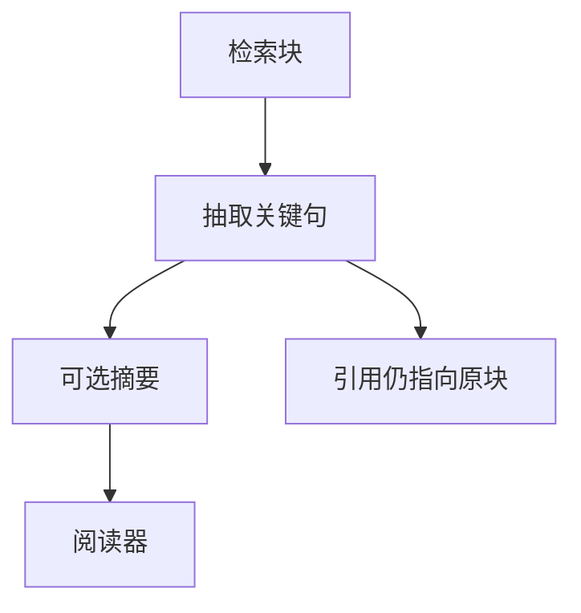

# RAG 中的上下文压缩

Top-k 块里只有几句在支撑答案，其余占窗口、占注意力、诱使胡编。压缩的是证据，不是把提示缩成口号。

<footer>—— 对照 LLMLingua 一类提示压缩；RECOMP 一类针对检索块的压缩</footer>

[上一课](/llm/adaptive-rag)决定检索之后，窗口仍可能被 $k$ 块填满。主干已有[提示压缩](/llm/prompt-compression)与检索式压缩；本课钉 RAG 场景：在**保支撑**的前提下缩短。缺口不是再讲 tokenizer，而是压缩与归因的冲突——删掉的句子可能正是引用对象。后课 ANN 结构默认：召回的候选可以多，送进阅读器的 token 必须少。

## 问题

压缩器若只优化语言建模困惑度，会留下流畅套话、删掉数字与约束。RAG 需要的是查询条件下的抽取或摘要：留下能支撑答案的句。Xu 等 RECOMP 训练压缩器服务下游 QA。LLMLingua 更偏通用提示压缩，用于 RAG 时必须用任务分数验收，不能只看压缩率。

压缩后再引用：ID 必须仍指向未压缩块或可逆片段，否则归因课的可解析率崩掉。

把压缩交给阅读器自己「先看目录」而不删 token，是注意力税，不是压缩。真压缩要减少进入 softmax 的 token。

## 方法

两种：抽取式（选句，可逆、好引用）与生成式摘要（更短、可能不忠）。先抽取后摘要。保留查询词命中句与高 BM25 句作下限。评测：压缩率、忠实度、答案正确、引用可解析。与切分重叠一起调：先切好再压，比先压整页再切更可控。

## 机制

窗口里的无关句成为干扰负例，注意力与参数记忆都会被带偏，忠实度下降。压缩是在测试时做一次信息瓶颈，逼迫阅读器只看见高相关子集。瓶颈若由未校准的 LLM 摘要实现，会引入新幻觉层——必须用支撑指标挡。

## 边界

法律原文不可生成式压缩。下一课把「候选可以很多」交给 HNSW / IVF：那是索引层的近似，不是窗口层的压缩。

## 小结

- RAG 压缩保支撑与可引用，不以 PPL 或压缩率为第一指标。
- 抽取优于盲目摘要；引用指向原块。
- 用 QA 与忠实度验收，不用压缩率发版。
- 出处：RECOMP；LLMLingua；提示压缩课。
