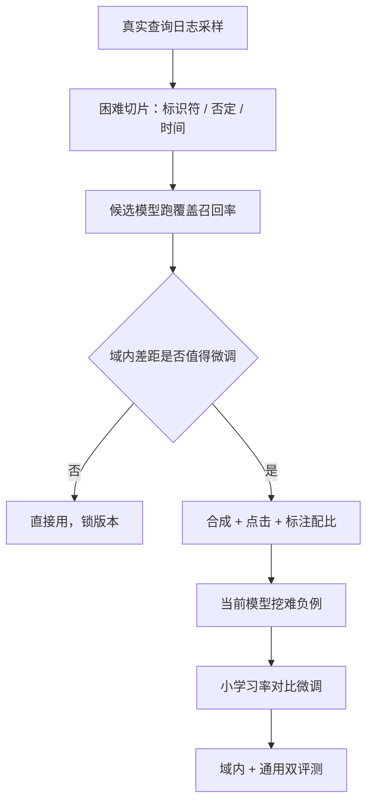

# 嵌入的选型与微调

榜单分数是别人语料上的均值；你的召回是你自己查询分布上的分位数。选型与微调的全部纪律，就是把评测搬回自己的分布。

<footer>—— 据 Muennighoff 等 MTEB 与检索嵌入工程实践整理</footer>

[上一课](/llm/rag-chunking-deep)把切分写成受控比较：金标跨度固定，四族策略各在哪种语料上赢。切分定义了检索对象，本课给对象定度量：嵌入模型怎么选、什么时候值得微调、微调的数据从哪来、怎么不把通用能力调坏。对比损失的第一性在[对比学习与 InfoNCE](/llm/contrastive-infonce)，难负例在[难负例挖掘](/llm/hard-negatives)；本课不重推公式，只写选型与微调的工程协议。

## 问题

公开榜单（MTEB 一类）的域、语言、块长与你的语料不一致：榜首模型在内部工单、代码库、法律条款上可能反输给低几名的对手，因为榜单的检索任务多是网页短段。选型还有系统耦合：维度与块长连着上一课的切分，也连着下一课的索引内存；多语需求、最大输入长度、许可证、嵌入服务延迟都在约束里。微调的诱惑与风险并存：域内对比微调常能明显涨召回，但会把「同主题」压得过细、丢失通用改写能力，且合成训练对本身带偏——用 LLM 从块生成问题，模型学会的是「块风格的问题」，用户口语是另一种分布。

直觉类比：榜单分数像全国统考平均分——它说明模型「总体不差」；可你的语料是另一张卷子，考的是工单缩写、内部产品号。统考状元来答你的卷子，完全可能输给一个默默无闻但练过你这类题的模型。所以选型只认自建验证集，榜单只用来筛掉明显不合格的。

## 方法

选型协议：自建验证查询集，从真实查询日志采样，并保留困难切片——标识符、否定、时间约束、跨语言改写；金标沿用上一课的支撑跨度，报「完整覆盖召回率」而不是榜单分数；同时记录维度、最大输入、多语能力、延迟与许可证五项约束。维度选择连着[Matryoshka 表示](/llm/matryoshka-embeddings)：若候选模型支持前缀截断，内存与延迟就有粗到细的余地。

微调协议分四步。数据：用户点击（有位置偏置，要纠偏或降权）、LLM 合成查询（快但分布窄）、人工标注（贵而准），三者按域配比；负例用当前模型挖掘——排得高但不含答案的块，再混入批内随机负例防噪声主导。训练：InfoNCE 温度不乱动，学习率小、轮数少、早停，混入通用检索语料防遗忘。评测：域内与通用两套都必须报，只报域内看不到遗忘。验收：金标跨度覆盖 + 端到端忠实度，微调后重切不必但必须全量重嵌与重建索引。

## 机制

微调为什么涨：对比微调把度量从「同主题」推进到「含答案」，等价于把难负例的边界推开——这正是难负例课的机制在域内的重放。为什么常常不必：通用模型已在十亿级弱监督对上训练，几百条域内标注只能修正明显错位，收益上界还受切分质量限制——训练对里的「正例块」若是上一课说的碎片，模型学到的是碎片分类器。为什么不微调也别乱换：榜上零点几分的差距多在噪声内，换模型的全量重索引成本远大于分数差。指令前缀是中间态：[指令嵌入](/llm/instruction-embeddings)用查询侧指令改变度量条件，不动权重，适合任务多样的系统先试。

换嵌入模型 = 全量重嵌 + 重建索引 + 可能重切，且融合权重、重排器难负例分布全部作废。把「换嵌入」当一次发布，走三角门禁，而不是当一次配置修改。

## 边界

微调过的模型不保证向其他域迁移，换语料大版本要重测；多语场景下微调数据若单语偏重，跨语言对齐会退化。多模态查询是另一套嵌入空间，见[多模态嵌入](/llm/multimodal-embeddings)，本课不混谈。嵌入服务的批处理与缓存属于延迟工程，后面专课处理。选型与微调都完成后，向量空间就绪，下一步是把它变成能扛住千万级库与延迟预算的索引——参数学见下一课。

## 小结

- 榜单是别人分布上的均值，选型只认自建验证集上的覆盖召回率与五项系统约束。
- 微调数据三源配比：合成、点击、标注；负例靠当前模型挖，混随机负例防噪。
- 小学习率、早停、混通用语料防遗忘；域内与通用双评测缺一不可。
- 指令前缀是不动权重的中间态；Matryoshka 给维度留粗到细余地。
- 换嵌入是发布级动作：全量重索引并重跑门禁。
- 出处：Muennighoff 等 MTEB；van den Oord 等 InfoNCE；Xiong 等 ANCE；据工程实践整理。
