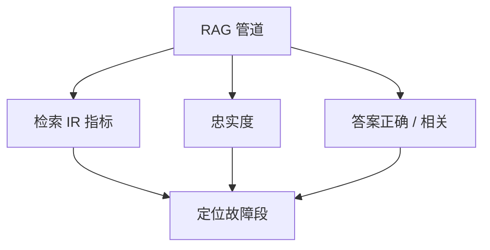

# RAG 评测 RAGAS

端到端准确率把检索错误与阅读错误绑死。要把上下文相关性、忠实度、答案相关性分列，管道才能知道该改哪一段。

<footer>—— Es 等 RAGAS；检索与生成必须分指标</footer>

[上一课](/llm/citation-attribution)定义了支撑。工程上还要一套可回归的自动分，不必每夜都上人评。Es 等人的 RAGAS 把 RAG 拆成若干 LLM 辅助指标。缺口是读懂这些分测的是管道哪一段。后课自适应 RAG 默认：你已经能测「该不该检索」，而不是只看最终 BLEU。

## 问题

只有最终答案对错时，检索召回低与阅读器胡编可以分数相同。RAGAS 一类协议提出：忠实度（答案是否可由上下文推出）、答案相关性（是否在问所问）、上下文精度/召回（检索块相对需要的证据）。许多实现用 LLM 法官估这些量，于是继承[裁判偏差](/llm/llm-judge-bias)：未校准前只能当烟雾。

金标可用时，检索用标准 IR 指标（nDCG、Recall@$k$），生成用支撑与精确匹配。无金标时，RAGAS 是代理，必须抽检。

「上下文召回」需要「该题应引用哪些块」的概念。没有题级证据标注时，这个量是法官的想象，方差大。

## 方法

最小表：检索 Recall@$k$ / nDCG（有金标块时）；忠实度；答案正确（有金标答时）；引用可解析率。RAGAS 分数与表并排，不替代。固定法官模型与提示版本。切片：无检索命中、有命中仍不忠、过检索（块对但答偏）。差异集派人看。

## 机制

分列指标对应管道的条件依赖：检索差则阅读器无论多忠也会信息不足；检索好而忠实度低是阅读器或提示问题；二者都高而答案不相关是任务理解问题。把它们加总成单分会回到 MMLU 式平均。自适应课将用这些信号决定是否检索、是否再检索。

## 边界

自动忠实度不是法律保证。下一课自适应 RAG：用信号在「直答 / 检索 / 再检索」之间路由。

## 小结

- RAG 必须分列检索与忠实度，禁止只报端到端。
- RAGAS 等 LLM 指标是代理，要校准与抽检。
- 有金标块时优先标准 IR 指标。
- 出处：Es 等 RAGAS；ALCE；IR 评测通识。
