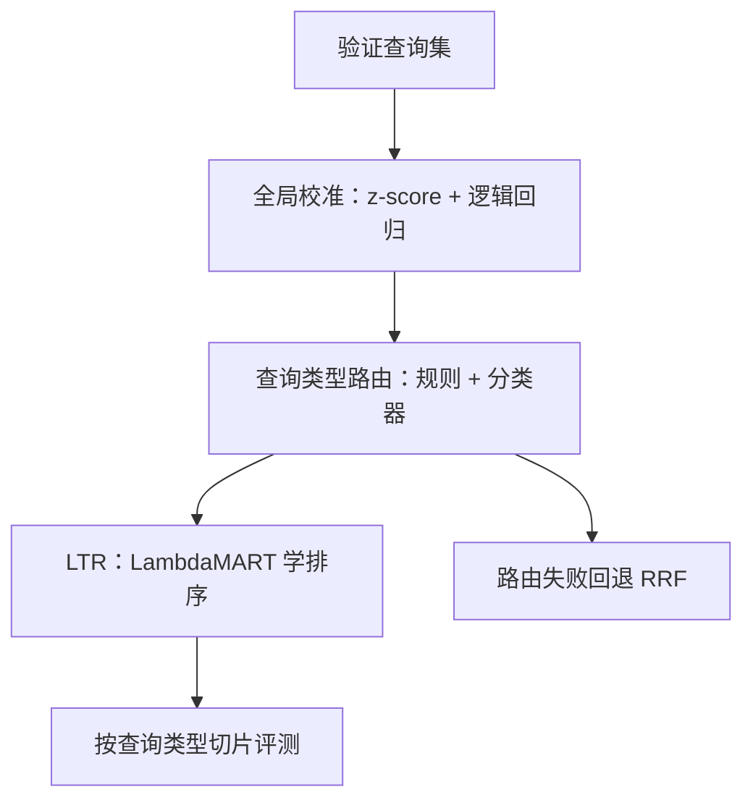
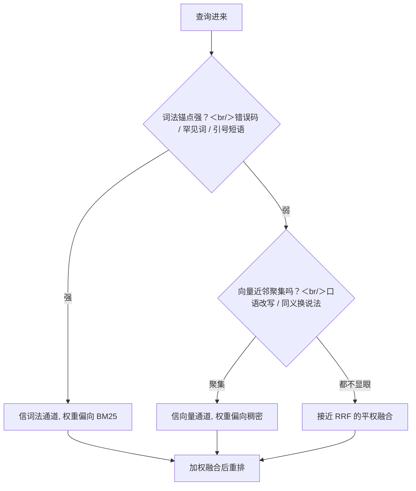

# 混合检索权重的学习

固定融合对谁都一样，学出来的融合对你的查询分布不一样；值得学的时刻，是分布本身成了系统的一部分。

<footer>—— Cormack 等 Reciprocal Rank Fusion，SIGIR 2009；Burges 从 RankNet 到 LambdaMART 的排序学习路线</footer>

[上一课](/llm/rag-index-hnsw-params)把向量通道调到位：曲线画完、索引卡立住。[混合检索](/llm/hybrid-retrieval)立过默认：两路并行、RRF 按名次融合、校准加权需谨慎。本课回答深一层的问题：固定 RRF 什么时候不够，融合权重怎么学、学到什么粒度、学了怎么不翻车。

## 问题

RRF 只看名次不看分数，稳，但对「本域哪一路更准」无感；校准线性加权能表达域知识，但一个全局 $\alpha$ 撑不起真实的查询分布：含工单号、错误码的查询词法通道主导，口语改写的查询向量通道主导，各让一步就是各输一半。学习的缺口有三层：监督信号从哪来（标注贵、点击有位置偏置）、学到什么粒度（全局、查询类型、逐查询）、以及学到的东西何时失效（语料换代、查询分布漂移）。不回答这三层，权重学习就是过拟合验证集的仪式。

术语翻译：RRF（倒数排名融合）就是「按名次合分」——每个通道给它排第 $n$ 的块加 $\frac{1}{60+n}$ 分，两路相加重排。只取名次、不看原始分，所以 BM25 的 12.3 和余弦的 0.87 量纲不同也不碍事；常数 60 是压第一名垄断的阻尼。

## 方法

三层递进，先便宜后贵。第一层，全局校准加权：在验证查询上把两路分数做 z-score，用逻辑回归拟合「块是否含答案」，特征就是两路分数加少量查询特征（长度、是否含数字与代码 token）；比手扫 $\alpha$ 稳，因为回归同时吸收了量纲与域偏置。第二层，查询类型路由：规则先行——引号短语、错误码正则强制走词法加权；再上轻量分类器预测类型，每类一组权重；路由必须带回退（退到 RRF），路由错误比固定融合更伤。第三层，排序学习（LTR）：把双塔分、BM25 分、块元数据等特征交给 LambdaMART 一类排序器端到端学排序，监督用标注或蒸馏自重排器。评测按查询类型切片报召回，权重版本与索引版本、嵌入版本绑定写入。

数字实例：点击偏置有多夸张——排第 1 的块被点的概率常常是第 5 名的五到十倍，哪怕两者质量相当。直接拿点击当标签训练，模型学到的第一课就是「模仿现在的排序」，而不是「答案在哪」。这就是为什么协议要求纠偏或直接用重排器蒸馏出的偏好当监督。

## 机制

学习为什么有用：融合本质是在两路证据间做加权，最优权重依赖查询的「词法锚点强度」——BM25 分高且命中罕见词，词法可信；BM25 平庸而向量近邻聚集，向量可信。逻辑回归与 LTR 学的就是这个条件结构。翻车为什么容易：训练分布是历史查询，语料换代（新产线、新术语）后锚点强度分布漂移，学到的权重系统性错位；点击信号有位置偏置，排前的被点多，不纠偏就学成「模仿现有排序」，把偏差固化。RRF 的常数 $c$ 是同一逻辑的影子：$c$ 压制第一名的垄断，$c$ 过大则名次差被抹平——先在自己分布上扫 $c$，成本远低于上一套 LTR。

直觉类比：学融合权重就像信任两个证人的法庭——错误码这种「硬证据」（词法通道）一出，几乎可直接定案；只有口语描述时，「长得像的其他案例」（向量通道）更可信。逻辑回归和 LTR 学的，就是「什么线索出现时该更信谁」。

SPLADE 是「学出来的词法通道」，与「学两路的融合权重」是两件事：前者换掉 BM25 这条通道本身，后者只动融合层。混称会让消融失去意义。

## 边界

流量与标注不足时，学习就是过拟合：日查询量低、验证集只有几百条时，固定 RRF 是更稳的默认。特征里混入重排器分数时，LTR 已经越过融合层，变成重排的一部分，归因与延迟预算都要跟着挪，见下一课。学到的权重随嵌入与切分版本绑定，召回侧任何换代都要重估。慢漂移要有监控：按周分片看切片召回，权重不再匹配分布时先回退 RRF 再重学。

常见误区：初学者容易以为「学出来的融合一定优于固定 RRF」。学习要用历史查询喂，历史只能代表过去；日查询几百条的内部系统，几周才攒出一次有统计意义的切片，先学先过拟合。经验次序是：先固定 RRF，攒够分布、监控立住，再逐层上学习。

## 小结

- RRF 稳而不敏；值得学习的前提是查询分布稳定到可学、大到可验。
- 三层递进：全局校准、类型路由带回退、LTR；先便宜后贵。
- 监督信号警惕位置偏置，点击要纠偏，蒸馏自重排器更干净。
- 权重、索引、嵌入版本绑定；语料换代先回退 RRF。
- SPLADE 与融合权重学习是两件事，消融分开报。
- 出处：Cormack 等 RRF，SIGIR 2009；Burges，LambdaMART；据工程实践整理。
