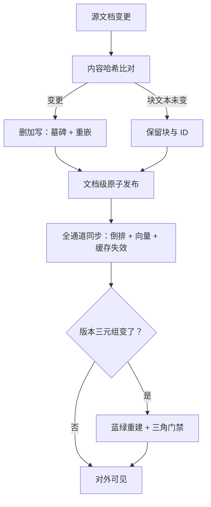
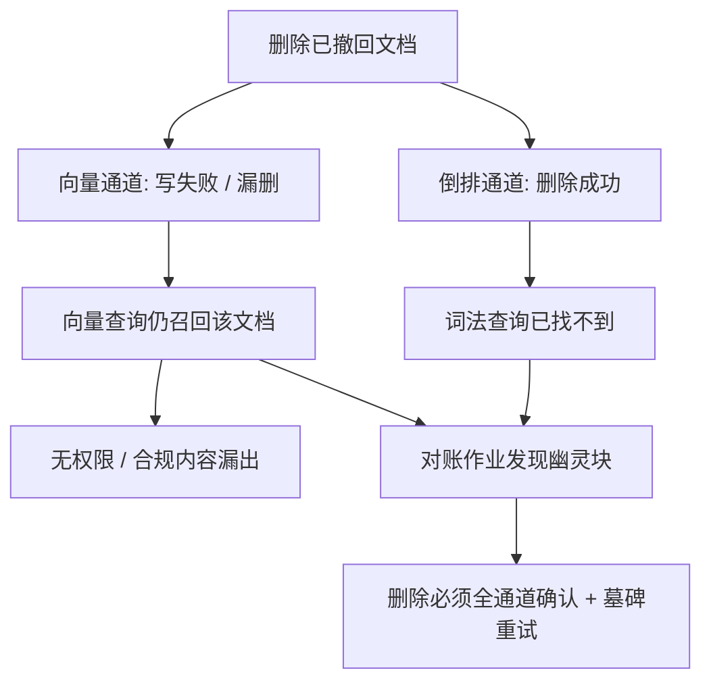

# 增量更新与一致性

索引不是建完就完的资产，是随语料呼吸的系统；一致性不是让所有副本时刻相同，是让「哪些版本在一起」永远可回答。

<footer>—— 据索引版本化与检索运维工程实践整理</footer>

[上一课](/llm/rag-latency-cost)把延迟与成本压进预算，缓存与降级都进了账本。本课处理时间维度：语料天天变——文档改一段、加一节、删一页，索引怎么跟上，各版本怎么对齐，旧答案怎么下线。第一课说过「换切分即数据迁移」；生产里这种迁移每天在发生，只是没人叫它迁移。

## 问题

三重一致性缺口。索引内：文档重写后哪些块保留原 ID、哪些重嵌——块 ID 一变，引用、缓存、权限过滤全部跟着断。跨通道：BM25 删了、向量还在（或反之），已撤回文档仍从另一路漏出——这不是陈旧的性能问题，是权限与合规事故。跨版本：嵌入模型、切分器、融合权重、重排器各自演进，线上一个请求穿过不同版本组合，评测环境与线上不可比，改动前后的三角分数没法归因。三重缺口共同的根源：没有「版本三元组」的意识——切分版本、嵌入版本、分析器版本必须作为一个整体被记录和切换。

术语翻译：墓碑（tombstone）就是「先立牌子、后拆房子」的删除方式——删请求只打一个「已删」标记，等所有通道都确认读到标记，才异步真正清数据。好处是删除命令超时或部分失败时，漏出旧内容的问题仍然可发现、可重试。

## 方法

版本三元组加配置版本，写进索引卡，任何一维变更触发三角门禁与全量或分区重索引。增量协议：内容哈希决定重嵌——块文本没变不重嵌（注意：切分边界变了，邻居变了，语义就变，此时必须全量重算）；删除走墓碑，先全通道墓碑、物理删除异步；更新实现为删加写，不做原地改；文档级原子性——同一文档的新块全部就绪才对外可见，否则检索到半新半旧。重建走蓝绿：新索引全量构建、过门禁、切流量、旧的保留回滚窗口；大库全量贵，按文档更新热力分区滚动重建。陈旧性 SLA：从源变更到索引可见的最大时延按查询类型分档，时效型问答要求分钟级，其余小时级即可。

数字实例：文档 10 个块、重写后 3 个块文本没变。按哈希只重嵌 7 个块，省三成嵌入费用——但前提是切分边界没动。若这次升级同时换了切分器，边界挪一格，那 3 个「没变」的块的上下文也全变了，必须全量重算，省的钱一分不能省。

## 机制

跨通道删除为什么是安全问题：混合检索两路索引独立写入独立删除，删除不同步时，无权限或已撤回的文档从漏掉的一路被召回——检索管道对所有索引到的内容一视同仁地信任，[投毒防御](/llm/retrieval-poisoning-defense)的鉴权与隔离必须延伸到更新路径：每条写请求都是注入面。为什么「没变就不重嵌」有例外：晚切分与语义断点的块语义依赖邻域，边界一动邻居全变，哈希相等不等于语义相等。为什么蓝绿比原地改稳：原地改的中间态是一致性黑洞——一半新块一半旧块同时在线，评测与线上都不可复现；蓝绿把中间态关在旧流量背后，门禁过了才见人。

常见误区：初学者容易把跨通道删除失败当成「小事，最多答案旧一点」。错——撤回的合同、下架的政策一旦从另一路被召回，就是合规事故而非质量问题。删除路径要当安全代码写：全通道确认、可重试、有对账。

对账作业：定期抽样「索引块回读源文档」，验证块可解析、权限一致、内容存在。「幽灵块率」（源已删、索引还在的比例）是比召回率更容易被忽视的生产指标——它直接对应泄漏与陈旧答案。

## 边界

完全一致有代价：同步双写放大写延迟，多数系统选最终一致加墓碑加对账，SLA 写清楚即可，不必假装强一致。金标集随语料换代要重新对齐支撑跨度，与评测课的版本口径联动；缓存失效策略与更新协议同设计——上一课的缓存三层在文档更新时全部要考虑失效，只失效一层会出现「检索新、生成旧」。更新节奏、重建成本与查询陈旧容忍度三方权衡，没有普适答案；失败模式的跨层汇总与排查法，是下一课也是本课程的收束。

为什么重要：只失效检索缓存、忘了失效「答案缓存」或会话记忆，用户会看到检索已经拿到新政策、模型却照着旧缓存回答——两条都对，拼起来自相矛盾。更新协议和缓存失效必须画在同一张时序图里设计。

## 小结

- 版本三元组（切分、嵌入、分析器）加配置版本一体记录，一变即门禁加重索引。
- 增量协议：内容哈希重嵌、墓碑先行、删加写、文档级原子发布。
- 跨通道删除不同步是安全事故不是陈旧问题；鉴权延伸到更新路径。
- 蓝绿重建消灭中间态；大库按更新热力分区滚动。
- 幽灵块率进生产指标；金标与缓存随版本联动失效。
- 出处：据索引版本化与检索运维实践整理；投毒口径见公开检索投毒研究。
